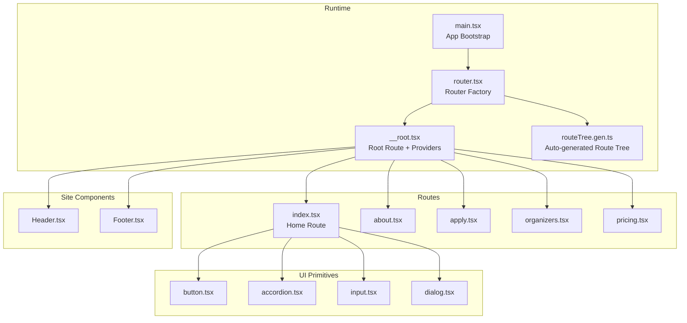
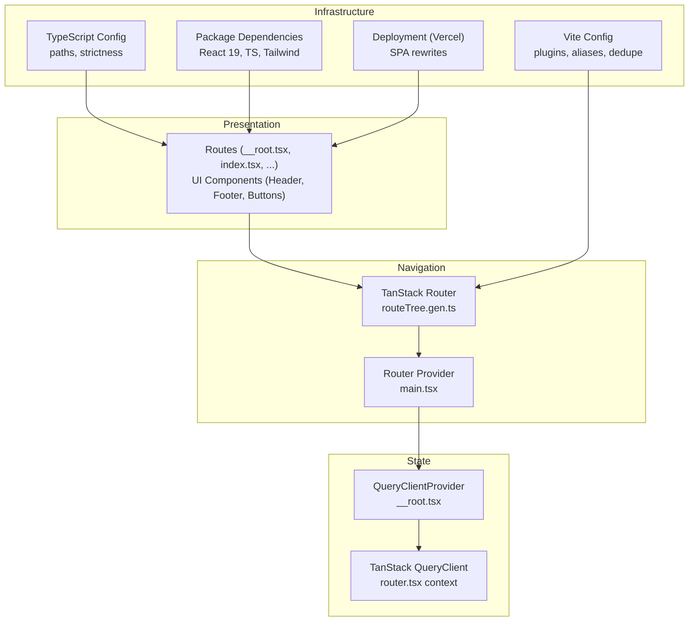
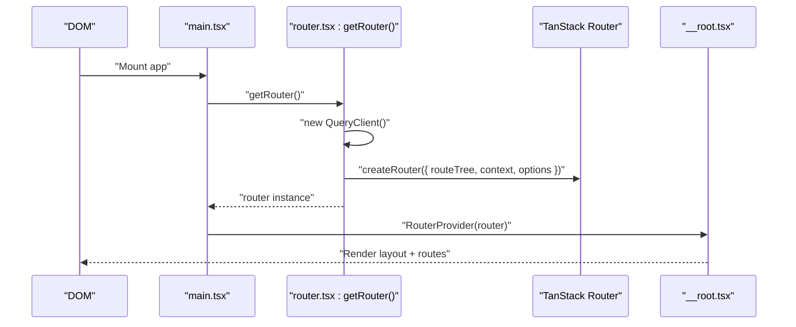
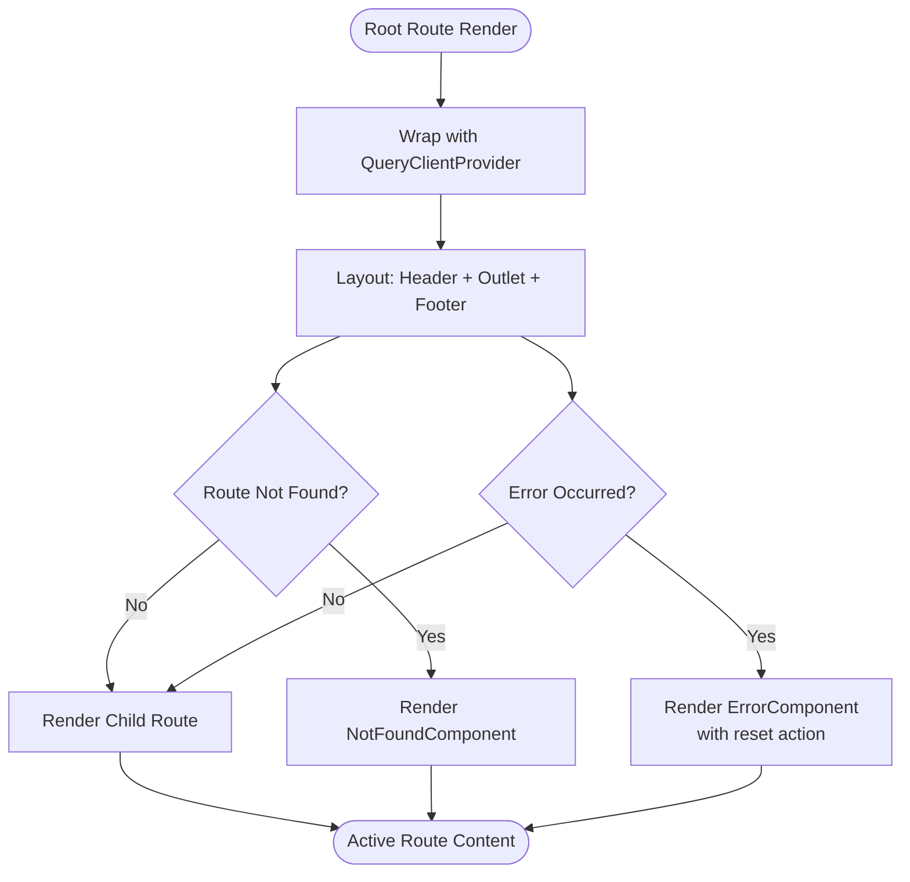
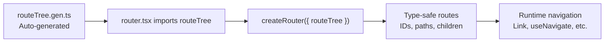
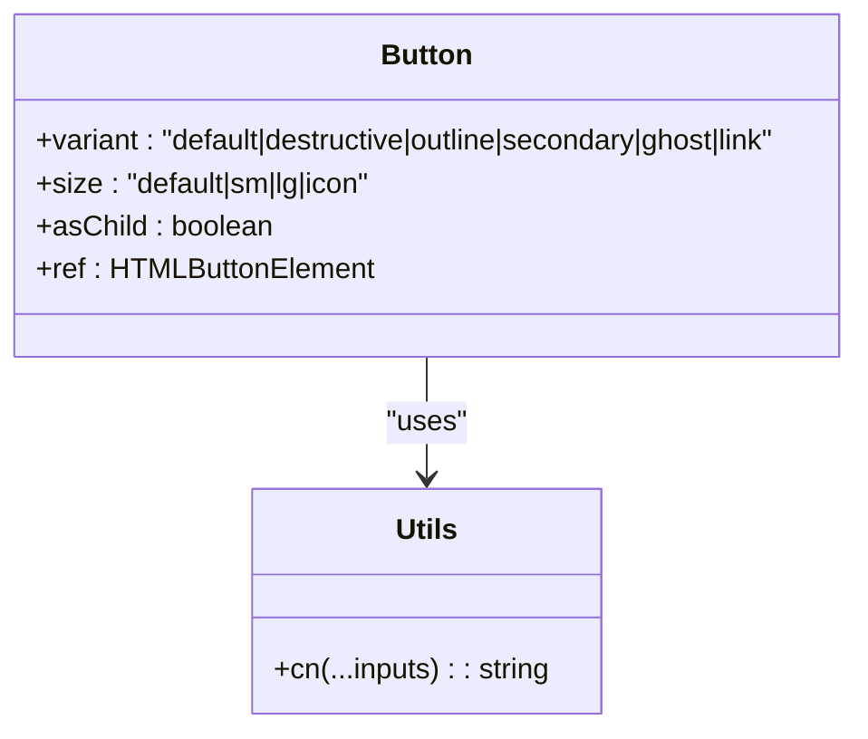
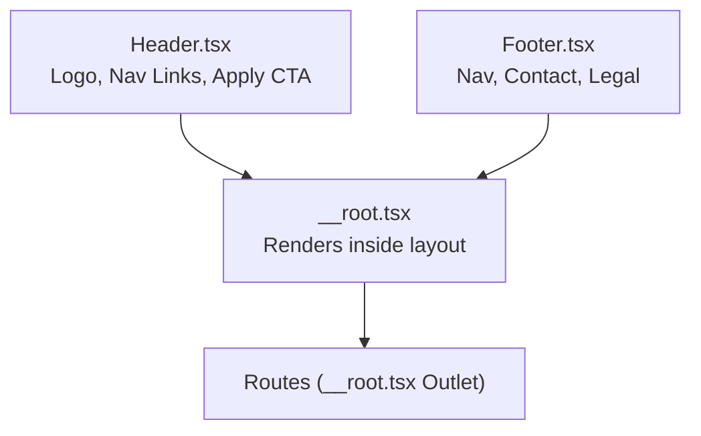
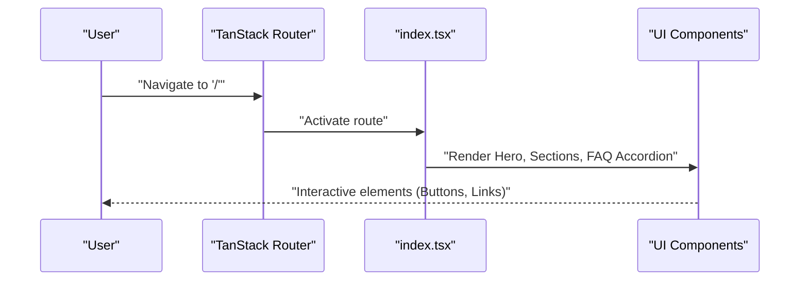
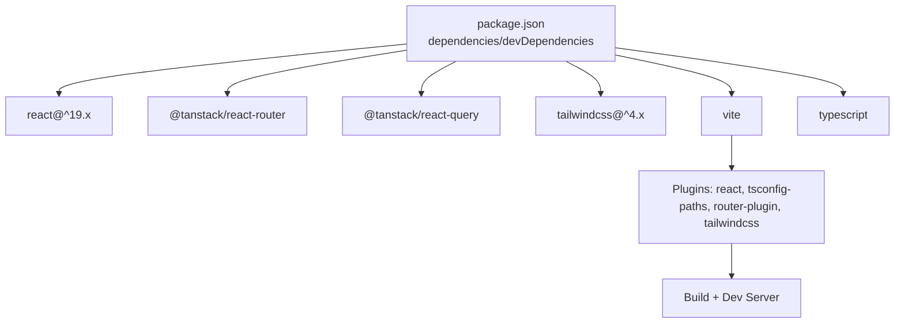

# Architecture Overview

<cite>
**Referenced Files in This Document**
- [main.tsx](file://src/main.tsx)
- [router.tsx](file://src/router.tsx)
- [__root.tsx](file://src/routes/__root.tsx)
- [routeTree.gen.ts](file://src/routeTree.gen.ts)
- [index.tsx](file://src/routes/index.tsx)
- [Header.tsx](file://src/components/site/Header.tsx)
- [Footer.tsx](file://src/components/site/Footer.tsx)
- [button.tsx](file://src/components/ui/button.tsx)
- [utils.ts](file://src/lib/utils.ts)
- [start.ts](file://src/start.ts)
- [package.json](file://package.json)
- [tsconfig.json](file://tsconfig.json)
- [vite.config.ts](file://vite.config.ts)
- [vercel.json](file://vercel.json)
</cite>

## Table of Contents
1. [Introduction](#introduction)
2. [Project Structure](#project-structure)
3. [Core Components](#core-components)
4. [Architecture Overview](#architecture-overview)
5. [Detailed Component Analysis](#detailed-component-analysis)
6. [Dependency Analysis](#dependency-analysis)
7. [Performance Considerations](#performance-considerations)
8. [Troubleshooting Guide](#troubleshooting-guide)
9. [Conclusion](#conclusion)
10. [Appendices](#appendices)

## Introduction
This document describes the architecture of the Skillyme Programs System, a modern React application leveraging TanStack Router for navigation and TanStack Query for client-side state management. The system emphasizes a component-based design with a clear separation between routing, state, UI primitives, and shared site components. It uses React 19, TypeScript, and Tailwind CSS for a type-safe, maintainable, and visually consistent user experience. The auto-generated route tree ensures type-safe navigation, while the provider pattern centralizes context-based state management.

## Project Structure
The project follows a feature- and layer-based organization:
- Routing and bootstrapping: src/main.tsx, src/router.tsx, src/routes/__root.tsx, src/routeTree.gen.ts
- Site-level components: src/components/site/*
- UI primitives: src/components/ui/*
- Utilities and styling: src/lib/utils.ts, src/styles.css
- Application entry points and server-side concerns: src/start.ts
- Tooling and configuration: package.json, tsconfig.json, vite.config.ts, vercel.json

**Diagram sources**
- [main.tsx:1-21](file://src/main.tsx#L1-L21)
- [router.tsx:1-17](file://src/router.tsx#L1-L17)
- [__root.tsx:1-61](file://src/routes/__root.tsx#L1-L61)
- [routeTree.gen.ts:1-132](file://src/routeTree.gen.ts#L1-L132)
- [index.tsx:1-350](file://src/routes/index.tsx#L1-L350)
- [Header.tsx:1-84](file://src/components/site/Header.tsx#L1-L84)
- [Footer.tsx:1-44](file://src/components/site/Footer.tsx#L1-L44)
- [button.tsx:1-50](file://src/components/ui/button.tsx#L1-L50)

**Section sources**
- [main.tsx:1-21](file://src/main.tsx#L1-L21)
- [router.tsx:1-17](file://src/router.tsx#L1-L17)
- [__root.tsx:1-61](file://src/routes/__root.tsx#L1-L61)
- [routeTree.gen.ts:1-132](file://src/routeTree.gen.ts#L1-L132)
- [index.tsx:1-350](file://src/routes/index.tsx#L1-L350)
- [Header.tsx:1-84](file://src/components/site/Header.tsx#L1-L84)
- [Footer.tsx:1-44](file://src/components/site/Footer.tsx#L1-L44)
- [button.tsx:1-50](file://src/components/ui/button.tsx#L1-L50)

## Core Components
- App bootstrap: Initializes the router and registers it for type safety.
- Router factory: Creates a TanStack Router instance with a QueryClient context and scroll restoration.
- Root route: Provides global providers (QueryClientProvider), layout (Header/Footer), and error/not-found handling.
- Auto-generated route tree: Ensures type-safe navigation across routes.
- UI primitives: Reusable, variant-driven components using Tailwind classes and class-variance-authority.
- Site components: Shared Header and Footer with navigation and branding.
- Utilities: Tailwind merging and class composition helpers.

**Section sources**
- [main.tsx:1-21](file://src/main.tsx#L1-L21)
- [router.tsx:1-17](file://src/router.tsx#L1-L17)
- [__root.tsx:1-61](file://src/routes/__root.tsx#L1-L61)
- [routeTree.gen.ts:1-132](file://src/routeTree.gen.ts#L1-L132)
- [button.tsx:1-50](file://src/components/ui/button.tsx#L1-L50)
- [utils.ts:1-7](file://src/lib/utils.ts#L1-L7)
- [Header.tsx:1-84](file://src/components/site/Header.tsx#L1-L84)
- [Footer.tsx:1-44](file://src/components/site/Footer.tsx#L1-L44)

## Architecture Overview
The system uses a layered architecture:
- Presentation layer: Routes and UI components.
- Navigation layer: TanStack Router manages route tree, navigation, and context.
- State layer: TanStack Query manages caching, invalidation, and optimistic updates.
- Infrastructure layer: Vite toolchain, plugin system, and deployment configuration.

**Diagram sources**
- [main.tsx:1-21](file://src/main.tsx#L1-L21)
- [router.tsx:1-17](file://src/router.tsx#L1-L17)
- [__root.tsx:1-61](file://src/routes/__root.tsx#L1-L61)
- [routeTree.gen.ts:1-132](file://src/routeTree.gen.ts#L1-L132)
- [vite.config.ts:1-30](file://vite.config.ts#L1-L30)
- [tsconfig.json:1-28](file://tsconfig.json#L1-L28)
- [package.json:1-86](file://package.json#L1-L86)
- [vercel.json:1-9](file://vercel.json#L1-L9)

## Detailed Component Analysis

### Bootstrapping and Router Initialization
The app bootstraps by creating a RouterProvider with a router instance registered for type safety. The router is constructed with a route tree, a QueryClient injected into the router context, scroll restoration enabled, and preload behavior configured.

**Diagram sources**
- [main.tsx:1-21](file://src/main.tsx#L1-L21)
- [router.tsx:1-17](file://src/router.tsx#L1-L17)
- [__root.tsx:1-61](file://src/routes/__root.tsx#L1-L61)

**Section sources**
- [main.tsx:1-21](file://src/main.tsx#L1-L21)
- [router.tsx:1-17](file://src/router.tsx#L1-L17)

### Root Route and Provider Pattern
The root route composes global providers and layout:
- QueryClientProvider wraps the outlet to enable TanStack Query across nested routes.
- Header and Footer provide consistent navigation and branding.
- ErrorComponent and NotFoundComponent handle error and not-found scenarios with a reset mechanism.

**Diagram sources**
- [__root.tsx:1-61](file://src/routes/__root.tsx#L1-L61)

**Section sources**
- [__root.tsx:1-61](file://src/routes/__root.tsx#L1-L61)

### Auto-Generated Route Tree and Type-Safe Navigation
The route tree is auto-generated and imported by the router. It defines all routes, their IDs, paths, and parent-child relationships, enabling compile-time navigation safety. The generated types expose strongly typed route parameters, loaders, and search params.

**Diagram sources**
- [routeTree.gen.ts:1-132](file://src/routeTree.gen.ts#L1-L132)
- [router.tsx:1-17](file://src/router.tsx#L1-L17)

**Section sources**
- [routeTree.gen.ts:1-132](file://src/routeTree.gen.ts#L1-L132)
- [router.tsx:1-17](file://src/router.tsx#L1-L17)

### UI Primitive Design and Tailwind Integration
UI primitives use a variant-based design system:
- Variants and sizes are defined via class-variance-authority.
- Tailwind classes compose through a utility function that merges and tidies classes.
- Radix UI slots enable semantic composition.

**Diagram sources**
- [button.tsx:1-50](file://src/components/ui/button.tsx#L1-L50)
- [utils.ts:1-7](file://src/lib/utils.ts#L1-L7)

**Section sources**
- [button.tsx:1-50](file://src/components/ui/button.tsx#L1-L50)
- [utils.ts:1-7](file://src/lib/utils.ts#L1-L7)

### Site Components: Header and Footer
- Header provides responsive navigation, branding, and a call-to-action link. It uses TanStack Router’s Link for type-safe navigation and toggles a mobile menu.
- Footer organizes site navigation, contact info, and legal text, linking to internal pages and external application portal.

**Diagram sources**
- [Header.tsx:1-84](file://src/components/site/Header.tsx#L1-L84)
- [Footer.tsx:1-44](file://src/components/site/Footer.tsx#L1-L44)
- [__root.tsx:1-61](file://src/routes/__root.tsx#L1-L61)

**Section sources**
- [Header.tsx:1-84](file://src/components/site/Header.tsx#L1-L84)
- [Footer.tsx:1-44](file://src/components/site/Footer.tsx#L1-L44)
- [__root.tsx:1-61](file://src/routes/__root.tsx#L1-L61)

### Example Route: Home Page
The index route demonstrates:
- Head metadata injection for SEO.
- Composition of site sections and reusable UI components.
- Integration with TanStack Router’s Link for navigation.
- Use of motion for animations and UI primitives for interactive elements.

**Diagram sources**
- [index.tsx:1-350](file://src/routes/index.tsx#L1-L350)

**Section sources**
- [index.tsx:1-350](file://src/routes/index.tsx#L1-L350)

## Dependency Analysis
The application relies on modern frontend tooling and libraries:
- React 19 and React DOM for rendering.
- TanStack Router for routing and TanStack Router Plugin for code-splitting and route tree generation.
- TanStack Query for caching and state management.
- Tailwind CSS v4 with Tailwind Vite plugin for utility-first styling.
- Vite with plugins for React, path resolution, and router code generation.
- TypeScript for type safety and strict compiler options.

**Diagram sources**
- [package.json:1-86](file://package.json#L1-L86)
- [vite.config.ts:1-30](file://vite.config.ts#L1-L30)

**Section sources**
- [package.json:1-86](file://package.json#L1-L86)
- [vite.config.ts:1-30](file://vite.config.ts#L1-L30)
- [tsconfig.json:1-28](file://tsconfig.json#L1-L28)

## Performance Considerations
- Auto-code splitting: Enabled via the TanStack Router Vite plugin to reduce bundle sizes and improve initial load performance.
- Scroll restoration: Enabled in the router to preserve user position across navigations.
- Dedupe dependencies: Vite resolves duplicates for React and TanStack packages to avoid multiple instances.
- Tailwind utilities: Utility-first classes minimize CSS overhead and enable efficient styling.
- QueryClient context: Centralized caching reduces redundant network requests and improves perceived performance.

[No sources needed since this section provides general guidance]

## Troubleshooting Guide
Common areas to check:
- Router registration: Ensure the router instance is registered for type safety in main.tsx.
- Provider placement: Verify QueryClientProvider wraps the outlet in the root route.
- Route tree integrity: Confirm routeTree.gen.ts is up to date and imported by the router.
- Error handling: Use the root route’s errorComponent to surface and recover from errors.
- Server middleware: For server-side concerns, review the start.ts error middleware and Vercel rewrites.

**Section sources**
- [main.tsx:1-21](file://src/main.tsx#L1-L21)
- [__root.tsx:1-61](file://src/routes/__root.tsx#L1-L61)
- [routeTree.gen.ts:1-132](file://src/routeTree.gen.ts#L1-L132)
- [start.ts:1-23](file://src/start.ts#L1-L23)
- [vercel.json:1-9](file://vercel.json#L1-L9)

## Conclusion
The Skillyme Programs System employs modern React patterns with TanStack Router and TanStack Query to deliver a scalable, type-safe, and maintainable application. The component-based architecture, combined with auto-generated route trees and provider-based state management, enables clean data flows and predictable UI behavior. Tooling choices support rapid iteration and reliable deployments.

[No sources needed since this section summarizes without analyzing specific files]

## Appendices

### Deployment Topology Considerations
- Single Page Application: Vercel rewrites all routes to index.html to support client-side routing.
- Build and Output: Build command and output directory configured for static hosting.
- Scalability: Auto-code splitting and centralized caching via TanStack Query improve runtime performance at scale.

**Section sources**
- [vercel.json:1-9](file://vercel.json#L1-L9)
- [vite.config.ts:1-30](file://vite.config.ts#L1-L30)