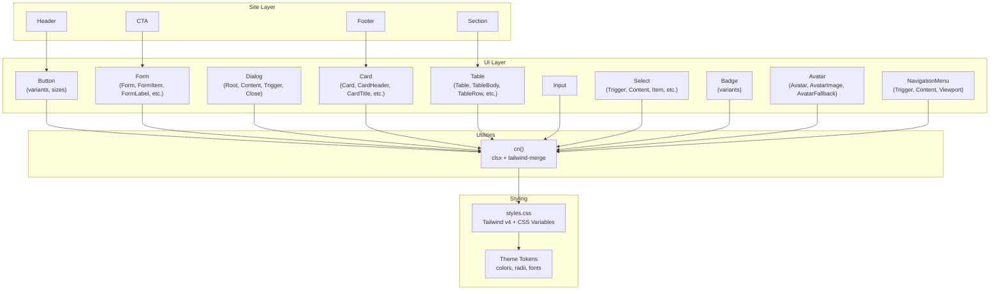
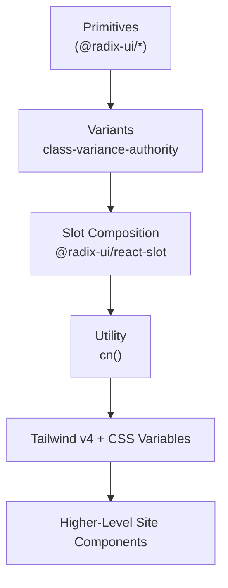
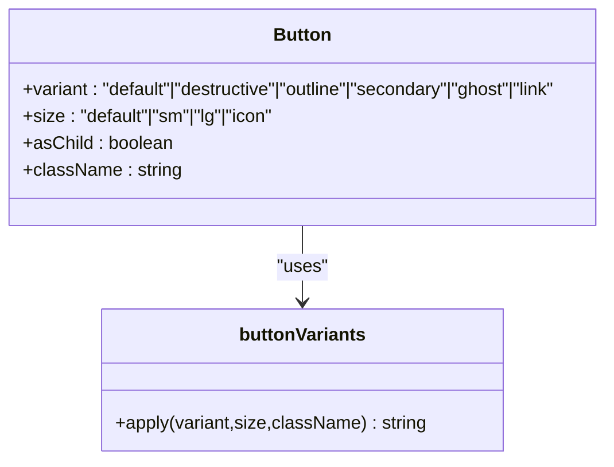
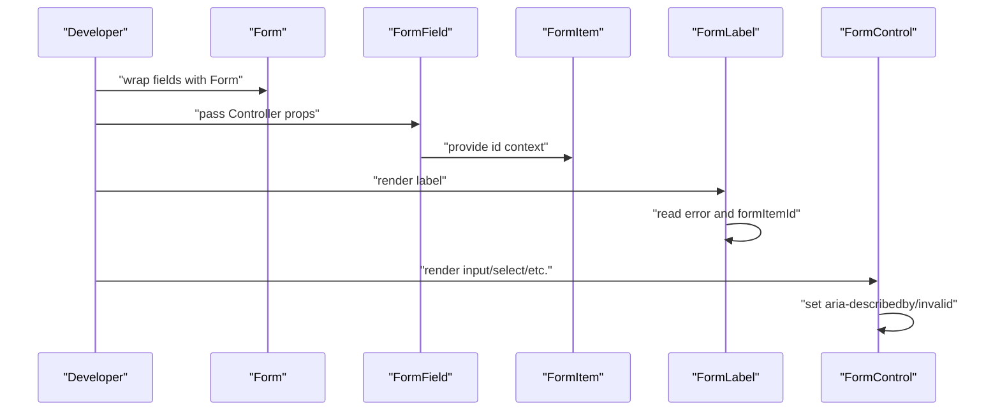
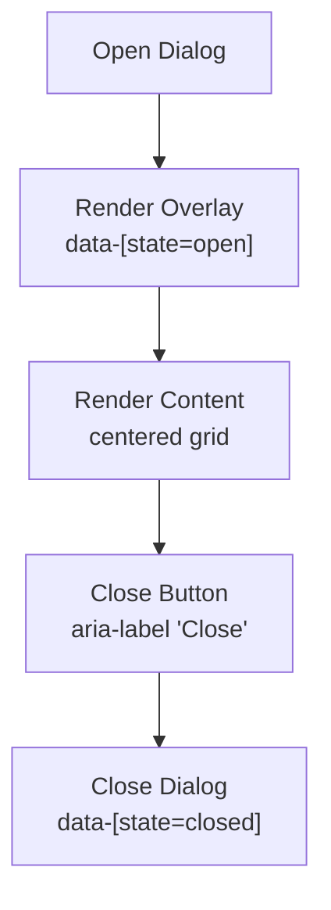
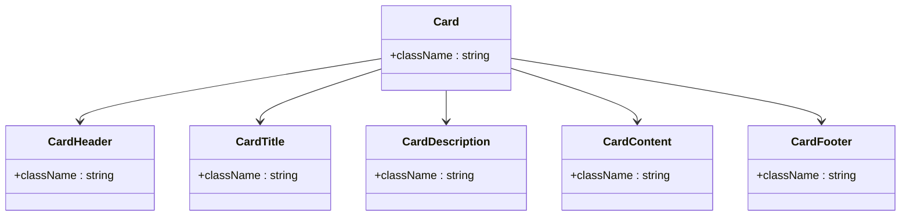
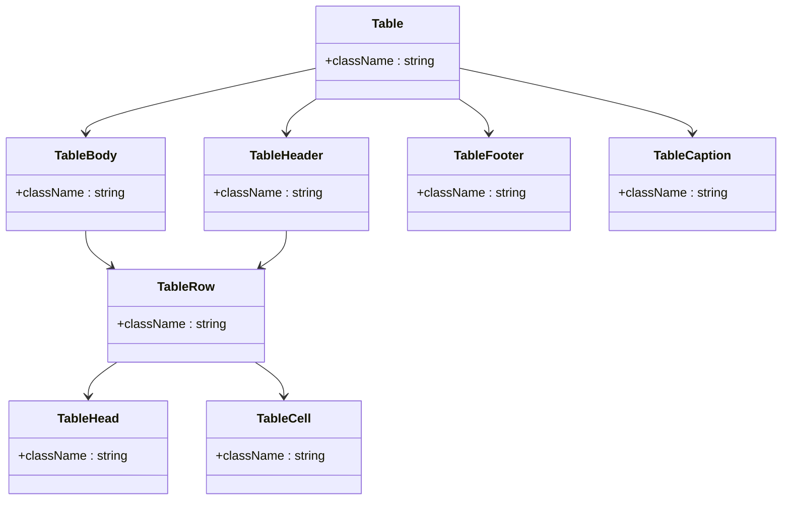
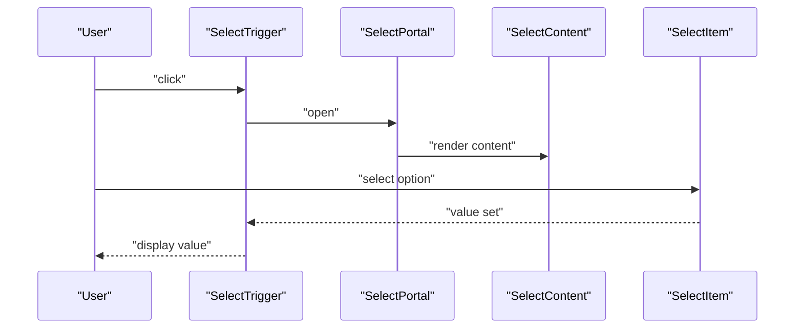
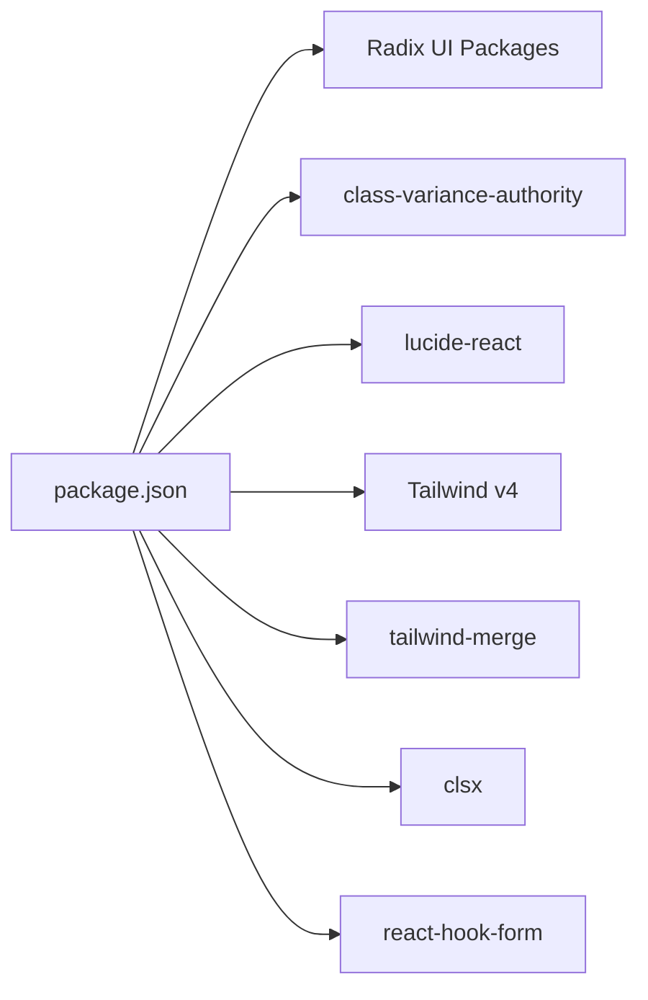

# Component Library

<cite>
**Referenced Files in This Document**
- [button.tsx](file://src/components/ui/button.tsx)
- [form.tsx](file://src/components/ui/form.tsx)
- [dialog.tsx](file://src/components/ui/dialog.tsx)
- [card.tsx](file://src/components/ui/card.tsx)
- [table.tsx](file://src/components/ui/table.tsx)
- [input.tsx](file://src/components/ui/input.tsx)
- [select.tsx](file://src/components/ui/select.tsx)
- [badge.tsx](file://src/components/ui/badge.tsx)
- [avatar.tsx](file://src/components/ui/avatar.tsx)
- [navigation-menu.tsx](file://src/components/ui/navigation-menu.tsx)
- [utils.ts](file://src/lib/utils.ts)
- [package.json](file://package.json)
- [components.json](file://components.json)
- [styles.css](file://src/styles.css)
</cite>

## Table of Contents
1. [Introduction](#introduction)
2. [Project Structure](#project-structure)
3. [Core Components](#core-components)
4. [Architecture Overview](#architecture-overview)
5. [Detailed Component Analysis](#detailed-component-analysis)
6. [Dependency Analysis](#dependency-analysis)
7. [Performance Considerations](#performance-considerations)
8. [Troubleshooting Guide](#troubleshooting-guide)
9. [Conclusion](#conclusion)
10. [Appendices](#appendices)

## Introduction
This document describes a comprehensive UI component library built on Radix UI primitives and styled with Tailwind CSS. The library provides 30+ reusable components spanning buttons, forms, dialogs, navigation, and data display. It emphasizes:
- Consistent design tokens and a cohesive theme
- Accessible primitives via Radix UI
- Composable variants and sizes using class-variance-authority
- Utility-driven styling with cn for safe class merging
- Responsive and animated interactions
- Composition patterns for higher-level site components

## Project Structure
The UI components live under src/components/ui and are consumed by site components under src/components/site. Styling is centralized in src/styles.css with Tailwind v4 and CSS variables for theme tokens. The project integrates Radix UI packages and related utilities.

**Diagram sources**
- [button.tsx:1-50](file://src/components/ui/button.tsx#L1-L50)
- [form.tsx:1-172](file://src/components/ui/form.tsx#L1-L172)
- [dialog.tsx:1-105](file://src/components/ui/dialog.tsx#L1-L105)
- [card.tsx:1-56](file://src/components/ui/card.tsx#L1-L56)
- [table.tsx:1-95](file://src/components/ui/table.tsx#L1-L95)
- [input.tsx:1-23](file://src/components/ui/input.tsx#L1-L23)
- [select.tsx:1-153](file://src/components/ui/select.tsx#L1-L153)
- [badge.tsx:1-33](file://src/components/ui/badge.tsx#L1-L33)
- [avatar.tsx:1-48](file://src/components/ui/avatar.tsx#L1-L48)
- [navigation-menu.tsx:1-121](file://src/components/ui/navigation-menu.tsx#L1-L121)
- [utils.ts:1-7](file://src/lib/utils.ts#L1-L7)
- [styles.css:1-136](file://src/styles.css#L1-L136)

**Section sources**
- [package.json:14-66](file://package.json#L14-L66)
- [components.json:1-23](file://components.json#L1-L23)
- [styles.css:1-136](file://src/styles.css#L1-L136)

## Core Components
This section highlights the primary building blocks and their patterns.

- Button
  - Variants: default, destructive, outline, secondary, ghost, link
  - Sizes: default, sm, lg, icon
  - Composition: accepts asChild via Slot; uses cn for merging classes
  - Accessibility: inherits native button semantics; focus-visible ring
  - Reference: [button.tsx:7-32](file://src/components/ui/button.tsx#L7-L32), [button.tsx:34-47](file://src/components/ui/button.tsx#L34-L47)

- Form System
  - Provider: Form (alias of FormProvider)
  - Fields: FormField (Controller wrapper), FormItem (context provider)
  - Labels: FormLabel (Radix Label with error-aware styling)
  - Controls: FormControl (Slot with aria-* attributes)
  - Descriptions: FormDescription
  - Messages: FormMessage (error message or child content)
  - Accessibility: aria-invalid, aria-describedby, generated ids
  - Reference: [form.tsx:16-38](file://src/components/ui/form.tsx#L16-L38), [form.tsx:86-101](file://src/components/ui/form.tsx#L86-L101), [form.tsx:103-118](file://src/components/ui/form.tsx#L103-L118), [form.tsx:138-160](file://src/components/ui/form.tsx#L138-L160)

- Dialog
  - Primitives: Root, Portal, Overlay, Content, Trigger, Close
  - Layout: centered grid with max width; close button with sr-only label
  - Animations: fade/zoom transitions via data-[state] attributes
  - Accessibility: overlay click-to-close, focus trapping via Radix
  - Reference: [dialog.tsx:9-15](file://src/components/ui/dialog.tsx#L9-L15), [dialog.tsx:17-29](file://src/components/ui/dialog.tsx#L17-L29), [dialog.tsx:32-54](file://src/components/ui/dialog.tsx#L32-L54), [dialog.tsx:69-91](file://src/components/ui/dialog.tsx#L69-L91)

- Card
  - Structure: Card, CardHeader, CardTitle, CardDescription, CardContent, CardFooter
  - Styling: border, background, shadow, spacing
  - Reference: [card.tsx:5-14](file://src/components/ui/card.tsx#L5-L14), [card.tsx:16-32](file://src/components/ui/card.tsx#L16-L32), [card.tsx:41-53](file://src/components/ui/card.tsx#L41-L53)

- Table
  - Structure: Table, TableHeader, TableBody, TableFooter, TableRow, TableHead, TableCell, TableCaption
  - Responsiveness: container scrolling; hover and selection states
  - Reference: [table.tsx:5-12](file://src/components/ui/table.tsx#L5-L12), [table.tsx:42-54](file://src/components/ui/table.tsx#L42-L54), [table.tsx:56-84](file://src/components/ui/table.tsx#L56-L84)

- Input
  - Base input with focus-visible ring and disabled states
  - Reference: [input.tsx:5-20](file://src/components/ui/input.tsx#L5-L20)

- Select
  - Primitives: Root, Group, Value, Trigger, Content, Label, Item, Separator, Scroll buttons
  - Behavior: viewport sizing, popper positioning, indicator, icons
  - Reference: [select.tsx:9-33](file://src/components/ui/select.tsx#L9-L33), [select.tsx:63-93](file://src/components/ui/select.tsx#L63-L93), [select.tsx:107-127](file://src/components/ui/select.tsx#L107-L127)

- Badge
  - Variants: default, secondary, destructive, outline
  - Reference: [badge.tsx:6-23](file://src/components/ui/badge.tsx#L6-L23), [badge.tsx:25-30](file://src/components/ui/badge.tsx#L25-L30)

- Avatar
  - Primitives: Root, Image, Fallback
  - Reference: [avatar.tsx:8-18](file://src/components/ui/avatar.tsx#L8-L18), [avatar.tsx:20-31](file://src/components/ui/avatar.tsx#L20-L31), [avatar.tsx:32-45](file://src/components/ui/avatar.tsx#L32-L45)

- NavigationMenu
  - Primitives: Root, List, Item, Trigger, Content, Link, Indicator, Viewport
  - Motion: viewport and indicator animations; chevron rotation on open
  - Reference: [navigation-menu.tsx:8-21](file://src/components/ui/navigation-menu.tsx#L8-L21), [navigation-menu.tsx:37-57](file://src/components/ui/navigation-menu.tsx#L37-L57), [navigation-menu.tsx:76-91](file://src/components/ui/navigation-menu.tsx#L76-L91)

**Section sources**
- [button.tsx:1-50](file://src/components/ui/button.tsx#L1-L50)
- [form.tsx:1-172](file://src/components/ui/form.tsx#L1-L172)
- [dialog.tsx:1-105](file://src/components/ui/dialog.tsx#L1-L105)
- [card.tsx:1-56](file://src/components/ui/card.tsx#L1-L56)
- [table.tsx:1-95](file://src/components/ui/table.tsx#L1-L95)
- [input.tsx:1-23](file://src/components/ui/input.tsx#L1-L23)
- [select.tsx:1-153](file://src/components/ui/select.tsx#L1-L153)
- [badge.tsx:1-33](file://src/components/ui/badge.tsx#L1-L33)
- [avatar.tsx:1-48](file://src/components/ui/avatar.tsx#L1-L48)
- [navigation-menu.tsx:1-121](file://src/components/ui/navigation-menu.tsx#L1-L121)

## Architecture Overview
The component library follows a layered architecture:
- Primitive layer: thin wrappers around Radix UI primitives
- Variant layer: class-variance-authority for consistent variants and sizes
- Composition layer: Slot-based composition for semantic flexibility
- Styling layer: cn utility with Tailwind v4 and CSS variables
- Site layer: higher-level components composed from UI primitives

**Diagram sources**
- [button.tsx:2-3](file://src/components/ui/button.tsx#L2-L3)
- [form.tsx:3](file://src/components/ui/form.tsx#L3)
- [utils.ts:4-6](file://src/lib/utils.ts#L4-L6)
- [styles.css:1-136](file://src/styles.css#L1-L136)
- [components.json:1-23](file://components.json#L1-L23)

## Detailed Component Analysis

### Button
- Pattern: cva defines variants and sizes; forwardRef exposes native button props; asChild enables semantic composition
- States: disabled pointer-events and opacity; focus-visible ring; svg nesting support
- Accessibility: inherits button semantics; supports aria attributes via props
- Customization: pass additional className to override defaults

**Diagram sources**
- [button.tsx:7-32](file://src/components/ui/button.tsx#L7-L32)
- [button.tsx:34-47](file://src/components/ui/button.tsx#L34-L47)

**Section sources**
- [button.tsx:1-50](file://src/components/ui/button.tsx#L1-L50)

### Form System
- Pattern: Context providers for field and item ids; Slot for control insertion; aria-* attributes for accessibility
- States: error-aware label color; dynamic aria-describedby; aria-invalid flag
- Composition: FormField wraps Controller; FormItem manages ids; useFormField centralizes field state

**Diagram sources**
- [form.tsx:16-38](file://src/components/ui/form.tsx#L16-L38)
- [form.tsx:73-83](file://src/components/ui/form.tsx#L73-L83)
- [form.tsx:86-101](file://src/components/ui/form.tsx#L86-L101)
- [form.tsx:103-118](file://src/components/ui/form.tsx#L103-L118)

**Section sources**
- [form.tsx:1-172](file://src/components/ui/form.tsx#L1-L172)

### Dialog
- Pattern: Portal renders overlay/content outside DOM subtree; overlay/content animate via data-[state]; close button with sr-only label
- States: open/closed via Radix; fade/zoom transitions
- Accessibility: focus trapping, keyboard handling, screen-reader friendly labels

**Diagram sources**
- [dialog.tsx:17-29](file://src/components/ui/dialog.tsx#L17-L29)
- [dialog.tsx:32-54](file://src/components/ui/dialog.tsx#L32-L54)
- [dialog.tsx:69-91](file://src/components/ui/dialog.tsx#L69-L91)

**Section sources**
- [dialog.tsx:1-105](file://src/components/ui/dialog.tsx#L1-L105)

### Card
- Pattern: Semantic sections with consistent spacing and typography
- Composition: Header/Title/Description/Footer for flexible layouts

**Diagram sources**
- [card.tsx:5-14](file://src/components/ui/card.tsx#L5-L14)
- [card.tsx:16-32](file://src/components/ui/card.tsx#L16-L32)
- [card.tsx:41-53](file://src/components/ui/card.tsx#L41-L53)

**Section sources**
- [card.tsx:1-56](file://src/components/ui/card.tsx#L1-L56)

### Table
- Pattern: Scrollable container with striped rows and hover/selection states
- Composition: Head/body/footer sections for semantic markup

**Diagram sources**
- [table.tsx:5-12](file://src/components/ui/table.tsx#L5-L12)
- [table.tsx:14-29](file://src/components/ui/table.tsx#L14-L29)
- [table.tsx:42-54](file://src/components/ui/table.tsx#L42-L54)
- [table.tsx:56-84](file://src/components/ui/table.tsx#L56-L84)
- [table.tsx:86-92](file://src/components/ui/table.tsx#L86-L92)

**Section sources**
- [table.tsx:1-95](file://src/components/ui/table.tsx#L1-L95)

### Input
- Pattern: Base input with focus-visible ring and disabled states; consistent sizing and typography
- Customization: className merges with defaults via cn

**Section sources**
- [input.tsx:1-23](file://src/components/ui/input.tsx#L1-L23)

### Select
- Pattern: Trigger/content with scroll buttons; viewport sizing; item indicators and separators
- States: disabled, selected, open; popper positioning adjustments

**Diagram sources**
- [select.tsx:15-33](file://src/components/ui/select.tsx#L15-L33)
- [select.tsx:63-93](file://src/components/ui/select.tsx#L63-L93)
- [select.tsx:107-127](file://src/components/ui/select.tsx#L107-L127)

**Section sources**
- [select.tsx:1-153](file://src/components/ui/select.tsx#L1-L153)

### Badge
- Pattern: cva variants for color roles; border and shadow options
- Customization: variant prop controls color scheme

**Section sources**
- [badge.tsx:1-33](file://src/components/ui/badge.tsx#L1-L33)

### Avatar
- Pattern: Root with rounded-full; Image and Fallback for loading/error states
- Accessibility: preserves semantic image role

**Section sources**
- [avatar.tsx:1-48](file://src/components/ui/avatar.tsx#L1-L48)

### NavigationMenu
- Pattern: Trigger chevron rotation; viewport animation; indicator visibility
- Motion: CSS transitions via data-[state] and motion attributes

**Section sources**
- [navigation-menu.tsx:1-121](file://src/components/ui/navigation-menu.tsx#L1-L121)

## Dependency Analysis
External dependencies and integrations:
- Radix UI primitives for accessibility and composability
- class-variance-authority for variant definitions
- lucide-react for icons
- Tailwind v4 for utility-first styling and tw-animate-css for animations
- react-hook-form for form integration

**Diagram sources**
- [package.json:14-66](file://package.json#L14-L66)

**Section sources**
- [package.json:14-66](file://package.json#L14-L66)

## Performance Considerations
- Prefer variants and sizes defined via class-variance-authority to minimize runtime conditionals
- Use cn to avoid redundant classes and reduce bundle size
- Limit heavy animations to essential components (Dialog, NavigationMenu)
- Keep portal usage scoped to modals/drawers to avoid unnecessary DOM overhead
- Use responsive utilities sparingly; coalesce repeated patterns into shared components

## Troubleshooting Guide
- Missing focus rings or incorrect focus-visible behavior
  - Ensure focus-visible ring utilities are present in styles and applied via variants
  - Verify Button and Input receive focus and that className does not override focus styles unintentionally
  - Reference: [button.tsx:8](file://src/components/ui/button.tsx#L8), [input.tsx:10](file://src/components/ui/input.tsx#L10)

- Form accessibility errors (ARIA invalid states)
  - Confirm FormControl sets aria-describedby and aria-invalid based on field error
  - Ensure FormLabel has htmlFor bound to formItemId
  - Reference: [form.tsx:103-118](file://src/components/ui/form.tsx#L103-L118), [form.tsx:86-101](file://src/components/ui/form.tsx#L86-L101)

- Dialog not animating or closing unexpectedly
  - Verify data-[state] attributes are present and Tailwind animations enabled
  - Ensure Portal renders overlay and content in the correct order
  - Reference: [dialog.tsx:17-29](file://src/components/ui/dialog.tsx#L17-L29), [dialog.tsx:32-54](file://src/components/ui/dialog.tsx#L32-L54)

- Select viewport misalignment
  - Confirm position="popper" classes and viewport sizing logic
  - Reference: [select.tsx:63-93](file://src/components/ui/select.tsx#L63-L93)

**Section sources**
- [button.tsx:1-50](file://src/components/ui/button.tsx#L1-L50)
- [input.tsx:1-23](file://src/components/ui/input.tsx#L1-L23)
- [form.tsx:1-172](file://src/components/ui/form.tsx#L1-L172)
- [dialog.tsx:1-105](file://src/components/ui/dialog.tsx#L1-L105)
- [select.tsx:1-153](file://src/components/ui/select.tsx#L1-L153)

## Conclusion
This component library establishes a robust, accessible, and maintainable foundation for building consistent UIs. By leveraging Radix UI primitives, class-variance-authority, and Tailwind CSS, it balances flexibility with strong defaults. The patterns demonstrated here enable teams to scale component development while preserving design system coherence.

## Appendices

### Design System and Theming
- CSS variables define theme tokens for colors, radii, fonts, gradients, and shadows
- Tailwind v4 layers base and utilities for global styles and reusable utilities
- Dark mode is supported via custom dark variant selector

**Section sources**
- [styles.css:8-43](file://src/styles.css#L8-L43), [styles.css:45-79](file://src/styles.css#L45-L79), [styles.css:81-107](file://src/styles.css#L81-L107), [styles.css:109-135](file://src/styles.css#L109-L135)

### Utilities and Class Merging
- cn combines clsx and tailwind-merge to deduplicate and merge classes safely
- Used across components to preserve specificity and avoid duplicates

**Section sources**
- [utils.ts:1-7](file://src/lib/utils.ts#L1-L7)

### Integration Notes
- components.json configures aliases and Tailwind CSS path for consistent imports
- Icons are standardized via lucide-react

**Section sources**
- [components.json:1-23](file://components.json#L1-L23)