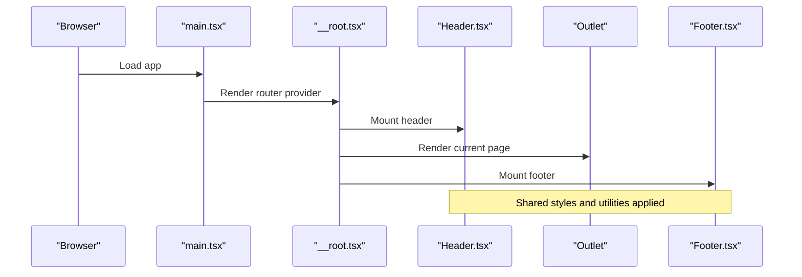
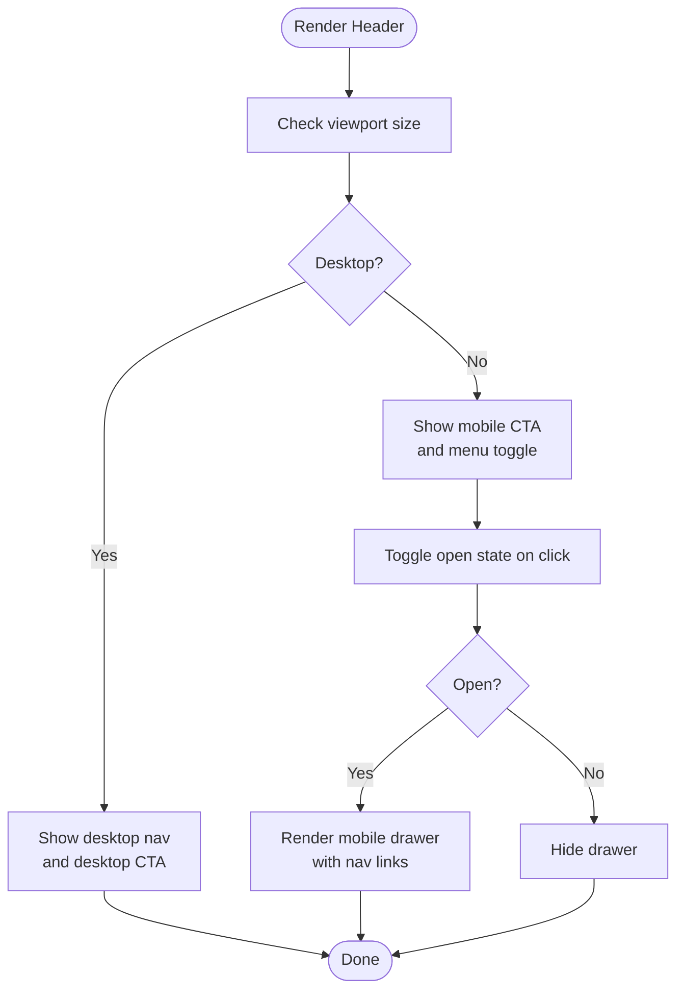
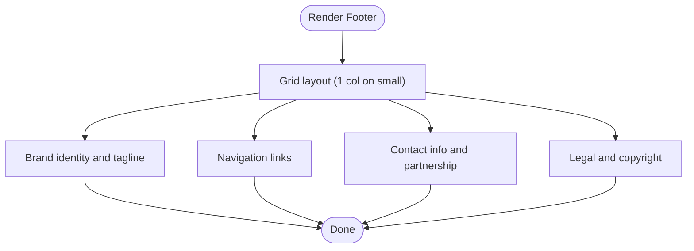
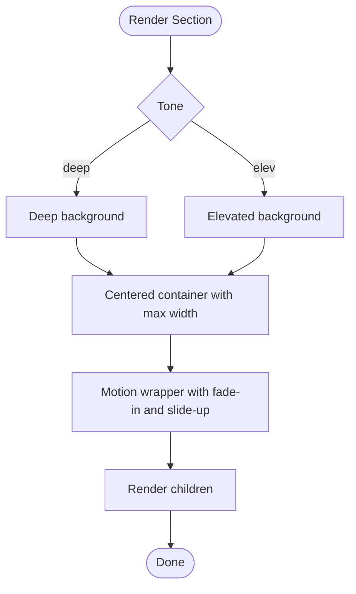
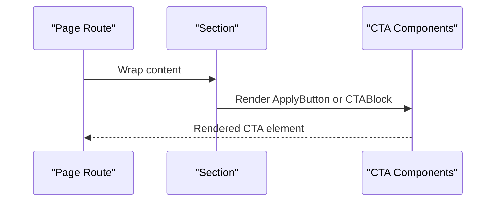
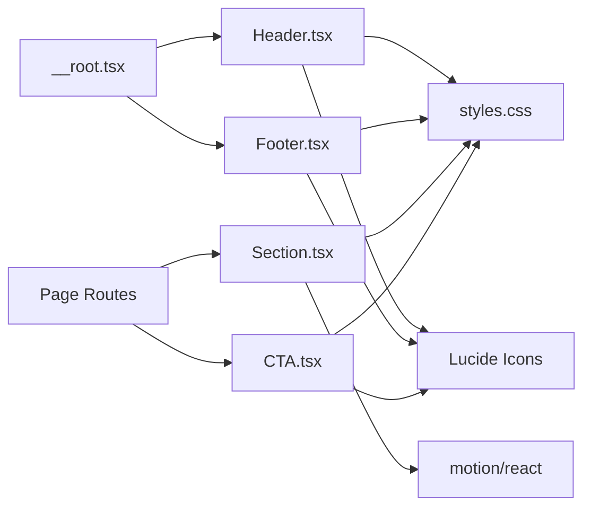

# Site Components

<cite>
**Referenced Files in This Document**
- [Header.tsx](file://src/components/site/Header.tsx)
- [Footer.tsx](file://src/components/site/Footer.tsx)
- [Section.tsx](file://src/components/site/Section.tsx)
- [CTA.tsx](file://src/components/site/CTA.tsx)
- [__root.tsx](file://src/routes/__root.tsx)
- [index.tsx](file://src/routes/index.tsx)
- [about.tsx](file://src/routes/about.tsx)
- [pricing.tsx](file://src/routes/pricing.tsx)
- [styles.css](file://src/styles.css)
- [use-mobile.tsx](file://src/hooks/use-mobile.tsx)
- [button.tsx](file://src/components/ui/button.tsx)
- [main.tsx](file://src/main.tsx)
</cite>

## Table of Contents
1. [Introduction](#introduction)
2. [Project Structure](#project-structure)
3. [Core Components](#core-components)
4. [Architecture Overview](#architecture-overview)
5. [Detailed Component Analysis](#detailed-component-analysis)
6. [Dependency Analysis](#dependency-analysis)
7. [Performance Considerations](#performance-considerations)
8. [Troubleshooting Guide](#troubleshooting-guide)
9. [Conclusion](#conclusion)
10. [Appendices](#appendices)

## Introduction
This document describes the application-specific site components that provide layout and structural elements for the Skillyme Programs System. It focuses on:
- Header: navigation, mobile responsiveness, and sticky positioning
- Footer: social/copyright layout and structure
- Section: content blocks with consistent spacing and styling
- CTA: call-to-action buttons and promotional blocks

It also explains how these components integrate with the overall application layout, how they relate to underlying UI primitives, and how to customize them for accessibility and responsive behavior.

## Project Structure
The site components live under src/components/site and are integrated into the routing system via the root route. Styles and design tokens are centralized in styles.css, and responsive utilities are used throughout.

```mermaid
graph TB
subgraph "Routing Layer"
Root["__root.tsx"]
Index["index.tsx"]
About["about.tsx"]
Pricing["pricing.tsx"]
end
subgraph "Site Components"
Header["Header.tsx"]
Footer["Footer.tsx"]
Section["Section.tsx"]
CTA["CTA.tsx"]
end
subgraph "UI Primitives"
Button["button.tsx"]
Utils["utils.ts"]
end
subgraph "Styles"
Styles["styles.css"]
UseMobile["use-mobile.tsx"]
end
Root --> Header
Root --> Footer
Index --> Section
About --> Section
Pricing --> Section
Index --> CTA
About --> CTA
Pricing --> CTA
Header --> Styles
Footer --> Styles
Section --> Styles
CTA --> Styles
Header --> UseMobile
Button --> Utils
```

**Diagram sources**
- [__root.tsx:49-60](file://src/routes/__root.tsx#L49-L60)
- [Header.tsx:13-84](file://src/components/site/Header.tsx#L13-L84)
- [Footer.tsx:3-44](file://src/components/site/Footer.tsx#L3-L44)
- [Section.tsx:4-44](file://src/components/site/Section.tsx#L4-L44)
- [CTA.tsx:1-27](file://src/components/site/CTA.tsx#L1-L27)
- [styles.css:1-135](file://src/styles.css#L1-L135)
- [use-mobile.tsx:1-20](file://src/hooks/use-mobile.tsx#L1-L20)
- [button.tsx:1-50](file://src/components/ui/button.tsx#L1-L50)
- [index.tsx:1-350](file://src/routes/index.tsx#L1-L350)
- [about.tsx:1-237](file://src/routes/about.tsx#L1-L237)
- [pricing.tsx:1-241](file://src/routes/pricing.tsx#L1-L241)

**Section sources**
- [__root.tsx:49-60](file://src/routes/__root.tsx#L49-L60)
- [styles.css:1-135](file://src/styles.css#L1-L135)

## Core Components
This section introduces each component’s purpose, props, and typical usage patterns.

- Header
  - Sticky top bar with logo, desktop navigation, and apply links
  - Mobile hamburger menu toggled via state
  - Uses gradient and glow utilities for visual emphasis
- Footer
  - Grid-based layout with brand identity, navigation, contact, and legal info
  - Responsive grid columns
- Section
  - Wrapper for content blocks with consistent vertical rhythm and backdrop blur
  - Optional “tone” variants for background depth
  - Includes helper headings and eyebrow utilities
- CTA
  - ApplyButton: prominent gradient call-to-action with external link
  - CTABlock: centered promotional container with heading and grouped actions

**Section sources**
- [Header.tsx:13-84](file://src/components/site/Header.tsx#L13-L84)
- [Footer.tsx:3-44](file://src/components/site/Footer.tsx#L3-L44)
- [Section.tsx:4-44](file://src/components/site/Section.tsx#L4-L44)
- [CTA.tsx:1-27](file://src/components/site/CTA.tsx#L1-L27)

## Architecture Overview
The site components are composed at the root route level and consumed by page routes. They rely on shared design tokens and utilities defined in styles.css and use-motion animations for subtle entrance effects.



**Diagram sources**
- [main.tsx:1-21](file://src/main.tsx#L1-L21)
- [__root.tsx:49-60](file://src/routes/__root.tsx#L49-L60)
- [Header.tsx:13-84](file://src/components/site/Header.tsx#L13-L84)
- [Footer.tsx:3-44](file://src/components/site/Footer.tsx#L3-L44)

## Detailed Component Analysis

### Header Component
Responsibilities:
- Provide primary navigation links
- Offer mobile-responsive navigation via a collapsible drawer
- Maintain sticky positioning at the top of the viewport
- Render a branded logo and gradient “Apply Now” call-to-action

Key behaviors:
- Navigation links are defined statically and rendered conditionally for desktop vs. mobile
- Mobile menu toggled with an internal state flag
- Desktop and mobile apply buttons differ in size and visibility
- Uses Lucide icons for menu and close affordances
- Accessibility: aria-label on the mobile toggle button

Responsive design:
- Desktop: horizontal nav and desktop apply button
- Mobile: hamburger menu opens a vertical list of links

Styling and theming:
- Backdrop blur and semi-transparent backgrounds
- Gradient and glow utilities for CTAs
- Sticky positioning with z-index and border separation

Accessibility:
- Focus styles defined globally
- Clear contrast and readable typography
- Semantic links and buttons

Customization options:
- Modify navigation entries in the static array
- Adjust gradient and shadow tokens in styles.css
- Change sticky behavior by editing position and backdrop classes

Usage examples:
- Integrated in the root route layout
- Consumed implicitly by all pages

**Section sources**
- [Header.tsx:13-84](file://src/components/site/Header.tsx#L13-L84)
- [__root.tsx:49-60](file://src/routes/__root.tsx#L49-L60)
- [styles.css:109-135](file://src/styles.css#L109-L135)



**Diagram sources**
- [Header.tsx:13-84](file://src/components/site/Header.tsx#L13-L84)

### Footer Component
Responsibilities:
- Present brand identity and tagline
- Provide navigational links to key pages
- Display contact information and legal notices
- Maintain a responsive grid layout

Structure:
- Brand area with logo placeholder and tagline
- Navigate column with internal links
- Contact column with email and partnership text
- Legal column with data protection notice and copyright

Responsive design:
- Single column on small screens
- Three-column grid on medium screens and above

Accessibility:
- Links use semantic anchor elements with appropriate targets for external resources
- Text contrast maintained via theme tokens

Customization options:
- Update navigation links and labels
- Modify legal text and contact details
- Adjust grid columns via Tailwind utilities

Usage examples:
- Integrated in the root route layout
- Consumed implicitly by all pages

**Section sources**
- [Footer.tsx:3-44](file://src/components/site/Footer.tsx#L3-L44)
- [__root.tsx:49-60](file://src/routes/__root.tsx#L49-L60)
- [styles.css:109-135](file://src/styles.css#L109-L135)



**Diagram sources**
- [Footer.tsx:3-44](file://src/components/site/Footer.tsx#L3-L44)

### Section Component
Responsibilities:
- Encapsulate content blocks with consistent spacing and backdrop blur
- Provide optional “tone” variants for background depth
- Center content within a max-width container
- Add entrance animation on view with motion

Composition:
- Accepts id, children, className, and tone props
- Renders a motion-styled wrapper with max-width container
- Exposes helper components: Eyebrow and H2

Responsive design:
- Consistent padding via utility class
- Max-width container centers content across breakpoints

Accessibility:
- Semantic headings and text utilities
- Maintains readability with theme tokens

Customization options:
- Choose tone variant (“deep” or “elev”)
- Extend className for additional styling
- Use helper components for consistent typography

Usage examples:
- Used extensively in index, about, and pricing pages
- Combined with CTA components for promotional sections

**Section sources**
- [Section.tsx:4-44](file://src/components/site/Section.tsx#L4-L44)
- [index.tsx:163-183](file://src/routes/index.tsx#L163-L183)
- [about.tsx:45-76](file://src/routes/about.tsx#L45-L76)
- [pricing.tsx:102-132](file://src/routes/pricing.tsx#L102-L132)



**Diagram sources**
- [Section.tsx:4-44](file://src/components/site/Section.tsx#L4-L44)

### CTA Component
Responsibilities:
- Provide a prominent call-to-action button for applications
- Offer a promotional block for grouping multiple actions

Composition:
- ApplyButton: configurable size and label, external link with noreferrer and target attributes
- CTABlock: centered layout with heading and grouped child actions

Integration:
- Used within Section blocks on landing and informational pages
- Linked to the shared application portal

Responsive design:
- Button sizes adapt via utility classes
- Block layout stacks vertically on small screens, aligns horizontally on larger screens

Accessibility:
- External links include appropriate attributes for security and usability
- Focus styles and contrast maintained by theme tokens

Customization options:
- Adjust size and label for ApplyButton
- Customize CTABlock heading and inner actions
- Replace URL constant with environment-aware configuration

Usage examples:
- Prominent placement in hero sections and conclusion blocks
- Combined with navigation links for cross-promotion

**Section sources**
- [CTA.tsx:1-27](file://src/components/site/CTA.tsx#L1-L27)
- [index.tsx:135-142](file://src/routes/index.tsx#L135-L142)
- [about.tsx:227-233](file://src/routes/about.tsx#L227-L233)
- [pricing.tsx:227-237](file://src/routes/pricing.tsx#L227-L237)



**Diagram sources**
- [index.tsx:135-142](file://src/routes/index.tsx#L135-L142)
- [about.tsx:227-233](file://src/routes/about.tsx#L227-L233)
- [pricing.tsx:227-237](file://src/routes/pricing.tsx#L227-L237)
- [Section.tsx:4-44](file://src/components/site/Section.tsx#L4-L44)
- [CTA.tsx:1-27](file://src/components/site/CTA.tsx#L1-L27)

## Dependency Analysis
The site components depend on:
- Shared design tokens and utilities in styles.css
- Motion for entrance animations
- Lucide icons for UI affordances
- TanStack Router for navigation and routing



**Diagram sources**
- [Header.tsx:1-4](file://src/components/site/Header.tsx#L1-L4)
- [Footer.tsx:1-1](file://src/components/site/Footer.tsx#L1-L1)
- [Section.tsx:1-2](file://src/components/site/Section.tsx#L1-L2)
- [CTA.tsx:1-1](file://src/components/site/CTA.tsx#L1-L1)
- [styles.css:109-135](file://src/styles.css#L109-L135)
- [__root.tsx:9-10](file://src/routes/__root.tsx#L9-L10)
- [index.tsx:1-12](file://src/routes/index.tsx#L1-L12)

**Section sources**
- [styles.css:1-135](file://src/styles.css#L1-L135)
- [Header.tsx:1-4](file://src/components/site/Header.tsx#L1-L4)
- [Footer.tsx:1-1](file://src/components/site/Footer.tsx#L1-L1)
- [Section.tsx:1-2](file://src/components/site/Section.tsx#L1-L2)
- [CTA.tsx:1-1](file://src/components/site/CTA.tsx#L1-L1)
- [__root.tsx:9-10](file://src/routes/__root.tsx#L9-L10)

## Performance Considerations
- Lazy loading and minimal re-renders: Keep Header and Footer as pure functional components with minimal state
- Motion animations: Entrance animations are scoped to visible sections to avoid unnecessary computations
- CSS utilities: Reuse shared utilities to reduce CSS bundle size
- Image assets: Ensure images are optimized and sized appropriately for different viewports

## Troubleshooting Guide
Common issues and resolutions:
- Navigation links not updating
  - Verify the static navigation array in Header and ensure keys match route paths
- Mobile menu not opening
  - Confirm state toggle logic and that the aria-label is present for accessibility
- Apply button not linking externally
  - Ensure target and rel attributes are set for external links
- Spacing inconsistencies
  - Use the Section component with the intended tone and className to maintain consistent padding
- Gradient or glow visuals not appearing
  - Confirm that the gradient and shadow tokens are defined in styles.css and applied via utility classes

**Section sources**
- [Header.tsx:13-84](file://src/components/site/Header.tsx#L13-L84)
- [Footer.tsx:3-44](file://src/components/site/Footer.tsx#L3-L44)
- [Section.tsx:4-44](file://src/components/site/Section.tsx#L4-L44)
- [CTA.tsx:1-27](file://src/components/site/CTA.tsx#L1-L27)
- [styles.css:109-135](file://src/styles.css#L109-L135)

## Conclusion
The site components provide a cohesive, accessible, and responsive foundation for the application. They leverage shared design tokens, motion utilities, and semantic markup to deliver a consistent user experience across pages. Their modular structure enables easy customization and extension while maintaining alignment with the overall design system.

## Appendices

### Relationship to UI Primitives
- The site components do not directly import UI primitives but rely on:
  - Shared design tokens and utilities (styles.css)
  - Motion for animations
  - Lucide icons for affordances
- UI primitives like Button are available for building interactive elements elsewhere in the app and can be composed with site components when needed.

**Section sources**
- [button.tsx:1-50](file://src/components/ui/button.tsx#L1-L50)
- [styles.css:1-135](file://src/styles.css#L1-L135)

### Responsive Design and Accessibility Checklist
- Responsive breakpoints
  - Mobile-first design with desktop variants
  - Use of grid utilities for layout adaptation
- Accessibility
  - Focus-visible outlines and keyboard navigation
  - Proper contrast and readable typography
  - ARIA labels for interactive elements

**Section sources**
- [styles.css:81-107](file://src/styles.css#L81-L107)
- [use-mobile.tsx:1-20](file://src/hooks/use-mobile.tsx#L1-L20)