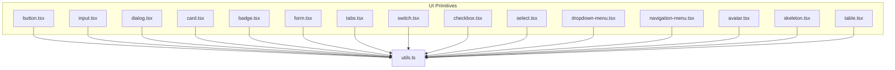
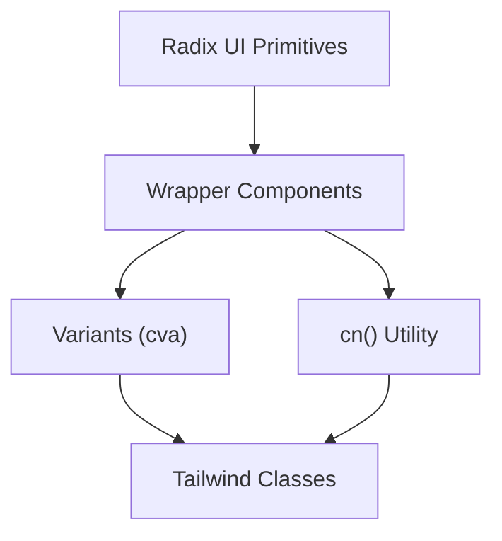
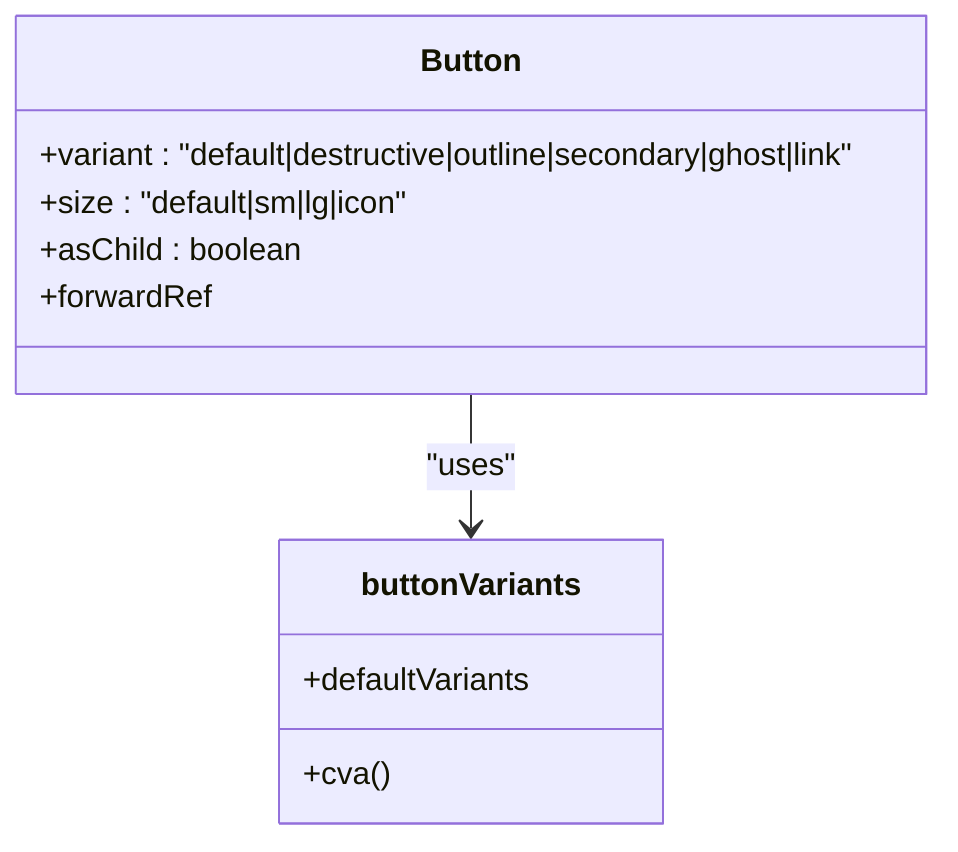
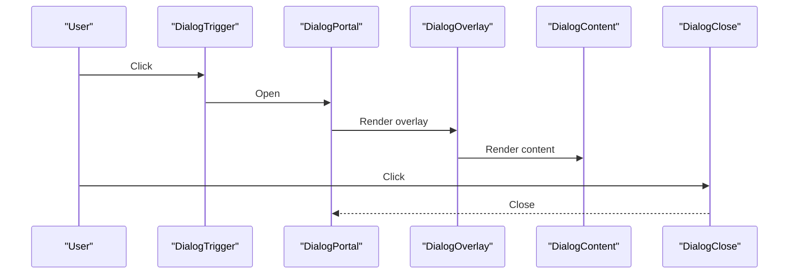
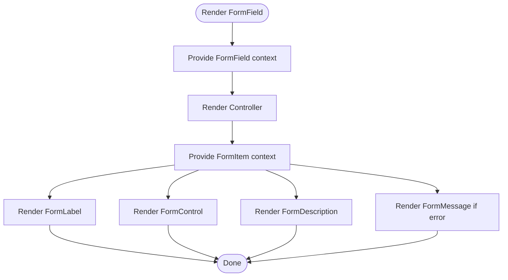
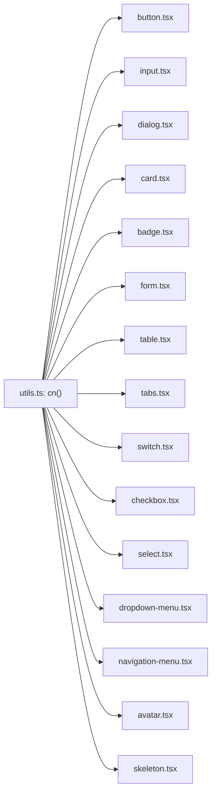

# UI Components

<cite>
**Referenced Files in This Document**
- [button.tsx](file://src/components/ui/button.tsx)
- [input.tsx](file://src/components/ui/input.tsx)
- [dialog.tsx](file://src/components/ui/dialog.tsx)
- [card.tsx](file://src/components/ui/card.tsx)
- [badge.tsx](file://src/components/ui/badge.tsx)
- [form.tsx](file://src/components/ui/form.tsx)
- [table.tsx](file://src/components/ui/table.tsx)
- [tabs.tsx](file://src/components/ui/tabs.tsx)
- [switch.tsx](file://src/components/ui/switch.tsx)
- [checkbox.tsx](file://src/components/ui/checkbox.tsx)
- [select.tsx](file://src/components/ui/select.tsx)
- [dropdown-menu.tsx](file://src/components/ui/dropdown-menu.tsx)
- [navigation-menu.tsx](file://src/components/ui/navigation-menu.tsx)
- [avatar.tsx](file://src/components/ui/avatar.tsx)
- [skeleton.tsx](file://src/components/ui/skeleton.tsx)
- [utils.ts](file://src/lib/utils.ts)
</cite>

## Table of Contents
1. [Introduction](#introduction)
2. [Project Structure](#project-structure)
3. [Core Components](#core-components)
4. [Architecture Overview](#architecture-overview)
5. [Detailed Component Analysis](#detailed-component-analysis)
6. [Dependency Analysis](#dependency-analysis)
7. [Performance Considerations](#performance-considerations)
8. [Troubleshooting Guide](#troubleshooting-guide)
9. [Conclusion](#conclusion)
10. [Appendices](#appendices)

## Introduction
This document describes the UI primitive components that compose the design system. These primitives are built on Radix UI to ensure accessibility, interoperability, and consistent behavior across components. Each component exposes a small set of props, variants, and styling hooks that integrate with Tailwind CSS via a shared cn() utility for conditional class merging. The guide explains component architecture, prop interfaces, styling patterns, accessibility features, and composition strategies. It also outlines how to extend components while preserving design consistency and how primitives relate to higher-level site components.

## Project Structure
The UI primitives live under src/components/ui and are organized by feature area. Each file exports one or more components that wrap Radix UI primitives and apply consistent Tailwind classes. Shared utilities (like cn()) are centralized in src/lib/utils.ts.

**Diagram sources**
- [button.tsx:1-50](file://src/components/ui/button.tsx#L1-L50)
- [input.tsx:1-23](file://src/components/ui/input.tsx#L1-L23)
- [dialog.tsx:1-105](file://src/components/ui/dialog.tsx#L1-L105)
- [card.tsx:1-56](file://src/components/ui/card.tsx#L1-L56)
- [badge.tsx:1-33](file://src/components/ui/badge.tsx#L1-L33)
- [form.tsx:1-172](file://src/components/ui/form.tsx#L1-L172)
- [table.tsx:1-95](file://src/components/ui/table.tsx#L1-L95)
- [tabs.tsx:1-54](file://src/components/ui/tabs.tsx#L1-L54)
- [switch.tsx:1-28](file://src/components/ui/switch.tsx#L1-L28)
- [checkbox.tsx:1-27](file://src/components/ui/checkbox.tsx#L1-L27)
- [select.tsx:1-153](file://src/components/ui/select.tsx#L1-L153)
- [dropdown-menu.tsx:1-189](file://src/components/ui/dropdown-menu.tsx#L1-L189)
- [navigation-menu.tsx:1-121](file://src/components/ui/navigation-menu.tsx#L1-L121)
- [avatar.tsx:1-48](file://src/components/ui/avatar.tsx#L1-L48)
- [skeleton.tsx:1-8](file://src/components/ui/skeleton.tsx#L1-L8)
- [utils.ts](file://src/lib/utils.ts)

**Section sources**
- [button.tsx:1-50](file://src/components/ui/button.tsx#L1-L50)
- [input.tsx:1-23](file://src/components/ui/input.tsx#L1-L23)
- [dialog.tsx:1-105](file://src/components/ui/dialog.tsx#L1-L105)
- [card.tsx:1-56](file://src/components/ui/card.tsx#L1-L56)
- [badge.tsx:1-33](file://src/components/ui/badge.tsx#L1-L33)
- [form.tsx:1-172](file://src/components/ui/form.tsx#L1-L172)
- [table.tsx:1-95](file://src/components/ui/table.tsx#L1-L95)
- [tabs.tsx:1-54](file://src/components/ui/tabs.tsx#L1-L54)
- [switch.tsx:1-28](file://src/components/ui/switch.tsx#L1-L28)
- [checkbox.tsx:1-27](file://src/components/ui/checkbox.tsx#L1-L27)
- [select.tsx:1-153](file://src/components/ui/select.tsx#L1-L153)
- [dropdown-menu.tsx:1-189](file://src/components/ui/dropdown-menu.tsx#L1-L189)
- [navigation-menu.tsx:1-121](file://src/components/ui/navigation-menu.tsx#L1-L121)
- [avatar.tsx:1-48](file://src/components/ui/avatar.tsx#L1-L48)
- [skeleton.tsx:1-8](file://src/components/ui/skeleton.tsx#L1-L8)
- [utils.ts](file://src/lib/utils.ts)

## Core Components
This section summarizes the primary UI primitives and their roles in the system.

- Button: Variants and sizes with consistent focus, hover, and disabled states; supports rendering as a child element via asChild.
- Input: Text input with focus, disabled, and placeholder styling.
- Dialog: Overlay, portal, content, header, footer, title, and description wrappers around Radix Dialog primitives.
- Card: Container with header, title, description, content, and footer slots.
- Badge: Label-like indicator with variant styling.
- Form: Provider and form-field helpers for react-hook-form with accessibility attributes and labeling.
- Table: Scrollable container plus table, thead, tbody, tfoot, tr, th, td, and caption.
- Tabs: Root, list, trigger, and content wrappers around Radix Tabs.
- Switch: Toggle with thumb and data-state-driven styling.
- Checkbox: Box with check indicator and data-state-driven styling.
- Select: Root, group, value, trigger, content, viewport, label, item, separator, and scroll buttons.
- Dropdown Menu: Root, trigger, content, items (including checkbox/radio), labels, separators, submenus, and shortcuts.
- Navigation Menu: Root, list, item, trigger, content, link, indicator, and viewport.
- Avatar: Root, image, and fallback wrappers.
- Skeleton: Pulse animation for loading placeholders.
- Utilities: cn() merges Tailwind classes safely.

**Section sources**
- [button.tsx:1-50](file://src/components/ui/button.tsx#L1-L50)
- [input.tsx:1-23](file://src/components/ui/input.tsx#L1-L23)
- [dialog.tsx:1-105](file://src/components/ui/dialog.tsx#L1-L105)
- [card.tsx:1-56](file://src/components/ui/card.tsx#L1-L56)
- [badge.tsx:1-33](file://src/components/ui/badge.tsx#L1-L33)
- [form.tsx:1-172](file://src/components/ui/form.tsx#L1-L172)
- [table.tsx:1-95](file://src/components/ui/table.tsx#L1-L95)
- [tabs.tsx:1-54](file://src/components/ui/tabs.tsx#L1-L54)
- [switch.tsx:1-28](file://src/components/ui/switch.tsx#L1-L28)
- [checkbox.tsx:1-27](file://src/components/ui/checkbox.tsx#L1-L27)
- [select.tsx:1-153](file://src/components/ui/select.tsx#L1-L153)
- [dropdown-menu.tsx:1-189](file://src/components/ui/dropdown-menu.tsx#L1-L189)
- [navigation-menu.tsx:1-121](file://src/components/ui/navigation-menu.tsx#L1-L121)
- [avatar.tsx:1-48](file://src/components/ui/avatar.tsx#L1-L48)
- [skeleton.tsx:1-8](file://src/components/ui/skeleton.tsx#L1-L8)
- [utils.ts](file://src/lib/utils.ts)

## Architecture Overview
The UI primitives follow a consistent pattern:
- Wrap Radix UI primitives to preserve accessibility semantics.
- Apply Tailwind classes via cn() for theme-aware styling.
- Expose variants and sizes using class-variance-authority where appropriate.
- Support composition via asChild and Slot where applicable.
- Provide semantic subcomponents (header, footer, trigger, content) for structured layouts.

[No sources needed since this diagram shows conceptual workflow, not actual code structure]

## Detailed Component Analysis

### Button
- Purpose: Base action element with variants and sizes.
- Props:
  - Inherits standard button attributes.
  - variant: default, destructive, outline, secondary, ghost, link.
  - size: default, sm, lg, icon.
  - asChild: render as a child element using @radix-ui/react-slot.
- Styling:
  - Uses cva for variant and size combinations.
  - Focus-visible ring, transitions, disabled states, and SVG sizing handled consistently.
- Accessibility:
  - Inherits native button semantics; focus-visible ring ensures keyboard operability.
- Composition:
  - Combine with icons and text; use asChild to render links or custom anchors.

**Diagram sources**
- [button.tsx:7-32](file://src/components/ui/button.tsx#L7-L32)

**Section sources**
- [button.tsx:1-50](file://src/components/ui/button.tsx#L1-L50)

### Input
- Purpose: Text input with consistent focus/disabled styling.
- Props:
  - Standard input attributes plus className.
- Styling:
  - Border, background, padding, focus ring, disabled opacity, and placeholder color.
- Accessibility:
  - Native input semantics; focus-visible ring for keyboard navigation.

**Section sources**
- [input.tsx:1-23](file://src/components/ui/input.tsx#L1-L23)

### Dialog
- Purpose: Modal overlay with animated content and close controls.
- Subcomponents:
  - Dialog, Portal, Overlay, Trigger, Close, Content, Header, Footer, Title, Description.
- Props:
  - Overlay and Content accept className and pass-through attributes.
  - Content includes close button with sr-only label.
- Animations:
  - Fade and zoom animations driven by data-state attributes.
- Accessibility:
  - Proper focus trapping via Radix Dialog; close button labeled for screen readers.

**Diagram sources**
- [dialog.tsx:9-54](file://src/components/ui/dialog.tsx#L9-L54)

**Section sources**
- [dialog.tsx:1-105](file://src/components/ui/dialog.tsx#L1-L105)

### Card
- Purpose: Content container with header/title/description/content/footer slots.
- Props:
  - All subcomponents accept className and HTML attributes.
- Styling:
  - Consistent border, background, and shadow; spacing optimized for content blocks.

**Section sources**
- [card.tsx:1-56](file://src/components/ui/card.tsx#L1-L56)

### Badge
- Purpose: Label or indicator with variant styling.
- Props:
  - variant: default, secondary, destructive, outline.
- Styling:
  - Uses cva for variant classes; focus ring for keyboard focus.

**Section sources**
- [badge.tsx:1-33](file://src/components/ui/badge.tsx#L1-L33)

### Form (react-hook-form integration)
- Purpose: Provide form context and helpers for labeling, validation, and accessibility.
- Key exports:
  - Form, FormField, FormItem, FormLabel, FormControl, FormDescription, FormMessage, useFormField.
- Behavior:
  - Generates unique ids per item; connects labels to controls; sets aria-invalid and aria-describedby.
  - Renders error messages when present.
- Accessibility:
  - Ensures proper labeling and error announcements.

**Diagram sources**
- [form.tsx:16-171](file://src/components/ui/form.tsx#L16-L171)

**Section sources**
- [form.tsx:1-172](file://src/components/ui/form.tsx#L1-L172)

### Table
- Purpose: Scrollable table container with semantic table parts.
- Props:
  - Table wraps a div with overflow-auto; subcomponents accept className and HTML attributes.
- Styling:
  - Hover and selection states; responsive checkbox alignment.

**Section sources**
- [table.tsx:1-95](file://src/components/ui/table.tsx#L1-L95)

### Tabs
- Purpose: Tabbed interface with list, triggers, and content.
- Props:
  - TabsList, TabsTrigger, TabsContent accept className and pass-through attributes.
  - Active state styling via data-state.
- Accessibility:
  - Inherits Radix Tabs semantics; focus-visible ring for keyboard navigation.

**Section sources**
- [tabs.tsx:1-54](file://src/components/ui/tabs.tsx#L1-L54)

### Switch
- Purpose: Binary toggle with animated thumb.
- Props:
  - Root and Thumb accept className and pass-through attributes.
  - Data-state classes drive checked/unchecked styles.

**Section sources**
- [switch.tsx:1-28](file://src/components/ui/switch.tsx#L1-L28)

### Checkbox
- Purpose: Selection box with check indicator.
- Props:
  - Root and Indicator accept className and pass-through attributes.
  - Data-state classes drive checked styles.

**Section sources**
- [checkbox.tsx:1-27](file://src/components/ui/checkbox.tsx#L1-L27)

### Select
- Purpose: Accessible single/multi-selection dropdown.
- Subcomponents:
  - Root, Group, Value, Trigger, Content, Viewport, Label, Item, Separator, ScrollUp/Down buttons.
- Props:
  - Trigger and Item accept className and pass-through attributes.
  - Position and popper transforms handled via data-state and CSS variables.
- Accessibility:
  - Keyboard navigation, focus management, and selection indicators.

**Section sources**
- [select.tsx:1-153](file://src/components/ui/select.tsx#L1-L153)

### Dropdown Menu
- Purpose: Contextual menu with optional submenus and checkboxes/radios.
- Subcomponents:
  - Root, Trigger, Content, Item, CheckboxItem, RadioItem, Label, Separator, Shortcut, Group, Portal, Sub, SubContent, SubTrigger, RadioGroup.
- Props:
  - Many items accept className and pass-through attributes.
  - Side offsets and animations via data-state.
- Accessibility:
  - Focus management, keyboard navigation, and indicator patterns.

**Section sources**
- [dropdown-menu.tsx:1-189](file://src/components/ui/dropdown-menu.tsx#L1-L189)

### Navigation Menu
- Purpose: Multi-level navigation with animated viewport and indicator.
- Subcomponents:
  - Root, List, Item, Trigger, Content, Link, Indicator, Viewport.
- Props:
  - Trigger includes rotation animation; Viewport animates open/close.
- Accessibility:
  - Focus management and motion-safe animations.

**Section sources**
- [navigation-menu.tsx:1-121](file://src/components/ui/navigation-menu.tsx#L1-L121)

### Avatar
- Purpose: User identity with image and fallback.
- Subcomponents:
  - Root, Image, Fallback.
- Props:
  - Accept className and pass-through attributes.
- Accessibility:
  - Semantic structure; image alt/fallback handled by primitives.

**Section sources**
- [avatar.tsx:1-48](file://src/components/ui/avatar.tsx#L1-L48)

### Skeleton
- Purpose: Loading placeholder with pulse animation.
- Props:
  - Accept className and HTML attributes.

**Section sources**
- [skeleton.tsx:1-8](file://src/components/ui/skeleton.tsx#L1-L8)

## Dependency Analysis
All components depend on:
- Radix UI primitives for accessibility semantics and behavior.
- Tailwind CSS for styling.
- class-variance-authority for variant definitions.
- @radix-ui/react-slot for asChild composition.
- lucide-react for icons where applicable.

**Diagram sources**
- [utils.ts](file://src/lib/utils.ts)
- [button.tsx:1-50](file://src/components/ui/button.tsx#L1-L50)
- [input.tsx:1-23](file://src/components/ui/input.tsx#L1-L23)
- [dialog.tsx:1-105](file://src/components/ui/dialog.tsx#L1-L105)
- [card.tsx:1-56](file://src/components/ui/card.tsx#L1-L56)
- [badge.tsx:1-33](file://src/components/ui/badge.tsx#L1-L33)
- [form.tsx:1-172](file://src/components/ui/form.tsx#L1-L172)
- [table.tsx:1-95](file://src/components/ui/table.tsx#L1-L95)
- [tabs.tsx:1-54](file://src/components/ui/tabs.tsx#L1-L54)
- [switch.tsx:1-28](file://src/components/ui/switch.tsx#L1-L28)
- [checkbox.tsx:1-27](file://src/components/ui/checkbox.tsx#L1-L27)
- [select.tsx:1-153](file://src/components/ui/select.tsx#L1-L153)
- [dropdown-menu.tsx:1-189](file://src/components/ui/dropdown-menu.tsx#L1-L189)
- [navigation-menu.tsx:1-121](file://src/components/ui/navigation-menu.tsx#L1-L121)
- [avatar.tsx:1-48](file://src/components/ui/avatar.tsx#L1-L48)
- [skeleton.tsx:1-8](file://src/components/ui/skeleton.tsx#L1-L8)

**Section sources**
- [utils.ts](file://src/lib/utils.ts)
- [button.tsx:1-50](file://src/components/ui/button.tsx#L1-L50)
- [input.tsx:1-23](file://src/components/ui/input.tsx#L1-L23)
- [dialog.tsx:1-105](file://src/components/ui/dialog.tsx#L1-L105)
- [card.tsx:1-56](file://src/components/ui/card.tsx#L1-L56)
- [badge.tsx:1-33](file://src/components/ui/badge.tsx#L1-L33)
- [form.tsx:1-172](file://src/components/ui/form.tsx#L1-L172)
- [table.tsx:1-95](file://src/components/ui/table.tsx#L1-L95)
- [tabs.tsx:1-54](file://src/components/ui/tabs.tsx#L1-L54)
- [switch.tsx:1-28](file://src/components/ui/switch.tsx#L1-L28)
- [checkbox.tsx:1-27](file://src/components/ui/checkbox.tsx#L1-L27)
- [select.tsx:1-153](file://src/components/ui/select.tsx#L1-L153)
- [dropdown-menu.tsx:1-189](file://src/components/ui/dropdown-menu.tsx#L1-L189)
- [navigation-menu.tsx:1-121](file://src/components/ui/navigation-menu.tsx#L1-L121)
- [avatar.tsx:1-48](file://src/components/ui/avatar.tsx#L1-L48)
- [skeleton.tsx:1-8](file://src/components/ui/skeleton.tsx#L1-L8)

## Performance Considerations
- Prefer variants and sizes defined via cva to minimize runtime class computation.
- Use asChild only when necessary to avoid unnecessary DOM nodes.
- Keep className merging minimal; pass only essential overrides.
- Avoid heavy animations on low-power devices; leverage data-state-driven animations already provided by Radix UI.

[No sources needed since this section provides general guidance]

## Troubleshooting Guide
- Missing focus rings or keyboard navigation:
  - Ensure focus-visible ring classes are preserved and that components expose ref forwarding.
- Disabled state not applying:
  - Verify disabled classes are included in variants and that disabled props are passed through.
- Incorrect label association:
  - Use FormLabel with proper htmlFor and FormField context to connect labels to inputs.
- Animation glitches:
  - Confirm data-state attributes are present and that animation classes match Radix state tokens.

**Section sources**
- [form.tsx:86-101](file://src/components/ui/form.tsx#L86-L101)
- [button.tsx:34-37](file://src/components/ui/button.tsx#L34-L37)
- [input.tsx:5-10](file://src/components/ui/input.tsx#L5-L10)

## Conclusion
The UI primitives provide a cohesive, accessible, and extensible foundation for building interfaces. By leveraging Radix UI, class-variance-authority, and Tailwind CSS with cn(), the system maintains consistency across variants, states, and interactions. The patterns demonstrated here enable predictable composition, strong accessibility defaults, and straightforward extension for higher-level site components.

[No sources needed since this section summarizes without analyzing specific files]

## Appendices

### Design Tokens and Styling Patterns
- Spacing and typography:
  - Use standard text sizes and spacing scales; maintain consistent padding and margins across components.
- Color system:
  - Primary, secondary, muted, destructive, and neutral palettes; ensure sufficient contrast for text and borders.
- States:
  - Focus-visible ring, hover, active, selected, and disabled states are consistently styled via data-state and variant classes.
- Motion:
  - Use data-state-driven animations (fade, zoom, slide) for open/close transitions.

[No sources needed since this section provides general guidance]

### Extending Components
- Add new variants via cva with clear defaultVariants.
- Keep className merging explicit and additive; avoid overriding core tokens unintentionally.
- Preserve accessibility semantics by wrapping Radix primitives and forwarding refs.
- Compose subcomponents thoughtfully; expose className passthroughs for overrides.

[No sources needed since this section provides general guidance]

### Relationship to Higher-Level Site Components
- Site components (e.g., Header, Footer, Section) should compose primitives to build pages.
- Example patterns:
  - Use Button for actions, Input for forms, Card for content blocks, Badge for status, Tabs for grouped content, Dialog for modals, Dropdown Menu for contextual actions, Navigation Menu for primary nav, Avatar for user identity, Skeleton for loading states.

[No sources needed since this section provides general guidance]