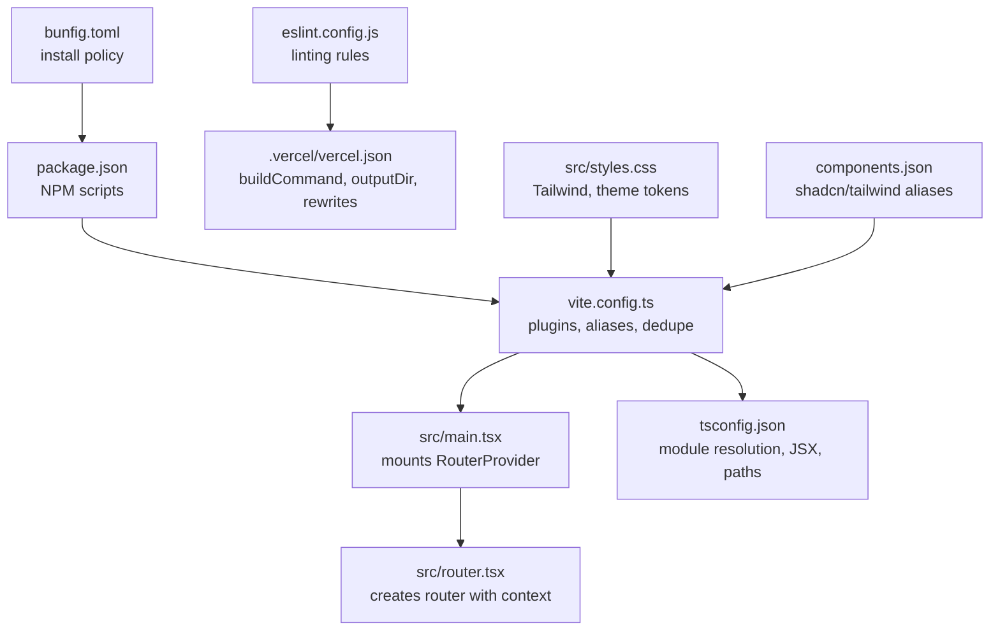
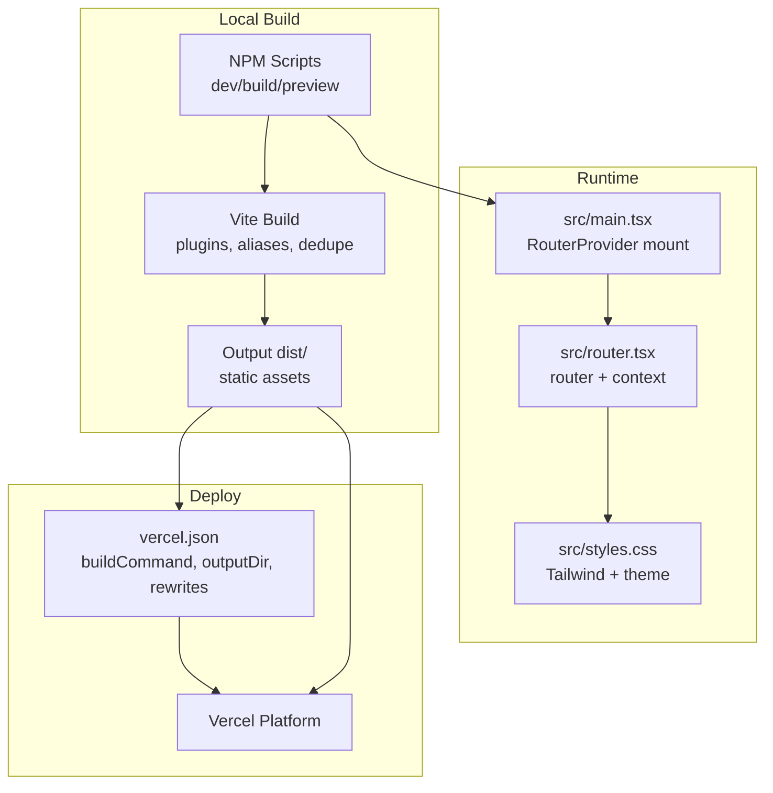
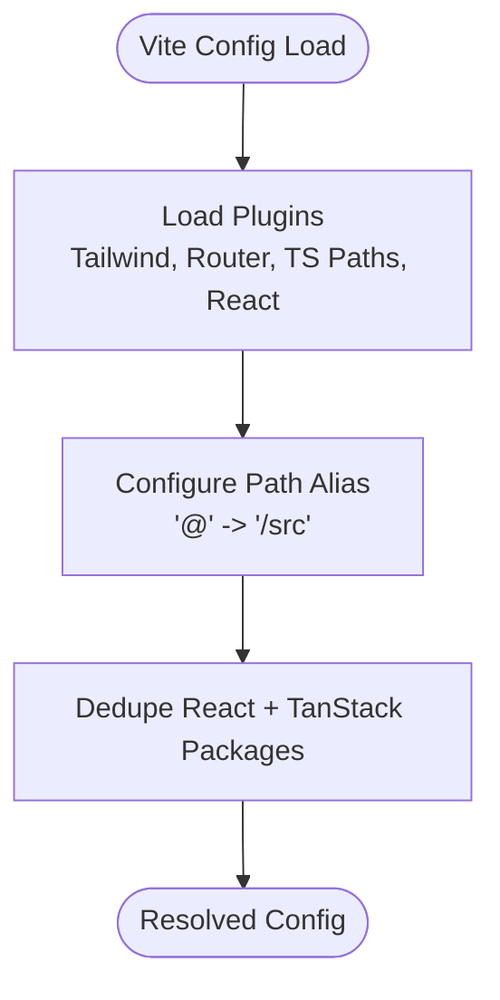
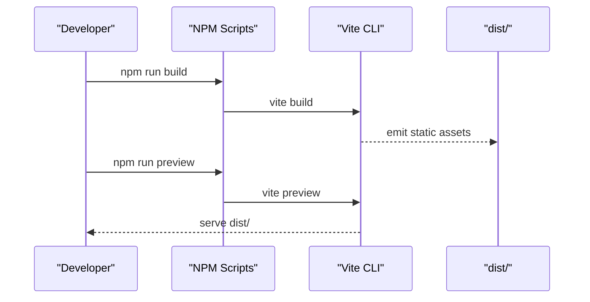
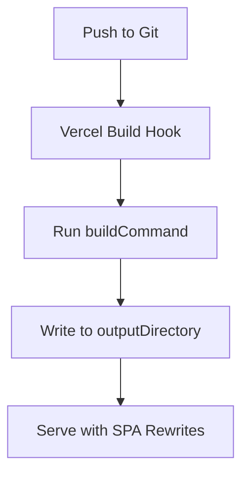
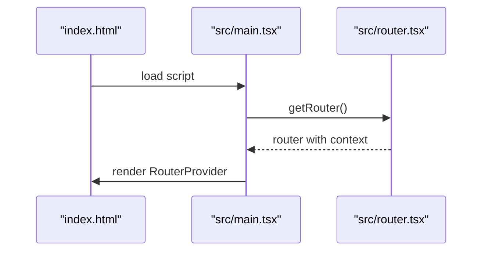
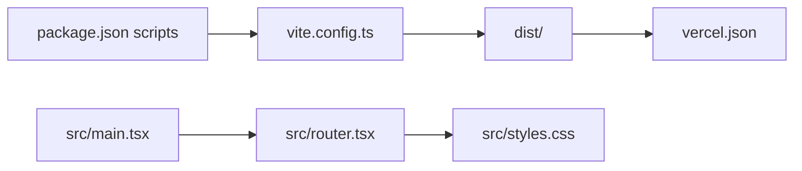

# Deployment & Build

<cite>
**Referenced Files in This Document**
- [vite.config.ts](file://vite.config.ts)
- [package.json](file://package.json)
- [vercel.json](file://vercel.json)
- [tsconfig.json](file://tsconfig.json)
- [eslint.config.js](file://eslint.config.js)
- [components.json](file://components.json)
- [src/main.tsx](file://src/main.tsx)
- [src/router.tsx](file://src/router.tsx)
- [src/styles.css](file://src/styles.css)
- [bunfig.toml](file://bunfig.toml)
</cite>

## Table of Contents
1. [Introduction](#introduction)
2. [Project Structure](#project-structure)
3. [Core Components](#core-components)
4. [Architecture Overview](#architecture-overview)
5. [Detailed Component Analysis](#detailed-component-analysis)
6. [Dependency Analysis](#dependency-analysis)
7. [Performance Considerations](#performance-considerations)
8. [Troubleshooting Guide](#troubleshooting-guide)
9. [Conclusion](#conclusion)
10. [Appendices](#appendices)

## Introduction
This document explains the build and deployment process for the Skillyme Programs System. It covers Vite configuration, optimization settings, production bundling, environment variable management, build modes, deployment targets, and Vercel-specific configuration. It also documents performance optimization techniques, bundle analysis, asset handling, CDN integration, monitoring and logging, post-deployment verification, and troubleshooting for common build and deployment issues.

## Project Structure
The project is a React application using Vite with TanStack Router and Tailwind CSS. Key build and deployment configuration lives in Vite, NPM scripts, TypeScript configuration, ESLint, and Vercel configuration. The runtime entry point initializes the router and mounts the app.

**Diagram sources**
- [package.json:1-86](file://package.json#L1-L86)
- [vite.config.ts:1-30](file://vite.config.ts#L1-L30)
- [src/main.tsx:1-21](file://src/main.tsx#L1-L21)
- [src/router.tsx:1-17](file://src/router.tsx#L1-L17)
- [tsconfig.json:1-28](file://tsconfig.json#L1-L28)
- [eslint.config.js:1-41](file://eslint.config.js#L1-L41)
- [vercel.json:1-9](file://vercel.json#L1-L9)
- [src/styles.css:1-136](file://src/styles.css#L1-L136)
- [components.json:1-23](file://components.json#L1-L23)
- [bunfig.toml:1-7](file://bunfig.toml#L1-L7)

**Section sources**
- [package.json:1-86](file://package.json#L1-L86)
- [vite.config.ts:1-30](file://vite.config.ts#L1-L30)
- [src/main.tsx:1-21](file://src/main.tsx#L1-L21)
- [src/router.tsx:1-17](file://src/router.tsx#L1-L17)
- [tsconfig.json:1-28](file://tsconfig.json#L1-L28)
- [eslint.config.js:1-41](file://eslint.config.js#L1-L41)
- [vercel.json:1-9](file://vercel.json#L1-L9)
- [src/styles.css:1-136](file://src/styles.css#L1-L136)
- [components.json:1-23](file://components.json#L1-L23)
- [bunfig.toml:1-7](file://bunfig.toml#L1-L7)

## Core Components
- Vite configuration defines plugins, path aliases, and deduplication to optimize bundling and resolve conflicts.
- NPM scripts provide development, production build, preview, linting, and formatting tasks.
- TypeScript configuration enables Bundler module resolution, JSX transform, and path aliases aligned with Vite.
- ESLint configuration enforces code quality and restricts specific imports.
- Vercel configuration sets the build command, output directory, and SPA rewrites for client-side routing.
- Runtime initialization mounts the TanStack Router-powered application.

Key responsibilities:
- Build orchestration via NPM scripts and Vite CLI.
- Routing and query context initialization in the app entry.
- Styling and theme tokens via Tailwind and CSS layers.
- UI component aliases for consistent imports.

**Section sources**
- [vite.config.ts:1-30](file://vite.config.ts#L1-L30)
- [package.json:6-12](file://package.json#L6-L12)
- [tsconfig.json:3-25](file://tsconfig.json#L3-L25)
- [eslint.config.js:8-40](file://eslint.config.js#L8-L40)
- [vercel.json:1-9](file://vercel.json#L1-L9)
- [src/main.tsx:16-20](file://src/main.tsx#L16-L20)
- [src/router.tsx:5-16](file://src/router.tsx#L5-L16)
- [src/styles.css:1-136](file://src/styles.css#L1-L136)
- [components.json:14-21](file://components.json#L14-L21)

## Architecture Overview
The build and deployment pipeline integrates NPM scripts, Vite, TanStack Router, and Vercel. The runtime initializes the router and renders the UI. Vercel serves the built static assets and handles SPA routing via rewrites.

**Diagram sources**
- [package.json:6-12](file://package.json#L6-L12)
- [vite.config.ts:7-29](file://vite.config.ts#L7-L29)
- [src/main.tsx:16-20](file://src/main.tsx#L16-L20)
- [src/router.tsx:5-16](file://src/router.tsx#L5-L16)
- [src/styles.css:1-136](file://src/styles.css#L1-L136)
- [vercel.json:1-9](file://vercel.json#L1-L9)

## Detailed Component Analysis

### Vite Build Configuration
- Plugins: Tailwind, TanStack Router code splitting, TS paths, and React Fast Refresh.
- Aliasing: Root alias configured for clean imports.
- Deduplication: Ensures single copies of shared libraries in the bundle graph.
- Implications: Reduces bundle size, improves cacheability, and avoids runtime conflicts.

**Diagram sources**
- [vite.config.ts:8-28](file://vite.config.ts#L8-L28)

**Section sources**
- [vite.config.ts:1-30](file://vite.config.ts#L1-L30)

### NPM Scripts and Build Modes
- Development: Starts Vite dev server.
- Production build: Generates optimized static assets.
- Preview: Serves the production build locally.
- Lint and format: Enforce code quality and style consistency.
- Environment modes: Additional mode-specific builds supported by Vite CLI.

**Diagram sources**
- [package.json:6-12](file://package.json#L6-L12)
- [vite.config.ts:7-29](file://vite.config.ts#L7-L29)

**Section sources**
- [package.json:6-12](file://package.json#L6-L12)

### TypeScript Configuration and Path Aliases
- Module resolution set to Bundler for Vite compatibility.
- JSX transform configured for React.
- Path aliases mirror Vite’s alias to ensure consistent imports across the codebase.
- Implications: Faster builds, accurate editor support, and predictable module resolution.

**Section sources**
- [tsconfig.json:3-25](file://tsconfig.json#L3-L25)

### ESLint Configuration
- Extends recommended TypeScript and React rules.
- Integrates Prettier for formatting.
- Restricts specific imports to align with framework conventions.
- Implications: Consistent code style, fewer runtime errors, and enforced best practices.

**Section sources**
- [eslint.config.js:8-40](file://eslint.config.js#L8-L40)

### Vercel Deployment Configuration
- Build command: Uses the project’s build script.
- Output directory: Emits to dist/.
- Rewrites: Routes all paths to index.html for SPA routing.
- Implications: Single-page application support, simplified hosting, and predictable routing.

**Diagram sources**
- [vercel.json:3-7](file://vercel.json#L3-L7)

**Section sources**
- [vercel.json:1-9](file://vercel.json#L1-L9)

### Runtime Initialization and Router Context
- The app mounts the RouterProvider with a configured router instance.
- The router is created with a query client context and scroll restoration enabled.
- Implications: Type-safe routing, global query caching, and seamless navigation.

**Diagram sources**
- [src/main.tsx:16-20](file://src/main.tsx#L16-L20)
- [src/router.tsx:5-16](file://src/router.tsx#L5-L16)

**Section sources**
- [src/main.tsx:1-21](file://src/main.tsx#L1-L21)
- [src/router.tsx:1-17](file://src/router.tsx#L1-L17)

### Styling and Theme Tokens
- Tailwind is integrated via the Vite plugin and configured in CSS.
- Theme tokens are defined in CSS variables and layered for base/utilities.
- Implications: Consistent design system, dark mode variants, and scalable theming.

**Section sources**
- [src/styles.css:1-136](file://src/styles.css#L1-L136)
- [vite.config.ts:9-10](file://vite.config.ts#L9-L10)

### UI Component Aliases
- shadcn/tailwind aliases map to internal directories for consistent imports.
- Implications: Cleaner imports and easier refactoring.

**Section sources**
- [components.json:14-21](file://components.json#L14-L21)

### Package Manager Security Policy
- Install policy sets a minimum release age and exemptions for specific packages.
- Implications: Supply chain protection with controlled exceptions.

**Section sources**
- [bunfig.toml:1-7](file://bunfig.toml#L1-L7)

## Dependency Analysis
The build system relies on Vite plugins and NPM scripts to orchestrate bundling. The runtime depends on TanStack Router and React. Vercel consumes the generated dist/ directory.

**Diagram sources**
- [package.json:6-12](file://package.json#L6-L12)
- [vite.config.ts:7-29](file://vite.config.ts#L7-L29)
- [vercel.json:1-9](file://vercel.json#L1-L9)
- [src/main.tsx:16-20](file://src/main.tsx#L16-L20)
- [src/router.tsx:5-16](file://src/router.tsx#L5-L16)
- [src/styles.css:1-136](file://src/styles.css#L1-L136)

**Section sources**
- [package.json:6-12](file://package.json#L6-L12)
- [vite.config.ts:1-30](file://vite.config.ts#L1-L30)
- [vercel.json:1-9](file://vercel.json#L1-L9)
- [src/main.tsx:1-21](file://src/main.tsx#L1-L21)
- [src/router.tsx:1-17](file://src/router.tsx#L1-L17)
- [src/styles.css:1-136](file://src/styles.css#L1-L136)

## Performance Considerations
- Code splitting: Enabled via the TanStack Router plugin to split route-level code automatically.
- Alias and dedupe: Reduce duplication and improve caching.
- Module resolution: Bundler mode in TypeScript ensures Vite-compatible resolution.
- Asset handling: Static assets are emitted to dist/ and served by Vercel.
- Bundle analysis: Recommended to inspect dist/ contents and assess payload sizes after builds.
- CDN integration: Vercel acts as a CDN; ensure long-term caching headers and immutable asset naming for optimal performance.
- Post-build checks: Verify that index.html and chunk files load correctly and that rewrites preserve routing.

[No sources needed since this section provides general guidance]

## Troubleshooting Guide
Common build and deployment issues and resolutions:
- Build fails due to missing dependencies: Ensure all dependencies are installed and up-to-date.
- Alias resolution errors: Confirm path aliases match between Vite config and tsconfig.
- Duplicate React/TanStack packages: Dedupe entries should prevent conflicts; verify bundler output.
- Vercel 404 on refresh: Confirm rewrites are configured to target index.html for SPA routing.
- Lint/format failures: Run lint and format commands to fix style issues.
- Local preview differs from Vercel: Use the preview script to emulate production behavior.

**Section sources**
- [vite.config.ts:16-28](file://vite.config.ts#L16-L28)
- [vercel.json:5-7](file://vercel.json#L5-L7)
- [eslint.config.js:21-37](file://eslint.config.js#L21-L37)
- [package.json:6-12](file://package.json#L6-L12)

## Conclusion
The Skillyme Programs System uses a streamlined build and deployment pipeline centered on Vite, TanStack Router, and Vercel. The configuration emphasizes code splitting, aliasing, deduplication, and SPA-friendly rewrites. By following the documented practices—running the build scripts, verifying dist/, and configuring Vercel—you can reliably produce and deploy optimized static assets with robust routing and performance characteristics.

[No sources needed since this section summarizes without analyzing specific files]

## Appendices

### Build Artifacts and Static Assets
- Output directory: dist/
- Generated files include HTML, JS chunks, CSS, and static assets.
- Verify that index.html and route chunks are present after building.

**Section sources**
- [vercel.json:4](file://vercel.json#L4)

### Environment Variables and Build Modes
- Build modes: Use the Vite CLI to specify modes when needed.
- Environment variables: Access via Vite’s environment handling in the browser context.
- Implications: Keep secrets out of client bundles; use backend APIs for sensitive data.

**Section sources**
- [package.json:9](file://package.json#L9)

### CI/CD Pipeline and Release Management
- Recommended steps:
  - Run lint and tests in CI before building.
  - Build with the production script and preview locally.
  - Deploy to Vercel using the configured build command and output directory.
  - Tag releases and manage branches per your workflow.
- Automated testing integration: Add test scripts to NPM and run them in CI before build.

**Section sources**
- [package.json:11-12](file://package.json#L11-L12)
- [eslint.config.js:8-40](file://eslint.config.js#L8-L40)

### Monitoring, Logging, and Post-Deployment Verification
- Monitoring: Integrate analytics or error reporting in the app entry.
- Logging: Use console-based logging during development; avoid sensitive data.
- Post-deployment verification: Test routing, hydration, and asset loading across devices and networks.

[No sources needed since this section provides general guidance]