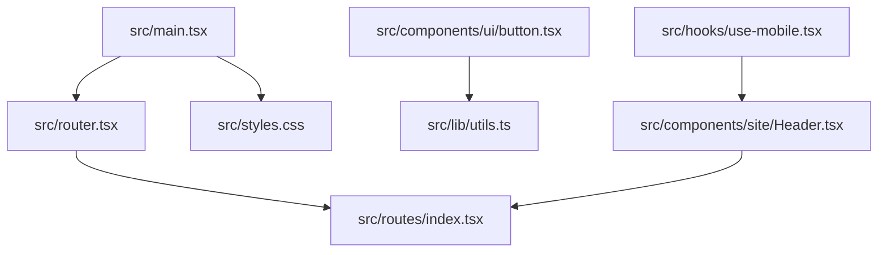
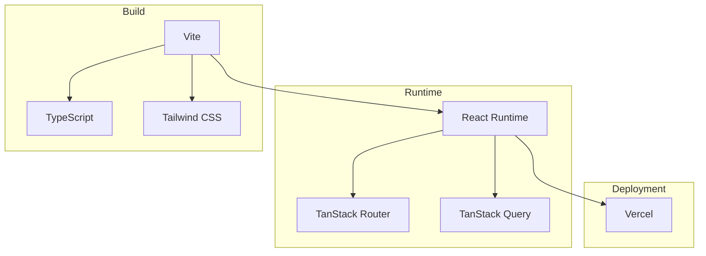
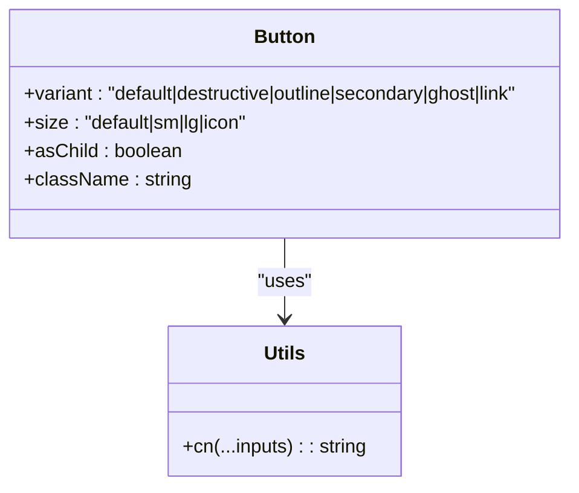
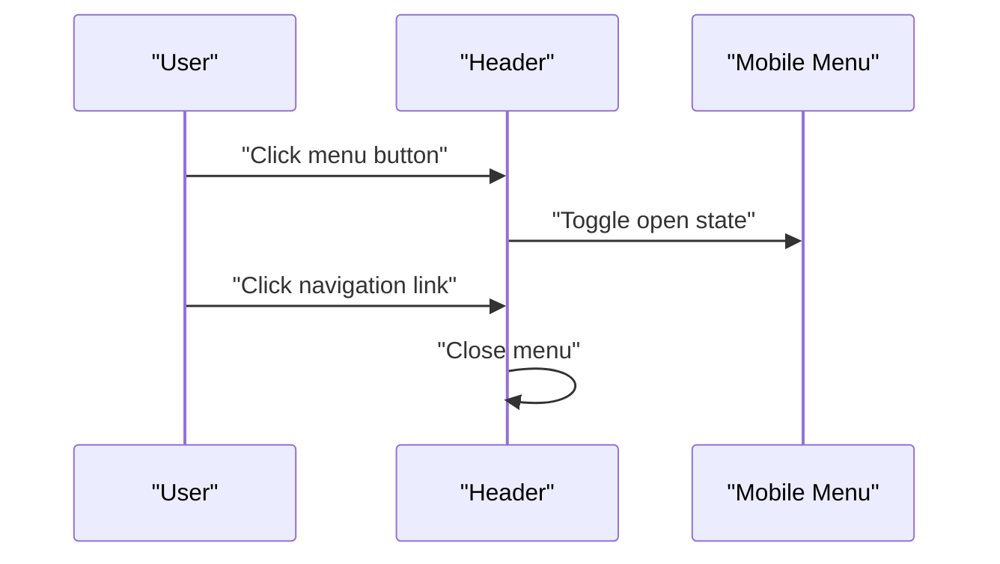
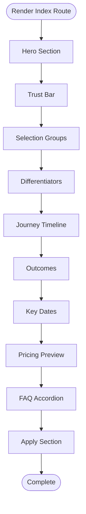
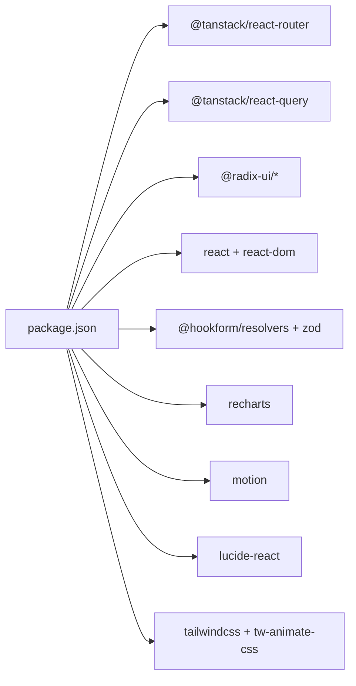
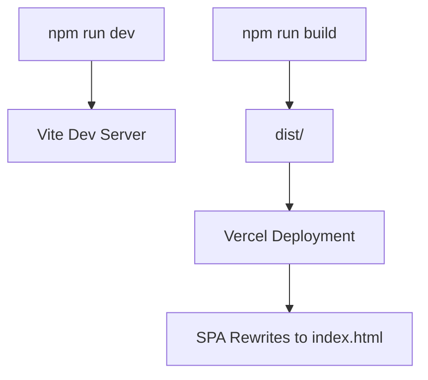

# Development Guidelines

<cite>
**Referenced Files in This Document**
- [package.json](file://package.json)
- [tsconfig.json](file://tsconfig.json)
- [eslint.config.js](file://eslint.config.js)
- [.prettierrc](file://.prettierrc)
- [vite.config.ts](file://vite.config.ts)
- [vercel.json](file://vercel.json)
- [src/main.tsx](file://src/main.tsx)
- [src/router.tsx](file://src/router.tsx)
- [src/routes/index.tsx](file://src/routes/index.tsx)
- [src/lib/utils.ts](file://src/lib/utils.ts)
- [src/hooks/use-mobile.tsx](file://src/hooks/use-mobile.tsx)
- [src/components/ui/button.tsx](file://src/components/ui/button.tsx)
- [src/components/site/Header.tsx](file://src/components/site/Header.tsx)
- [src/styles.css](file://src/styles.css)
- [components.json](file://components.json)
</cite>

## Table of Contents
1. [Introduction](#introduction)
2. [Project Structure](#project-structure)
3. [Core Components](#core-components)
4. [Architecture Overview](#architecture-overview)
5. [Detailed Component Analysis](#detailed-component-analysis)
6. [Dependency Analysis](#dependency-analysis)
7. [Performance Considerations](#performance-considerations)
8. [Accessibility and Compatibility](#accessibility-and-compatibility)
9. [Testing Strategies](#testing-strategies)
10. [Quality Assurance Practices](#quality-assurance-practices)
11. [Contribution and Review Standards](#contribution-and-review-standards)
12. [Build and Deployment](#build-and-deployment)
13. [Troubleshooting Guide](#troubleshooting-guide)
14. [Conclusion](#conclusion)

## Introduction
This document provides comprehensive development guidelines and best practices for the Skillyme Programs System. It covers code organization principles, component development standards, naming conventions, TypeScript configuration, linting and formatting standards, testing strategies, quality assurance practices, contribution workflows, build and deployment configuration, performance optimization, accessibility and compatibility, and troubleshooting guidance. These guidelines are derived from the project’s current configuration and implementation patterns.

## Project Structure
The project follows a feature- and layer-based organization:
- src/main.tsx initializes the React app and mounts the TanStack Router provider.
- src/router.tsx creates a typed router with a shared React Query client and scroll restoration.
- src/routes defines file-based routes generated by TanStack Router, with the root route rendering the home page.
- src/components contains reusable UI primitives under ui and site-specific layout components.
- src/hooks provides reusable React hooks, such as a mobile detection hook.
- src/lib centralizes shared utilities, such as a Tailwind CSS class merging helper.
- src/styles.css defines global styles, theme tokens, and layer-based styling.
- Configuration files include package.json, tsconfig.json, eslint.config.js, .prettierrc, vite.config.ts, vercel.json, and components.json.

**Diagram sources**
- [src/main.tsx:1-21](file://src/main.tsx#L1-L21)
- [src/router.tsx:1-17](file://src/router.tsx#L1-L17)
- [src/routes/index.tsx:1-350](file://src/routes/index.tsx#L1-L350)
- [src/components/ui/button.tsx:1-50](file://src/components/ui/button.tsx#L1-L50)
- [src/lib/utils.ts:1-7](file://src/lib/utils.ts#L1-L7)
- [src/components/site/Header.tsx:1-84](file://src/components/site/Header.tsx#L1-L84)
- [src/hooks/use-mobile.tsx:1-20](file://src/hooks/use-mobile.tsx#L1-L20)
- [src/styles.css:1-136](file://src/styles.css#L1-L136)

**Section sources**
- [src/main.tsx:1-21](file://src/main.tsx#L1-L21)
- [src/router.tsx:1-17](file://src/router.tsx#L1-L17)
- [src/routes/index.tsx:1-350](file://src/routes/index.tsx#L1-L350)
- [src/styles.css:1-136](file://src/styles.css#L1-L136)
- [components.json:1-23](file://components.json#L1-L23)

## Core Components
- Router initialization and context: The router is created with a shared React Query client and scroll restoration enabled. The router instance is registered for type safety in the React Router module declaration.
- Home route: The root route renders a feature-rich landing page with sections for hero, trust indicators, selection groups, differentiators, journey timeline, outcomes, key dates, pricing preview, FAQ accordion, and application call-to-action.
- UI primitives: The Button component demonstrates variant and size composition using class variance authority and Tailwind merging utilities.
- Site layout: The Header component provides responsive navigation with mobile menu support and external application links.
- Utilities: The cn utility merges Tailwind classes safely, reducing conflicts and improving maintainability.
- Hooks: The useIsMobile hook detects viewport breakpoints and normalizes media query events for consistent behavior.

**Section sources**
- [src/router.tsx:1-17](file://src/router.tsx#L1-L17)
- [src/routes/index.tsx:14-350](file://src/routes/index.tsx#L14-L350)
- [src/components/ui/button.tsx:1-50](file://src/components/ui/button.tsx#L1-L50)
- [src/components/site/Header.tsx:1-84](file://src/components/site/Header.tsx#L1-L84)
- [src/lib/utils.ts:1-7](file://src/lib/utils.ts#L1-L7)
- [src/hooks/use-mobile.tsx:1-20](file://src/hooks/use-mobile.tsx#L1-L20)

## Architecture Overview
The application uses a modern React stack with TanStack Router for routing and TanStack Query for data fetching. Vite handles bundling and development, while Tailwind CSS provides styling. The build targets ES2022 with React JSX transform and path aliases configured for clean imports.

**Diagram sources**
- [src/main.tsx:1-21](file://src/main.tsx#L1-L21)
- [src/router.tsx:1-17](file://src/router.tsx#L1-L17)
- [vite.config.ts:1-30](file://vite.config.ts#L1-L30)
- [tsconfig.json:1-28](file://tsconfig.json#L1-L28)
- [vercel.json:1-9](file://vercel.json#L1-L9)

## Detailed Component Analysis

### Button Component
The Button component encapsulates variant and size logic using class variance authority and composes Tailwind classes via the cn utility. It supports an asChild pattern for semantic markup and forwards refs for accessibility.

**Diagram sources**
- [src/components/ui/button.tsx:1-50](file://src/components/ui/button.tsx#L1-L50)
- [src/lib/utils.ts:1-7](file://src/lib/utils.ts#L1-L7)

**Section sources**
- [src/components/ui/button.tsx:1-50](file://src/components/ui/button.tsx#L1-L50)
- [src/lib/utils.ts:1-7](file://src/lib/utils.ts#L1-L7)

### Header Navigation
The Header component manages responsive navigation, including a mobile menu toggle and external application links. It integrates with TanStack Router for internal navigation and uses semantic markup for accessibility.

**Diagram sources**
- [src/components/site/Header.tsx:13-84](file://src/components/site/Header.tsx#L13-L84)

**Section sources**
- [src/components/site/Header.tsx:1-84](file://src/components/site/Header.tsx#L1-L84)

### Home Route Rendering
The root route composes multiple sections and UI components to render a complete landing page. It leverages Radix UI primitives and Lucide icons for interactive elements.

**Diagram sources**
- [src/routes/index.tsx:14-350](file://src/routes/index.tsx#L14-L350)

**Section sources**
- [src/routes/index.tsx:14-350](file://src/routes/index.tsx#L14-L350)

## Dependency Analysis
The project relies on a curated set of libraries:
- UI primitives and composables from @radix-ui and shadcn-inspired components.
- TanStack ecosystem for routing and data fetching.
- Tailwind CSS v4 for styling with CSS variables and layer-based utilities.
- Motion for animations and Recharts for data visualization.
- React Hook Form and Zod for forms and validation.

**Diagram sources**
- [package.json:14-66](file://package.json#L14-L66)

**Section sources**
- [package.json:14-66](file://package.json#L14-L66)

## Performance Considerations
- Code splitting: TanStack Router plugin enables automatic code splitting for routes, reducing initial bundle size.
- Alias resolution: Path aliases reduce module resolution overhead and improve DX.
- Deduplication: Vite deduplicates frequently used packages to avoid multiple instances.
- Bundle size: Prefer lazy loading for heavy components and defer non-critical resources.
- Runtime optimization: Use React.memo and useMemo where appropriate; leverage TanStack Query caching strategies.

**Section sources**
- [vite.config.ts:1-30](file://vite.config.ts#L1-L30)
- [src/router.tsx:1-17](file://src/router.tsx#L1-L17)

## Accessibility and Compatibility
- Focus management: Ensure focus-visible outlines and keyboard navigation support across interactive components.
- Semantic markup: Use native elements and roles; provide aria-labels for icons and buttons.
- Color contrast: Maintain sufficient contrast ratios against backgrounds defined in theme tokens.
- Responsive breakpoints: Use the mobile hook and Tailwind utilities to adapt layouts for small screens.
- Cross-browser compatibility: Test on latest Chrome, Firefox, Safari, and Edge; polyfills are generally unnecessary for ES2022+ APIs.

**Section sources**
- [src/styles.css:44-107](file://src/styles.css#L44-L107)
- [src/hooks/use-mobile.tsx:1-20](file://src/hooks/use-mobile.tsx#L1-L20)

## Testing Strategies
- Unit tests: Test pure functions and small components in isolation using a testing framework. Mock external dependencies and provide deterministic inputs.
- Component tests: Render components with React Testing Library, simulate user interactions, and assert DOM updates and accessibility attributes.
- Integration tests: Verify route transitions, navigation behavior, and data fetching flows using TanStack Router and Query client mocks.
- Snapshot tests: Capture rendered output for visual regression checks where appropriate.
- Continuous integration: Run linters, formatters, and tests on every push to catch regressions early.

[No sources needed since this section provides general guidance]

## Quality Assurance Practices
- Code reviews: Require at least one reviewer familiar with the affected domain; focus on correctness, readability, and performance.
- Linting: Enforce TypeScript strictness and React Hooks rules; disallow restricted imports and prefer constant exports for refresh-friendly components.
- Formatting: Automate formatting with Prettier; configure CI to block commits that fail formatting checks.
- Commit hygiene: Keep commits small, descriptive, and scoped; use conventional commit messages when applicable.
- Documentation: Update README and inline comments when changing behavior or introducing new patterns.

**Section sources**
- [eslint.config.js:1-41](file://eslint.config.js#L1-L41)
- [.prettierrc:1-7](file://.prettierrc#L1-L7)

## Contribution and Review Standards
- Branching: Use feature branches prefixed with feature/, fix/, chore/, or docs/.
- Pull requests: Provide a clear description, link related issues, and summarize changes.
- Reviews: Address feedback promptly; request re-reviews after changes; ensure CI passes.
- Merge: Squash or rebase commits; ensure main branch remains clean and stable.

[No sources needed since this section provides general guidance]

## Build and Deployment
- Local development: Use npm scripts to start the dev server and preview builds locally.
- Build configuration: Vite compiles TypeScript, applies React JSX transform, resolves aliases, and generates optimized bundles.
- Environment variables: Define environment variables in .env files and access them via import.meta.env in the browser.
- Deployment: The project is configured for Vercel with SPA fallback rewriting to index.html and a build command that runs the production build.

**Diagram sources**
- [package.json:6-12](file://package.json#L6-L12)
- [vite.config.ts:1-30](file://vite.config.ts#L1-L30)
- [vercel.json:1-9](file://vercel.json#L1-L9)

**Section sources**
- [package.json:6-12](file://package.json#L6-L12)
- [vite.config.ts:1-30](file://vite.config.ts#L1-L30)
- [vercel.json:1-9](file://vercel.json#L1-L9)

## Troubleshooting Guide
- Type errors: Enable strict mode and fix unused locals/parameters; ensure path aliases resolve correctly.
- Lint failures: Address ESLint warnings and errors; follow recommended rules for React Hooks and refresh.
- Formatting issues: Run the formatter script to normalize code style; ensure editor integration is configured.
- Build errors: Verify Vite plugins are installed and configured; check path aliases and module resolution.
- Routing issues: Confirm route generation and context injection; ensure the router instance is registered.
- Styling problems: Validate Tailwind directives and CSS variables; check layer ordering and custom utilities.

**Section sources**
- [tsconfig.json:16-25](file://tsconfig.json#L16-L25)
- [eslint.config.js:21-38](file://eslint.config.js#L21-L38)
- [vite.config.ts:16-28](file://vite.config.ts#L16-L28)
- [src/main.tsx:10-14](file://src/main.tsx#L10-L14)

## Conclusion
These guidelines consolidate the project’s current architecture, tooling, and development practices. By adhering to the outlined conventions—code organization, component standards, TypeScript and linting rules, testing strategies, QA practices, contribution workflows, build and deployment steps, performance optimizations, accessibility, and troubleshooting—you can maintain a consistent, scalable, and high-quality codebase for the Skillyme Programs System.