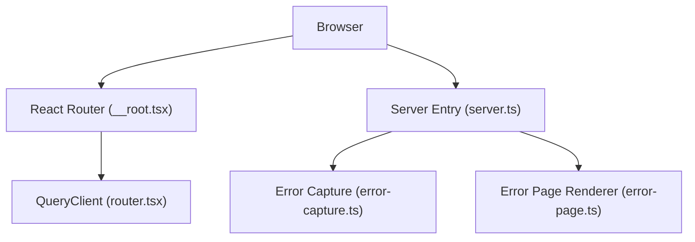
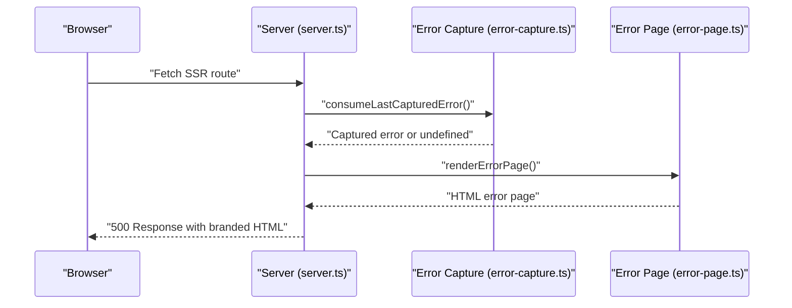
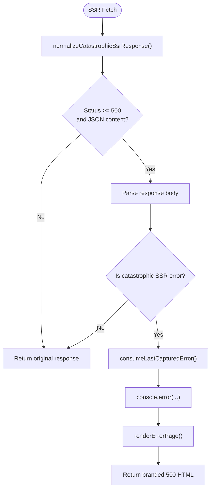
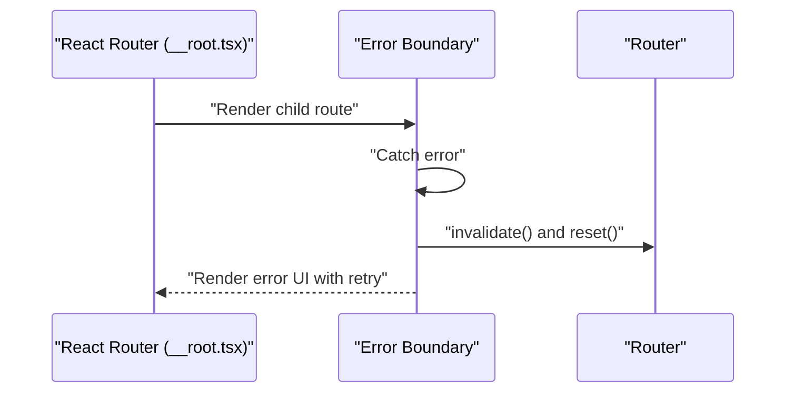
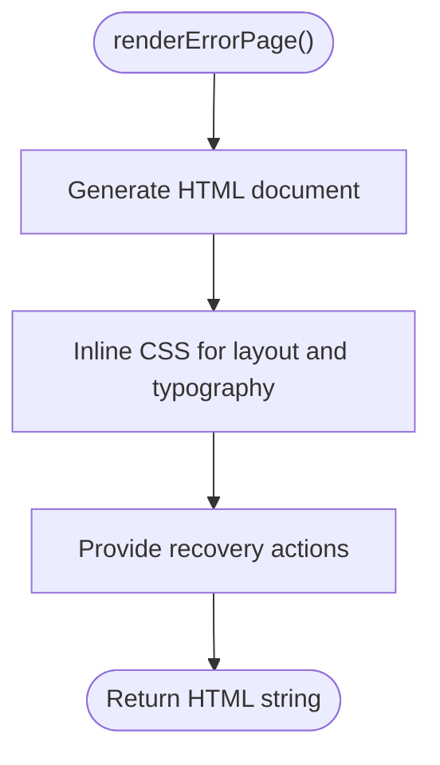
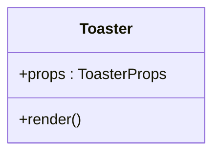
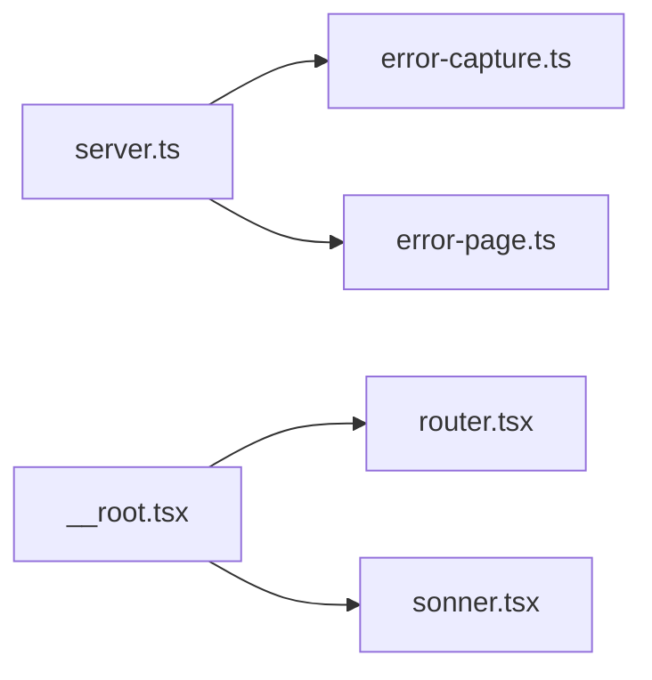

# Analytics and Tracking

<cite>
**Referenced Files in This Document**
- [error-capture.ts](file://src/lib/error-capture.ts)
- [error-page.ts](file://src/lib/error-page.ts)
- [server.ts](file://src/server.ts)
- [__root.tsx](file://src/routes/__root.tsx)
- [router.tsx](file://src/router.tsx)
- [main.tsx](file://src/main.tsx)
- [sonner.tsx](file://src/components/ui/sonner.tsx)
- [package.json](file://package.json)
</cite>

## Table of Contents
1. [Introduction](#introduction)
2. [Project Structure](#project-structure)
3. [Core Components](#core-components)
4. [Architecture Overview](#architecture-overview)
5. [Detailed Component Analysis](#detailed-component-analysis)
6. [Dependency Analysis](#dependency-analysis)
7. [Performance Considerations](#performance-considerations)
8. [Troubleshooting Guide](#troubleshooting-guide)
9. [Conclusion](#conclusion)
10. [Appendices](#appendices)

## Introduction
This document explains the analytics and tracking integration patterns present in the codebase, focusing on error capture and reporting, graceful error handling, and pathways for extending analytics capabilities. It also outlines privacy-compliant implementation approaches, consent management, and compliance considerations for educational applications. The current implementation centers on robust error capture and a branded error page for server-side rendering (SSR) failures, along with React Router’s built-in error boundaries for client-side errors.

## Project Structure
The analytics and tracking surface is primarily implemented in three areas:
- Server-side error capture and normalization for SSR failures
- Client-side error boundaries and graceful fallbacks
- Notification UX for user feedback and status updates

**Diagram sources**
- [server.ts:1-81](file://src/server.ts#L1-L81)
- [error-capture.ts:1-28](file://src/lib/error-capture.ts#L1-L28)
- [error-page.ts:1-31](file://src/lib/error-page.ts#L1-L31)
- [__root.tsx:1-61](file://src/routes/__root.tsx#L1-L61)
- [router.tsx:1-17](file://src/router.tsx#L1-L17)

**Section sources**
- [server.ts:1-81](file://src/server.ts#L1-L81)
- [error-capture.ts:1-28](file://src/lib/error-capture.ts#L1-L28)
- [error-page.ts:1-31](file://src/lib/error-page.ts#L1-L31)
- [__root.tsx:1-61](file://src/routes/__root.tsx#L1-L61)
- [router.tsx:1-17](file://src/router.tsx#L1-L17)
- [main.tsx:1-21](file://src/main.tsx#L1-L21)

## Core Components
- Server-side error capture and normalization: Captures unhandled errors and rethrows them to avoid swallowing exceptions during SSR, then serves a branded error page on failure.
- Client-side error boundaries: Provides a React error boundary component to gracefully handle client-side errors and offer retry/reset actions.
- Branded error page renderer: Generates a consistent, user-friendly HTML error page with recovery actions.
- Notifications: A toast component for user feedback and status updates.

**Section sources**
- [server.ts:1-81](file://src/server.ts#L1-L81)
- [error-capture.ts:1-28](file://src/lib/error-capture.ts#L1-L28)
- [error-page.ts:1-31](file://src/lib/error-page.ts#L1-L31)
- [__root.tsx:24-41](file://src/routes/__root.tsx#L24-L41)
- [sonner.tsx:1-24](file://src/components/ui/sonner.tsx#L1-L24)

## Architecture Overview
The system integrates error handling across client and server lifecycles. On the server, SSR fetch requests are intercepted and normalized to detect catastrophic SSR errors. On the client, React Router’s error boundary renders a friendly error UI and allows the user to retry.

**Diagram sources**
- [server.ts:55-67](file://src/server.ts#L55-L67)
- [error-capture.ts:18-27](file://src/lib/error-capture.ts#L18-L27)
- [error-page.ts:1-31](file://src/lib/error-page.ts#L1-L31)

## Detailed Component Analysis

### Server-Side Error Capture and Normalization
- Purpose: Capture unhandled errors during SSR and prevent silent failures by surfacing them to the server logs and returning a branded error page.
- Mechanism:
  - Listens to global error events and unhandled promise rejections to record the last error with a timestamp.
  - Normalizes catastrophic SSR responses by detecting a specific JSON error pattern and replacing it with a branded error page.
  - Logs the captured error and returns a 500 HTML response.

**Diagram sources**
- [server.ts:28-67](file://src/server.ts#L28-L67)
- [error-capture.ts:7-27](file://src/lib/error-capture.ts#L7-L27)
- [error-page.ts:1-31](file://src/lib/error-page.ts#L1-L31)

**Section sources**
- [server.ts:1-81](file://src/server.ts#L1-L81)
- [error-capture.ts:1-28](file://src/lib/error-capture.ts#L1-L28)

### Client-Side Error Boundary
- Purpose: Provide a graceful fallback when a React component throws an error during rendering, allowing users to retry or navigate back.
- Behavior:
  - Renders a friendly error UI with a retry action.
  - Uses router invalidation and reset to attempt recovery.

**Diagram sources**
- [__root.tsx:24-41](file://src/routes/__root.tsx#L24-L41)

**Section sources**
- [__root.tsx:24-41](file://src/routes/__root.tsx#L24-L41)

### Branded Error Page Renderer
- Purpose: Deliver a consistent, accessible error page with recovery actions when SSR fails.
- Features:
  - Minimal HTML with embedded styles.
  - Actions to reload the page or return home.

**Diagram sources**
- [error-page.ts:1-31](file://src/lib/error-page.ts#L1-L31)

**Section sources**
- [error-page.ts:1-31](file://src/lib/error-page.ts#L1-L31)

### Notifications and User Feedback
- Purpose: Provide non-blocking, accessible feedback to users for actions like successful submissions or warnings.
- Implementation: A thin wrapper around a toast library for consistent styling and behavior.

**Diagram sources**
- [sonner.tsx:1-24](file://src/components/ui/sonner.tsx#L1-L24)

**Section sources**
- [sonner.tsx:1-24](file://src/components/ui/sonner.tsx#L1-L24)

## Dependency Analysis
- Server entry depends on error capture and error page modules to handle SSR failures.
- Client-side error boundary relies on React Router and the router context for recovery.
- Notifications depend on a toast library and Tailwind-based styling.

**Diagram sources**
- [server.ts:1-81](file://src/server.ts#L1-L81)
- [error-capture.ts:1-28](file://src/lib/error-capture.ts#L1-L28)
- [error-page.ts:1-31](file://src/lib/error-page.ts#L1-L31)
- [__root.tsx:1-61](file://src/routes/__root.tsx#L1-L61)
- [router.tsx:1-17](file://src/router.tsx#L1-L17)
- [sonner.tsx:1-24](file://src/components/ui/sonner.tsx#L1-L24)

**Section sources**
- [server.ts:1-81](file://src/server.ts#L1-L81)
- [__root.tsx:1-61](file://src/routes/__root.tsx#L1-L61)
- [router.tsx:1-17](file://src/router.tsx#L1-L17)
- [sonner.tsx:1-24](file://src/components/ui/sonner.tsx#L1-L24)

## Performance Considerations
- Error capture TTL: Captured errors are retained only briefly to avoid memory pressure.
- SSR normalization avoids unnecessary parsing for non-error responses.
- Client-side error boundaries minimize re-render overhead by resetting router state efficiently.
- Toast notifications are lightweight and styled via CSS classes.

[No sources needed since this section provides general guidance]

## Troubleshooting Guide
- SSR 500 errors: When SSR returns a JSON error payload matching the catastrophic pattern, the server replaces it with a branded error page and logs the captured error.
- Client-side errors: The error boundary logs the error and offers a retry action; invoking router invalidation and reset attempts to recover.
- Logging: Server-side errors are logged to the console; ensure logging infrastructure is configured in your deployment environment.

**Section sources**
- [server.ts:28-67](file://src/server.ts#L28-L67)
- [error-capture.ts:18-27](file://src/lib/error-capture.ts#L18-L27)
- [__root.tsx:24-41](file://src/routes/__root.tsx#L24-L41)

## Conclusion
The codebase implements a robust foundation for error handling across client and server lifecycles, ensuring users see a consistent, helpful error experience while preserving developer visibility through captured errors and logs. Analytics and tracking can be layered on top of these foundations by integrating provider-specific SDKs and event handlers at the appropriate lifecycle hooks, while adhering to privacy and consent requirements.

[No sources needed since this section summarizes without analyzing specific files]

## Appendices

### Privacy-Compliant Tracking and Consent Management
- Consent-first approach: Defer analytics initialization until explicit consent is granted. Use a consent manager to gate provider scripts and event dispatch.
- Data minimization: Collect only essential metrics (e.g., page views, conversion funnels) and anonymize identifiers. Avoid capturing sensitive personal data.
- Transparency: Provide granular consent options (e.g., marketing vs. analytics) and maintain a clear privacy policy tailored for educational audiences.
- Compliance: Align with applicable regulations (e.g., GDPR, CCPA) by offering opt-out controls, data deletion requests, and secure transport.

[No sources needed since this section provides general guidance]

### Extending Analytics Providers
- Provider SDK integration: Initialize provider SDKs after consent is given and attach event listeners for routing changes, form submissions, and user interactions.
- Event schema: Define a consistent event taxonomy (e.g., track, pageview, conversion) and ensure payloads exclude PII.
- Performance monitoring: Integrate performance APIs (e.g., navigation timing, resource timing) to measure loading performance and identify bottlenecks.
- Testing and validation: Use staging environments to validate event delivery and accuracy before enabling production tracking.

[No sources needed since this section provides general guidance]