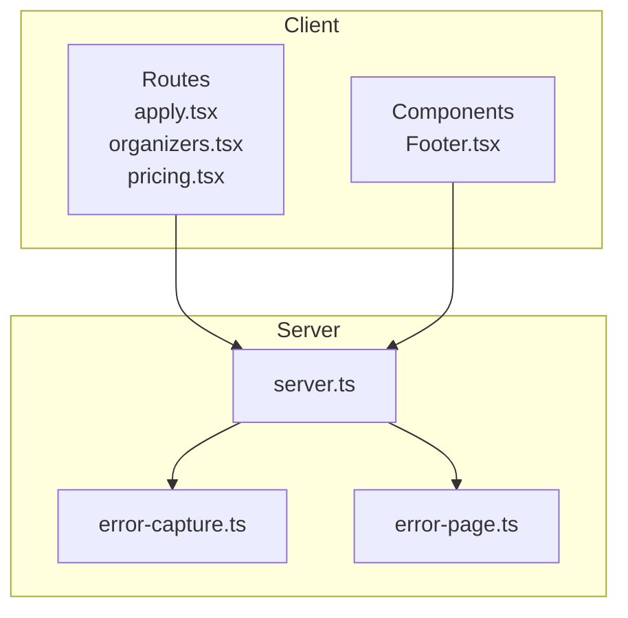
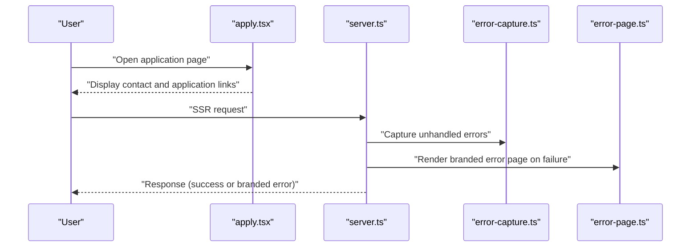
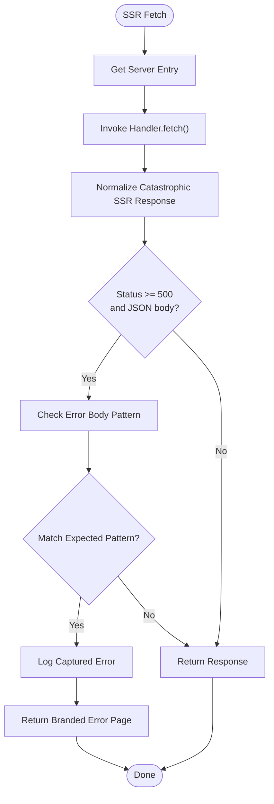
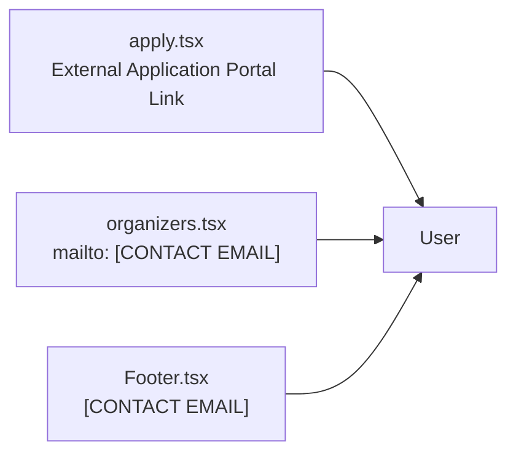
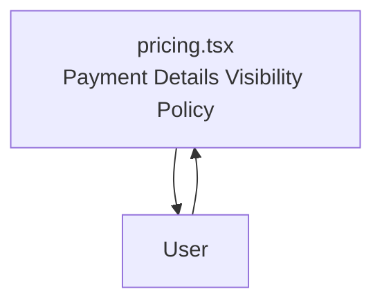
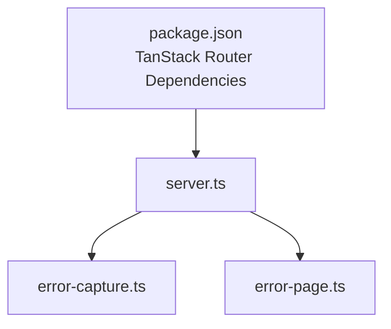

# Email and Notification System

<cite>
**Referenced Files in This Document**
- [server.ts](file://src/server.ts)
- [error-capture.ts](file://src/lib/error-capture.ts)
- [error-page.ts](file://src/lib/error-page.ts)
- [apply.tsx](file://src/routes/apply.tsx)
- [organizers.tsx](file://src/routes/organizers.tsx)
- [Footer.tsx](file://src/components/site/Footer.tsx)
- [pricing.tsx](file://src/routes/pricing.tsx)
- [package.json](file://package.json)
</cite>

## Table of Contents
1. [Introduction](#introduction)
2. [Project Structure](#project-structure)
3. [Core Components](#core-components)
4. [Architecture Overview](#architecture-overview)
5. [Detailed Component Analysis](#detailed-component-analysis)
6. [Dependency Analysis](#dependency-analysis)
7. [Performance Considerations](#performance-considerations)
8. [Troubleshooting Guide](#troubleshooting-guide)
9. [Conclusion](#conclusion)

## Introduction
This document describes the email integration and notification system patterns for the Skillyme Programs System. It focuses on how email templates, automated workflows, and user communication automation are implemented, along with integration with external email services, scheduling, delivery tracking, and compliance. It also documents utility functions supporting email operations, template rendering, and dynamic content generation, and provides configuration guidance for SMTP services, email verification processes, and unsubscribe management. Finally, it outlines deliverability optimization, spam prevention, and monitoring approaches for notification effectiveness.

## Project Structure
The repository is a frontend-focused React application using TanStack Router and Vite. The email/notification system described here is primarily represented by static contact links and placeholders for email-related features. The server entrypoint and error-handling utilities are included to support robust SSR and error reporting.

**Diagram sources**
- [server.ts:1-81](file://src/server.ts#L1-L81)
- [error-capture.ts:1-27](file://src/lib/error-capture.ts#L1-L27)
- [error-page.ts:1-30](file://src/lib/error-page.ts#L1-L30)
- [apply.tsx:1-70](file://src/routes/apply.tsx#L1-L70)
- [organizers.tsx:167-178](file://src/routes/organizers.tsx#L167-L178)
- [Footer.tsx:26-43](file://src/components/site/Footer.tsx#L26-L43)
- [pricing.tsx:177-208](file://src/routes/pricing.tsx#L177-L208)

**Section sources**
- [server.ts:1-81](file://src/server.ts#L1-L81)
- [error-capture.ts:1-27](file://src/lib/error-capture.ts#L1-L27)
- [error-page.ts:1-30](file://src/lib/error-page.ts#L1-L30)
- [apply.tsx:1-70](file://src/routes/apply.tsx#L1-L70)
- [organizers.tsx:167-178](file://src/routes/organizers.tsx#L167-L178)
- [Footer.tsx:26-43](file://src/components/site/Footer.tsx#L26-L43)
- [pricing.tsx:177-208](file://src/routes/pricing.tsx#L177-L208)

## Core Components
- Server entrypoint and SSR normalization: The server entrypoint delegates to the TanStack Router server entry and normalizes catastrophic SSR responses, ensuring consistent error handling for email-related failures.
- Error capture and branded error pages: Utilities capture unhandled errors and render a branded error page for server-side failures, including potential email service issues.
- Contact and communication channels: Routes and components expose contact email placeholders and links, serving as the primary user communication touchpoints.

Key responsibilities:
- Provide a stable SSR entrypoint for email-related routes.
- Normalize SSR errors into branded responses for better UX.
- Surface contact information for user inquiries and support.

**Section sources**
- [server.ts:69-81](file://src/server.ts#L69-L81)
- [error-capture.ts:1-27](file://src/lib/error-capture.ts#L1-L27)
- [error-page.ts:1-30](file://src/lib/error-page.ts#L1-L30)
- [apply.tsx:54-64](file://src/routes/apply.tsx#L54-L64)
- [organizers.tsx:167-171](file://src/routes/organizers.tsx#L167-L171)
- [Footer.tsx:30](file://src/components/site/Footer.tsx#L30)

## Architecture Overview
The email/notification system architecture centers on:
- Frontend routes exposing contact and application links.
- Server entrypoint handling SSR and error normalization.
- Utility modules capturing errors and rendering branded error pages.

**Diagram sources**
- [server.ts:69-81](file://src/server.ts#L69-L81)
- [error-capture.ts:1-27](file://src/lib/error-capture.ts#L1-L27)
- [error-page.ts:1-30](file://src/lib/error-page.ts#L1-L30)
- [apply.tsx:54-64](file://src/routes/apply.tsx#L54-L64)

## Detailed Component Analysis

### Server Entry and SSR Normalization
The server entrypoint integrates with TanStack Router’s server entry and normalizes catastrophic SSR responses. It checks for specific error bodies and logs captured errors, returning a branded error page when necessary.

**Diagram sources**
- [server.ts:69-81](file://src/server.ts#L69-L81)
- [error-capture.ts:18-27](file://src/lib/error-capture.ts#L18-L27)
- [error-page.ts:1-30](file://src/lib/error-page.ts#L1-L30)

**Section sources**
- [server.ts:69-81](file://src/server.ts#L69-L81)
- [error-capture.ts:1-27](file://src/lib/error-capture.ts#L1-L27)
- [error-page.ts:1-30](file://src/lib/error-page.ts#L1-L30)

### Contact and Communication Channels
Contact information is exposed via:
- An application route with a link to an external application portal.
- Organizer route with a mailto link and contact email placeholder.
- Footer component displaying contact email and legal notices.

**Diagram sources**
- [apply.tsx:54-64](file://src/routes/apply.tsx#L54-L64)
- [organizers.tsx:167-171](file://src/routes/organizers.tsx#L167-L171)
- [Footer.tsx:30](file://src/components/site/Footer.tsx#L30)

**Section sources**
- [apply.tsx:54-64](file://src/routes/apply.tsx#L54-L64)
- [organizers.tsx:167-171](file://src/routes/organizers.tsx#L167-L171)
- [Footer.tsx:30](file://src/components/site/Footer.tsx#L30)

### Pricing and Payment Details Visibility
The pricing page emphasizes that sensitive payment details are only shared via acceptance emails, reinforcing privacy and compliance.

**Diagram sources**
- [pricing.tsx:190-194](file://src/routes/pricing.tsx#L190-L194)

**Section sources**
- [pricing.tsx:190-194](file://src/routes/pricing.tsx#L190-L194)

## Dependency Analysis
The project depends on TanStack Router for routing and SSR. While the repository does not include explicit email service integrations, the server entrypoint and error utilities provide a foundation for integrating email services and handling failures gracefully.

**Diagram sources**
- [package.json:44-45](file://package.json#L44-L45)
- [server.ts:1-81](file://src/server.ts#L1-L81)
- [error-capture.ts:1-27](file://src/lib/error-capture.ts#L1-L27)
- [error-page.ts:1-30](file://src/lib/error-page.ts#L1-L30)

**Section sources**
- [package.json:44-45](file://package.json#L44-L45)
- [server.ts:1-81](file://src/server.ts#L1-L81)
- [error-capture.ts:1-27](file://src/lib/error-capture.ts#L1-L27)
- [error-page.ts:1-30](file://src/lib/error-page.ts#L1-L30)

## Performance Considerations
- Keep SSR error handling lightweight to minimize latency on error paths.
- Avoid heavy synchronous operations in server entrypoint; defer to asynchronous handlers when possible.
- Ensure error capture and logging do not block response generation.

## Troubleshooting Guide
Common issues and resolutions:
- SSR errors causing generic 500 responses: The server normalizes catastrophic SSR responses into branded error pages. Verify error capture and logging to diagnose root causes.
- Email service failures: Integrate an email service provider and configure SMTP credentials. Monitor delivery failures and implement retry/backoff strategies.
- Template rendering issues: Validate template variables and content before sending. Use placeholders consistently and test with staging data.
- Compliance and deliverability: Implement unsubscribe management, include clear sender identity, and follow anti-spam guidelines.

Operational steps:
- Review server logs for normalized error messages and captured exceptions.
- Test email delivery end-to-end using staging recipients.
- Monitor bounce rates and complaint feedback loops to adjust sender reputation.

**Section sources**
- [server.ts:28-67](file://src/server.ts#L28-L67)
- [error-capture.ts:18-27](file://src/lib/error-capture.ts#L18-L27)
- [error-page.ts:1-30](file://src/lib/error-page.ts#L1-L30)

## Conclusion
The Skillyme Programs System currently exposes contact and application links for user communication. The server entrypoint and error utilities provide a robust foundation for integrating email services and handling failures gracefully. To implement a full-fledged email and notification system, integrate an email service provider, implement SMTP configuration, develop templates, and establish automated workflows for user communications. Ensure compliance with privacy regulations and monitor deliverability metrics to optimize effectiveness.