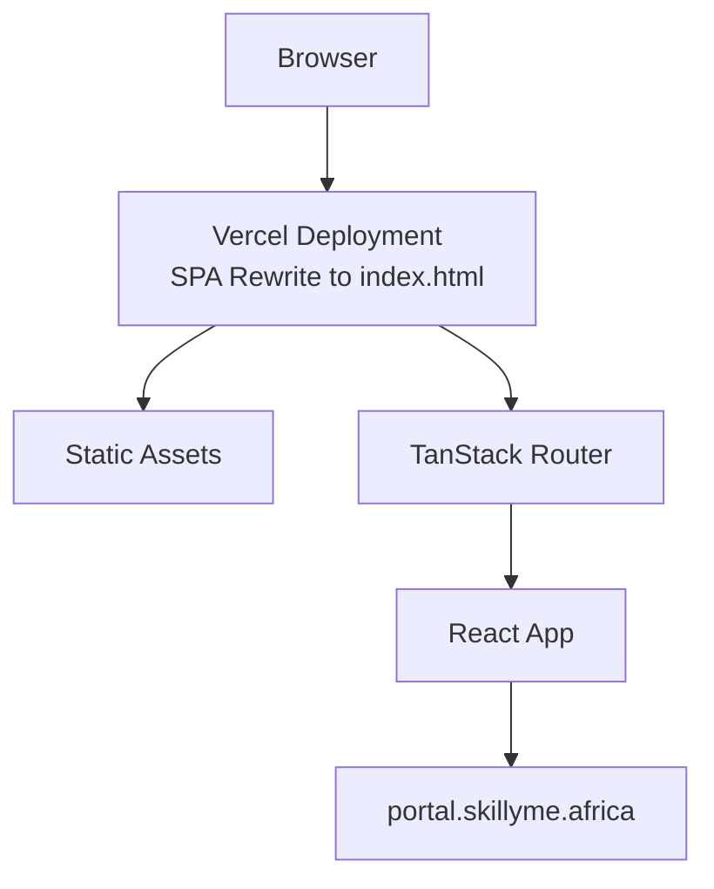
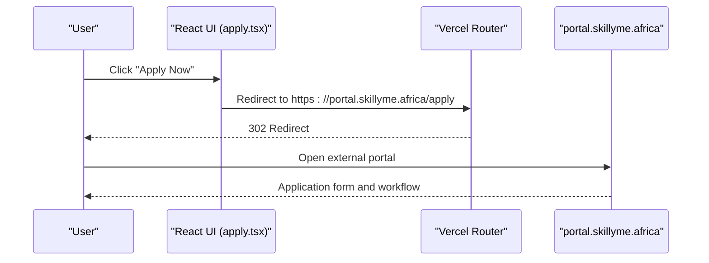
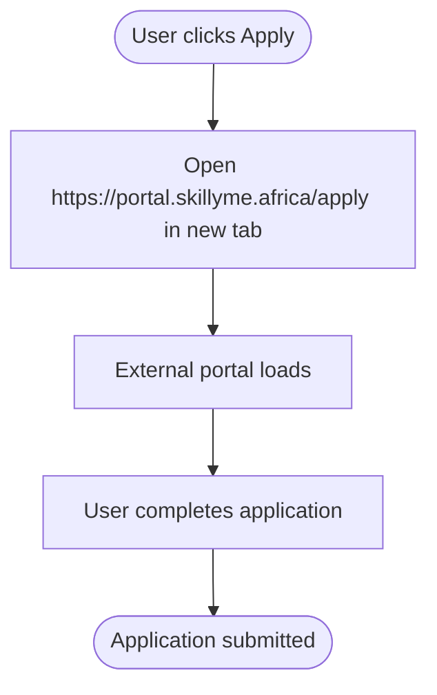
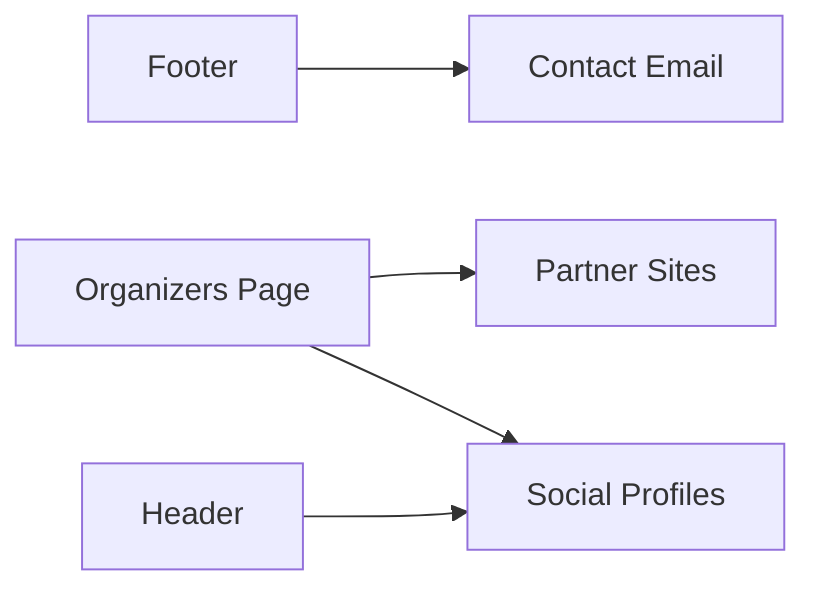
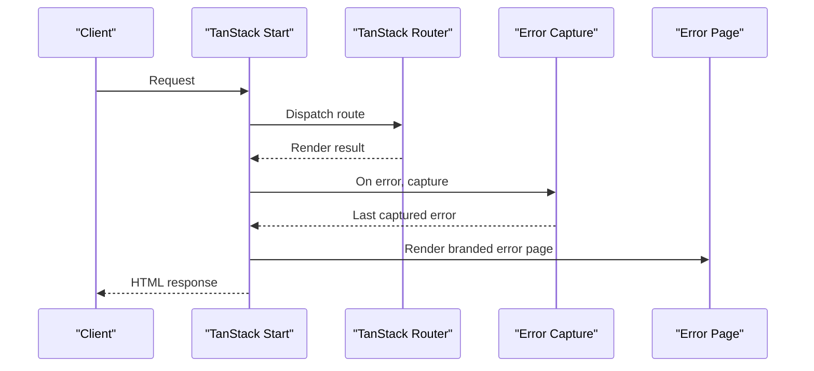
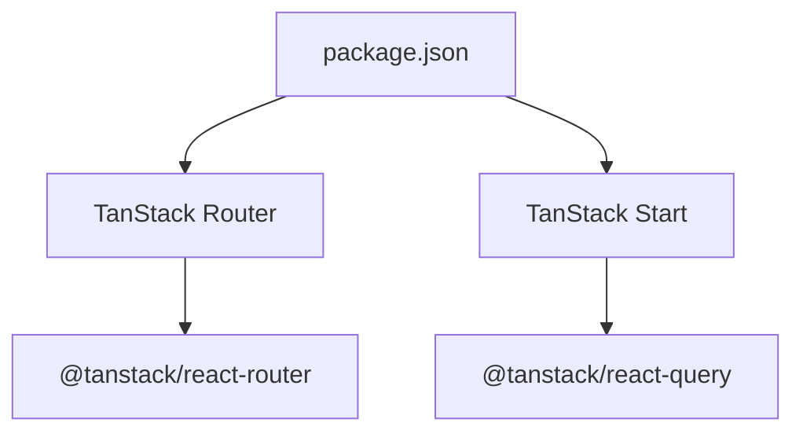

# External Integrations

<cite>
**Referenced Files in This Document**
- [main.tsx](file://src/main.tsx)
- [server.ts](file://src/server.ts)
- [start.ts](file://src/start.ts)
- [error-capture.ts](file://src/lib/error-capture.ts)
- [error-page.ts](file://src/lib/error-page.ts)
- [router.tsx](file://src/router.tsx)
- [apply.tsx](file://src/routes/apply.tsx)
- [index.tsx](file://src/routes/index.tsx)
- [Footer.tsx](file://src/components/site/Footer.tsx)
- [Header.tsx](file://src/components/site/Header.tsx)
- [CTA.tsx](file://src/components/site/CTA.tsx)
- [pricing.tsx](file://src/routes/pricing.tsx)
- [organizers.tsx](file://src/routes/organizers.tsx)
- [package.json](file://package.json)
- [vite.config.ts](file://vite.config.ts)
- [vercel.json](file://vercel.json)
</cite>

## Table of Contents
1. [Introduction](#introduction)
2. [Project Structure](#project-structure)
3. [Core Components](#core-components)
4. [Architecture Overview](#architecture-overview)
5. [Detailed Component Analysis](#detailed-component-analysis)
6. [Dependency Analysis](#dependency-analysis)
7. [Performance Considerations](#performance-considerations)
8. [Troubleshooting Guide](#troubleshooting-guide)
9. [Conclusion](#conclusion)
10. [Appendices](#appendices)

## Introduction
This document explains the external integrations and third-party service patterns implemented in the Skillyme Programs System. The primary external integration is the portal integration with portal.skillyme.africa for application processing and user workflow management. The system also includes social media and community link patterns, privacy and compliance statements, and placeholder areas for analytics, email notifications, and payment processing. The documentation covers integration architecture, API patterns, error handling, security considerations, and troubleshooting guidance.

## Project Structure
The application is a React-based single-page application using TanStack Router for routing and TanStack Start for server-side rendering. It is configured to deploy via Vercel with a SPA-style rewrite to index.html. External integrations are primarily implemented as outbound links to portal.skillyme.africa and social/community links.

**Diagram sources**
- [vercel.json:1-9](file://vercel.json#L1-L9)
- [vite.config.ts:1-30](file://vite.config.ts#L1-L30)
- [main.tsx:1-21](file://src/main.tsx#L1-L21)
- [router.tsx:1-17](file://src/router.tsx#L1-L17)

**Section sources**
- [vercel.json:1-9](file://vercel.json#L1-L9)
- [vite.config.ts:1-30](file://vite.config.ts#L1-L30)
- [main.tsx:1-21](file://src/main.tsx#L1-L21)
- [router.tsx:1-17](file://src/router.tsx#L1-L17)

## Core Components
- Application portal integration: Links to portal.skillyme.africa are present across multiple UI components for applying and navigating to the external portal.
- Social and community links: Footer and organizers pages include external links to partner sites and social profiles.
- Privacy and compliance: Footer includes a statement regarding data handling aligned with Kenya’s Data Protection Act.
- Routing and SSR: TanStack Router and TanStack Start provide routing and server-side rendering with robust error middleware.

Key integration touchpoints:
- Apply buttons and links consistently point to https://portal.skillyme.africa/apply.
- Social and partner links use target="_blank" and rel="noreferrer" for security.
- Pricing page communicates that payment details are shared only via acceptance emails.

**Section sources**
- [apply.tsx:1-69](file://src/routes/apply.tsx#L1-L69)
- [index.tsx:185-210](file://src/routes/index.tsx#L185-L210)
- [Header.tsx:38-83](file://src/components/site/Header.tsx#L38-L83)
- [Footer.tsx:26-43](file://src/components/site/Footer.tsx#L26-L43)
- [pricing.tsx:1-19](file://src/routes/pricing.tsx#L1-L19)
- [organizers.tsx:33-165](file://src/routes/organizers.tsx#L33-L165)

## Architecture Overview
The system integrates externally by redirecting users to portal.skillyme.africa for application processing. The frontend is a static SPA served by Vercel with a single-route rewrite to index.html. Routing is handled client-side by TanStack Router, while server-side rendering is supported via TanStack Start. Error handling is centralized to ensure consistent user feedback and logging.

**Diagram sources**
- [apply.tsx:54-61](file://src/routes/apply.tsx#L54-L61)
- [CTA.tsx:8-16](file://src/components/site/CTA.tsx#L8-L16)
- [Header.tsx:40-54](file://src/components/site/Header.tsx#L40-L54)
- [index.tsx:199-206](file://src/routes/index.tsx#L199-L206)
- [vercel.json:5-7](file://vercel.json#L5-L7)

**Section sources**
- [apply.tsx:1-69](file://src/routes/apply.tsx#L1-L69)
- [CTA.tsx:1-26](file://src/components/site/CTA.tsx#L1-L26)
- [Header.tsx:38-83](file://src/components/site/Header.tsx#L38-L83)
- [index.tsx:185-210](file://src/routes/index.tsx#L185-L210)
- [vercel.json:1-9](file://vercel.json#L1-L9)

## Detailed Component Analysis

### Portal Integration with portal.skillyme.africa
- Purpose: Drive application submissions to an external portal for processing and user workflow management.
- Implementation pattern: Consistent anchor links with target="_blank" and rel="noreferrer" to enforce security and open in new tabs.
- Placement: Buttons and links appear on the landing page, dedicated apply page, header, and group cards.
- UX: Clear messaging indicates users will be taken to a secure application portal.

**Diagram sources**
- [apply.tsx:54-61](file://src/routes/apply.tsx#L54-L61)
- [CTA.tsx:8-16](file://src/components/site/CTA.tsx#L8-L16)
- [Header.tsx:40-54](file://src/components/site/Header.tsx#L40-L54)
- [index.tsx:199-206](file://src/routes/index.tsx#L199-L206)

**Section sources**
- [apply.tsx:1-69](file://src/routes/apply.tsx#L1-L69)
- [CTA.tsx:1-26](file://src/components/site/CTA.tsx#L1-L26)
- [Header.tsx:38-83](file://src/components/site/Header.tsx#L38-L83)
- [index.tsx:185-210](file://src/routes/index.tsx#L185-L210)

### Social Media Integration Patterns and Community Links
- Social and partner links are implemented as external anchors with security attributes.
- Footer includes contact information and partnership acknowledgments.
- Organizers page links to partner websites and social profiles.

**Diagram sources**
- [Footer.tsx:26-43](file://src/components/site/Footer.tsx#L26-L43)
- [organizers.tsx:117-165](file://src/routes/organizers.tsx#L117-L165)
- [Header.tsx:38-83](file://src/components/site/Header.tsx#L38-L83)

**Section sources**
- [Footer.tsx:26-43](file://src/components/site/Footer.tsx#L26-L43)
- [organizers.tsx:33-165](file://src/routes/organizers.tsx#L33-L165)
- [Header.tsx:38-83](file://src/components/site/Header.tsx#L38-L83)

### Analytics and Tracking Integration
- Current codebase does not include explicit analytics or tracking scripts.
- Recommended approach: Add analytics SDKs (e.g., Google Analytics, Meta Pixel) during app initialization or via environment-driven configuration. Ensure compliance with regional privacy regulations.

[No sources needed since this section provides general guidance]

### Email Integration Patterns and Notification Systems
- Current codebase does not include email integration code.
- Pricing page indicates payment details are shared only via acceptance emails, implying an email-based communication workflow.
- Recommended approach: Integrate with a transactional email provider (e.g., SendGrid, Resend) and configure templates for acceptance and payment notifications.

**Section sources**
- [pricing.tsx:189-194](file://src/routes/pricing.tsx#L189-L194)

### Payment Processing Integration
- Current codebase does not include payment processing code.
- Pricing page outlines a post-acceptance payment model with M-Pesa and bank transfer options.
- Recommended approach: Integrate a payment provider (e.g., Stripe, Flutterwave) with server-side handlers for sensitive financial data and compliance with local regulations.

**Section sources**
- [pricing.tsx:74-79](file://src/routes/pricing.tsx#L74-L79)
- [pricing.tsx:134-208](file://src/routes/pricing.tsx#L134-L208)

### Integration Architecture, API Patterns, and Error Handling
- SPA architecture with Vercel rewrites ensures single-page behavior and client-side routing.
- TanStack Router manages navigation and context injection.
- TanStack Start provides SSR support with error middleware and branded error pages.
- Global error capture mechanism preserves stack traces for catastrophic SSR errors.

**Diagram sources**
- [start.ts:5-18](file://src/start.ts#L5-L18)
- [server.ts:28-67](file://src/server.ts#L28-L67)
- [error-capture.ts:1-28](file://src/lib/error-capture.ts#L1-L28)
- [error-page.ts:1-31](file://src/lib/error-page.ts#L1-L31)

**Section sources**
- [start.ts:1-23](file://src/start.ts#L1-L23)
- [server.ts:1-81](file://src/server.ts#L1-L81)
- [error-capture.ts:1-28](file://src/lib/error-capture.ts#L1-L28)
- [error-page.ts:1-31](file://src/lib/error-page.ts#L1-L31)

### Security Considerations, Authentication Flows, and Data Privacy
- External links use target="_blank" and rel="noreferrer" to prevent tabnabbing and reverse tabnabbing.
- Privacy statement in footer references Kenya’s Data Protection Act, 2019.
- Payment details are communicated via acceptance emails, not published publicly.
- Authentication flows are managed by portal.skillyme.africa; ensure HTTPS and secure cookies for the external portal.

**Section sources**
- [apply.tsx:54-61](file://src/routes/apply.tsx#L54-L61)
- [Footer.tsx:37-38](file://src/components/site/Footer.tsx#L37-L38)
- [pricing.tsx:189-194](file://src/routes/pricing.tsx#L189-L194)

## Dependency Analysis
The project relies on TanStack ecosystem packages for routing and SSR, along with UI primitives and charting libraries. These dependencies underpin the integration architecture and error handling mechanisms.

**Diagram sources**
- [package.json:14-66](file://package.json#L14-L66)
- [router.tsx:1-17](file://src/router.tsx#L1-L17)
- [start.ts:1-23](file://src/start.ts#L1-L23)

**Section sources**
- [package.json:1-86](file://package.json#L1-L86)
- [router.tsx:1-17](file://src/router.tsx#L1-L17)
- [start.ts:1-23](file://src/start.ts#L1-L23)

## Performance Considerations
- Single-page application reduces server load and improves perceived performance.
- Client-side routing minimizes full-page reloads.
- Keep external redirects minimal to avoid unnecessary network hops.
- Lazy-load heavy components and defer non-critical resources.

[No sources needed since this section provides general guidance]

## Troubleshooting Guide
Common integration issues and resolutions:
- External portal not loading:
  - Verify https://portal.skillyme.africa/apply accessibility and DNS resolution.
  - Confirm browser pop-up blockers are not preventing new tab opens.
- Links not opening in new tabs:
  - Ensure target="_blank" and rel="noreferrer" attributes are present on anchor tags.
- Error pages on server:
  - Review server logs for swallowed SSR errors and inspect branded error page rendering.
  - Check global error capture for preserved stack traces.
- Vercel deployment issues:
  - Confirm SPA rewrite configuration and build output directory align with Vercel settings.

**Section sources**
- [apply.tsx:54-61](file://src/routes/apply.tsx#L54-L61)
- [server.ts:69-81](file://src/server.ts#L69-L81)
- [error-capture.ts:1-28](file://src/lib/error-capture.ts#L1-L28)
- [error-page.ts:1-31](file://src/lib/error-page.ts#L1-L31)
- [vercel.json:1-9](file://vercel.json#L1-L9)

## Conclusion
The Skillyme Programs System integrates externally via portal.skillyme.africa for application processing, with consistent link patterns across UI components. Social and community links are implemented securely with proper attributes. The system’s SSR and error handling mechanisms provide resilience. Future enhancements should focus on analytics, email notifications, and payment processing integrations, ensuring compliance with regional privacy regulations and secure authentication flows.

## Appendices
- Recommended integration checklist:
  - Analytics: Add SDKs and configure event tracking.
  - Email: Integrate transactional email provider and set up acceptance/payment templates.
  - Payments: Integrate payment provider with server-side handlers and compliance checks.
  - Monitoring: Add structured logging and error reporting for external service calls.

[No sources needed since this section provides general guidance]