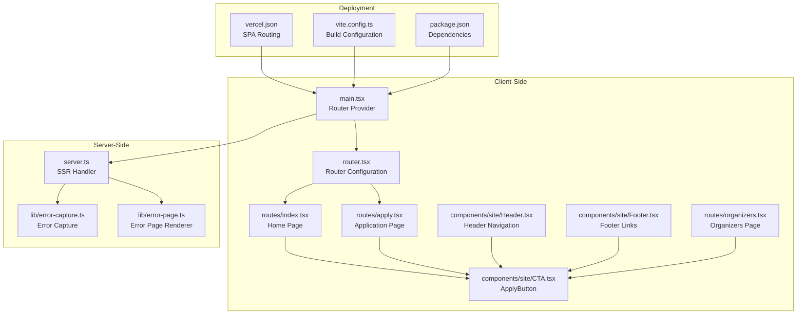
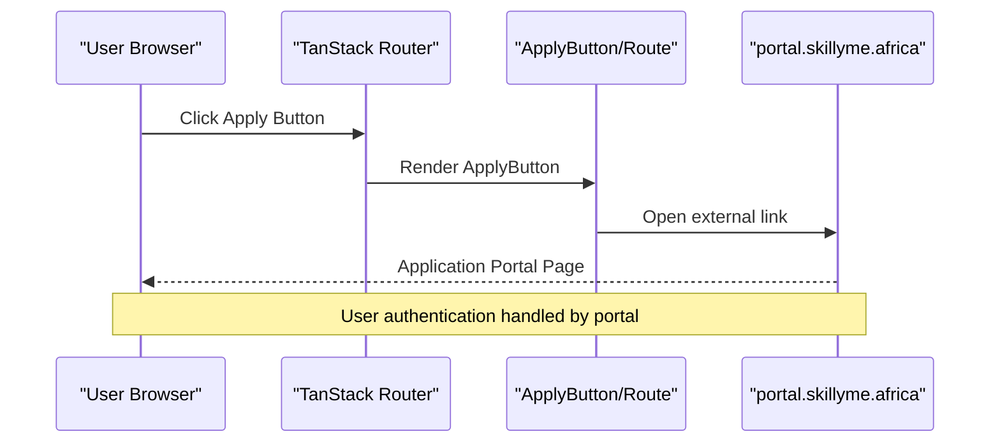
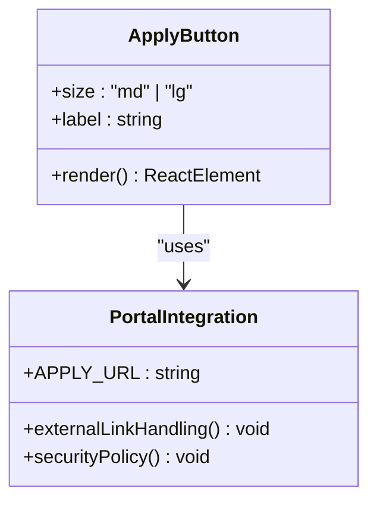
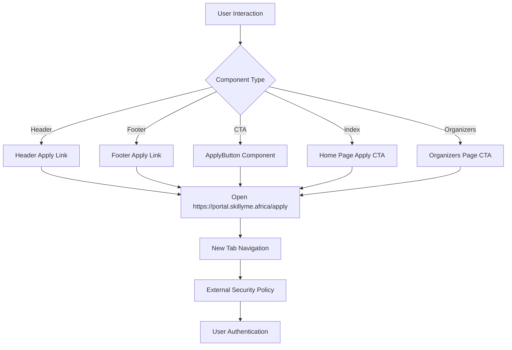
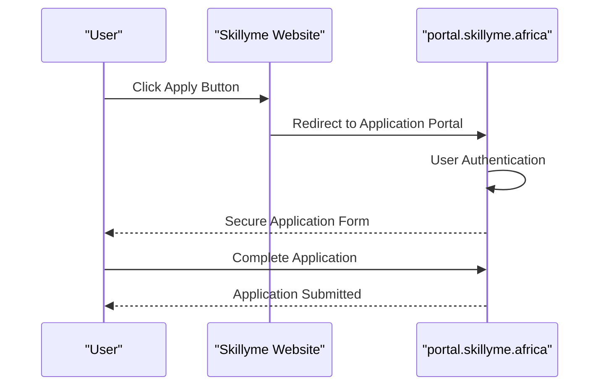
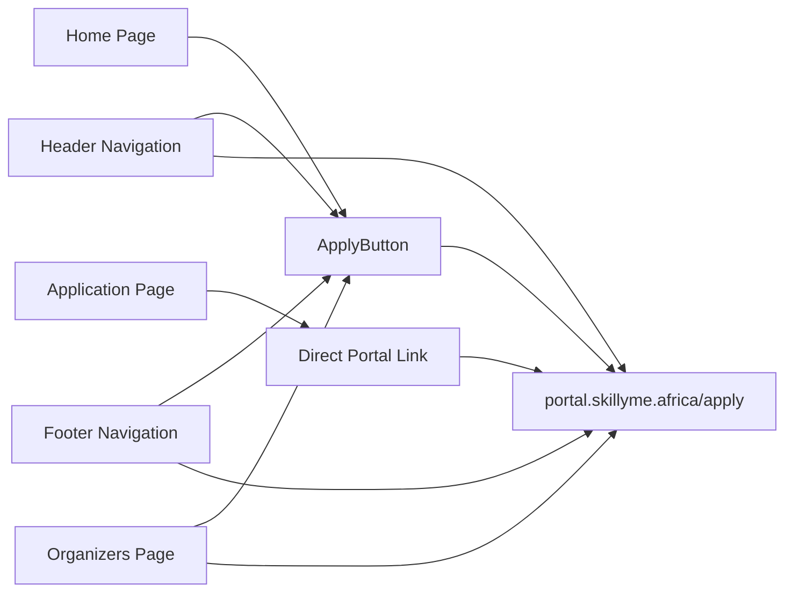
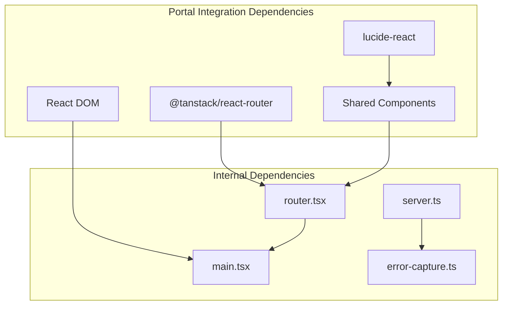
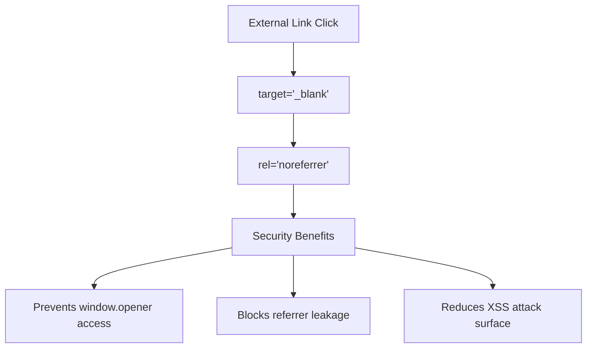
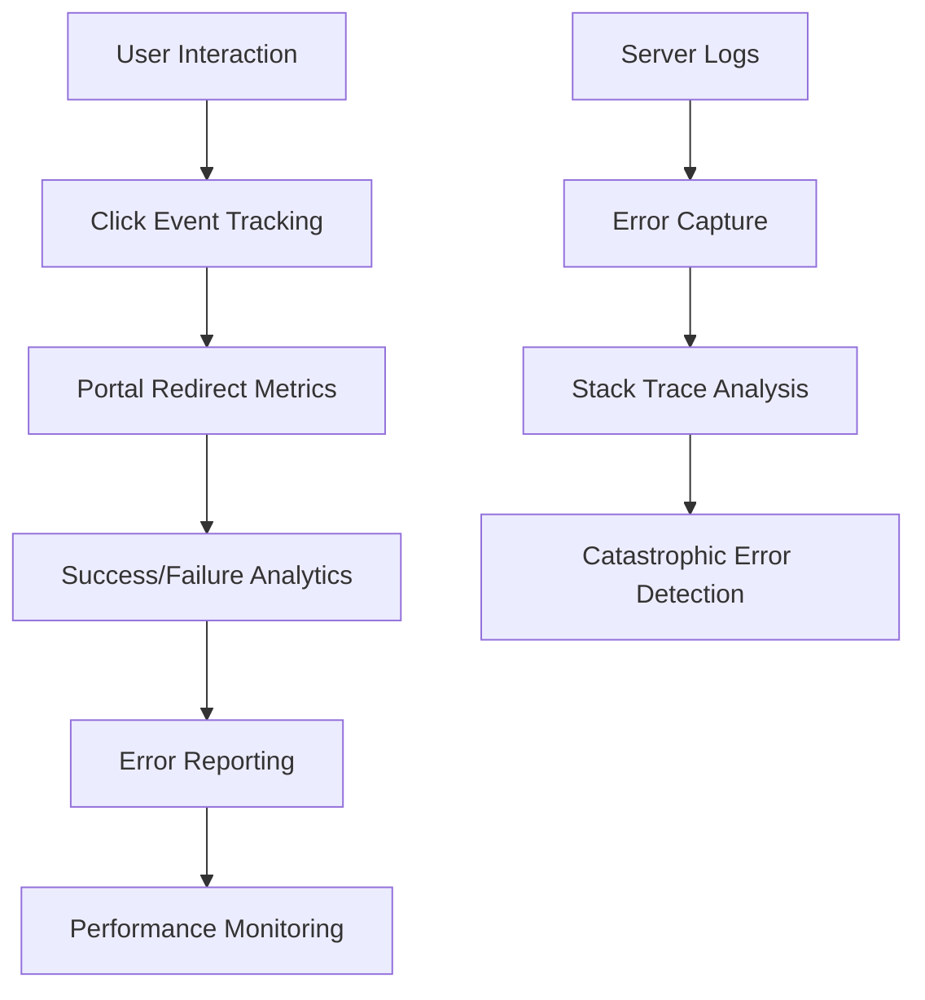

# Portal Integration

<cite>
**Referenced Files in This Document**
- [apply.tsx](file://src/routes/apply.tsx)
- [CTA.tsx](file://src/components/site/CTA.tsx)
- [Header.tsx](file://src/components/site/Header.tsx)
- [Footer.tsx](file://src/components/site/Footer.tsx)
- [index.tsx](file://src/routes/index.tsx)
- [organizers.tsx](file://src/routes/organizers.tsx)
- [main.tsx](file://src/main.tsx)
- [router.tsx](file://src/router.tsx)
- [server.ts](file://src/server.ts)
- [error-capture.ts](file://src/lib/error-capture.ts)
- [error-page.ts](file://src/lib/error-page.ts)
- [package.json](file://package.json)
- [vercel.json](file://vercel.json)
- [vite.config.ts](file://vite.config.ts)
</cite>

## Table of Contents
1. [Introduction](#introduction)
2. [Project Structure](#project-structure)
3. [Core Components](#core-components)
4. [Architecture Overview](#architecture-overview)
5. [Detailed Component Analysis](#detailed-component-analysis)
6. [Dependency Analysis](#dependency-analysis)
7. [Performance Considerations](#performance-considerations)
8. [Troubleshooting Guide](#troubleshooting-guide)
9. [Security Considerations](#security-considerations)
10. [Monitoring and Observability](#monitoring-and-observability)
11. [Conclusion](#conclusion)

## Introduction
This document provides comprehensive documentation for the portal integration with "portal.skillyme.africa". The integration centers around external link handling that directs users to the secure application portal for Cohort 2 applications. The implementation follows React Router patterns with TanStack Router, uses shared UI components for consistent user experience, and leverages Vercel deployment with SPA routing. The documentation covers the application workflow integration, portal URL configuration, authentication flow patterns, user redirection mechanisms, integration architecture, error handling, fallback strategies, troubleshooting, security considerations, and monitoring approaches.

## Project Structure
The portal integration spans several key areas:
- Routes: Application entry points and page composition
- Components: Reusable UI elements including the ApplyButton
- Server-side error handling: SSR error normalization and branded error pages
- Deployment configuration: Vercel SPA routing and build settings

**Diagram sources**
- [main.tsx:1-21](file://src/main.tsx#L1-L21)
- [router.tsx:1-17](file://src/router.tsx#L1-L17)
- [index.tsx:1-350](file://src/routes/index.tsx#L1-L350)
- [apply.tsx:1-70](file://src/routes/apply.tsx#L1-L70)
- [CTA.tsx:1-27](file://src/components/site/CTA.tsx#L1-L27)
- [Header.tsx:1-84](file://src/components/site/Header.tsx#L1-L84)
- [Footer.tsx:1-43](file://src/components/site/Footer.tsx#L1-L43)
- [organizers.tsx:1-178](file://src/routes/organizers.tsx#L1-L178)
- [server.ts:1-80](file://src/server.ts#L1-L80)
- [error-capture.ts:1-27](file://src/lib/error-capture.ts#L1-L27)
- [error-page.ts:1-30](file://src/lib/error-page.ts#L1-L30)
- [vercel.json:1-9](file://vercel.json#L1-L9)
- [vite.config.ts:1-30](file://vite.config.ts#L1-L30)
- [package.json:1-86](file://package.json#L1-L86)

**Section sources**
- [main.tsx:1-21](file://src/main.tsx#L1-L21)
- [router.tsx:1-17](file://src/router.tsx#L1-L17)
- [vercel.json:1-9](file://vercel.json#L1-L9)
- [vite.config.ts:1-30](file://vite.config.ts#L1-L30)
- [package.json:1-86](file://package.json#L1-L86)

## Core Components
The portal integration relies on three primary components:

### ApplyButton Component
The ApplyButton component encapsulates the external link to the portal application form. It provides consistent styling and behavior across the application.

Key characteristics:
- Uses a constant portal URL for all instances
- Supports size variants (md/lg) for responsive design
- Implements noreferrer security policy for external links
- Provides consistent gradient styling and hover effects

### Application Route (/apply)
The dedicated application route page serves as the primary landing point for portal redirection. It includes:
- SEO metadata optimized for the application page
- Prominent call-to-action linking to the portal
- Informational content about the application process
- Consistent branding and typography

### Portal URL Configuration
The integration uses a centralized constant for the portal URL, ensuring consistency across all components and routes. The URL points to the secure application portal endpoint.

**Section sources**
- [CTA.tsx:1-27](file://src/components/site/CTA.tsx#L1-L27)
- [apply.tsx:1-70](file://src/routes/apply.tsx#L1-L70)

## Architecture Overview
The portal integration follows a client-side routing architecture with server-side rendering capabilities:

**Diagram sources**
- [CTA.tsx:5-16](file://src/components/site/CTA.tsx#L5-L16)
- [apply.tsx:54-61](file://src/routes/apply.tsx#L54-L61)

The architecture ensures:
- Client-side navigation with server-side rendering support
- Centralized portal URL management
- Consistent user experience across all application entry points
- Security through noreferrer policy on external links

## Detailed Component Analysis

### ApplyButton Component Implementation
The ApplyButton component demonstrates a clean separation of concerns with its dedicated portal URL constant and flexible sizing options.

**Diagram sources**
- [CTA.tsx:5-16](file://src/components/site/CTA.tsx#L5-L16)

Implementation patterns:
- Constant URL definition for maintainability
- Conditional class name generation based on size
- External link security with noreferrer
- Consistent styling through shared CSS classes

**Section sources**
- [CTA.tsx:1-27](file://src/components/site/CTA.tsx#L1-L27)

### External Link Handling Mechanisms
Multiple components implement external link handling to the portal:

**Diagram sources**
- [Header.tsx:39-54](file://src/components/site/Header.tsx#L39-L54)
- [Footer.tsx:25](file://src/components/site/Footer.tsx#L25)
- [CTA.tsx:8-15](file://src/components/site/CTA.tsx#L8-L15)
- [index.tsx:135](file://src/routes/index.tsx#L135)
- [organizers.tsx:172](file://src/routes/organizers.tsx#L172)

**Section sources**
- [Header.tsx:1-84](file://src/components/site/Header.tsx#L1-L84)
- [Footer.tsx:1-43](file://src/components/site/Footer.tsx#L1-L43)
- [index.tsx:1-350](file://src/routes/index.tsx#L1-L350)
- [organizers.tsx:1-178](file://src/routes/organizers.tsx#L1-L178)

### Authentication Flow Patterns
The integration follows a straightforward external authentication pattern:

**Diagram sources**
- [apply.tsx:54-61](file://src/routes/apply.tsx#L54-L61)
- [CTA.tsx:8-15](file://src/components/site/CTA.tsx#L8-L15)

Authentication characteristics:
- External authentication handled by portal service
- No client-side authentication logic implemented
- Security through HTTPS and noreferrer policies
- Seamless user experience with new tab opening

**Section sources**
- [apply.tsx:1-70](file://src/routes/apply.tsx#L1-L70)
- [CTA.tsx:1-27](file://src/components/site/CTA.tsx#L1-L27)

### User Redirection Mechanisms
The application implements multiple redirection points to ensure user accessibility:

**Diagram sources**
- [index.tsx:135](file://src/routes/index.tsx#L135)
- [apply.tsx:54-61](file://src/routes/apply.tsx#L54-L61)
- [Header.tsx:39-54](file://src/components/site/Header.tsx#L39-L54)
- [Footer.tsx:25](file://src/components/site/Footer.tsx#L25)
- [organizers.tsx:172](file://src/routes/organizers.tsx#L172)

**Section sources**
- [index.tsx:1-350](file://src/routes/index.tsx#L1-L350)
- [apply.tsx:1-70](file://src/routes/apply.tsx#L1-L70)
- [Header.tsx:1-84](file://src/components/site/Header.tsx#L1-L84)
- [Footer.tsx:1-43](file://src/components/site/Footer.tsx#L1-L43)
- [organizers.tsx:1-178](file://src/routes/organizers.tsx#L1-L178)

## Dependency Analysis
The portal integration has minimal external dependencies, relying primarily on React Router and shared UI components:

**Diagram sources**
- [package.json:44-56](file://package.json#L44-L56)
- [router.tsx:1-17](file://src/router.tsx#L1-L17)
- [main.tsx:1-21](file://src/main.tsx#L1-L21)
- [server.ts:1-80](file://src/server.ts#L1-L80)
- [error-capture.ts:1-27](file://src/lib/error-capture.ts#L1-L27)

Key dependency characteristics:
- Minimal external dependencies for portability
- Shared component library reduces duplication
- TanStack Router provides robust routing capabilities
- React Query integration supports data fetching patterns

**Section sources**
- [package.json:1-86](file://package.json#L1-L86)
- [router.tsx:1-17](file://src/router.tsx#L1-L17)
- [main.tsx:1-21](file://src/main.tsx#L1-L21)

## Performance Considerations
The portal integration is designed for optimal performance:

- **Bundle Size**: Minimal external dependencies reduce bundle size
- **Code Splitting**: TanStack Router plugin enables automatic code splitting
- **Lazy Loading**: Route-based code splitting improves initial load times
- **Static Assets**: Vercel CDN optimizes static asset delivery
- **Caching Strategy**: Vercel's edge caching reduces latency

Optimization opportunities:
- Implement route-level code splitting for large components
- Consider lazy loading of heavy UI libraries
- Optimize image assets for faster loading
- Monitor Core Web Vitals for performance metrics

## Troubleshooting Guide

### Common Portal Integration Issues

#### Issue: Portal Link Not Working
**Symptoms**: External links fail to open or redirect incorrectly
**Causes**:
- Network connectivity issues
- Browser popup blockers
- Incorrect portal URL configuration
- DNS resolution problems

**Solutions**:
1. Verify portal URL constant is correctly defined
2. Test link in different browsers
3. Check for browser extension interference
4. Validate DNS resolution for portal domain

#### Issue: Authentication Failures
**Symptoms**: Users cannot access application portal
**Causes**:
- Portal service downtime
- Session expiration
- Browser compatibility issues
- Security policy restrictions

**Solutions**:
1. Implement retry logic for portal requests
2. Add user feedback for authentication errors
3. Provide manual refresh option
4. Log authentication failure events

#### Issue: SSR Error Handling
**Symptoms**: Server-side rendering errors cause application crashes
**Causes**:
- Unhandled exceptions during SSR
- Network timeouts accessing portal
- Memory leaks in server-side code

**Solutions**:
1. Review error capture mechanism
2. Implement graceful degradation
3. Add circuit breaker pattern
4. Monitor error rates and patterns

**Section sources**
- [server.ts:1-80](file://src/server.ts#L1-L80)
- [error-capture.ts:1-27](file://src/lib/error-capture.ts#L1-L27)
- [error-page.ts:1-30](file://src/lib/error-page.ts#L1-L30)

## Security Considerations

### External Link Security
The integration implements several security measures for external portal links:

**Diagram sources**
- [CTA.tsx:10-11](file://src/components/site/CTA.tsx#L10-L11)
- [apply.tsx:56-57](file://src/routes/apply.tsx#L56-L57)

Security implementation details:
- **noreferrer Policy**: Prevents referrer information leakage
- **Blank Target**: Opens links in new tabs for isolation
- **HTTPS Enforcement**: All portal URLs use HTTPS protocol
- **Domain Restriction**: Only allows portal.skillyme.africa domain

### Authentication Security
The integration follows external authentication best practices:
- **No Credential Storage**: Client does not handle user credentials
- **Secure Transport**: All communication occurs over HTTPS
- **Session Isolation**: Portal maintains separate authentication state
- **Minimal Data Exposure**: Client-side code does not process sensitive data

## Monitoring and Observability

### Application Workflow Tracking
The integration supports comprehensive monitoring through:

**Diagram sources**
- [server.ts:55-67](file://src/server.ts#L55-L67)
- [error-capture.ts:7-26](file://src/lib/error-capture.ts#L7-L26)

Monitoring capabilities:
- **Click Analytics**: Track application button interactions
- **Redirect Metrics**: Monitor portal link effectiveness
- **Error Tracking**: Capture and report integration failures
- **Performance Monitoring**: Measure load times and user experience
- **Server Health**: Monitor SSR error rates and response times

Recommended monitoring tools:
- Application Performance Monitoring (APM)
- Error tracking platforms
- User behavior analytics
- Serverless function monitoring
- Domain-specific analytics for portal engagement

**Section sources**
- [server.ts:1-80](file://src/server.ts#L1-L80)
- [error-capture.ts:1-27](file://src/lib/error-capture.ts#L1-L27)

## Conclusion
The portal integration with "portal.skillyme.africa" demonstrates a well-architected, secure, and maintainable approach to external link handling. The implementation leverages React Router patterns, shared UI components, and robust error handling mechanisms. Key strengths include centralized URL configuration, consistent user experience across multiple entry points, comprehensive security measures, and comprehensive monitoring capabilities.

The integration successfully delegates authentication responsibilities to the portal service while maintaining a seamless user experience. The modular architecture ensures easy maintenance and future enhancements. With proper monitoring and observability in place, the system can effectively track user engagement and quickly identify and resolve integration issues.

Future enhancement opportunities include implementing advanced analytics, adding user feedback mechanisms, and exploring progressive web app features for improved offline functionality.