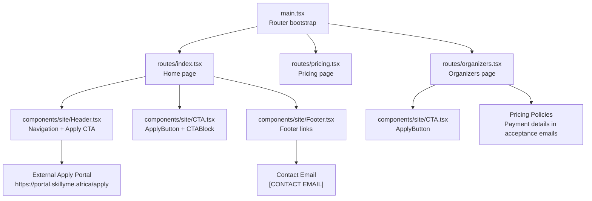
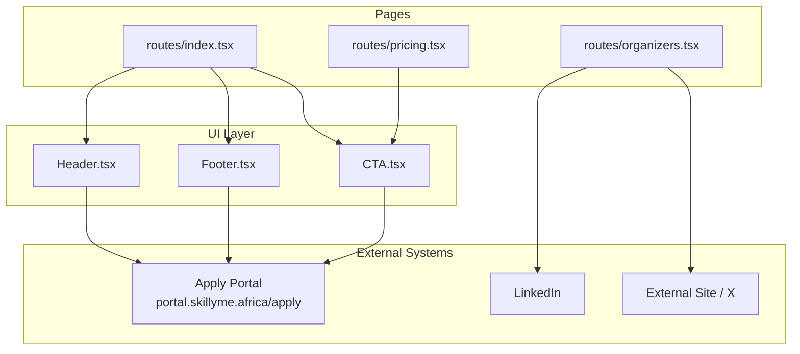
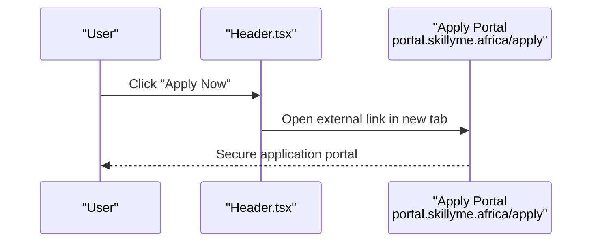
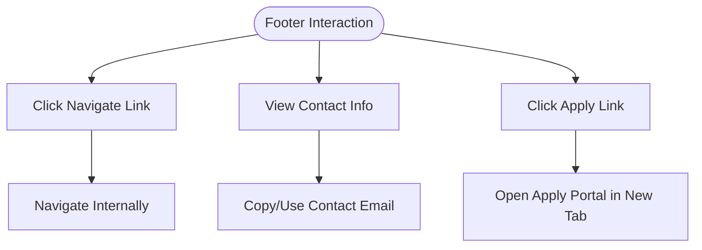
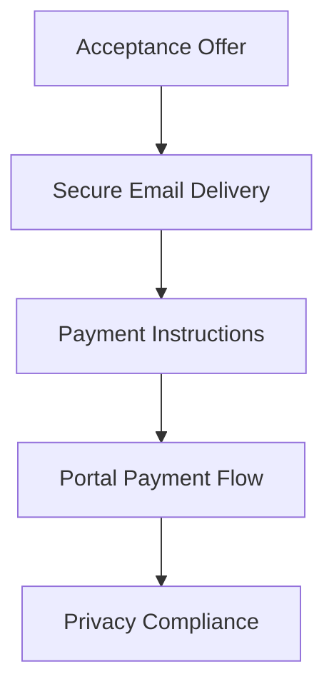
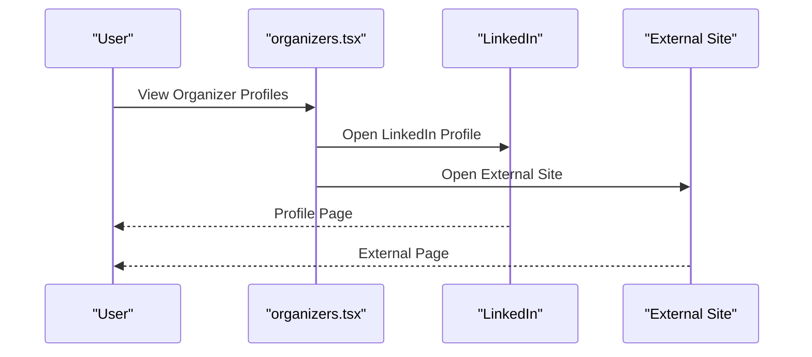
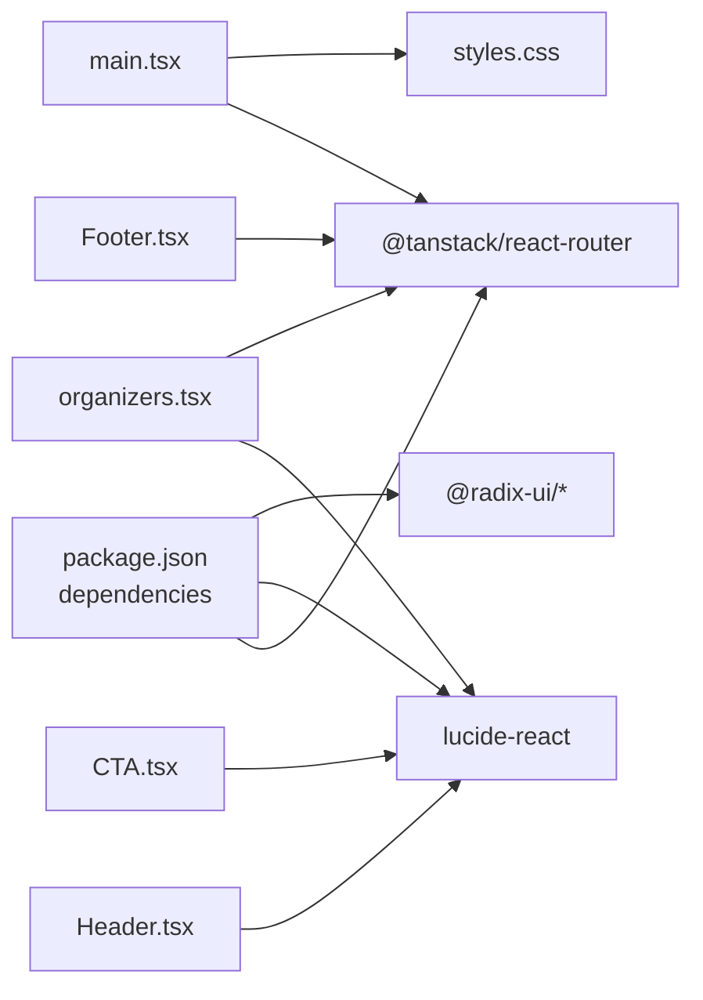

# Social Media Integration

<cite>
**Referenced Files in This Document**
- [Header.tsx](file://src/components/site/Header.tsx)
- [Footer.tsx](file://src/components/site/Footer.tsx)
- [CTA.tsx](file://src/components/site/CTA.tsx)
- [index.tsx](file://src/routes/index.tsx)
- [pricing.tsx](file://src/routes/pricing.tsx)
- [organizers.tsx](file://src/routes/organizers.tsx)
- [main.tsx](file://src/main.tsx)
- [package.json](file://package.json)
</cite>

## Table of Contents
1. [Introduction](#introduction)
2. [Project Structure](#project-structure)
3. [Core Components](#core-components)
4. [Architecture Overview](#architecture-overview)
5. [Detailed Component Analysis](#detailed-component-analysis)
6. [Dependency Analysis](#dependency-analysis)
7. [Performance Considerations](#performance-considerations)
8. [Troubleshooting Guide](#troubleshooting-guide)
9. [Conclusion](#conclusion)

## Introduction
This document explains the social media integration patterns and community engagement features implemented in the Skillyme Africa application. It focuses on how the header component presents navigation and call-to-action links, how community platforms are connected, and how content sharing and engagement tracking can be integrated. It also outlines platform-specific configuration approaches for Facebook, Twitter, LinkedIn, Instagram, and WhatsApp, along with best practices for privacy, community guidelines, and metrics collection.

## Project Structure
The application is a React-based single-page app using TanStack Router for routing. Social-related functionality is primarily exposed through:
- Global navigation and call-to-action buttons
- Community and contact links
- Application portal integration for engagement and conversions

**Diagram sources**
- [main.tsx:1-21](file://src/main.tsx#L1-L21)
- [index.tsx:14-350](file://src/routes/index.tsx#L14-L350)
- [pricing.tsx:55-208](file://src/routes/pricing.tsx#L55-L208)
- [organizers.tsx:33-61](file://src/routes/organizers.tsx#L33-L61)
- [Header.tsx:13-84](file://src/components/site/Header.tsx#L13-L84)
- [Footer.tsx:3-44](file://src/components/site/Footer.tsx#L3-L44)
- [CTA.tsx:1-26](file://src/components/site/CTA.tsx#L1-L26)

**Section sources**
- [main.tsx:1-21](file://src/main.tsx#L1-L21)
- [package.json:14-66](file://package.json#L14-L66)

## Core Components
- Header navigation and Apply CTA: Provides primary navigation and external application portal link.
- Footer: Includes navigation, contact information, and external links.
- Pricing page policies: Emphasize privacy and secure handling of sensitive payment details.
- Organizers page: Contains platform-specific links (LinkedIn, external sites) for community connection.

Key implementation patterns:
- External links use target="_blank" and rel="noreferrer" for security.
- Centralized ApplyButton component ensures consistent engagement prompts.
- Privacy-first messaging for payment details and data protection.

**Section sources**
- [Header.tsx:13-84](file://src/components/site/Header.tsx#L13-L84)
- [Footer.tsx:3-44](file://src/components/site/Footer.tsx#L3-L44)
- [CTA.tsx:1-26](file://src/components/site/CTA.tsx#L1-L26)
- [pricing.tsx:55-208](file://src/routes/pricing.tsx#L55-L208)
- [organizers.tsx:33-61](file://src/routes/organizers.tsx#L33-L61)

## Architecture Overview
The social and community integration architecture centers on:
- Internal navigation and content pages
- External application portal for conversions
- Platform-specific links for community engagement
- Privacy-compliant handling of sensitive information

**Diagram sources**
- [Header.tsx:13-84](file://src/components/site/Header.tsx#L13-L84)
- [Footer.tsx:3-44](file://src/components/site/Footer.tsx#L3-L44)
- [CTA.tsx:1-26](file://src/components/site/CTA.tsx#L1-L26)
- [index.tsx:14-350](file://src/routes/index.tsx#L14-L350)
- [pricing.tsx:55-208](file://src/routes/pricing.tsx#L55-L208)
- [organizers.tsx:33-61](file://src/routes/organizers.tsx#L33-L61)

## Detailed Component Analysis

### Header Navigation and Apply CTA
The header component provides:
- Logo and brand identity
- Desktop and mobile navigation
- Apply Now call-to-action linking to the external application portal
- Mobile menu toggle for responsive navigation

**Diagram sources**
- [Header.tsx:38-54](file://src/components/site/Header.tsx#L38-L54)
- [CTA.tsx:5-16](file://src/components/site/CTA.tsx#L5-L16)

**Section sources**
- [Header.tsx:13-84](file://src/components/site/Header.tsx#L13-L84)
- [CTA.tsx:1-26](file://src/components/site/CTA.tsx#L1-L26)

### Footer Community Links
The footer exposes:
- Navigation to internal pages
- Contact information
- External links to the application portal

**Diagram sources**
- [Footer.tsx:18-35](file://src/components/site/Footer.tsx#L18-L35)

**Section sources**
- [Footer.tsx:3-44](file://src/components/site/Footer.tsx#L3-L44)

### Pricing Policies and Privacy Messaging
The pricing page emphasizes:
- Payment details are shared only via acceptance emails
- Privacy compliance and secure handling of sensitive information

**Diagram sources**
- [pricing.tsx:177-208](file://src/routes/pricing.tsx#L177-L208)

**Section sources**
- [pricing.tsx:55-208](file://src/routes/pricing.tsx#L55-L208)

### Organizers Platform Links
The organizers page includes:
- LinkedIn profile links for lead organizers
- External site links for additional profiles

**Diagram sources**
- [organizers.tsx:50-56](file://src/routes/organizers.tsx#L50-L56)

**Section sources**
- [organizers.tsx:33-61](file://src/routes/organizers.tsx#L33-L61)

## Dependency Analysis
The application relies on:
- TanStack Router for routing and page composition
- React for UI rendering
- Lucide icons for visual cues
- Radix UI primitives for accessible components

**Diagram sources**
- [package.json:14-66](file://package.json#L14-L66)
- [main.tsx:1-21](file://src/main.tsx#L1-L21)

**Section sources**
- [package.json:14-66](file://package.json#L14-L66)
- [main.tsx:1-21](file://src/main.tsx#L1-L21)

## Performance Considerations
- External links use target="_blank" and rel="noreferrer" to prevent reverse tabnabbing and improve security.
- Centralized ApplyButton reduces duplication and improves maintainability.
- Minimal DOM and state changes in header and footer enhance responsiveness.

## Troubleshooting Guide
Common issues and resolutions:
- External links not opening: Verify target="_blank" and rel="noreferrer" attributes are present.
- Apply CTA not visible: Confirm ApplyButton component is rendered and styles are applied.
- Privacy policy confusion: Ensure pricing page messaging about acceptance-email-only delivery of payment details is visible.

**Section sources**
- [Header.tsx:38-54](file://src/components/site/Header.tsx#L38-L54)
- [CTA.tsx:5-16](file://src/components/site/CTA.tsx#L5-L16)
- [pricing.tsx:177-208](file://src/routes/pricing.tsx#L177-L208)

## Conclusion
The application integrates social and community features through centralized navigation, external portal links, and privacy-focused messaging. Platform-specific integrations (LinkedIn, external sites) are straightforward to add. For broader social sharing and analytics, extend the existing patterns with dedicated sharing components and analytics hooks while maintaining privacy and compliance.