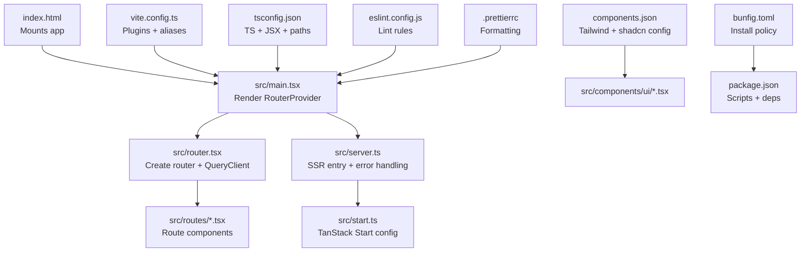
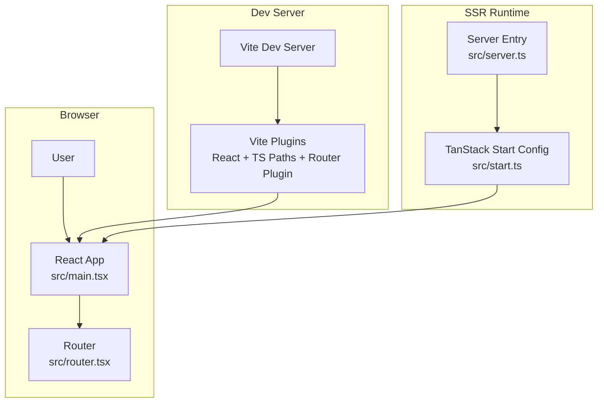

# Getting Started

<cite>
**Referenced Files in This Document**
- [package.json](file://package.json)
- [bunfig.toml](file://bunfig.toml)
- [vite.config.ts](file://vite.config.ts)
- [tsconfig.json](file://tsconfig.json)
- [eslint.config.js](file://eslint.config.js)
- [.prettierrc](file://.prettierrc)
- [.gitignore](file://.gitignore)
- [index.html](file://index.html)
- [src/main.tsx](file://src/main.tsx)
- [src/router.tsx](file://src/router.tsx)
- [src/start.ts](file://src/start.ts)
- [src/server.ts](file://src/server.ts)
- [src/lib/utils.ts](file://src/lib/utils.ts)
- [components.json](file://components.json)
- [vercel.json](file://vercel.json)
</cite>

## Table of Contents
1. [Introduction](#introduction)
2. [Prerequisites](#prerequisites)
3. [Development Environment Setup](#development-environment-setup)
4. [Installation](#installation)
5. [Running the Development Server](#running-the-development-server)
6. [Build and Preview](#build-and-preview)
7. [Project Structure](#project-structure)
8. [Key Configuration Files](#key-configuration-files)
9. [Architecture Overview](#architecture-overview)
10. [Troubleshooting Guide](#troubleshooting-guide)
11. [Conclusion](#conclusion)

## Introduction
This guide helps you set up and run the Skillyme Programs System locally. It covers installing Bun, understanding the project’s toolchain (Vite, TypeScript, ESLint/Prettier), running the development server, building for production, and previewing the app. It also explains the project structure and highlights key configuration files so you can onboard quickly and confidently.

## Prerequisites
Before starting, ensure you have:
- React fundamentals: components, props, state, effects, and routing.
- TypeScript basics: types, interfaces, generics, and strict mode behavior.
- Modern JavaScript (ES6+): modules, destructuring, arrow functions, async/await.
- A terminal/shell familiar with npm-style scripts and package managers.

These skills will help you navigate the codebase and configuration files effectively.

## Development Environment Setup
- Node.js: The project targets modern JavaScript/TypeScript features and uses Vite. While Node.js is not strictly required to run Bun, having a recent LTS Node installed can be helpful for compatibility checks and tooling diagnostics.
- Bun: This project uses Bun as the package manager and runtime. Install Bun from https://bun.sh/. After installation, verify it by running bun -v in your terminal.
- Git: Clone the repository and use git commands to manage branches and updates.

Notes:
- The project uses Bun’s configuration for dependency resolution and supply-chain safeguards. See [bunfig.toml](file://bunfig.toml) for details.
- The project targets ES2022 and uses bundler-style module resolution, strict TypeScript settings, and React JSX transform. See [tsconfig.json](file://tsconfig.json).

**Section sources**
- [bunfig.toml:1-7](file://bunfig.toml#L1-L7)
- [tsconfig.json:1-28](file://tsconfig.json#L1-L28)

## Installation
Install dependencies using Bun:
- Run: bun install
- This installs both runtime and development dependencies defined in [package.json](file://package.json).

What you get:
- React and related libraries for UI and routing.
- Vite for fast dev server and builds.
- Tailwind CSS v4 integration and shadcn/ui components configuration.
- TypeScript, ESLint, and Prettier for code quality and formatting.

Tip:
- If you encounter permission errors during installation, review Bun’s cache and lockfile behavior. The project’s Bun config includes a release age policy to avoid freshly published packages. See [bunfig.toml](file://bunfig.toml).

**Section sources**
- [package.json:1-86](file://package.json#L1-L86)
- [bunfig.toml:1-7](file://bunfig.toml#L1-L7)

## Running the Development Server
Start the Vite dev server:
- Run: bun run dev
- This executes the dev script defined in [package.json](file://package.json).

What happens:
- Vite starts a local dev server with hot module replacement (HMR).
- The React app mounts to the DOM via [src/main.tsx](file://src/main.tsx), which renders the TanStack Router-powered app.
- Plugins configured in [vite.config.ts](file://vite.config.ts) enable React JSX transform, TypeScript path mapping, TanStack Router code splitting, and Tailwind CSS integration.

Open the browser to the URL shown in the terminal (typically http://localhost:5173).

**Section sources**
- [package.json:6-13](file://package.json#L6-L13)
- [vite.config.ts:1-30](file://vite.config.ts#L1-L30)
- [src/main.tsx:1-21](file://src/main.tsx#L1-L21)

## Build and Preview
Production build:
- Run: bun run build
- This creates an optimized static build in the dist directory.

Preview the production build locally:
- Run: bun run preview
- This serves the built assets locally for testing.

Note:
- The Vercel configuration expects the build output in dist and rewrites all routes to index.html. See [vercel.json](file://vercel.json).

**Section sources**
- [package.json:8-10](file://package.json#L8-L10)
- [vercel.json:1-9](file://vercel.json#L1-L9)

## Project Structure
High-level layout:
- src/: Application source code
  - main.tsx: App entry point mounting the RouterProvider
  - router.tsx: Router initialization with a QueryClient context
  - routes/: Route files generated by TanStack Router plugin
  - components/: UI components (site-level and reusable UI)
  - lib/: Utilities and shared helpers
  - server.ts: Server entry for SSR and error normalization
  - start.ts: TanStack Start configuration and middleware
- public/: Static assets referenced by index.html
- Config files at the repo root: package.json, vite.config.ts, tsconfig.json, eslint.config.js, components.json, vercel.json, bunfig.toml, .prettierrc, .gitignore

**Diagram sources**
- [index.html:1-21](file://index.html#L1-L21)
- [src/main.tsx:1-21](file://src/main.tsx#L1-L21)
- [src/router.tsx:1-17](file://src/router.tsx#L1-L17)
- [src/server.ts:1-81](file://src/server.ts#L1-L81)
- [src/start.ts:1-23](file://src/start.ts#L1-L23)
- [vite.config.ts:1-30](file://vite.config.ts#L1-L30)
- [tsconfig.json:1-28](file://tsconfig.json#L1-L28)
- [components.json:1-23](file://components.json#L1-L23)
- [eslint.config.js:1-41](file://eslint.config.js#L1-L41)
- [.prettierrc:1-7](file://.prettierrc#L1-L7)
- [bunfig.toml:1-7](file://bunfig.toml#L1-L7)
- [package.json:1-86](file://package.json#L1-L86)

**Section sources**
- [index.html:1-21](file://index.html#L1-L21)
- [src/main.tsx:1-21](file://src/main.tsx#L1-L21)
- [src/router.tsx:1-17](file://src/router.tsx#L1-L17)
- [src/server.ts:1-81](file://src/server.ts#L1-L81)
- [src/start.ts:1-23](file://src/start.ts#L1-L23)
- [vite.config.ts:1-30](file://vite.config.ts#L1-L30)
- [tsconfig.json:1-28](file://tsconfig.json#L1-L28)
- [components.json:1-23](file://components.json#L1-L23)
- [eslint.config.js:1-41](file://eslint.config.js#L1-L41)
- [.prettierrc:1-7](file://.prettierrc#L1-L7)
- [bunfig.toml:1-7](file://bunfig.toml#L1-L7)
- [package.json:1-86](file://package.json#L1-L86)

## Key Configuration Files
- package.json: Defines scripts (dev, build, preview), dependencies, and devDependencies. See [package.json](file://package.json).
- vite.config.ts: Enables React, TanStack Router plugin, tsconfig paths, and Tailwind CSS. See [vite.config.ts](file://vite.config.ts).
- tsconfig.json: Targets ES2022, uses Bundler module resolution, JSX transform, and path aliases. See [tsconfig.json](file://tsconfig.json).
- eslint.config.js: Extends recommended TS and React rules, adds Prettier, and enforces React Hooks. See [eslint.config.js](file://eslint.config.js).
- components.json: Tailwind + shadcn configuration and aliases. See [components.json](file://components.json).
- bunfig.toml: Supply-chain guard and exemptions for specific packages. See [bunfig.toml](file://bunfig.toml).
- .prettierrc: Formatting preferences. See [.prettierrc](file://.prettierrc).
- .gitignore: Ignores node_modules, dist, and tool-specific caches. See [.gitignore](file://.gitignore).
- vercel.json: Build command, output directory, and rewrite rules for deployment. See [vercel.json](file://vercel.json).

**Section sources**
- [package.json:1-86](file://package.json#L1-L86)
- [vite.config.ts:1-30](file://vite.config.ts#L1-L30)
- [tsconfig.json:1-28](file://tsconfig.json#L1-L28)
- [eslint.config.js:1-41](file://eslint.config.js#L1-L41)
- [components.json:1-23](file://components.json#L1-L23)
- [bunfig.toml:1-7](file://bunfig.toml#L1-L7)
- [.prettierrc:1-7](file://.prettierrc#L1-L7)
- [.gitignore:1-33](file://.gitignore#L1-L33)
- [vercel.json:1-9](file://vercel.json#L1-L9)

## Architecture Overview
The app is a client-side React application powered by TanStack Router and TanStack Start. It uses Vite for dev/build, Tailwind CSS for styling, and shadcn/ui components. SSR is handled via a server entry that wraps TanStack Start.

**Diagram sources**
- [src/main.tsx:1-21](file://src/main.tsx#L1-L21)
- [src/router.tsx:1-17](file://src/router.tsx#L1-L17)
- [vite.config.ts:1-30](file://vite.config.ts#L1-L30)
- [src/server.ts:1-81](file://src/server.ts#L1-L81)
- [src/start.ts:1-23](file://src/start.ts#L1-L23)

## Troubleshooting Guide
Common setup and environment issues:

- Bun install fails with permission errors
  - Cause: File system permissions or locked cache.
  - Action: Clear Bun cache and retry installation. Review the release age policy in [bunfig.toml](file://bunfig.toml).

- TypeScript errors in the terminal
  - Cause: Strict TS settings and bundler module resolution.
  - Action: Ensure your editor supports TS + Vite. Verify path aliases and JSX settings in [tsconfig.json](file://tsconfig.json).

- ESLint/Prettier warnings or errors
  - Cause: Style/formatting rules or missing Prettier plugin.
  - Action: Run lint and format scripts defined in [package.json](file://package.json). Confirm [eslint.config.js](file://eslint.config.js) and [.prettierrc](file://.prettierrc) are respected.

- Vite dev server not starting or port conflicts
  - Cause: Port in use or misconfigured plugins.
  - Action: Change the port in [vite.config.ts](file://vite.config.ts) if needed. Restart the dev server.

- Tailwind CSS not applying styles
  - Cause: Missing Tailwind directives or incorrect config.
  - Action: Confirm Tailwind plugin is enabled in [vite.config.ts](file://vite.config.ts) and CSS path in [components.json](file://components.json).

- SSR-related errors in the server entry
  - Cause: Unhandled exceptions or catastrophic SSR responses.
  - Action: Review error normalization and middleware in [src/server.ts](file://src/server.ts) and [src/start.ts](file://src/start.ts).

- Production build fails or preview shows blank page
  - Cause: Incorrect output directory or missing rewrites.
  - Action: Ensure build runs successfully and output matches [vercel.json](file://vercel.json). Use bun run preview to test locally.

**Section sources**
- [bunfig.toml:1-7](file://bunfig.toml#L1-L7)
- [tsconfig.json:1-28](file://tsconfig.json#L1-L28)
- [package.json:6-13](file://package.json#L6-L13)
- [eslint.config.js:1-41](file://eslint.config.js#L1-L41)
- [.prettierrc:1-7](file://.prettierrc#L1-L7)
- [vite.config.ts:1-30](file://vite.config.ts#L1-L30)
- [components.json:1-23](file://components.json#L1-L23)
- [src/server.ts:1-81](file://src/server.ts#L1-L81)
- [src/start.ts:1-23](file://src/start.ts#L1-L23)
- [vercel.json:1-9](file://vercel.json#L1-L9)

## Conclusion
You now have the essentials to set up the Skillyme Programs System, install dependencies with Bun, run the dev server, build for production, and preview the app. Use the provided configuration references to troubleshoot and extend the project. Explore the route components under src/routes and the UI components under src/components to understand the application structure further.