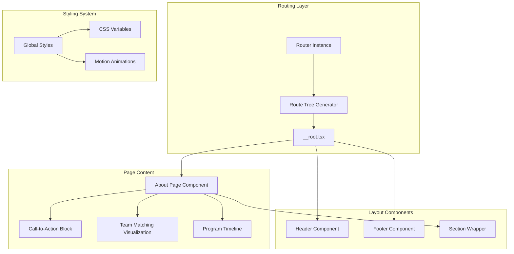
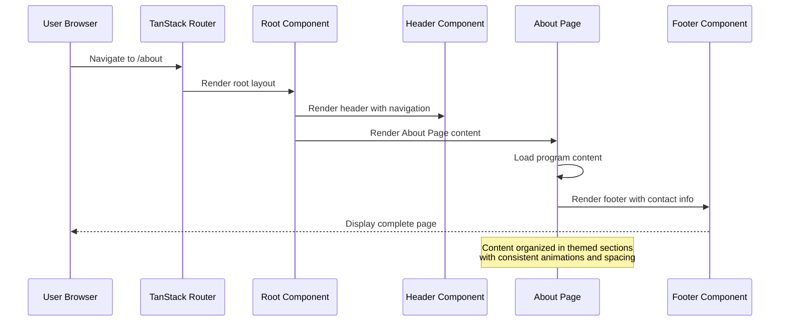
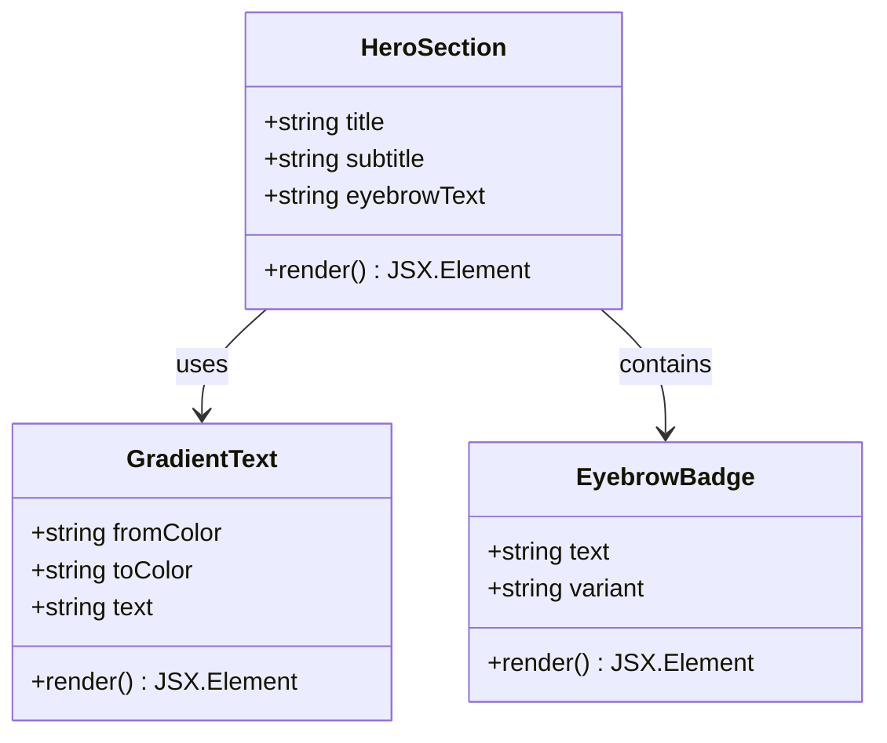
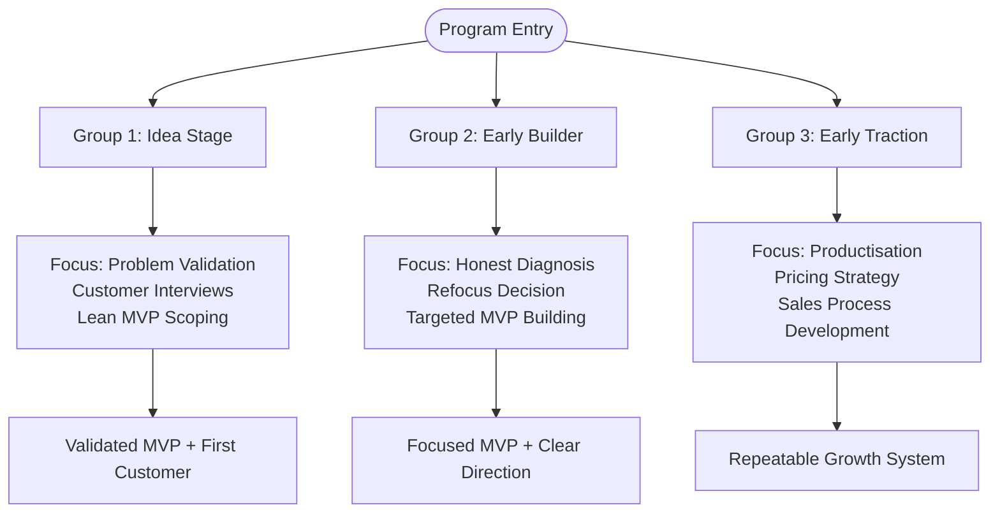
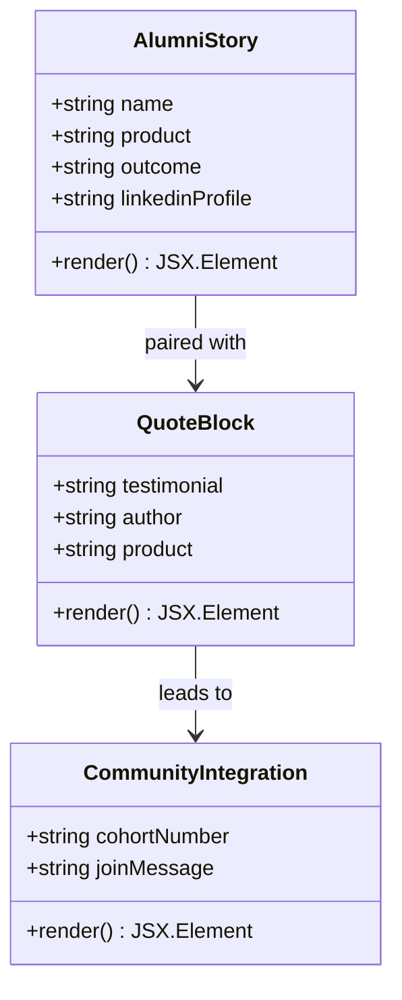
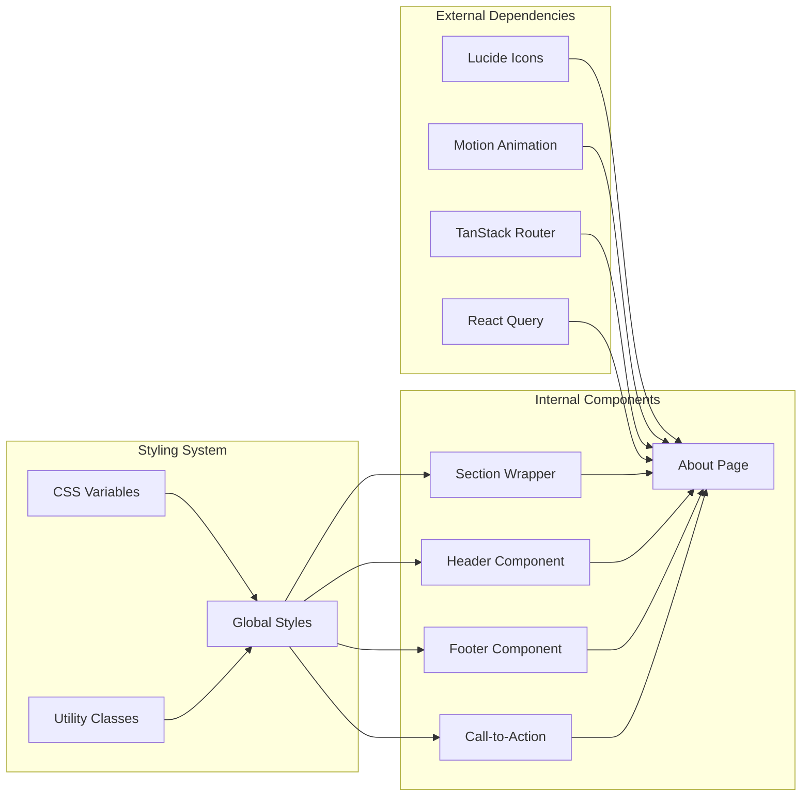

# About Page

<cite>
**Referenced Files in This Document**
- [about.tsx](file://src/routes/about.tsx)
- [Section.tsx](file://src/components/site/Section.tsx)
- [Header.tsx](file://src/components/site/Header.tsx)
- [Footer.tsx](file://src/components/site/Footer.tsx)
- [CTA.tsx](file://src/components/site/CTA.tsx)
- [router.tsx](file://src/router.tsx)
- [__root.tsx](file://src/routes/__root.tsx)
- [styles.css](file://src/styles.css)
- [routeTree.gen.ts](file://src/routeTree.gen.ts)
- [main.tsx](file://src/main.tsx)
</cite>

## Table of Contents
1. [Introduction](#introduction)
2. [Project Structure](#project-structure)
3. [Core Components](#core-components)
4. [Architecture Overview](#architecture-overview)
5. [Detailed Component Analysis](#detailed-component-analysis)
6. [Dependency Analysis](#dependency-analysis)
7. [Performance Considerations](#performance-considerations)
8. [Accessibility Features](#accessibility-features)
9. [Responsive Design Implementation](#responsive-design-implementation)
10. [Integration with Site Layout System](#integration-with-site-layout-system)
11. [Content Organization Strategies](#content-organization-strategies)
12. [Troubleshooting Guide](#troubleshooting-guide)
13. [Conclusion](#conclusion)

## Introduction

The About Page component serves as the primary informational hub for Skillyme Africa's Cohort 2 Build Track program. This comprehensive documentation covers the program philosophy, objectives, educational approach, team composition, time commitment, demo day celebrations, and alumni success stories. The component is designed as a modern, outcome-focused educational accelerator that emphasizes practical application over theoretical learning.

The page communicates Skillyme's unique value proposition through a structured narrative that demonstrates how participants move from ideation to product delivery and client acquisition within a six-week timeframe. The implementation leverages a clean, dark-themed interface with gradient accents that reinforce the innovative and forward-thinking nature of the program.

## Project Structure

The About Page is organized within the TanStack Router framework as a dedicated route component. The page follows a modular architecture pattern where reusable site components handle layout concerns while the About component focuses on content presentation.



**Diagram sources**
- [router.tsx:1-17](file://src/router.tsx#L1-L17)
- [routeTree.gen.ts:11-132](file://src/routeTree.gen.ts#L11-L132)
- [__root.tsx:43-61](file://src/routes/__root.tsx#L43-L61)

**Section sources**
- [about.tsx:1-237](file://src/routes/about.tsx#L1-L237)
- [main.tsx:1-21](file://src/main.tsx#L1-L21)

## Core Components

The About Page leverages several core components that work together to create a cohesive user experience:

### Section Wrapper Component
The Section component provides consistent spacing, typography, and animation behavior across all content blocks. It supports two tone variants: "deep" (default) and "elev" (with elevated background treatment).

### Header and Navigation
The Header component maintains consistent navigation across all pages, featuring the Skillyme brand identity and prominent call-to-action buttons for program applications.

### Footer Component
The Footer provides essential contact information, navigation links, and legal compliance details while maintaining the dark theme aesthetic.

### Call-to-Action Components
The CTA system includes specialized components for primary actions and secondary navigation, ensuring consistent user experience across different page contexts.

**Section sources**
- [Section.tsx:4-44](file://src/components/site/Section.tsx#L4-L44)
- [Header.tsx:13-84](file://src/components/site/Header.tsx#L13-L84)
- [Footer.tsx:3-44](file://src/components/site/Footer.tsx#L3-L44)
- [CTA.tsx:1-27](file://src/components/site/CTA.tsx#L1-L27)

## Architecture Overview

The About Page follows a component-based architecture that separates concerns between layout, content presentation, and interactive elements. The page utilizes TanStack Router for navigation and React Query for state management.



**Diagram sources**
- [about.tsx:6-16](file://src/routes/about.tsx#L6-L16)
- [__root.tsx:49-60](file://src/routes/__root.tsx#L49-L60)
- [Header.tsx:13-84](file://src/components/site/Header.tsx#L13-L84)

The architecture ensures that the About Page integrates seamlessly with the broader site structure while maintaining its unique program-focused content presentation.

**Section sources**
- [about.tsx:28-236](file://src/routes/about.tsx#L28-L236)
- [router.tsx:5-16](file://src/router.tsx#L5-L16)

## Detailed Component Analysis

### Hero Section Implementation

The hero section establishes the program's identity through a bold headline and clear value proposition statement. The implementation uses gradient text effects and strategic spacing to create visual impact.



**Diagram sources**
- [about.tsx:32-42](file://src/routes/about.tsx#L32-L42)

The hero section effectively communicates the program's outcome-focused approach through concise messaging that differentiates it from traditional educational formats.

### Program Philosophy Content Structure

The program detail section presents three core pillars that define the educational methodology:

1. **Outcome-Based Learning**: Emphasizes practical achievement over theoretical assessment
2. **Real-World Application**: Focuses on building actual products with real customers
3. **Industry Expert Guidance**: Provides mentorship from practicing founders

**Section sources**
- [about.tsx:44-57](file://src/routes/about.tsx#L44-L57)

### Three Groups Target Audience Framework

The page implements a sophisticated audience segmentation system that addresses different participant stages:



**Diagram sources**
- [about.tsx:63-76](file://src/routes/about.tsx#L63-L76)

Each group receives tailored guidance that addresses their specific challenges and learning objectives, ensuring relevant and actionable content for diverse participant backgrounds.

**Section sources**
- [about.tsx:63-76](file://src/routes/about.tsx#L63-L76)

### Team Composition and Matching Process

The team matching system represents a sophisticated approach to building balanced startup teams. The implementation includes both visual and procedural components:

```mermaid
sequenceDiagram
participant Participant as Participant
participant System as Matching System
participant Facilitator as Program Facilitator
Participant->>System : Submit application
System->>System : Pre-formed team validation
System->>Facilitator : Schedule Founder Mixer
Facilitator->>Participant : Pitch opportunity
Facilitator->>Participant : Express interest
Facilitator->>System : Connect compatible participants
System->>System : Functional coverage review
System->>System : Specialist placement
System->>System : Final balancing pass
System->>Participant : Team assignment notification
```

**Diagram sources**
- [about.tsx:133-152](file://src/routes/about.tsx#L133-L152)

The team visualization component uses SVG graphics to represent the ideal startup skill distribution, with each role positioned at strategic angles around a central team concept.

**Section sources**
- [about.tsx:78-153](file://src/routes/about.tsx#L78-L153)

### Time Commitment and Session Schedule

The session structure balances intensive learning with practical application time:

| Day | Time | Activity | Purpose |
|-----|------|----------|---------|
| Tuesday | 6:00-8:00 PM EAT | Teaching & Build Clinic | Weekly theme instruction + hands-on problem solving |
| Saturday | 9:30-12:00 PM EAT | Workshop & Cohort Sync | Practical workshops + peer accountability |
| Between Sessions | Flexible | Independent Build Work | Team-driven product development |

**Section sources**
- [about.tsx:155-172](file://src/routes/about.tsx#L155-L172)

### Demo Day and Graduation Celebration

The program concludes with a comprehensive showcase event that validates participant achievements:

```mermaid
timelineDiagram
timeline
title Program Graduation Event
section Day 1 - Demo Day (28 July)
Teams pitch MVPs to investors and judges
Live product expo
Outcome assessment
section Day 2 - Ecosystem Day (29 July)
Public panels and showcases
Partner networking events
Alumni celebration
Awards ceremony
end timeline
```

**Diagram sources**
- [about.tsx:174-192](file://src/routes/about.tsx#L174-L192)

The awards system recognizes multiple achievement categories, reflecting the diverse ways participants demonstrate success.

**Section sources**
- [about.tsx:174-192](file://src/routes/about.tsx#L174-L192)

### Alumni Success Stories Integration

The alumni section creates a bridge between past participants and prospective students, showcasing real-world outcomes and ongoing success:



**Diagram sources**
- [about.tsx:194-223](file://src/routes/about.tsx#L194-L223)

**Section sources**
- [about.tsx:194-223](file://src/routes/about.tsx#L194-L223)

### Call-to-Action Integration

The page concludes with strategically positioned call-to-action elements that guide interested participants toward enrollment while providing alternative information pathways.

**Section sources**
- [about.tsx:225-236](file://src/routes/about.tsx#L225-L236)

## Dependency Analysis

The About Page component maintains loose coupling with site-wide components while establishing clear dependencies for content presentation:



**Diagram sources**
- [about.tsx:1-5](file://src/routes/about.tsx#L1-L5)
- [Section.tsx:1](file://src/components/site/Section.tsx#L1)
- [styles.css:1-136](file://src/styles.css#L1-L136)

**Section sources**
- [about.tsx:1-237](file://src/routes/about.tsx#L1-L237)
- [package.json:14-66](file://package.json#L14-L66)

## Performance Considerations

The About Page implementation incorporates several performance optimization strategies:

### Lazy Loading and Code Splitting
- Route-based code splitting ensures only necessary components are loaded
- Motion animations are conditionally rendered based on viewport visibility
- SVG graphics are optimized for minimal DOM overhead

### Asset Management
- Font loading is optimized through Google Fonts integration
- Background images are strategically sized for performance
- CSS variables minimize style recalculation overhead

### Rendering Optimization
- Section components use viewport-based animation triggers
- Grid layouts leverage CSS Grid for efficient rendering
- Minimal re-renders through component composition patterns

## Accessibility Features

The implementation includes comprehensive accessibility features:

### Semantic HTML Structure
- Proper heading hierarchy maintains logical content flow
- Descriptive alt text for all visual elements
- Accessible navigation patterns throughout the layout

### Keyboard Navigation
- Full keyboard accessibility for interactive elements
- Focus management for modal and navigation components
- Skip links for efficient navigation

### Screen Reader Support
- ARIA labels for interactive components
- Proper landmark roles for content sections
- Descriptive link text and navigation labels

### Color Contrast and Visual Design
- High contrast ratios for text and interactive elements
- Sufficient color differentiation for visual content
- Alternative text for icon-based information

## Responsive Design Implementation

The About Page employs a comprehensive responsive design strategy:

### Breakpoint Strategy
- Mobile-first design with progressive enhancement
- Tablet-optimized content presentation
- Desktop layouts with increased information density

### Typography Scaling
- Fluid typography scales across device sizes
- Readability-optimized font sizing and line heights
- Responsive text wrapping for optimal reading

### Grid and Layout Systems
- CSS Grid for flexible content arrangement
- Responsive image handling with aspect ratio preservation
- Adaptive spacing and padding for different screen sizes

### Interactive Elements
- Touch-friendly button sizing and spacing
- Mobile-optimized navigation patterns
- Responsive form elements and interactive components

**Section sources**
- [styles.css:127-135](file://src/styles.css#L127-L135)
- [Section.tsx:17-27](file://src/components/site/Section.tsx#L17-L27)

## Integration with Site Layout System

The About Page seamlessly integrates with the broader site architecture through consistent design patterns and shared components:

### Navigation Integration
- Consistent header navigation across all pages
- Active state indicators for current page location
- Brand continuity through shared visual elements

### Content Consistency
- Unified typography and spacing systems
- Shared color schemes and visual themes
- Consistent interaction patterns throughout

### Data Flow
- Centralized routing system for navigation
- Shared state management for application data
- Consistent error handling and user feedback

**Section sources**
- [Header.tsx:6-11](file://src/components/site/Header.tsx#L6-L11)
- [__root.tsx:9-10](file://src/routes/__root.tsx#L9-L10)
- [routeTree.gen.ts:11-42](file://src/routeTree.gen.ts#L11-L42)

## Content Organization Strategies

The About Page employs several content organization strategies that enhance user comprehension and engagement:

### Information Architecture
- Logical content progression from program overview to specific details
- Clear visual hierarchy through typography and spacing
- Consistent section treatment for different content types

### Visual Content Strategy
- Strategic use of white space for readability
- Iconography to support textual content
- Visual metaphors for complex concepts

### User Experience Patterns
- Progressive disclosure of information depth
- Clear call-to-action placement
- Consistent interaction patterns across sections

## Troubleshooting Guide

Common issues and their solutions:

### Routing Issues
- Verify route configuration in routeTree.gen.ts
- Check router context setup in __root.tsx
- Ensure proper import paths for component dependencies

### Styling Problems
- Confirm CSS variable definitions in styles.css
- Verify Tailwind configuration and custom utilities
- Check for conflicting style declarations

### Component Integration
- Validate component prop types and interfaces
- Ensure proper dependency injection for shared components
- Check for circular dependency issues

### Performance Issues
- Monitor bundle size and code splitting effectiveness
- Optimize image loading and asset delivery
- Implement lazy loading for non-critical content

**Section sources**
- [router.tsx:5-16](file://src/router.tsx#L5-L16)
- [styles.css:81-135](file://src/styles.css#L81-L135)

## Conclusion

The About Page component successfully communicates Skillyme Africa's unique educational approach through a well-structured, visually compelling interface. The implementation demonstrates effective use of modern React patterns, thoughtful content organization, and comprehensive accessibility considerations.

Key strengths of the implementation include:

- **Clear Value Proposition**: The page effectively communicates the program's outcome-focused methodology
- **Structured Content**: Logical organization supports different participant needs and backgrounds
- **Visual Consistency**: Unified design language reinforces brand identity
- **Technical Excellence**: Modern React patterns ensure maintainability and scalability
- **Accessibility Compliance**: Comprehensive accessibility features ensure inclusive user experience

The component serves as an exemplary model for educational website content presentation, balancing informative content with engaging visual design while maintaining technical excellence and user accessibility standards.