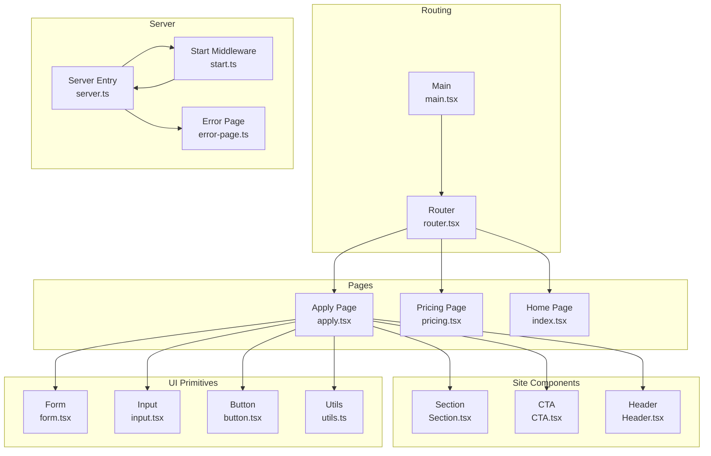
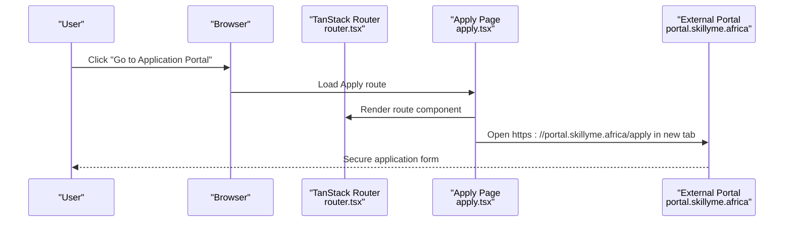
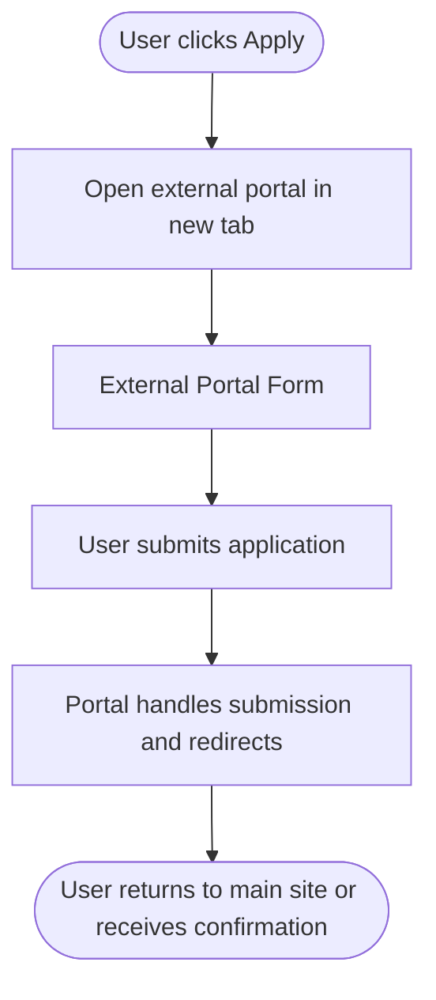
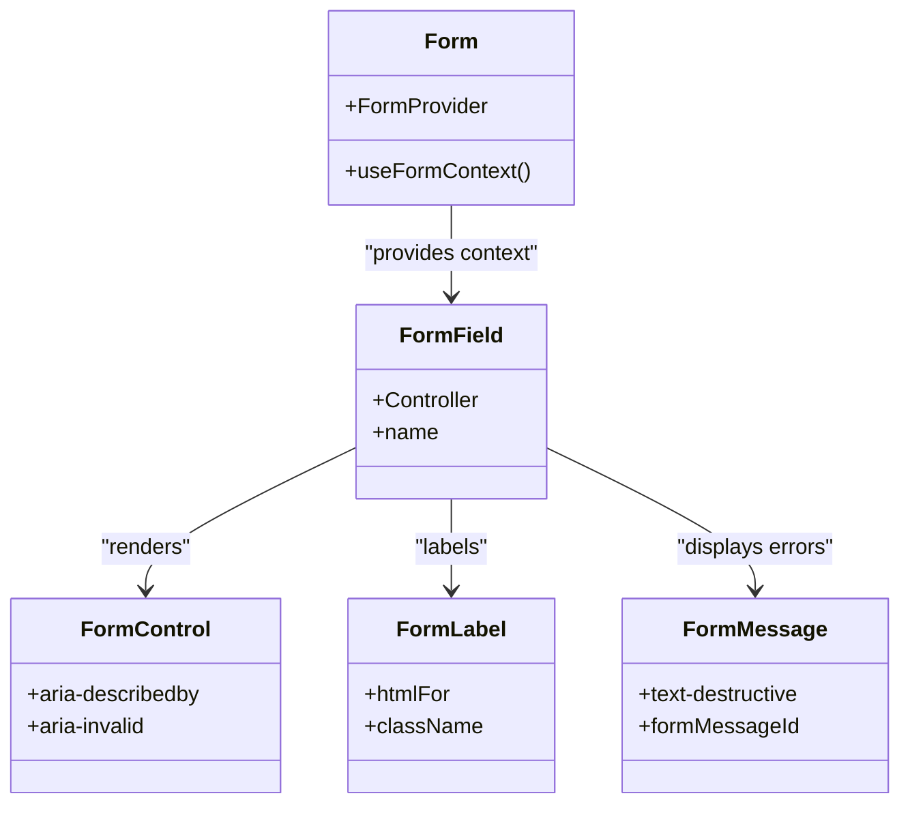
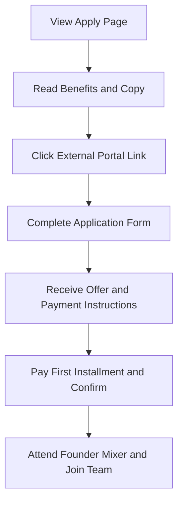
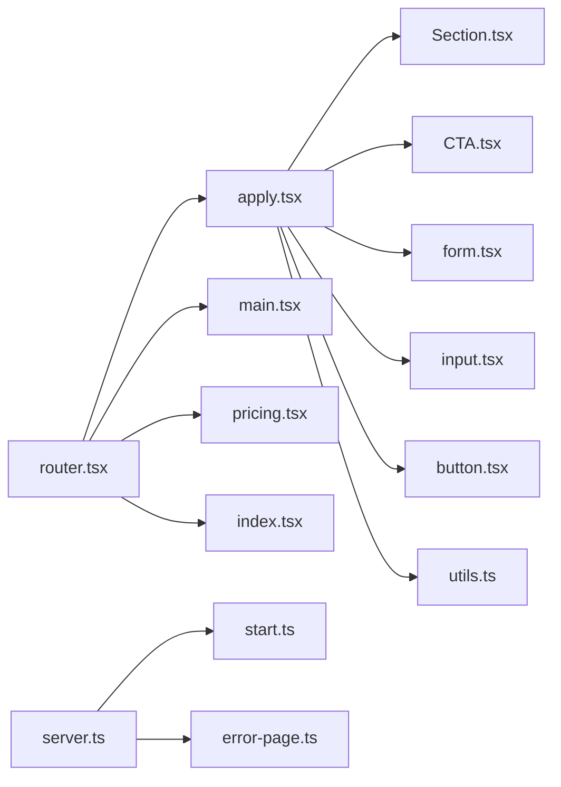

# Application Page

<cite>
**Referenced Files in This Document**
- [apply.tsx](file://src/routes/apply.tsx)
- [Section.tsx](file://src/components/site/Section.tsx)
- [CTA.tsx](file://src/components/site/CTA.tsx)
- [Header.tsx](file://src/components/site/Header.tsx)
- [form.tsx](file://src/components/ui/form.tsx)
- [input.tsx](file://src/components/ui/input.tsx)
- [button.tsx](file://src/components/ui/button.tsx)
- [utils.ts](file://src/lib/utils.ts)
- [router.tsx](file://src/router.tsx)
- [main.tsx](file://src/main.tsx)
- [server.ts](file://src/server.ts)
- [start.ts](file://src/start.ts)
- [error-page.ts](file://src/lib/error-page.ts)
- [pricing.tsx](file://src/routes/pricing.tsx)
- [index.tsx](file://src/routes/index.tsx)
- [use-mobile.tsx](file://src/hooks/use-mobile.tsx)
</cite>

## Table of Contents
1. [Introduction](#introduction)
2. [Project Structure](#project-structure)
3. [Core Components](#core-components)
4. [Architecture Overview](#architecture-overview)
5. [Detailed Component Analysis](#detailed-component-analysis)
6. [Dependency Analysis](#dependency-analysis)
7. [Performance Considerations](#performance-considerations)
8. [Troubleshooting Guide](#troubleshooting-guide)
9. [Conclusion](#conclusion)

## Introduction
This document describes the Application Page component that serves as the centralized entry point for participant registration and program enrollment. It explains how the page integrates with the external portal service portal.skillyme.africa, how it guides users through the application workflow, and how it supports both individual and team applications. It also covers form validation strategies, responsive design, accessibility, and security considerations for handling sensitive participant data.

## Project Structure
The Application Page is implemented as a TanStack Router file route and composes reusable UI components for layout, typography, and interactive elements. It links to the external portal via a secure HTTPS URL and leverages shared UI primitives for consistent styling and accessibility.

**Diagram sources**
- [router.tsx:1-17](file://src/router.tsx#L1-L17)
- [main.tsx:1-21](file://src/main.tsx#L1-L21)
- [apply.tsx:1-70](file://src/routes/apply.tsx#L1-L70)
- [Section.tsx:1-44](file://src/components/site/Section.tsx#L1-L44)
- [CTA.tsx:1-26](file://src/components/site/CTA.tsx#L1-L26)
- [Header.tsx:38-83](file://src/components/site/Header.tsx#L38-L83)
- [form.tsx:1-172](file://src/components/ui/form.tsx#L1-L172)
- [input.tsx:1-23](file://src/components/ui/input.tsx#L1-L23)
- [button.tsx:1-50](file://src/components/ui/button.tsx#L1-L50)
- [utils.ts:1-7](file://src/lib/utils.ts#L1-L7)
- [server.ts:1-81](file://src/server.ts#L1-L81)
- [start.ts:1-23](file://src/start.ts#L1-L23)
- [error-page.ts:1-30](file://src/lib/error-page.ts#L1-L30)

**Section sources**
- [apply.tsx:1-70](file://src/routes/apply.tsx#L1-L70)
- [router.tsx:1-17](file://src/router.tsx#L1-L17)
- [main.tsx:1-21](file://src/main.tsx#L1-L21)

## Core Components
- Application Page route: Defines metadata, renders hero content, and provides a prominent call-to-action linking to the external portal.
- Site components: Section, Eyebrow, and H2 provide consistent layout and typography.
- CTA components: Provide styled buttons that open the external portal in a new tab.
- UI primitives: Form, Input, and Button primitives support validation and accessibility.
- Utilities: Tailwind merging and class composition utilities ensure consistent styling.

Key responsibilities:
- Present application copy and benefits.
- Provide a secure link to the external portal.
- Compose reusable layout and form components.

**Section sources**
- [apply.tsx:1-70](file://src/routes/apply.tsx#L1-L70)
- [Section.tsx:1-44](file://src/components/site/Section.tsx#L1-L44)
- [CTA.tsx:1-26](file://src/components/site/CTA.tsx#L1-L26)
- [form.tsx:1-172](file://src/components/ui/form.tsx#L1-L172)
- [input.tsx:1-23](file://src/components/ui/input.tsx#L1-L23)
- [button.tsx:1-50](file://src/components/ui/button.tsx#L1-L50)
- [utils.ts:1-7](file://src/lib/utils.ts#L1-L7)

## Architecture Overview
The Application Page is a client-rendered route that delegates form submission to an external portal. The routing framework initializes a router with a query client and scroll restoration. The server entry normalizes SSR errors and renders a branded error page when necessary.

**Diagram sources**
- [apply.tsx:54-61](file://src/routes/apply.tsx#L54-L61)
- [router.tsx:5-16](file://src/router.tsx#L5-L16)
- [main.tsx:7-20](file://src/main.tsx#L7-L20)

## Detailed Component Analysis

### Application Page Route
The Apply route configures SEO metadata and renders a hero section with benefits, followed by a centered call-to-action that opens the external portal in a new tab. It uses site components for typography and layout.

Implementation highlights:
- Uses a constant external portal URL for consistent linking.
- Provides structured metadata for social sharing and SEO.
- Renders a prominent gradient-styled button with an external link icon.

Responsive and accessibility considerations:
- Centered layout with max widths ensures readability on mobile and desktop.
- Semantic heading hierarchy and text contrast for readability.
- New tab link with noreferrer for security and privacy.

**Section sources**
- [apply.tsx:5-17](file://src/routes/apply.tsx#L5-L17)
- [apply.tsx:19-69](file://src/routes/apply.tsx#L19-L69)
- [Section.tsx:31-43](file://src/components/site/Section.tsx#L31-L43)

### External Portal Integration
The page integrates with the external portal by opening a secure HTTPS URL in a new browser tab. This pattern ensures:
- The application form runs in a trusted, secure environment.
- The main site remains lightweight and focused on onboarding.
- Users can easily navigate back to the main site.

**Diagram sources**
- [apply.tsx:54-61](file://src/routes/apply.tsx#L54-L61)

**Section sources**
- [apply.tsx:54-61](file://src/routes/apply.tsx#L54-L61)

### Form Validation Strategies
Although the form itself resides on the external portal, the shared UI primitives support robust validation patterns:
- Form context and field-level validation using react-hook-form patterns.
- Accessible labeling and error messaging with ARIA attributes.
- Controlled components with proper state propagation.

**Diagram sources**
- [form.tsx:16-171](file://src/components/ui/form.tsx#L16-L171)

**Section sources**
- [form.tsx:16-171](file://src/components/ui/form.tsx#L16-L171)

### Participant Onboarding and Workflow Management
The application workflow is designed around three stages:
- Discovery and awareness: Hero copy and benefits highlight time commitment, cost, and IP retention.
- Submission: External portal link directs users to a secure form.
- Confirmation: The pricing page outlines steps, policies, and schedules for payment and acceptance.

**Diagram sources**
- [apply.tsx:31-33](file://src/routes/apply.tsx#L31-L33)
- [pricing.tsx:55-63](file://src/routes/pricing.tsx#L55-L63)

**Section sources**
- [apply.tsx:31-33](file://src/routes/apply.tsx#L31-L33)
- [pricing.tsx:55-63](file://src/routes/pricing.tsx#L55-L63)

### Responsive Design and Accessibility
Responsive design:
- Max widths and padding ensure content remains readable across devices.
- Mobile-first spacing and typography scales appropriately on larger screens.

Accessibility:
- Proper heading hierarchy and semantic markup.
- ARIA attributes on form controls for assistive technologies.
- Focus states and keyboard navigability supported by shared UI primitives.

**Section sources**
- [apply.tsx:22-46](file://src/routes/apply.tsx#L22-L46)
- [Section.tsx:14-29](file://src/components/site/Section.tsx#L14-L29)
- [form.tsx:103-118](file://src/components/ui/form.tsx#L103-L118)

### Security Measures for Sensitive Data
Security considerations:
- All links to the external portal use HTTPS.
- Links open in a new tab with noreferrer for privacy and security.
- The main site does not handle sensitive form data; the portal is responsible for data protection and compliance.

**Section sources**
- [apply.tsx:54-61](file://src/routes/apply.tsx#L54-L61)
- [Header.tsx:38-54](file://src/components/site/Header.tsx#L38-L54)

### Examples: Individual vs Team Applications
The pricing page documents two application models:
- Individual: Single applicant pays installments upon acceptance.
- Team of Five: Pre-formed team applies together as a unit; if team composition changes during matching, members revert to individual rates.

These scenarios are facilitated by the external portal’s form and matching process, while the main site provides clear policy and step-by-step guidance.

**Section sources**
- [pricing.tsx:21-43](file://src/routes/pricing.tsx#L21-L43)
- [pricing.tsx:65-72](file://src/routes/pricing.tsx#L65-L72)

## Dependency Analysis
The Application Page depends on:
- Routing infrastructure for page rendering and context.
- UI primitives for form handling and accessibility.
- Shared utilities for styling and composition.
- External portal for form processing and confirmation workflows.

**Diagram sources**
- [apply.tsx:1-70](file://src/routes/apply.tsx#L1-L70)
- [router.tsx:1-17](file://src/router.tsx#L1-L17)
- [main.tsx:1-21](file://src/main.tsx#L1-21)
- [Section.tsx:1-44](file://src/components/site/Section.tsx#L1-L44)
- [CTA.tsx:1-26](file://src/components/site/CTA.tsx#L1-L26)
- [form.tsx:1-172](file://src/components/ui/form.tsx#L1-L172)
- [input.tsx:1-23](file://src/components/ui/input.tsx#L1-L23)
- [button.tsx:1-50](file://src/components/ui/button.tsx#L1-L50)
- [utils.ts:1-7](file://src/lib/utils.ts#L1-L7)
- [pricing.tsx:1-208](file://src/routes/pricing.tsx#L1-L208)
- [index.tsx:333-346](file://src/routes/index.tsx#L333-L346)
- [server.ts:1-81](file://src/server.ts#L1-L81)
- [start.ts:1-23](file://src/start.ts#L1-L23)
- [error-page.ts:1-30](file://src/lib/error-page.ts#L1-L30)

**Section sources**
- [apply.tsx:1-70](file://src/routes/apply.tsx#L1-L70)
- [router.tsx:1-17](file://src/router.tsx#L1-L17)
- [main.tsx:1-21](file://src/main.tsx#L1-L21)
- [server.ts:1-81](file://src/server.ts#L1-L81)
- [start.ts:1-23](file://src/start.ts#L1-L23)

## Performance Considerations
- Keep the main page lightweight by delegating form processing to the external portal.
- Use lazy loading and minimal JavaScript on the landing page.
- Optimize images and icons; leverage SVGs for crisp rendering across resolutions.
- Ensure fast initial page loads by deferring non-critical resources.

## Troubleshooting Guide
Common issues and resolutions:
- External portal link not opening: Verify HTTPS URL and ensure the link targets a new tab with noreferrer.
- Form accessibility errors: Confirm ARIA attributes and labels are applied via the shared form primitives.
- SSR errors: The server entry normalizes catastrophic SSR responses and renders a branded error page.

**Section sources**
- [apply.tsx:54-61](file://src/routes/apply.tsx#L54-L61)
- [form.tsx:103-118](file://src/components/ui/form.tsx#L103-L118)
- [server.ts:28-67](file://src/server.ts#L28-L67)
- [error-page.ts:1-30](file://src/lib/error-page.ts#L1-L30)

## Conclusion
The Application Page provides a streamlined, secure, and accessible pathway for participants to begin their application journey. By integrating with the external portal and leveraging reusable UI primitives, it ensures a consistent experience across devices while maintaining strong security and accessibility practices. The accompanying pages clarify the application workflow, policies, and payment schedules, supporting successful onboarding for both individual and team applicants.