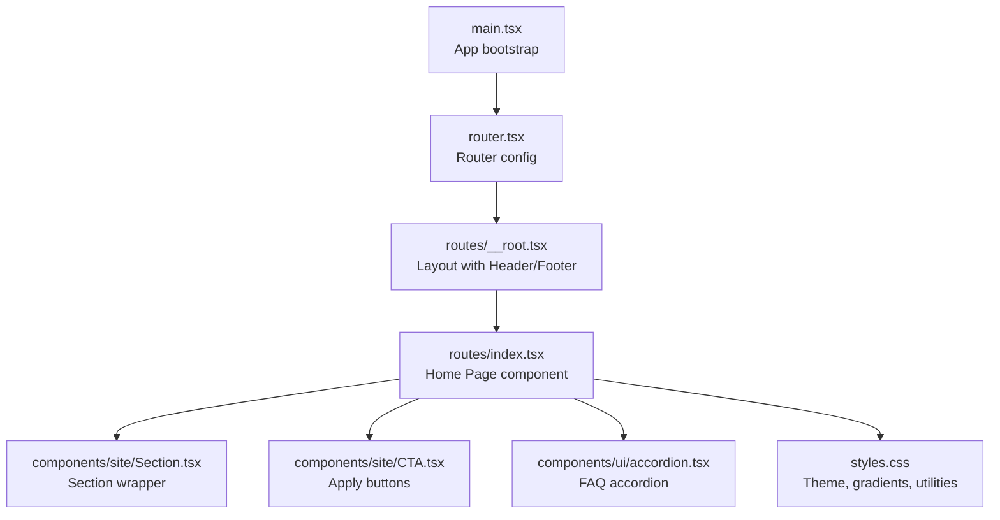
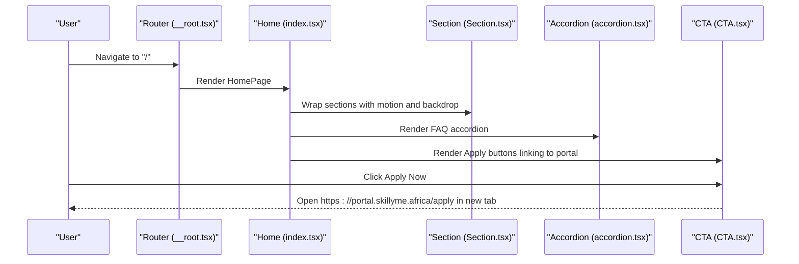
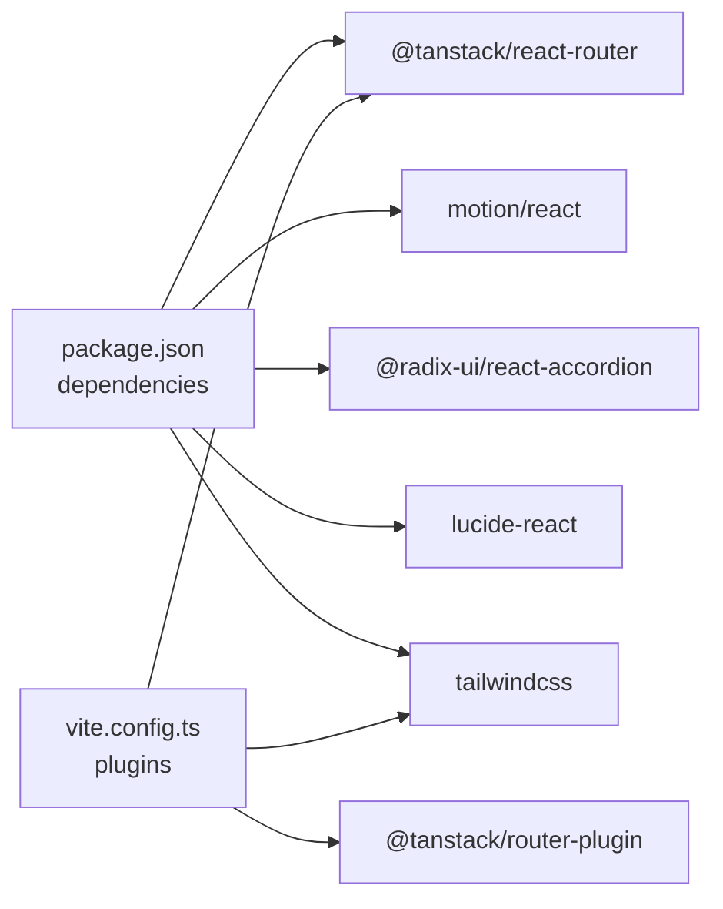

# Home Page

<cite>
**Referenced Files in This Document**
- [index.tsx](file://src/routes/index.tsx)
- [CTA.tsx](file://src/components/site/CTA.tsx)
- [Section.tsx](file://src/components/site/Section.tsx)
- [accordion.tsx](file://src/components/ui/accordion.tsx)
- [Header.tsx](file://src/components/site/Header.tsx)
- [Footer.tsx](file://src/components/site/Footer.tsx)
- [styles.css](file://src/styles.css)
- [main.tsx](file://src/main.tsx)
- [router.tsx](file://src/router.tsx)
- [__root.tsx](file://src/routes/__root.tsx)
- [use-mobile.tsx](file://src/hooks/use-mobile.tsx)
- [utils.ts](file://src/lib/utils.ts)
- [package.json](file://package.json)
- [vite.config.ts](file://vite.config.ts)
</cite>

## Table of Contents
1. [Introduction](#introduction)
2. [Project Structure](#project-structure)
3. [Core Components](#core-components)
4. [Architecture Overview](#architecture-overview)
5. [Detailed Component Analysis](#detailed-component-analysis)
6. [Dependency Analysis](#dependency-analysis)
7. [Performance Considerations](#performance-considerations)
8. [Troubleshooting Guide](#troubleshooting-guide)
9. [Conclusion](#conclusion)

## Introduction
This document describes the Home Page component for Skillyme Africa’s Cohort 2 Build Track program. It explains the hero section with gradient backgrounds and animations, trust indicators and statistics, the three-stage group selection system, differentiators, six-week journey timeline, outcomes showcase, key dates calendar, pricing preview, FAQ accordion, and application call-to-action. It also documents component composition patterns, Motion animations, responsive design, integration with shared site components, data structures, external portal integration, SEO metadata, and performance optimization.

## Project Structure
The Home Page is implemented as a TanStack Router file route under src/routes/index.tsx. It composes reusable site components and UI primitives from src/components/site and src/components/ui. Global styles and theme tokens are defined in src/styles.css. The app is bootstrapped in main.tsx and configured via router.tsx and vite.config.ts.

**Diagram sources**
- [main.tsx:1-21](file://src/main.tsx#L1-L21)
- [router.tsx:1-17](file://src/router.tsx#L1-L17)
- [__root.tsx:1-61](file://src/routes/__root.tsx#L1-L61)
- [index.tsx:1-350](file://src/routes/index.tsx#L1-L350)
- [Section.tsx:1-44](file://src/components/site/Section.tsx#L1-L44)
- [CTA.tsx:1-27](file://src/components/site/CTA.tsx#L1-L27)
- [accordion.tsx:1-52](file://src/components/ui/accordion.tsx#L1-L52)
- [styles.css:1-136](file://src/styles.css#L1-L136)

**Section sources**
- [main.tsx:1-21](file://src/main.tsx#L1-L21)
- [router.tsx:1-17](file://src/router.tsx#L1-L17)
- [__root.tsx:1-61](file://src/routes/__root.tsx#L1-L61)
- [index.tsx:1-350](file://src/routes/index.tsx#L1-L350)
- [styles.css:1-136](file://src/styles.css#L1-L136)

## Core Components
- Hero section with image background, gradient overlay, animated entrance, and CTA buttons.
- Trust indicators grid showcasing program guarantees.
- Three-stage group selection cards with “This is me” affordance and external application links.
- Differentiators grid with Lucide icons and concise value statements.
- Six-week journey timeline cards with week numbering and descriptions.
- Outcome showcase with benefit items.
- Key dates calendar and free intro session promotion.
- Pricing preview with tiered options and link to full pricing.
- FAQ accordion system with collapsible items.
- Application call-to-action centered block with external portal link.

**Section sources**
- [index.tsx:98-349](file://src/routes/index.tsx#L98-L349)

## Architecture Overview
The Home Page leverages:
- Motion for scroll-triggered animations and entrance effects.
- Shared site components for consistent spacing and typography.
- Radix UI accordion for accessible, animated FAQs.
- Tailwind-based theme tokens and utilities for gradients, shadows, and responsive layouts.
- External portal integration via anchor links to the application system.

**Diagram sources**
- [__root.tsx:49-61](file://src/routes/__root.tsx#L49-L61)
- [index.tsx:98-349](file://src/routes/index.tsx#L98-L349)
- [Section.tsx:4-29](file://src/components/site/Section.tsx#L4-L29)
- [accordion.tsx:1-52](file://src/components/ui/accordion.tsx#L1-L52)
- [CTA.tsx:5-17](file://src/components/site/CTA.tsx#L5-L17)

## Detailed Component Analysis

### Hero Section
- Background: Full-viewport image with gradient overlay for readability.
- Animated entrance: Title and content fade-in and lift using Motion.
- CTA: Primary application button opens the external portal in a new tab; secondary link scrolls to “How It Works”.

Implementation highlights:
- Gradient text and subtle text glow for emphasis.
- Responsive typography and spacing for mobile and desktop.
- Motion initial/animated transitions for entrance.

**Section sources**
- [index.tsx:102-148](file://src/routes/index.tsx#L102-L148)
- [styles.css:75-78](file://src/styles.css#L75-L78)

### Trust Indicators Grid
- Six program guarantees displayed in a responsive grid.
- Uses elevated surface and accent color for visibility.

**Section sources**
- [index.tsx:154-160](file://src/routes/index.tsx#L154-L160)

### Selection Section
- Describes selectivity and free application policy.
- Includes a highlighted card with gradient accent.

**Section sources**
- [index.tsx:163-183](file://src/routes/index.tsx#L163-L183)

### Three-Stage Group Selection
- Three group cards with stage number, name, who-it’s-for, and value proposition.
- Each card includes an external application link to the portal.

Data model:
- Array of objects with keys: n, name, who, value.

**Section sources**
- [index.tsx:189-210](file://src/routes/index.tsx#L189-L210)
- [index.tsx:29-33](file://src/routes/index.tsx#L29-L33)

### Differentiators Section
- Icon-driven cards highlighting program uniqueness.
- Icons imported from Lucide and rendered per item.

Data model:
- Array of objects with keys: icon, title, sub.

**Section sources**
- [index.tsx:213-225](file://src/routes/index.tsx#L213-L225)
- [index.tsx:35-42](file://src/routes/index.tsx#L35-L42)

### Six-Week Journey Timeline
- Six timeline cards representing each week with title and description.
- Subtle numbering and typography hierarchy.

Data model:
- Array of objects with keys: w, t, d.

**Section sources**
- [index.tsx:228-244](file://src/routes/index.tsx#L228-L244)
- [index.tsx:44-51](file://src/routes/index.tsx#L44-L51)

### Outcome Showcase
- List of tangible outcomes with checkmark icons.

Data model:
- Array of strings.

**Section sources**
- [index.tsx:247-258](file://src/routes/index.tsx#L247-L258)
- [index.tsx:53-63](file://src/routes/index.tsx#L53-L63)

### Key Dates Calendar
- Step-by-step timeline with date and description.
- Prominent free intro session card with registration link placeholder.

Data model:
- Array of objects with keys: d, t.

**Section sources**
- [index.tsx:261-292](file://src/routes/index.tsx#L261-L292)
- [index.tsx:65-72](file://src/routes/index.tsx#L65-L72)

### Pricing Preview
- Tiered pricing cards with name, price, and subtext.
- Additional explanatory note and link to full pricing.

Data model:
- Array of objects with keys: name, price, sub.

**Section sources**
- [index.tsx:295-315](file://src/routes/index.tsx#L295-L315)
- [index.tsx:74-78](file://src/routes/index.tsx#L74-L78)

### FAQ Accordion
- Single-expand accordion built with Radix UI primitives.
- Uses Motion for section entrance and custom chevron icon.

Data model:
- Array of arrays, each containing [question, answer].

**Section sources**
- [index.tsx:318-331](file://src/routes/index.tsx#L318-L331)
- [index.tsx:80-94](file://src/routes/index.tsx#L80-L94)
- [accordion.tsx:1-52](file://src/components/ui/accordion.tsx#L1-L52)

### Application Call-to-Action
- Centered block with eyebrow, headline, description, and CTA.
- External link opens the application portal.

**Section sources**
- [index.tsx:334-346](file://src/routes/index.tsx#L334-L346)

### Animation and Motion Patterns
- Hero entrance: Motion with opacity/y transition.
- Section entrance: Motion with viewport-triggered in-view animation.
- Accordion: Radix UI animations for expand/collapse.

**Section sources**
- [index.tsx:114-118](file://src/routes/index.tsx#L114-L118)
- [Section.tsx:18-26](file://src/components/site/Section.tsx#L18-L26)
- [accordion.tsx:41-48](file://src/components/ui/accordion.tsx#L41-L48)

### Responsive Design Strategies
- Tailwind utilities for responsive grids and typography.
- Mobile-first layout with breakpoints for tablets and desktops.
- Utility classes for spacing and padding normalization.

**Section sources**
- [styles.css:127-129](file://src/styles.css#L127-L129)
- [Section.tsx:17-26](file://src/components/site/Section.tsx#L17-L26)

### Integration with Shared Site Components
- Section wrapper for consistent spacing and motion.
- Eyebrow and H2 helpers for typography.
- ApplyButton for unified CTA styling and portal link.

**Section sources**
- [Section.tsx:4-44](file://src/components/site/Section.tsx#L4-L44)
- [CTA.tsx:5-17](file://src/components/site/CTA.tsx#L5-L17)
- [Header.tsx:13-84](file://src/components/site/Header.tsx#L13-L84)
- [Footer.tsx:3-44](file://src/components/site/Footer.tsx#L3-L44)

### External Portal Integration
- All application-related links target the external portal URL.
- ApplyButton centralizes the portal URL and link behavior.

**Section sources**
- [CTA.tsx:3-17](file://src/components/site/CTA.tsx#L3-L17)
- [Header.tsx:39-54](file://src/components/site/Header.tsx#L39-L54)
- [index.tsx:200-206](file://src/routes/index.tsx#L200-L206)
- [index.tsx:341](file://src/routes/index.tsx#L341)

### SEO Meta Tags Configuration
- Head metadata configured at the route level with title and description.

**Section sources**
- [index.tsx:15-22](file://src/routes/index.tsx#L15-L22)

## Dependency Analysis
- Runtime dependencies include React, TanStack Router, Motion, Radix UI, and Tailwind-based theme system.
- Build-time dependencies include Vite, React plugin, TanStack Router plugin, and Tailwind CSS.

**Diagram sources**
- [package.json:14-66](file://package.json#L14-L66)
- [vite.config.ts:7-15](file://vite.config.ts#L7-L15)

**Section sources**
- [package.json:14-66](file://package.json#L14-L66)
- [vite.config.ts:7-15](file://vite.config.ts#L7-L15)

## Performance Considerations
- Auto code-splitting enabled in TanStack Router plugin to reduce initial bundle size.
- Deduplication of React packages in Vite resolver to avoid multiple instances.
- Motion animations are scoped to viewport-triggered sections to minimize unnecessary re-renders.
- CSS utilities and theme tokens centralized to reduce duplication and improve caching.

[No sources needed since this section provides general guidance]

## Troubleshooting Guide
- If Motion animations do not trigger, verify viewport options and ensure the container is in view.
- If accordion does not expand/collapse, confirm Radix UI classes and data-state attributes are intact.
- If external links fail to open, verify the portal URL and target attributes.
- If layout shifts occur on mobile, review responsive grid classes and ensure consistent padding.

**Section sources**
- [Section.tsx:18-26](file://src/components/site/Section.tsx#L18-L26)
- [accordion.tsx:21-34](file://src/components/ui/accordion.tsx#L21-L34)
- [CTA.tsx:8-16](file://src/components/site/CTA.tsx#L8-L16)

## Conclusion
The Home Page composes a cohesive, outcome-focused narrative around the Build Track program. It leverages Motion for engaging micro-interactions, Radix UI for accessible components, and a consistent design system to communicate trust, clarity, and urgency. The external portal integration ensures seamless application flow, while SEO metadata and responsive design strategies support discoverability and accessibility across devices.