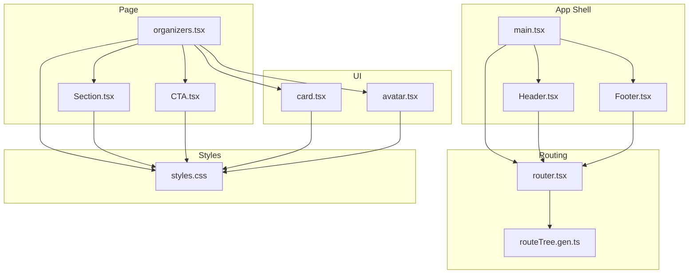
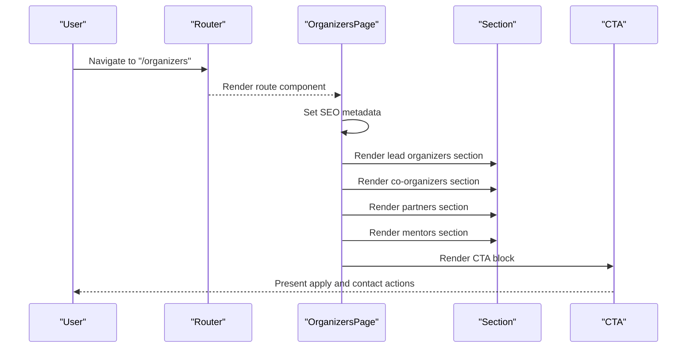
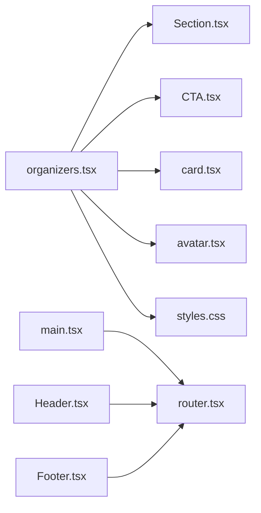

# Organizers Page

<cite>
**Referenced Files in This Document**
- [organizers.tsx](file://src/routes/organizers.tsx)
- [Section.tsx](file://src/components/site/Section.tsx)
- [Header.tsx](file://src/components/site/Header.tsx)
- [Footer.tsx](file://src/components/site/Footer.tsx)
- [CTA.tsx](file://src/components/site/CTA.tsx)
- [card.tsx](file://src/components/ui/card.tsx)
- [avatar.tsx](file://src/components/ui/avatar.tsx)
- [styles.css](file://src/styles.css)
- [router.tsx](file://src/router.tsx)
- [main.tsx](file://src/main.tsx)
</cite>

## Table of Contents
1. [Introduction](#introduction)
2. [Project Structure](#project-structure)
3. [Core Components](#core-components)
4. [Architecture Overview](#architecture-overview)
5. [Detailed Component Analysis](#detailed-component-analysis)
6. [Dependency Analysis](#dependency-analysis)
7. [Performance Considerations](#performance-considerations)
8. [Accessibility and Content Management](#accessibility-and-content-management)
9. [Integration and Social Presence](#integration-and-social-presence)
10. [Conclusion](#conclusion)

## Introduction
This document describes the Organizers Page component that presents program leadership, facilitation team, organizational partners, and governance-related information. It explains how team member profiles and roles are rendered, how organizational hierarchy is visualized, and how partnership acknowledgments are presented. It also documents responsive design patterns for team grids, profile cards, and partner logos, along with content management strategies, accessibility considerations, and integration with social and professional networks. The goal is to help stakeholders understand how the page builds credibility and trust through transparent representation of the team and structure.

## Project Structure
The Organizers Page is implemented as a file-route under the routing system and composes reusable site and UI components. The page is structured into clearly defined sections for Lead Organizers, Co-organizers and Core Facilitators, Program Partners, Mentors and Specialists, and a Contact/CTA block. Styling leverages a shared design system with gradients, glass-like backgrounds, and responsive grid layouts.

**Diagram sources**
- [router.tsx:1-17](file://src/router.tsx#L1-L17)
- [main.tsx:1-21](file://src/main.tsx#L1-L21)
- [organizers.tsx:1-179](file://src/routes/organizers.tsx#L1-L179)
- [Section.tsx:1-44](file://src/components/site/Section.tsx#L1-L44)
- [CTA.tsx:1-27](file://src/components/site/CTA.tsx#L1-L27)
- [card.tsx:1-56](file://src/components/ui/card.tsx#L1-L56)
- [avatar.tsx:1-48](file://src/components/ui/avatar.tsx#L1-L48)
- [styles.css:1-136](file://src/styles.css#L1-L136)

**Section sources**
- [router.tsx:1-17](file://src/router.tsx#L1-L17)
- [main.tsx:1-21](file://src/main.tsx#L1-L21)
- [organizers.tsx:1-179](file://src/routes/organizers.tsx#L1-L179)

## Core Components
- Organizers Page route and layout: Implements SEO metadata, sectioned content blocks, and responsive grids.
- Section wrapper: Provides consistent spacing, backdrop effects, and animated entrance.
- CTA block: Encapsulates call-to-action messaging and buttons.
- Card and Avatar: Provide reusable presentation primitives for team and partner entries.

Key implementation patterns:
- Responsive grids for team cards and mentor grids.
- Gradient accents and glass-like backgrounds for depth and brand consistency.
- Semantic headings and eyebrow labels for content hierarchy.
- Links to external profiles and websites with clear affordances.

**Section sources**
- [organizers.tsx:6-179](file://src/routes/organizers.tsx#L6-L179)
- [Section.tsx:4-29](file://src/components/site/Section.tsx#L4-L29)
- [CTA.tsx:5-26](file://src/components/site/CTA.tsx#L5-L26)
- [card.tsx:5-14](file://src/components/ui/card.tsx#L5-L14)
- [avatar.tsx:8-18](file://src/components/ui/avatar.tsx#L8-L18)

## Architecture Overview
The Organizers Page composes site-level sections and UI primitives to render a cohesive, branded experience. Routing integrates with the app shell, while styles define theme tokens and visual behaviors.

**Diagram sources**
- [organizers.tsx:6-179](file://src/routes/organizers.tsx#L6-L179)
- [Section.tsx:4-29](file://src/components/site/Section.tsx#L4-L29)
- [CTA.tsx:19-26](file://src/components/site/CTA.tsx#L19-L26)
- [router.tsx:5-16](file://src/router.tsx#L5-L16)

## Detailed Component Analysis

### Lead Organizers Section
Purpose:
- Showcase the two lead organizers with photo placeholders, names, titles, and short bios.
- Provide quick links to LinkedIn and external sites.

Implementation highlights:
- Uses a two-column grid on medium screens and above.
- Each card includes a gradient placeholder for photos and social links styled with gradient accents.
- Eyebrow and H2 components establish content hierarchy.

Responsive behavior:
- Grid adjusts from single column on small screens to two columns on medium and larger.

Accessibility:
- Photo placeholders include aria labels for screen readers.

**Section sources**
- [organizers.tsx:33-61](file://src/routes/organizers.tsx#L33-L61)
- [Section.tsx:31-43](file://src/components/site/Section.tsx#L31-L43)

### Co-organizers and Core Facilitators Section
Purpose:
- Present organizational partners and their lead/core facilitators.
- Visualize team composition per partner with dynamic slot counts.

Implementation highlights:
- Each partner entry includes a logo area, name, role, and description.
- A collapsible team grid appears beneath each partner entry, sized by the number of slots.
- Team cards show individual facilitators with gradient avatars and optional LinkedIn links.

Responsive behavior:
- Team grid scales from 1 to 4 columns depending on slot count.
- On small screens, cards stack vertically with constrained max width for readability.

Accessibility:
- Logo containers include concise textual placeholders for assistive tech.
- Role and name are semantically marked up for clarity.

**Section sources**
- [organizers.tsx:63-115](file://src/routes/organizers.tsx#L63-L115)

### Program Partners Section
Purpose:
- Acknowledge strategic partners and their contributions.
- Provide partner branding and value propositions.

Implementation highlights:
- Three-column layout on medium screens and above.
- Includes a prominent logo area, partner name and role, description, and action links.

Responsive behavior:
- Adjusts to stacked layout on smaller screens for legibility.

**Section sources**
- [organizers.tsx:117-143](file://src/routes/organizers.tsx#L117-L143)

### Mentors and Specialists Section
Purpose:
- Introduce the curated pool of mentors and specialists.
- Signal ongoing additions with a “coming soon” note.

Implementation highlights:
- Four-column grid on medium screens and above.
- Each mentor card includes avatar, name, and area of expertise.
- Placeholder links to LinkedIn for each mentor.

Responsive behavior:
- Grid adapts from two columns on small screens to four on larger ones.

**Section sources**
- [organizers.tsx:145-165](file://src/routes/organizers.tsx#L145-L165)

### Contact and CTA Block
Purpose:
- Provide a clear pathway for inquiries and applications.
- Reinforce contact information and next steps.

Implementation highlights:
- Centered CTA block with heading and action buttons.
- Includes a mail link and an application button.

**Section sources**
- [organizers.tsx:167-175](file://src/routes/organizers.tsx#L167-L175)
- [CTA.tsx:19-26](file://src/components/site/CTA.tsx#L19-L26)

### Section Wrapper and Motion Entrance
Purpose:
- Standardize spacing, backdrop blur, and entrance animations across sections.

Implementation highlights:
- Two tone variants: deep and elev, enabling layered backgrounds.
- Motion animation triggers on viewport entry with a smooth fade and subtle upward movement.

**Section sources**
- [Section.tsx:4-29](file://src/components/site/Section.tsx#L4-L29)

### Card and Avatar Primitives
Purpose:
- Provide reusable, accessible containers and image placeholders.

Implementation highlights:
- Card component exposes header, title, description, content, and footer slots.
- Avatar supports fallback visuals and client-side rendering.

**Section sources**
- [card.tsx:5-55](file://src/components/ui/card.tsx#L5-L55)
- [avatar.tsx:8-47](file://src/components/ui/avatar.tsx#L8-L47)

## Dependency Analysis
The Organizers Page depends on:
- Routing system for page registration and metadata.
- Site components for consistent sectioning and CTAs.
- UI primitives for cards and avatars.
- Shared styles for theme tokens, gradients, and responsive utilities.

**Diagram sources**
- [organizers.tsx:1-179](file://src/routes/organizers.tsx#L1-L179)
- [Section.tsx:1-44](file://src/components/site/Section.tsx#L1-L44)
- [CTA.tsx:1-27](file://src/components/site/CTA.tsx#L1-L27)
- [card.tsx:1-56](file://src/components/ui/card.tsx#L1-L56)
- [avatar.tsx:1-48](file://src/components/ui/avatar.tsx#L1-L48)
- [styles.css:1-136](file://src/styles.css#L1-L136)
- [router.tsx:1-17](file://src/router.tsx#L1-L17)
- [main.tsx:1-21](file://src/main.tsx#L1-L21)
- [Header.tsx:1-84](file://src/components/site/Header.tsx#L1-L84)
- [Footer.tsx:1-44](file://src/components/site/Footer.tsx#L1-L44)

**Section sources**
- [organizers.tsx:1-179](file://src/routes/organizers.tsx#L1-L179)
- [router.tsx:1-17](file://src/router.tsx#L1-L17)
- [main.tsx:1-21](file://src/main.tsx#L1-L21)

## Performance Considerations
- Minimize heavy images: Use gradient placeholders for profile avatars to reduce bandwidth and improve perceived load speed.
- Keep grid layouts responsive: Avoid excessive nested grids; maintain reasonable card counts per row for mobile.
- Lazy loading: Consider deferring non-critical partner logos and mentor placeholders until in-view.
- CSS performance: Utilize prebuilt theme tokens and avoid runtime style recomputation.

## Accessibility and Content Management
Accessibility:
- Alt text and aria labels: Replace placeholder labels with descriptive text for photos and logos.
- Focus management: Ensure focus indicators are visible on interactive elements (links, buttons).
- Contrast and readability: Verify sufficient contrast for text on glass backgrounds and gradients.
- Semantic structure: Use headings and eyebrow labels consistently to aid screen reader navigation.

Content management:
- Centralize copy: Store key phrases and bios in a content management layer to streamline updates.
- Dynamic slots: Use data-driven arrays for team members and slots to simplify scaling.
- Metadata: Maintain SEO metadata in the route head configuration for accurate social previews.

**Section sources**
- [organizers.tsx:7-14](file://src/routes/organizers.tsx#L7-L14)
- [organizers.tsx:41](file://src/routes/organizers.tsx#L41)
- [organizers.tsx:85](file://src/routes/organizers.tsx#L85)

## Integration and Social Presence
- Professional networks: Provide direct links to LinkedIn profiles and personal sites for team members and partners.
- Website integration: Include official partner websites and social channels for visibility and engagement.
- Email contact: Offer a clear contact email link for inquiries.
- Application portal: Connect users to the application process via prominent CTAs.

**Section sources**
- [organizers.tsx:50-57](file://src/routes/organizers.tsx#L50-L57)
- [organizers.tsx:91-93](file://src/routes/organizers.tsx#L91-L93)
- [organizers.tsx:133-139](file://src/routes/organizers.tsx#L133-L139)
- [organizers.tsx:168-171](file://src/routes/organizers.tsx#L168-L171)
- [CTA.tsx:5-17](file://src/components/site/CTA.tsx#L5-L17)

## Conclusion
The Organizers Page effectively communicates program leadership and structure through a modular, responsive design. By leveraging reusable components, consistent theming, and clear content sections, it establishes trust through transparency and builds credibility by showcasing real people and partners. With thoughtful accessibility and content management practices, the page remains maintainable and impactful across devices and user needs.