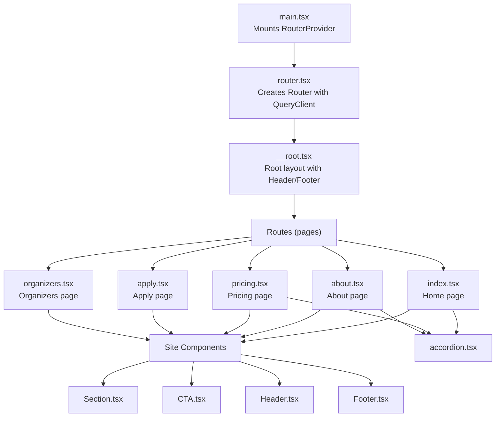
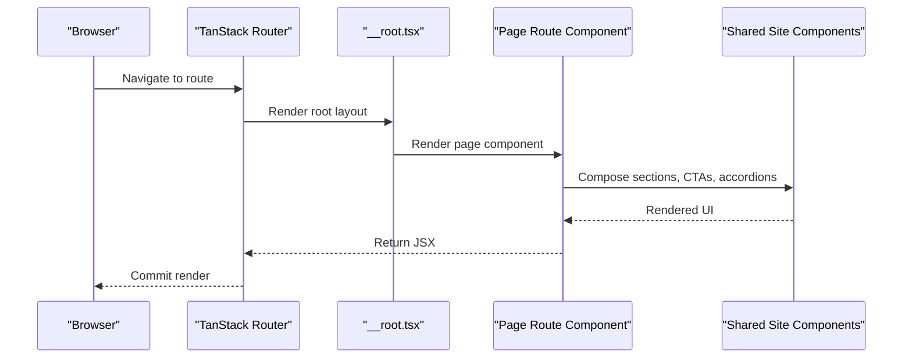
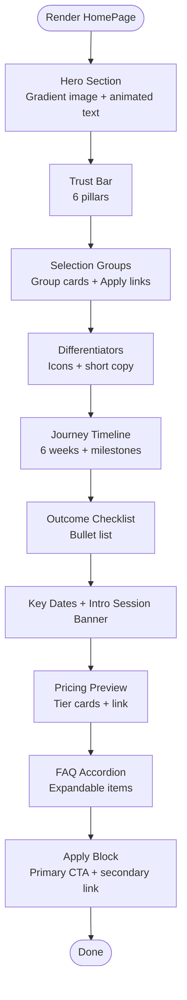
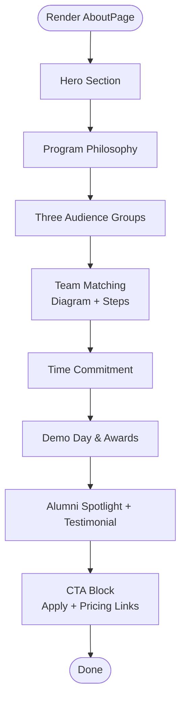
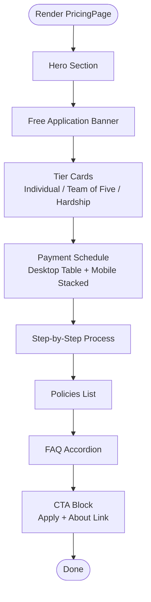
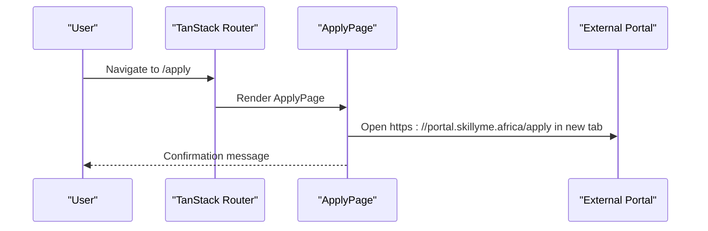
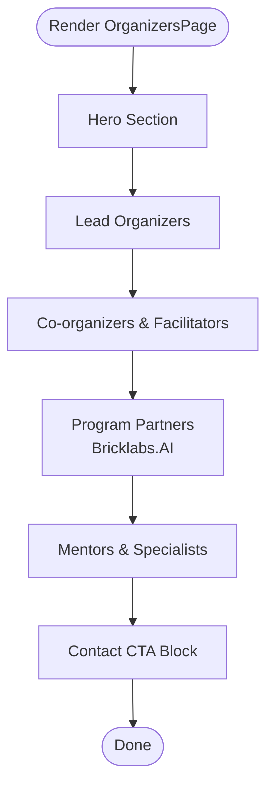
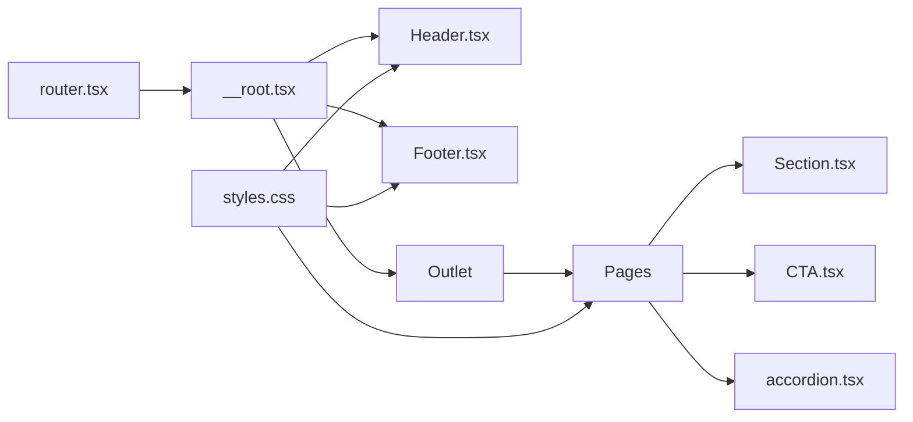

# Page Components

<cite>
**Referenced Files in This Document**
- [index.tsx](file://src/routes/index.tsx)
- [about.tsx](file://src/routes/about.tsx)
- [pricing.tsx](file://src/routes/pricing.tsx)
- [apply.tsx](file://src/routes/apply.tsx)
- [organizers.tsx](file://src/routes/organizers.tsx)
- [Section.tsx](file://src/components/site/Section.tsx)
- [CTA.tsx](file://src/components/site/CTA.tsx)
- [Header.tsx](file://src/components/site/Header.tsx)
- [Footer.tsx](file://src/components/site/Footer.tsx)
- [accordion.tsx](file://src/components/ui/accordion.tsx)
- [__root.tsx](file://src/routes/__root.tsx)
- [router.tsx](file://src/router.tsx)
- [main.tsx](file://src/main.tsx)
- [styles.css](file://src/styles.css)
- [package.json](file://package.json)
</cite>

## Table of Contents
1. [Introduction](#introduction)
2. [Project Structure](#project-structure)
3. [Core Components](#core-components)
4. [Architecture Overview](#architecture-overview)
5. [Detailed Component Analysis](#detailed-component-analysis)
6. [Dependency Analysis](#dependency-analysis)
7. [Performance Considerations](#performance-considerations)
8. [Troubleshooting Guide](#troubleshooting-guide)
9. [Conclusion](#conclusion)

## Introduction
This document describes the page-level components that define the application’s main views. It covers the home page with its hero and program showcase, the about page with program philosophy and team information, the pricing page with tiered structure and payment details, and the application portal integration page. It explains page composition patterns, meta tag configuration, layout and interactive elements, and the relationship between page components and shared site components. It also documents external portal integration, user workflow optimization, and SEO considerations.

## Project Structure
The application uses a file-based routing system with TanStack Router. Each page is defined as a route module exporting a route configuration and a React component. Shared site components encapsulate layout and reusable UI patterns. The global styles define the design tokens and visual language.

**Diagram sources**
- [main.tsx:1-21](file://src/main.tsx#L1-L21)
- [router.tsx:1-17](file://src/router.tsx#L1-L17)
- [__root.tsx:1-61](file://src/routes/__root.tsx#L1-L61)
- [index.tsx:1-350](file://src/routes/index.tsx#L1-L350)
- [about.tsx:1-237](file://src/routes/about.tsx#L1-L237)
- [pricing.tsx:1-241](file://src/routes/pricing.tsx#L1-L241)
- [apply.tsx:1-70](file://src/routes/apply.tsx#L1-L70)
- [organizers.tsx:1-179](file://src/routes/organizers.tsx#L1-L179)
- [Section.tsx:1-44](file://src/components/site/Section.tsx#L1-L44)
- [CTA.tsx:1-27](file://src/components/site/CTA.tsx#L1-L27)
- [Header.tsx:1-84](file://src/components/site/Header.tsx#L1-L84)
- [Footer.tsx:1-44](file://src/components/site/Footer.tsx#L1-L44)
- [accordion.tsx:1-52](file://src/components/ui/accordion.tsx#L1-L52)

**Section sources**
- [main.tsx:1-21](file://src/main.tsx#L1-L21)
- [router.tsx:1-17](file://src/router.tsx#L1-L17)
- [__root.tsx:1-61](file://src/routes/__root.tsx#L1-L61)

## Core Components
- Page route modules export a route configuration with metadata and a component. Examples:
  - Home page defines meta tags for title and description and renders a hero, trust bar, selection groups, differentiators, journey timeline, outcomes, key dates, pricing preview, FAQ, and apply block.
  - About page defines meta tags and presents program philosophy, team roles, matching process, time commitment, demo day, alumni highlights, and a call-to-action.
  - Pricing page defines meta tags and presents tiers, payment schedules, step-by-step process, policies, FAQs, and a call-to-action.
  - Apply page defines meta tags and redirects users to the external application portal.
  - Organizers page defines meta tags and presents lead organizers, co-organizers, program partners, and mentors.
- Shared site components:
  - Section.tsx provides a responsive section wrapper with motion-based entrance and optional elevated tone.
  - CTA.tsx provides a prominent Apply button and a CTA block container.
  - Header.tsx and Footer.tsx provide global navigation and footer links.
  - Radix UI Accordion is used for FAQ sections across pages.

**Section sources**
- [index.tsx:14-22](file://src/routes/index.tsx#L14-L22)
- [about.tsx:6-16](file://src/routes/about.tsx#L6-L16)
- [pricing.tsx:9-19](file://src/routes/pricing.tsx#L9-L19)
- [apply.tsx:7-17](file://src/routes/apply.tsx#L7-L17)
- [organizers.tsx:6-16](file://src/routes/organizers.tsx#L6-L16)
- [Section.tsx:4-29](file://src/components/site/Section.tsx#L4-L29)
- [CTA.tsx:5-26](file://src/components/site/CTA.tsx#L5-L26)
- [Header.tsx:6-11](file://src/components/site/Header.tsx#L6-L11)
- [Footer.tsx:19-26](file://src/components/site/Footer.tsx#L19-L26)
- [accordion.tsx:7-51](file://src/components/ui/accordion.tsx#L7-L51)

## Architecture Overview
The application composes pages from shared site components and UI primitives. Routing integrates with a global QueryClient for caching and optimistic updates. The root layout injects Header and Footer around page content. Pages configure metadata for SEO and social previews.

**Diagram sources**
- [router.tsx:5-16](file://src/router.tsx#L5-L16)
- [__root.tsx:49-60](file://src/routes/__root.tsx#L49-L60)
- [index.tsx:98-349](file://src/routes/index.tsx#L98-L349)
- [Section.tsx:4-29](file://src/components/site/Section.tsx#L4-L29)
- [CTA.tsx:5-26](file://src/components/site/CTA.tsx#L5-L26)

## Detailed Component Analysis

### Home Page (/)
- Composition pattern:
  - Hero section with gradient overlay and animated entrance.
  - Trust bar highlighting program guarantees.
  - Selection groups with external application links.
  - Differentiators using icons and concise copy.
  - Six-week journey timeline with milestone summaries.
  - Outcome checklist for transparency.
  - Key dates and a free intro session banner.
  - Pricing preview with links to full details.
  - FAQ accordion for common questions.
  - Final apply block linking to the portal.
- Data fetching strategy:
  - No client-side data fetching is performed in the route module; content is static.
- SEO and meta tags:
  - Title and description configured in the route head function.
- Layout and interactivity:
  - Motion animations for hero and section entrances.
  - Accordion components for FAQ.
  - Apply buttons and external links to the portal.
- Relationship to shared components:
  - Uses Section, Eyebrow, H2, ApplyButton, and CTA block components.

**Diagram sources**
- [index.tsx:98-349](file://src/routes/index.tsx#L98-L349)
- [Section.tsx:4-29](file://src/components/site/Section.tsx#L4-L29)
- [CTA.tsx:5-17](file://src/components/site/CTA.tsx#L5-L17)
- [accordion.tsx:7-51](file://src/components/ui/accordion.tsx#L7-L51)

**Section sources**
- [index.tsx:14-22](file://src/routes/index.tsx#L14-L22)
- [index.tsx:98-349](file://src/routes/index.tsx#L98-L349)
- [Section.tsx:4-29](file://src/components/site/Section.tsx#L4-L29)
- [CTA.tsx:5-17](file://src/components/site/CTA.tsx#L5-L17)
- [accordion.tsx:7-51](file://src/components/ui/accordion.tsx#L7-L51)

### About Page (/about)
- Composition pattern:
  - Hero with gradient title.
  - Program philosophy and outcomes.
  - Three-stage audience segmentation.
  - Team roles and matching process with visual diagram and steps.
  - Time commitment schedule.
  - Demo day details and awards.
  - Alumni spotlight and testimonials.
  - Call-to-action block with links to apply and pricing.
- Data fetching strategy:
  - Static content; no client-side data fetching.
- SEO and meta tags:
  - Title and description configured; Open Graph tags included.
- Layout and interactivity:
  - SVG-based team diagram with dynamic positioning.
  - Accordion for matching process and time commitment details.
  - CTA block for actions.

**Diagram sources**
- [about.tsx:28-236](file://src/routes/about.tsx#L28-L236)
- [Section.tsx:4-29](file://src/components/site/Section.tsx#L4-L29)
- [CTA.tsx:19-26](file://src/components/site/CTA.tsx#L19-L26)

**Section sources**
- [about.tsx:6-16](file://src/routes/about.tsx#L6-L16)
- [about.tsx:28-236](file://src/routes/about.tsx#L28-L236)
- [Section.tsx:4-29](file://src/components/site/Section.tsx#L4-L29)
- [CTA.tsx:19-26](file://src/components/site/CTA.tsx#L19-L26)

### Pricing Page (/pricing)
- Composition pattern:
  - Hero with gradient title and description.
  - Prominent banner stating free application.
  - Tier cards with pricing, splits, and notes.
  - Payment schedule table (desktop) and stacked blocks (mobile).
  - Step-by-step payment process.
  - Policies list.
  - FAQ accordion.
  - Final CTA block with apply and about links.
- Data fetching strategy:
  - Static content; no client-side data fetching.
- SEO and meta tags:
  - Title and description configured; Open Graph tags included.
- Layout and interactivity:
  - Featured tier highlighted with accent border.
  - Responsive desktop/tablet/mobile layouts for schedules.
  - Accordion for FAQs.
  - CTA block for actions.

**Diagram sources**
- [pricing.tsx:81-240](file://src/routes/pricing.tsx#L81-L240)
- [Section.tsx:4-29](file://src/components/site/Section.tsx#L4-L29)
- [CTA.tsx:19-26](file://src/components/site/CTA.tsx#L19-L26)

**Section sources**
- [pricing.tsx:9-19](file://src/routes/pricing.tsx#L9-L19)
- [pricing.tsx:81-240](file://src/routes/pricing.tsx#L81-L240)
- [Section.tsx:4-29](file://src/components/site/Section.tsx#L4-L29)
- [CTA.tsx:19-26](file://src/components/site/CTA.tsx#L19-L26)

### Application Portal Integration (/apply)
- Composition pattern:
  - Hero with gradient title and benefits summary.
  - Centered CTA to open the external application portal in a new tab.
  - Meta tags configured for SEO and social previews.
- Data fetching strategy:
  - No client-side data fetching; pure redirect to external portal.
- SEO and meta tags:
  - Title and description configured; Open Graph tags included.
- Integration with routing:
  - Redirects to the external portal URL.

**Diagram sources**
- [apply.tsx:19-69](file://src/routes/apply.tsx#L19-L69)

**Section sources**
- [apply.tsx:7-17](file://src/routes/apply.tsx#L7-L17)
- [apply.tsx:19-69](file://src/routes/apply.tsx#L19-L69)

### Organizers Page (/organizers)
- Composition pattern:
  - Hero with gradient title and description.
  - Lead organizers with photos and bios.
  - Co-organizers and core facilitators with partner descriptions.
  - Program partners (Bricklabs.AI) with links.
  - Mentors and specialists grid.
  - Contact CTA block.
- Data fetching strategy:
  - Static content; no client-side data fetching.
- SEO and meta tags:
  - Title and description configured; Open Graph tags included.
- Layout and interactivity:
  - Grid-based team member listings.
  - Links to external profiles and websites.

**Diagram sources**
- [organizers.tsx:18-178](file://src/routes/organizers.tsx#L18-L178)
- [Section.tsx:4-29](file://src/components/site/Section.tsx#L4-L29)
- [CTA.tsx:19-26](file://src/components/site/CTA.tsx#L19-L26)

**Section sources**
- [organizers.tsx:6-16](file://src/routes/organizers.tsx#L6-L16)
- [organizers.tsx:18-178](file://src/routes/organizers.tsx#L18-L178)
- [Section.tsx:4-29](file://src/components/site/Section.tsx#L4-L29)
- [CTA.tsx:19-26](file://src/components/site/CTA.tsx#L19-L26)

## Dependency Analysis
- Routing and context:
  - Router is created with a QueryClient and passed into the root route context.
  - Root layout wraps the app with QueryClientProvider and renders Header and Footer around Outlet.
- Shared components:
  - Pages depend on Section, Eyebrow, H2, ApplyButton, CTABlock, Header, and Footer.
  - Accordion components are used for FAQ and expandable content.
- External portal integration:
  - ApplyButton and header/footer links consistently point to the external portal URL.
- Design system:
  - Global styles define theme tokens, gradients, shadows, and utilities used across pages.

**Diagram sources**
- [router.tsx:5-16](file://src/router.tsx#L5-L16)
- [__root.tsx:49-60](file://src/routes/__root.tsx#L49-L60)
- [Header.tsx:13-83](file://src/components/site/Header.tsx#L13-L83)
- [Footer.tsx:3-43](file://src/components/site/Footer.tsx#L3-L43)
- [Section.tsx:4-29](file://src/components/site/Section.tsx#L4-L29)
- [CTA.tsx:5-26](file://src/components/site/CTA.tsx#L5-L26)
- [accordion.tsx:7-51](file://src/components/ui/accordion.tsx#L7-L51)
- [styles.css:8-136](file://src/styles.css#L8-L136)

**Section sources**
- [router.tsx:5-16](file://src/router.tsx#L5-L16)
- [__root.tsx:49-60](file://src/routes/__root.tsx#L49-L60)
- [Header.tsx:13-83](file://src/components/site/Header.tsx#L13-L83)
- [Footer.tsx:3-43](file://src/components/site/Footer.tsx#L3-L43)
- [Section.tsx:4-29](file://src/components/site/Section.tsx#L4-L29)
- [CTA.tsx:5-26](file://src/components/site/CTA.tsx#L5-L26)
- [accordion.tsx:7-51](file://src/components/ui/accordion.tsx#L7-L51)
- [styles.css:8-136](file://src/styles.css#L8-L136)

## Performance Considerations
- Static content rendering:
  - All page components render static content without client-side data fetching, minimizing network overhead.
- Motion and animations:
  - Motion animations are used sparingly; ensure they do not cause layout shifts or excessive reflows.
- Image handling:
  - Background images are used for hero sections; consider lazy-loading strategies if images become heavy.
- CSS and design tokens:
  - Centralized theme tokens and utilities reduce duplication and improve maintainability.
- Routing and caching:
  - QueryClient is initialized at the router level; consider enabling caching strategies for future data-fetching scenarios.

[No sources needed since this section provides general guidance]

## Troubleshooting Guide
- Navigation and routing:
  - Verify that routes are correctly defined and exported; ensure the root layout wraps pages with Header and Footer.
- Meta tags and SEO:
  - Confirm that each page route configures head meta tags appropriately; test Open Graph previews.
- External portal links:
  - Ensure ApplyButton and header/footer links consistently point to the external portal URL.
- Accordion behavior:
  - Confirm that accordion components are properly imported and used; verify single/collapsible modes align with intended UX.
- Error and not-found handling:
  - Root layout provides error and not-found components; ensure they render meaningful messages and include recovery actions.

**Section sources**
- [__root.tsx:12-41](file://src/routes/__root.tsx#L12-L41)
- [Header.tsx:39-54](file://src/components/site/Header.tsx#L39-L54)
- [Footer.tsx:20-26](file://src/components/site/Footer.tsx#L20-L26)
- [accordion.tsx:7-51](file://src/components/ui/accordion.tsx#L7-L51)

## Conclusion
The page components are structured around a consistent composition model using shared site components and a robust routing system. Each page defines clear SEO metadata, uses motion-enhanced layouts, and integrates seamlessly with the external application portal. The design system and global styles unify the visual language, while the root layout ensures consistent navigation and error handling. Future enhancements can introduce client-side data fetching with caching and optimize media assets for improved performance.