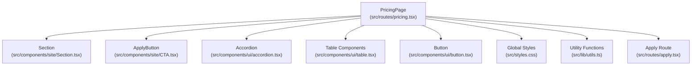
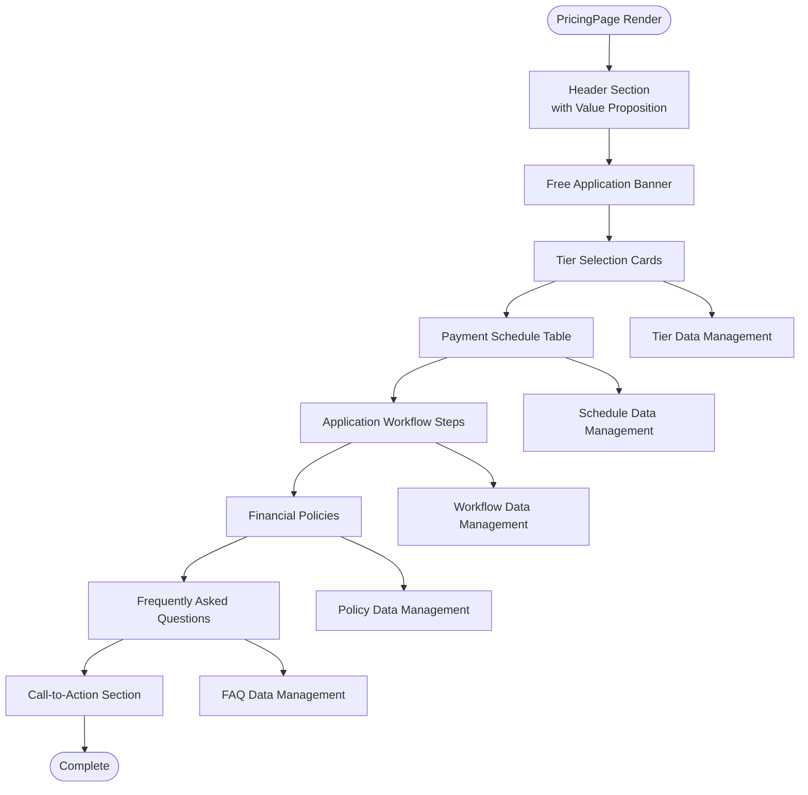
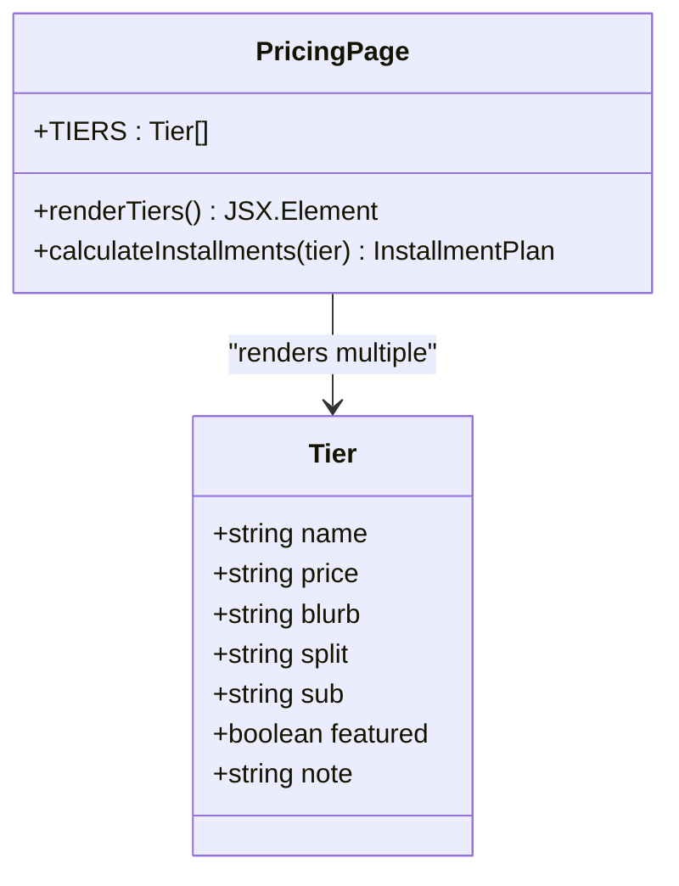
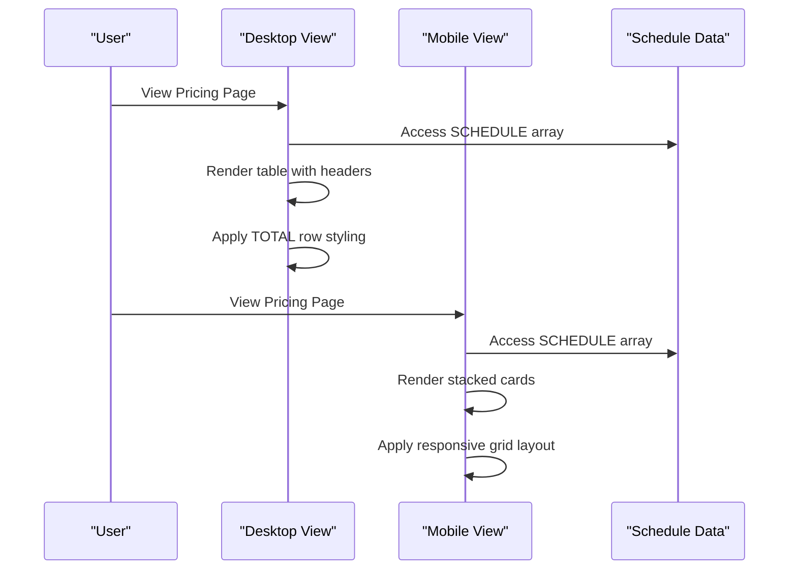
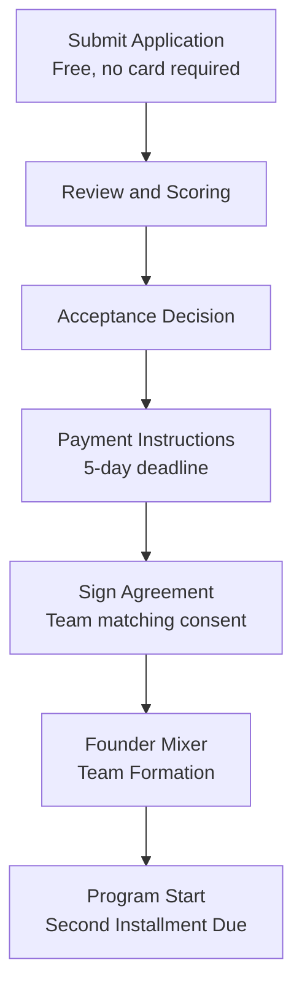
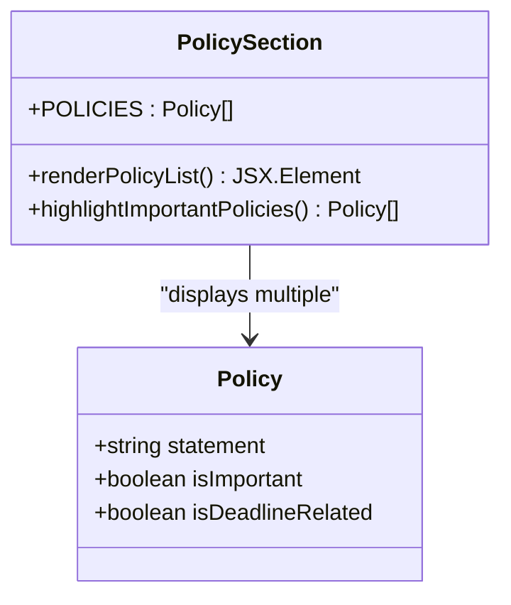
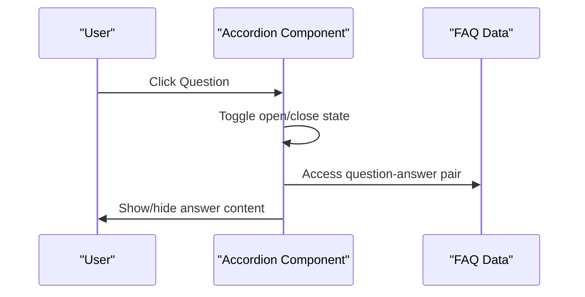
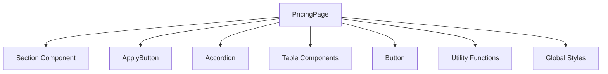

# Pricing Page

<cite>
**Referenced Files in This Document**
- [pricing.tsx](file://src/routes/pricing.tsx)
- [Section.tsx](file://src/components/site/Section.tsx)
- [CTA.tsx](file://src/components/site/CTA.tsx)
- [accordion.tsx](file://src/components/ui/accordion.tsx)
- [table.tsx](file://src/components/ui/table.tsx)
- [button.tsx](file://src/components/ui/button.tsx)
- [apply.tsx](file://src/routes/apply.tsx)
- [styles.css](file://src/styles.css)
- [utils.ts](file://src/lib/utils.ts)
- [use-mobile.tsx](file://src/hooks/use-mobile.tsx)
</cite>

## Table of Contents
1. [Introduction](#introduction)
2. [Project Structure](#project-structure)
3. [Core Components](#core-components)
4. [Architecture Overview](#architecture-overview)
5. [Detailed Component Analysis](#detailed-component-analysis)
6. [Dependency Analysis](#dependency-analysis)
7. [Performance Considerations](#performance-considerations)
8. [Troubleshooting Guide](#troubleshooting-guide)
9. [Conclusion](#conclusion)

## Introduction
The Pricing Page component presents a transparent, fair, and accessible financial structure for the Skillyme Africa Cohort 2 program. It communicates value through a tiered pricing model, clear payment schedules, and comprehensive financial policies. The implementation emphasizes user trust by ensuring applications are free, payments occur only after acceptance, and financial information is presented with strong visual hierarchy and responsive design.

## Project Structure
The Pricing Page is implemented as a standalone route component that composes reusable UI elements and follows a modular architecture:

**Diagram sources**
- [pricing.tsx:1-241](file://src/routes/pricing.tsx#L1-L241)
- [Section.tsx:1-44](file://src/components/site/Section.tsx#L1-L44)
- [CTA.tsx:1-27](file://src/components/site/CTA.tsx#L1-L27)
- [accordion.tsx:1-52](file://src/components/ui/accordion.tsx#L1-L52)
- [table.tsx:1-95](file://src/components/ui/table.tsx#L1-L95)
- [button.tsx:1-50](file://src/components/ui/button.tsx#L1-L50)
- [styles.css:1-136](file://src/styles.css#L1-L136)
- [utils.ts:1-7](file://src/lib/utils.ts#L1-L7)
- [apply.tsx:1-70](file://src/routes/apply.tsx#L1-L70)

**Section sources**
- [pricing.tsx:1-241](file://src/routes/pricing.tsx#L1-L241)
- [Section.tsx:1-44](file://src/components/site/Section.tsx#L1-L44)
- [CTA.tsx:1-27](file://src/components/site/CTA.tsx#L1-L27)
- [accordion.tsx:1-52](file://src/components/ui/accordion.tsx#L1-L52)
- [table.tsx:1-95](file://src/components/ui/table.tsx#L1-L95)
- [button.tsx:1-50](file://src/components/ui/button.tsx#L1-L50)
- [styles.css:1-136](file://src/styles.css#L1-L136)
- [utils.ts:1-7](file://src/lib/utils.ts#L1-L7)
- [apply.tsx:1-70](file://src/routes/apply.tsx#L1-L70)

## Core Components
The Pricing Page is composed of several key sections that communicate the financial structure and payment arrangements:

### Tiered Pricing Structure
The component defines three pricing tiers with clear differentiation:
- Individual: Fixed total with two-installment split
- Team of Five: Volume discount with shared cost
- Hardship Place: Extended payment plan for eligible candidates

### Payment Schedule Visualization
A dual-format schedule table provides both desktop and mobile experiences:
- Desktop: Traditional table with clear column headers
- Mobile: Stacked cards with consistent information density

### Application Workflow
A step-by-step process explains the complete journey from application to program participation, including acceptance, payment deadlines, and program start dates.

### Financial Policies and Transparency
Clear policy statements address refunds, deadlines, team membership rules, and hardship accommodations with specific limits and conditions.

**Section sources**
- [pricing.tsx:21-43](file://src/routes/pricing.tsx#L21-L43)
- [pricing.tsx:45-53](file://src/routes/pricing.tsx#L45-L53)
- [pricing.tsx:55-63](file://src/routes/pricing.tsx#L55-L63)
- [pricing.tsx:65-72](file://src/routes/pricing.tsx#L65-L72)

## Architecture Overview
The Pricing Page follows a component-driven architecture with clear separation of concerns:

**Diagram sources**
- [pricing.tsx:81-240](file://src/routes/pricing.tsx#L81-L240)

The component leverages:
- **Reusable Sections**: Consistent spacing and animation via the Section component
- **Accessible UI Patterns**: Radix UI primitives for keyboard navigation and screen reader support
- **Responsive Design**: Mobile-first approach with breakpoint-specific layouts
- **Visual Hierarchy**: Clear typography and color coding for emphasis

**Section sources**
- [pricing.tsx:81-240](file://src/routes/pricing.tsx#L81-L240)
- [Section.tsx:1-44](file://src/components/site/Section.tsx#L1-L44)

## Detailed Component Analysis

### Tiered Pricing Implementation
The tier system uses a structured data approach with consistent rendering logic:

**Diagram sources**
- [pricing.tsx:21-43](file://src/routes/pricing.tsx#L21-L43)

Key implementation patterns:
- **Featured Tier Highlighting**: Visual distinction for the Team of Five option
- **Consistent Card Layout**: Standardized presentation across all tiers
- **Dynamic Content Rendering**: Conditional display of subtext and notes

### Payment Schedule Visualization
The schedule component demonstrates sophisticated responsive design:

**Diagram sources**
- [pricing.tsx:134-175](file://src/routes/pricing.tsx#L134-L175)

Responsive design features:
- **Desktop Table**: Structured layout with clear column alignment
- **Mobile Cards**: Information preserved through stacked card design
- **Breakpoint Logic**: Automatic switching between views

### Application Workflow Explanation
The workflow component uses numbered steps with visual indicators:

**Diagram sources**
- [pricing.tsx:55-63](file://src/routes/pricing.tsx#L55-L63)

**Section sources**
- [pricing.tsx:101-132](file://src/routes/pricing.tsx#L101-L132)
- [pricing.tsx:134-175](file://src/routes/pricing.tsx#L134-L175)
- [pricing.tsx:177-195](file://src/routes/pricing.tsx#L177-L195)

### Financial Policy Documentation
The policy section presents clear, actionable information:

**Diagram sources**
- [pricing.tsx:65-72](file://src/routes/pricing.tsx#L65-L72)

Policy categories include:
- **Application Costs**: Free application process
- **Payment Deadlines**: Specific timing requirements
- **Refund Terms**: Clear withdrawal and refund conditions
- **Team Membership**: Special rules for team applications
- **Hardship Accommodations**: Limited availability and conditions

### FAQ Section Implementation
The FAQ uses an accordion component for efficient information display:

**Diagram sources**
- [pricing.tsx:210-224](file://src/routes/pricing.tsx#L210-L224)
- [accordion.tsx:1-52](file://src/components/ui/accordion.tsx#L1-L52)

**Section sources**
- [pricing.tsx:74-79](file://src/routes/pricing.tsx#L74-L79)
- [accordion.tsx:1-52](file://src/components/ui/accordion.tsx#L1-L52)

## Dependency Analysis
The Pricing Page component has minimal external dependencies, focusing on internal reusability:

**Diagram sources**
- [pricing.tsx:1-241](file://src/routes/pricing.tsx#L1-L241)
- [Section.tsx:1-44](file://src/components/site/Section.tsx#L1-L44)
- [CTA.tsx:1-27](file://src/components/site/CTA.tsx#L1-L27)
- [accordion.tsx:1-52](file://src/components/ui/accordion.tsx#L1-L52)
- [table.tsx:1-95](file://src/components/ui/table.tsx#L1-L95)
- [button.tsx:1-50](file://src/components/ui/button.tsx#L1-L50)
- [utils.ts:1-7](file://src/lib/utils.ts#L1-L7)
- [styles.css:1-136](file://src/styles.css#L1-L136)

**Section sources**
- [pricing.tsx:1-241](file://src/routes/pricing.tsx#L1-L241)
- [utils.ts:1-7](file://src/lib/utils.ts#L1-L7)

## Performance Considerations
The component is optimized for performance through several mechanisms:

- **Static Data Structures**: Pricing tiers, schedules, and policies are defined as static arrays
- **Minimal Re-renders**: No state changes within the component reduce unnecessary updates
- **Efficient Rendering**: Simple mapping over data arrays without complex computations
- **Responsive Breakpoints**: CSS media queries handle layout changes efficiently
- **Lightweight Dependencies**: Uses only essential UI primitives and utility functions

## Troubleshooting Guide
Common issues and solutions for the Pricing Page component:

### Responsive Design Issues
- **Problem**: Mobile layout appears compressed
- **Solution**: Verify breakpoint values in CSS and ensure proper container widths
- **Reference**: [styles.css:127-129](file://src/styles.css#L127-L129)

### Accessibility Concerns
- **Problem**: Screen reader compatibility issues
- **Solution**: Ensure proper ARIA labels and keyboard navigation support
- **Reference**: [accordion.tsx:17-35](file://src/components/ui/accordion.tsx#L17-L35)

### Content Display Problems
- **Problem**: Pricing tiers not displaying correctly
- **Solution**: Check data structure consistency and rendering logic
- **Reference**: [pricing.tsx:105-131](file://src/routes/pricing.tsx#L105-L131)

**Section sources**
- [styles.css:127-129](file://src/styles.css#L127-L129)
- [accordion.tsx:17-35](file://src/components/ui/accordion.tsx#L17-L35)
- [pricing.tsx:105-131](file://src/routes/pricing.tsx#L105-L131)

## Conclusion
The Pricing Page component successfully communicates a transparent, fair financial structure through thoughtful design and implementation. Its modular architecture, responsive design, and clear information hierarchy create a trustworthy experience that aligns with the program's value proposition. The component effectively balances comprehensive financial disclosure with user-friendly presentation, supporting informed decision-making while maintaining accessibility and performance standards.