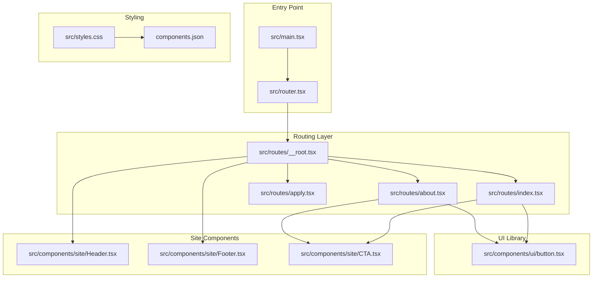
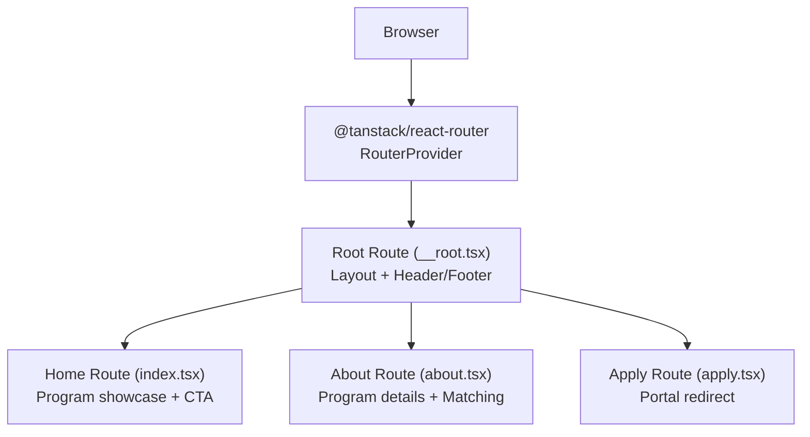
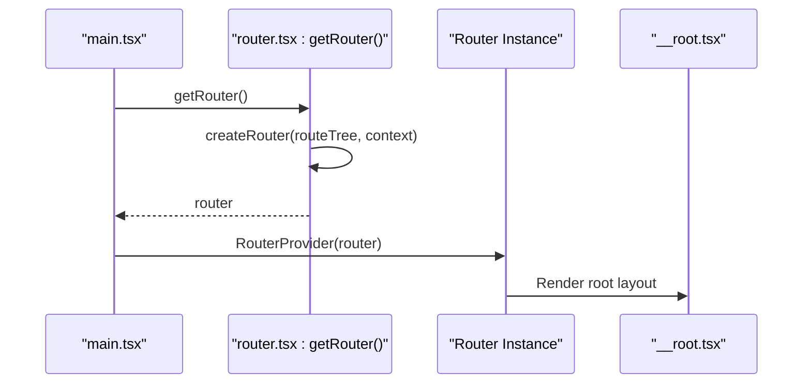
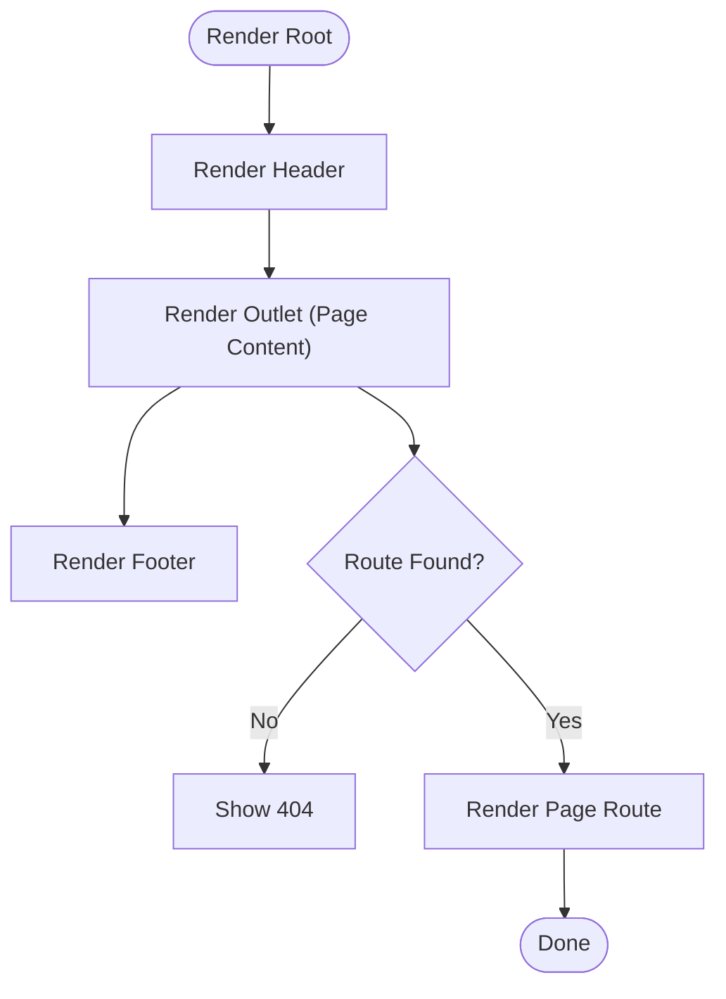
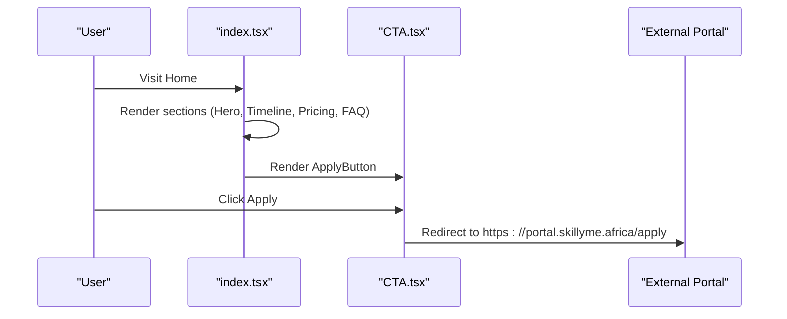
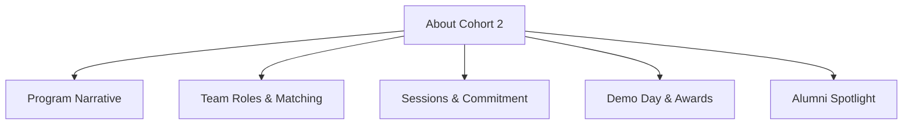
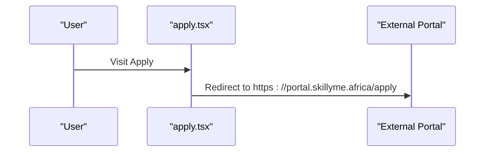
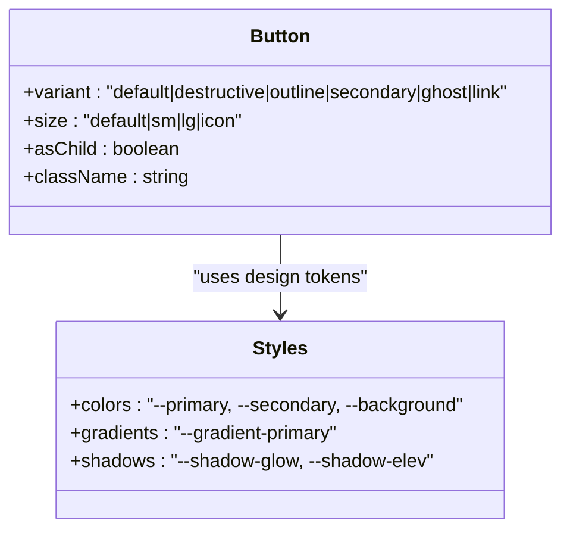
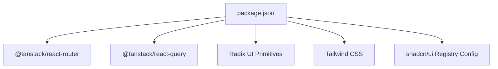

# Project Overview

<cite>
**Referenced Files in This Document**
- [package.json](file://package.json)
- [vite.config.ts](file://vite.config.ts)
- [src/main.tsx](file://src/main.tsx)
- [src/router.tsx](file://src/router.tsx)
- [src/routes/__root.tsx](file://src/routes/__root.tsx)
- [src/routes/index.tsx](file://src/routes/index.tsx)
- [src/routes/about.tsx](file://src/routes/about.tsx)
- [src/routes/apply.tsx](file://src/routes/apply.tsx)
- [src/components/site/Header.tsx](file://src/components/site/Header.tsx)
- [src/components/site/Footer.tsx](file://src/components/site/Footer.tsx)
- [src/components/site/CTA.tsx](file://src/components/site/CTA.tsx)
- [src/components/ui/button.tsx](file://src/components/ui/button.tsx)
- [src/styles.css](file://src/styles.css)
- [components.json](file://components.json)
</cite>

## Table of Contents
1. [Introduction](#introduction)
2. [Project Structure](#project-structure)
3. [Core Components](#core-components)
4. [Architecture Overview](#architecture-overview)
5. [Detailed Component Analysis](#detailed-component-analysis)
6. [Dependency Analysis](#dependency-analysis)
7. [Performance Considerations](#performance-considerations)
8. [Troubleshooting Guide](#troubleshooting-guide)
9. [Conclusion](#conclusion)
10. [Appendices](#appendices)

## Introduction
Skillyme Programs System is an educational program showcase and application portal for Skillyme Africa’s Cohort 2 Build Track. The platform serves as a central hub to communicate the program’s mission, structure, and outcomes while directing learners to the secure application portal. It positions the Cohort 2 Build Track within the broader Skillyme ecosystem as a selective, outcome-based startup build accelerator that emphasizes real product development, customer validation, and IP ownership.

Target audience:
- Prospective learners and builders evaluating the Cohort 2 Build Track
- Stakeholders and partners interested in program transparency and outcomes
- Program participants navigating program details and application logistics

Core functionality:
- Educational program showcase with program details, timelines, FAQs, and outcomes
- Navigation between key pages (Home, About Cohort 2, Organizers, Pricing)
- Application portal redirection to the secure “Apply Now” form hosted externally
- Responsive, accessible UI powered by a comprehensive component library

Relationship to the broader Skillyme ecosystem:
- Cohort 2 Build Track is presented as a flagship offering within Skillyme Africa’s learning ecosystem
- The application portal is integrated into the Skillyme ecosystem via external links
- Alumni outcomes and community access reinforce long-term engagement post-program

## Project Structure
The project follows a modern React-based architecture with TanStack Router for routing and a comprehensive UI component library. The structure is organized by feature and layer:
- Routes: Page-level routes under src/routes
- Site components: Shared header, footer, and layout components under src/components/site
- UI components: Reusable component library under src/components/ui
- Styling: Tailwind-based design tokens and utilities under src/styles.css
- Tooling: Vite configuration with TanStack Router plugin and TypeScript path aliases

**Diagram sources**
- [src/main.tsx:1-21](file://src/main.tsx#L1-L21)
- [src/router.tsx:1-17](file://src/router.tsx#L1-L17)
- [src/routes/__root.tsx:1-61](file://src/routes/__root.tsx#L1-L61)
- [src/routes/index.tsx:1-350](file://src/routes/index.tsx#L1-L350)
- [src/routes/about.tsx:1-237](file://src/routes/about.tsx#L1-L237)
- [src/routes/apply.tsx:1-70](file://src/routes/apply.tsx#L1-L70)
- [src/components/site/Header.tsx:1-84](file://src/components/site/Header.tsx#L1-L84)
- [src/components/site/Footer.tsx:1-44](file://src/components/site/Footer.tsx#L1-L44)
- [src/components/site/CTA.tsx:1-27](file://src/components/site/CTA.tsx#L1-L27)
- [src/components/ui/button.tsx:1-50](file://src/components/ui/button.tsx#L1-L50)
- [src/styles.css:1-136](file://src/styles.css#L1-L136)
- [components.json:1-23](file://components.json#L1-L23)

**Section sources**
- [package.json:1-86](file://package.json#L1-L86)
- [vite.config.ts:1-30](file://vite.config.ts#L1-L30)
- [src/main.tsx:1-21](file://src/main.tsx#L1-L21)
- [src/router.tsx:1-17](file://src/router.tsx#L1-L17)
- [src/routes/__root.tsx:1-61](file://src/routes/__root.tsx#L1-L61)
- [src/styles.css:1-136](file://src/styles.css#L1-L136)
- [components.json:1-23](file://components.json#L1-L23)

## Core Components
- TanStack Router integration: Provides type-safe routing, route tree generation, and context injection for React Query
- Root route wrapper: Manages global layout, header/footer, error boundaries, and not-found handling
- Page routes: Home, About Cohort 2, and Application portal redirection
- Site components: Header with navigation and “Apply Now” CTA; Footer with program description and navigation
- UI component library: Consistent, theme-driven components (e.g., Button) with variant and size APIs
- Styling system: Tailwind-based design tokens, gradients, shadows, and responsive utilities

Practical examples:
- The Home page presents program highlights, outcomes, timeline, and pricing previews, linking to the application portal
- The About Cohort 2 page explains team roles, matching process, and Demo Day, reinforcing the program’s outcome-based model
- The Application page redirects users to the secure application portal, emphasizing free application and IP retention

**Section sources**
- [src/main.tsx:1-21](file://src/main.tsx#L1-L21)
- [src/router.tsx:1-17](file://src/router.tsx#L1-L17)
- [src/routes/__root.tsx:1-61](file://src/routes/__root.tsx#L1-L61)
- [src/routes/index.tsx:1-350](file://src/routes/index.tsx#L1-L350)
- [src/routes/about.tsx:1-237](file://src/routes/about.tsx#L1-L237)
- [src/routes/apply.tsx:1-70](file://src/routes/apply.tsx#L1-L70)
- [src/components/site/Header.tsx:1-84](file://src/components/site/Header.tsx#L1-L84)
- [src/components/site/Footer.tsx:1-44](file://src/components/site/Footer.tsx#L1-L44)
- [src/components/site/CTA.tsx:1-27](file://src/components/site/CTA.tsx#L1-L27)
- [src/components/ui/button.tsx:1-50](file://src/components/ui/button.tsx#L1-L50)
- [src/styles.css:1-136](file://src/styles.css#L1-L136)

## Architecture Overview
The application uses a modern React stack with TanStack Router for navigation and a component-driven UI library. Routing is generated at build-time, enabling type-safe navigation and automatic code splitting. The root route composes shared layout elements and error/not-found handlers, while page routes encapsulate program content and CTAs.

**Diagram sources**
- [src/main.tsx:1-21](file://src/main.tsx#L1-L21)
- [src/router.tsx:1-17](file://src/router.tsx#L1-L17)
- [src/routes/__root.tsx:1-61](file://src/routes/__root.tsx#L1-L61)
- [src/routes/index.tsx:1-350](file://src/routes/index.tsx#L1-L350)
- [src/routes/about.tsx:1-237](file://src/routes/about.tsx#L1-L237)
- [src/routes/apply.tsx:1-70](file://src/routes/apply.tsx#L1-L70)

## Detailed Component Analysis

### TanStack Router Integration
- Router creation: Initializes TanStack Router with a generated route tree and React Query context
- Type safety: Registers router instance for type-safe usage across the app
- Scroll restoration: Enables seamless navigation with scroll position restoration

**Diagram sources**
- [src/main.tsx:1-21](file://src/main.tsx#L1-L21)
- [src/router.tsx:1-17](file://src/router.tsx#L1-L17)
- [src/routes/__root.tsx:1-61](file://src/routes/__root.tsx#L1-L61)

**Section sources**
- [src/main.tsx:1-21](file://src/main.tsx#L1-L21)
- [src/router.tsx:1-17](file://src/router.tsx#L1-L17)

### Root Layout and Navigation
- Layout composition: Header, outlet for page content, and Footer
- Error and not-found handling: Centralized error boundary and 404 page
- Navigation: Internal links via TanStack Router and external links to the application portal

**Diagram sources**
- [src/routes/__root.tsx:1-61](file://src/routes/__root.tsx#L1-L61)
- [src/components/site/Header.tsx:1-84](file://src/components/site/Header.tsx#L1-L84)
- [src/components/site/Footer.tsx:1-44](file://src/components/site/Footer.tsx#L1-L44)

**Section sources**
- [src/routes/__root.tsx:1-61](file://src/routes/__root.tsx#L1-L61)
- [src/components/site/Header.tsx:1-84](file://src/components/site/Header.tsx#L1-L84)
- [src/components/site/Footer.tsx:1-44](file://src/components/site/Footer.tsx#L1-L44)

### Home Page: Educational Program Showcase
- Hero section: Program headline, description, and primary CTA
- Trust indicators: Program guarantees and benefits
- Outcome-focused sections: Timeline, milestones, and what participants leave with
- Pricing preview: Transparent fee tiers and payment model
- FAQ: Collapsible accordion with common questions
- Secondary CTAs: Links to application portal and pricing details

**Diagram sources**
- [src/routes/index.tsx:1-350](file://src/routes/index.tsx#L1-L350)
- [src/components/site/CTA.tsx:1-27](file://src/components/site/CTA.tsx#L1-L27)

**Section sources**
- [src/routes/index.tsx:1-350](file://src/routes/index.tsx#L1-L350)
- [src/components/site/CTA.tsx:1-27](file://src/components/site/CTA.tsx#L1-L27)

### About Cohort 2: Program Details and Matching
- Program narrative: Outcome-based build accelerator with real product and client focus
- Team roles and matching: Visual diagram and process steps
- Sessions and time commitment: Live sessions and independent work expectations
- Demo Day and awards: Program finale and recognition
- Alumni spotlight: Cohort 1 outcomes and testimonials

**Diagram sources**
- [src/routes/about.tsx:1-237](file://src/routes/about.tsx#L1-L237)

**Section sources**
- [src/routes/about.tsx:1-237](file://src/routes/about.tsx#L1-L237)

### Application Portal Redirection
- Purpose: Direct users to the secure application portal hosted externally
- Messaging: Emphasizes free application and transparent payment model
- UX: Prominent CTA with external link semantics

**Diagram sources**
- [src/routes/apply.tsx:1-70](file://src/routes/apply.tsx#L1-L70)

**Section sources**
- [src/routes/apply.tsx:1-70](file://src/routes/apply.tsx#L1-L70)

### UI Component Library: Consistency and Theming
- Button component: Variants (default, destructive, outline, secondary, ghost, link) and sizes (default, sm, lg, icon)
- Theming: Tailwind-based design tokens, gradients, shadows, and responsive utilities
- Accessibility: Focus-visible outlines and semantic markup

**Diagram sources**
- [src/components/ui/button.tsx:1-50](file://src/components/ui/button.tsx#L1-L50)
- [src/styles.css:1-136](file://src/styles.css#L1-L136)

**Section sources**
- [src/components/ui/button.tsx:1-50](file://src/components/ui/button.tsx#L1-L50)
- [src/styles.css:1-136](file://src/styles.css#L1-L136)
- [components.json:1-23](file://components.json#L1-L23)

## Dependency Analysis
The project relies on a modern React toolchain with TanStack Router for routing and a rich set of UI primitives. Dependencies include Radix UI for accessible primitives, Tailwind CSS for styling, and TanStack Query for data fetching. The Vite configuration integrates TanStack Router code-splitting and TypeScript path aliases.

**Diagram sources**
- [package.json:1-86](file://package.json#L1-L86)

**Section sources**
- [package.json:1-86](file://package.json#L1-L86)
- [vite.config.ts:1-30](file://vite.config.ts#L1-L30)

## Performance Considerations
- Automatic code splitting: TanStack Router plugin enables route-level code splitting for faster initial loads
- Scroll restoration: Improves perceived performance by restoring scroll positions during navigation
- Lightweight UI primitives: Radix UI ensures minimal overhead for accessible components
- Tailwind utilities: Utility-first CSS reduces bundle bloat by avoiding unused styles

## Troubleshooting Guide
Common issues and resolutions:
- Routing errors: Use the centralized error boundary in the root route to capture and display friendly error messages
- Not-found pages: The root route defines a dedicated not-found component; verify route definitions to prevent 404s
- External portal links: Ensure the application portal URL is correct and accessible; test redirects from the Apply route
- Styling inconsistencies: Verify Tailwind configuration and design tokens in the stylesheet; confirm component registry settings

**Section sources**
- [src/routes/__root.tsx:24-41](file://src/routes/__root.tsx#L24-L41)
- [src/routes/__root.tsx:12-22](file://src/routes/__root.tsx#L12-L22)
- [src/routes/apply.tsx:54-61](file://src/routes/apply.tsx#L54-L61)
- [src/styles.css:1-136](file://src/styles.css#L1-L136)
- [components.json:1-23](file://components.json#L1-L23)

## Conclusion
Skillyme Programs System delivers a modern, accessible educational program showcase tailored to Skillyme Africa’s Cohort 2 Build Track. Built with TanStack Router and a comprehensive UI library, it communicates program outcomes, structure, and application logistics while seamlessly integrating with the broader Skillyme ecosystem. The platform’s design and architecture support both stakeholder understanding and developer productivity, ensuring a scalable foundation for future enhancements.

## Appendices
- Practical examples in the Skillyme learning ecosystem:
  - Cohort 2 Build Track as a flagship outcome-based accelerator
  - Application portal as the gateway to secure submissions
  - Alumni outcomes and community access as post-program engagement anchors