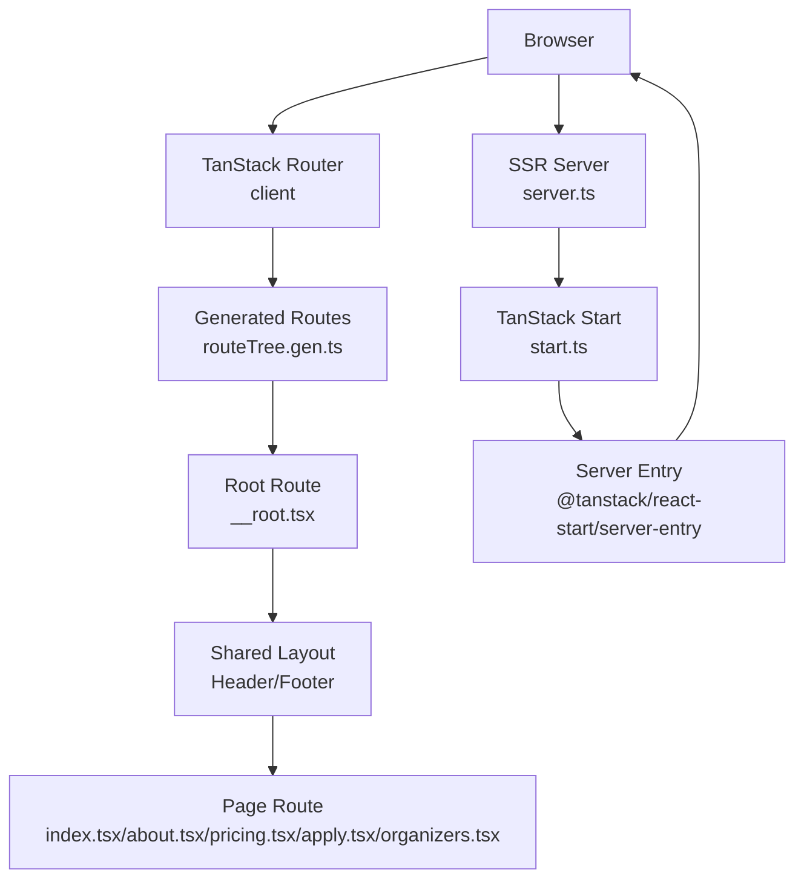
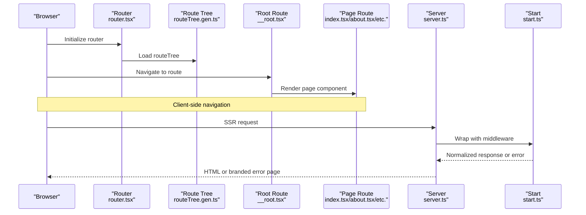
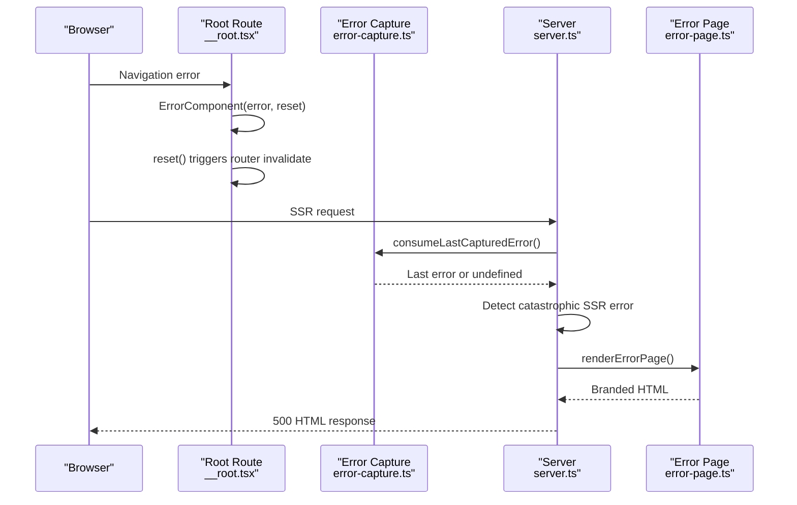
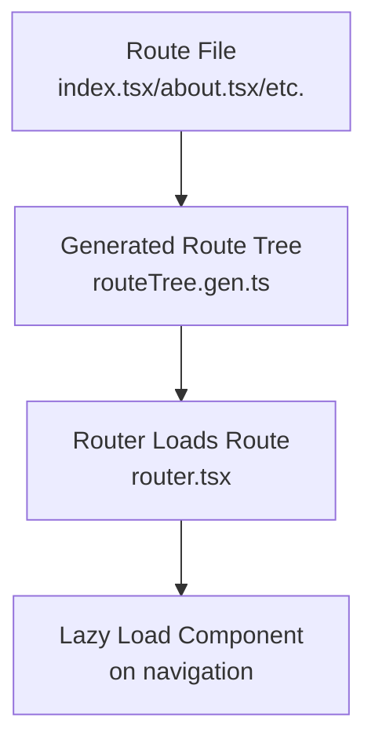
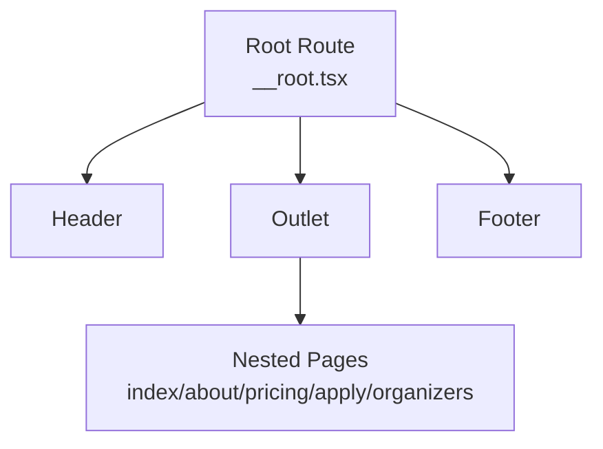
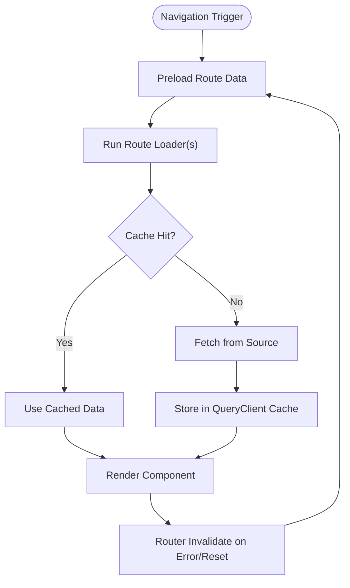
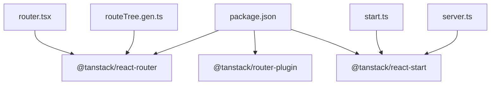

# Advanced Routing Features

<cite>
**Referenced Files in This Document**
- [router.tsx](file://src/router.tsx)
- [main.tsx](file://src/main.tsx)
- [__root.tsx](file://src/routes/__root.tsx)
- [routeTree.gen.ts](file://src/routeTree.gen.ts)
- [index.tsx](file://src/routes/index.tsx)
- [about.tsx](file://src/routes/about.tsx)
- [pricing.tsx](file://src/routes/pricing.tsx)
- [apply.tsx](file://src/routes/apply.tsx)
- [organizers.tsx](file://src/routes/organizers.tsx)
- [error-capture.ts](file://src/lib/error-capture.ts)
- [error-page.ts](file://src/lib/error-page.ts)
- [server.ts](file://src/server.ts)
- [start.ts](file://src/start.ts)
- [package.json](file://package.json)
- [vercel.json](file://vercel.json)
</cite>

## Table of Contents
1. [Introduction](#introduction)
2. [Project Structure](#project-structure)
3. [Core Components](#core-components)
4. [Architecture Overview](#architecture-overview)
5. [Detailed Component Analysis](#detailed-component-analysis)
6. [Dependency Analysis](#dependency-analysis)
7. [Performance Considerations](#performance-considerations)
8. [Troubleshooting Guide](#troubleshooting-guide)
9. [Conclusion](#conclusion)

## Introduction
This document explains the advanced routing features of the project, focusing on error handling, lazy loading, performance optimizations, route parameters and query handling, nested layouts, route groups, conditional rendering, route-level data loading, preloading strategies, caching, guards, authentication flows, dynamic route generation, debugging, and navigation performance tuning. The project uses TanStack Router for client-side routing and TanStack Start for server-side rendering and error normalization.

## Project Structure
The routing system is organized around:
- A generated route tree that defines static routes and their relationships
- A root route that provides shared layout, error handling, and not-found behavior
- Individual file routes for pages
- A server entry that normalizes SSR errors and serves a branded error page
- A start instance that wraps requests with error middleware

**Diagram sources**
- [main.tsx:1-21](file://src/main.tsx#L1-L21)
- [router.tsx:1-17](file://src/router.tsx#L1-L17)
- [routeTree.gen.ts:11-132](file://src/routeTree.gen.ts#L11-L132)
- [__root.tsx:1-61](file://src/routes/__root.tsx#L1-L61)
- [index.tsx:1-350](file://src/routes/index.tsx#L1-L350)
- [about.tsx:1-237](file://src/routes/about.tsx#L1-L237)
- [pricing.tsx:1-241](file://src/routes/pricing.tsx#L1-L241)
- [apply.tsx:1-70](file://src/routes/apply.tsx#L1-L70)
- [organizers.tsx:1-179](file://src/routes/organizers.tsx#L1-L179)
- [server.ts:1-80](file://src/server.ts#L1-L80)
- [start.ts:1-23](file://src/start.ts#L1-L23)

**Section sources**
- [main.tsx:1-21](file://src/main.tsx#L1-L21)
- [router.tsx:1-17](file://src/router.tsx#L1-L17)
- [routeTree.gen.ts:11-132](file://src/routeTree.gen.ts#L11-L132)
- [__root.tsx:1-61](file://src/routes/__root.tsx#L1-L61)

## Core Components
- Router initialization and context: The router is created with a QueryClient in context and scroll restoration enabled. Preload stale time is set to zero for immediate invalidation.
- Root route: Provides shared layout, not-found handling, and error handling with a dedicated error component and a reset mechanism.
- Generated route tree: Defines static routes and their parent-child relationships, enabling type-safe routing.
- Page routes: Define metadata and components for each page.
- Server error normalization: Detects catastrophic SSR errors and serves a branded HTML error page.
- Start error middleware: Wraps server requests and returns a branded error page on unhandled exceptions.

**Section sources**
- [router.tsx:1-17](file://src/router.tsx#L1-L17)
- [__root.tsx:1-61](file://src/routes/__root.tsx#L1-L61)
- [routeTree.gen.ts:11-132](file://src/routeTree.gen.ts#L11-L132)
- [index.tsx:1-350](file://src/routes/index.tsx#L1-L350)
- [about.tsx:1-237](file://src/routes/about.tsx#L1-L237)
- [pricing.tsx:1-241](file://src/routes/pricing.tsx#L1-L241)
- [apply.tsx:1-70](file://src/routes/apply.tsx#L1-L70)
- [organizers.tsx:1-179](file://src/routes/organizers.tsx#L1-L179)
- [server.ts:1-80](file://src/server.ts#L1-L80)
- [start.ts:1-23](file://src/start.ts#L1-L23)

## Architecture Overview
The routing architecture integrates client-side navigation with SSR error handling and a branded error page. The router is registered globally and used by the root provider. The server normalizes SSR errors and falls back to a branded HTML error page. The start instance adds request middleware to handle server-side errors consistently.

**Diagram sources**
- [router.tsx:1-17](file://src/router.tsx#L1-L17)
- [routeTree.gen.ts:11-132](file://src/routeTree.gen.ts#L11-L132)
- [__root.tsx:1-61](file://src/routes/__root.tsx#L1-L61)
- [index.tsx:1-350](file://src/routes/index.tsx#L1-L350)
- [server.ts:1-80](file://src/server.ts#L1-L80)
- [start.ts:1-23](file://src/start.ts#L1-L23)

## Detailed Component Analysis

### Error Handling and Error Page System
- Client-side error handling: The root route defines an error component that logs the error and exposes a reset function. The reset triggers router invalidation and re-execution of loaders.
- Branded SSR error page: The server detects catastrophic SSR errors (specific JSON payload) and serves a branded HTML error page. It consumes the last captured client-side error to log context.
- Start error middleware: Wraps server requests and returns a branded error page for unhandled exceptions, preserving status codes when appropriate.

**Diagram sources**
- [__root.tsx:24-41](file://src/routes/__root.tsx#L24-L41)
- [error-capture.ts:1-28](file://src/lib/error-capture.ts#L1-L28)
- [server.ts:21-80](file://src/server.ts#L21-L80)
- [error-page.ts:1-31](file://src/lib/error-page.ts#L1-L31)

**Section sources**
- [__root.tsx:24-41](file://src/routes/__root.tsx#L24-L41)
- [error-capture.ts:1-28](file://src/lib/error-capture.ts#L1-L28)
- [server.ts:21-80](file://src/server.ts#L21-L80)
- [error-page.ts:1-31](file://src/lib/error-page.ts#L1-L31)
- [start.ts:5-18](file://src/start.ts#L5-L18)

### Lazy Loading and Code Splitting
- File-based routing with automatic code splitting: Routes are defined as separate files under the routes directory. The generator creates a route tree that maps file routes to paths, enabling automatic code splitting for route components.
- Route-level component loading: Each route’s component is loaded on-demand when navigating to that route, reducing initial bundle size.

**Diagram sources**
- [routeTree.gen.ts:11-132](file://src/routeTree.gen.ts#L11-L132)
- [router.tsx:1-17](file://src/router.tsx#L1-L17)
- [index.tsx:1-350](file://src/routes/index.tsx#L1-L350)
- [about.tsx:1-237](file://src/routes/about.tsx#L1-L237)

**Section sources**
- [routeTree.gen.ts:11-132](file://src/routeTree.gen.ts#L11-L132)
- [index.tsx:1-350](file://src/routes/index.tsx#L1-L350)
- [about.tsx:1-237](file://src/routes/about.tsx#L1-L237)

### Route Parameters, Search Parameters, and Query Strings
- Static routes: The generated route tree defines fixed paths for each route. There are no dynamic segments in the current configuration.
- Search parameters and query strings: While not explicitly used in the provided routes, TanStack Router supports parsing and reacting to search parameters and query strings via route loaders and utilities. Implement route loaders to access URL parameters and query strings for data fetching and conditional rendering.

**Section sources**
- [routeTree.gen.ts:82-131](file://src/routeTree.gen.ts#L82-L131)

### Nested Route Layouts and Route Groups
- Shared layout: The root route composes a shared layout with header/footer and provides a QueryClient provider for route loaders.
- Conditional rendering: The root route’s error and not-found components enable conditional rendering of error/not-found states.

**Diagram sources**
- [__root.tsx:49-60](file://src/routes/__root.tsx#L49-L60)

**Section sources**
- [__root.tsx:1-61](file://src/routes/__root.tsx#L1-L61)

### Route-Level Data Loading, Preloading, and Cache Management
- Route-level data loading: Use route loaders to fetch data before rendering. TanStack Router supports loaders per route that can integrate with the QueryClient for caching and invalidation.
- Preloading strategies: The router disables default preload stale time, meaning preloaded data does not become stale automatically. Configure preloading per route as needed.
- Cache management: The QueryClient manages caching and invalidation. Use router invalidation and loader resets to refresh cached data.

**Diagram sources**
- [router.tsx:8-13](file://src/router.tsx#L8-L13)
- [__root.tsx:24-41](file://src/routes/__root.tsx#L24-L41)

**Section sources**
- [router.tsx:8-13](file://src/router.tsx#L8-L13)
- [__root.tsx:24-41](file://src/routes/__root.tsx#L24-L41)

### Guards, Authentication Flows, and Dynamic Route Generation
- Guards and authentication: Implement route loaders to guard protected routes. Use loader logic to check authentication state and redirect if unauthorized.
- Dynamic route generation: The generated route tree is static. To add dynamic routes, extend the file-based routing structure and regenerate the route tree.

**Section sources**
- [routeTree.gen.ts:11-132](file://src/routeTree.gen.ts#L11-L132)

### Examples of Route-Level Data Loading and Preloading
- Route loaders: Add loaders to routes to fetch data prior to rendering. Integrate with the QueryClient for caching and invalidation.
- Preloading: Configure per-route preload behavior. Given the current configuration, preloading is immediate and not cached by default.

**Section sources**
- [router.tsx:8-13](file://src/router.tsx#L8-L13)
- [index.tsx:14-22](file://src/routes/index.tsx#L14-L22)
- [about.tsx:6-16](file://src/routes/about.tsx#L6-L16)
- [pricing.tsx:9-19](file://src/routes/pricing.tsx#L9-L19)
- [apply.tsx:7-17](file://src/routes/apply.tsx#L7-L17)
- [organizers.tsx:6-16](file://src/routes/organizers.tsx#L6-L16)

## Dependency Analysis
The routing system relies on TanStack Router and TanStack Start. The plugin and runtime versions are declared in package.json. The server and start instances coordinate error handling and SSR.

**Diagram sources**
- [package.json:14-66](file://package.json#L14-L66)
- [router.tsx:1-3](file://src/router.tsx#L1-L3)
- [start.ts:1-2](file://src/start.ts#L1-L2)
- [server.ts:1-4](file://src/server.ts#L1-L4)
- [routeTree.gen.ts:11-16](file://src/routeTree.gen.ts#L11-L16)

**Section sources**
- [package.json:14-66](file://package.json#L14-L66)
- [router.tsx:1-3](file://src/router.tsx#L1-L3)
- [start.ts:1-2](file://src/start.ts#L1-L2)
- [server.ts:1-4](file://src/server.ts#L1-L4)
- [routeTree.gen.ts:11-16](file://src/routeTree.gen.ts#L11-L16)

## Performance Considerations
- Scroll restoration: Enabled to improve perceived performance by restoring scroll positions after navigation.
- Preload stale time: Set to zero to avoid caching preloaded data by default, ensuring fresh data on navigation.
- Code splitting: File-based routing naturally splits bundles per route, reducing initial load.
- SSR error normalization: Prevents catastrophic SSR errors from leaking and ensures a branded error page is served quickly.

**Section sources**
- [router.tsx:11-13](file://src/router.tsx#L11-L13)
- [server.ts:55-67](file://src/server.ts#L55-L67)

## Troubleshooting Guide
- Client-side navigation errors: Use the root route’s error component to log and reset. Trigger router invalidation to retry failed loaders.
- SSR errors: The server inspects JSON responses for a specific error pattern and replaces them with a branded error page. Review captured client-side errors via the error capture utility.
- Start middleware errors: Unhandled exceptions are caught and transformed into a branded error page with appropriate logging.
- Vercel deployment: The configuration rewrites all routes to index.html, ensuring client-side routing works correctly.

**Section sources**
- [__root.tsx:24-41](file://src/routes/__root.tsx#L24-L41)
- [error-capture.ts:1-28](file://src/lib/error-capture.ts#L1-L28)
- [server.ts:21-80](file://src/server.ts#L21-L80)
- [start.ts:5-18](file://src/start.ts#L5-L18)
- [vercel.json:1-8](file://vercel.json#L1-L8)

## Conclusion
The project implements a robust routing system with clear separation of concerns: client-side navigation powered by TanStack Router, SSR error normalization, and a branded error page. The generated route tree enables code splitting and static typing. Error handling is centralized in the root route and server entry, while performance is optimized through scroll restoration and minimal preload caching. Extending the system with route loaders, guards, and dynamic routes follows the existing patterns established by the file-based routing and generated route tree.