# Navigation Patterns

<cite>
**Referenced Files in This Document**
- [main.tsx](file://src/main.tsx)
- [router.tsx](file://src/router.tsx)
- [__root__.tsx](file://src/routes/__root.tsx)
- [routeTree.gen.ts](file://src/routeTree.gen.ts)
- [Header.tsx](file://src/components/site/Header.tsx)
- [Footer.tsx](file://src/components/site/Footer.tsx)
- [use-mobile.tsx](file://src/hooks/use-mobile.tsx)
- [index.tsx](file://src/routes/index.tsx)
- [about.tsx](file://src/routes/about.tsx)
- [pricing.tsx](file://src/routes/pricing.tsx)
- [organizers.tsx](file://src/routes/organizers.tsx)
- [CTA.tsx](file://src/components/site/CTA.tsx)
- [apply.tsx](file://src/routes/apply.tsx)
</cite>

## Table of Contents
1. [Introduction](#introduction)
2. [Project Structure](#project-structure)
3. [Core Components](#core-components)
4. [Architecture Overview](#architecture-overview)
5. [Detailed Component Analysis](#detailed-component-analysis)
6. [Dependency Analysis](#dependency-analysis)
7. [Performance Considerations](#performance-considerations)
8. [Troubleshooting Guide](#troubleshooting-guide)
9. [Conclusion](#conclusion)
10. [Appendices](#appendices)

## Introduction
This document explains navigation patterns and user interaction flows across the application. It covers:
- Declarative navigation via TanStack Router’s Link component
- Programmatic navigation using TanStack Router’s router instance
- Route transitions and scroll restoration behavior
- Navigation guards and error/not-found handling
- Active link highlighting and navigation state management
- Mobile navigation patterns (hamburger menus and responsive layouts)
- External portal integration workflows
- Analytics-ready navigation events and common navigation scenarios

## Project Structure
The application uses TanStack Router for routing. The router is bootstrapped in the main entry point, configured with scroll restoration, and wired into the React root. Routes are defined under src/routes and composed into a typed route tree. Shared navigation UI lives in src/components/site.

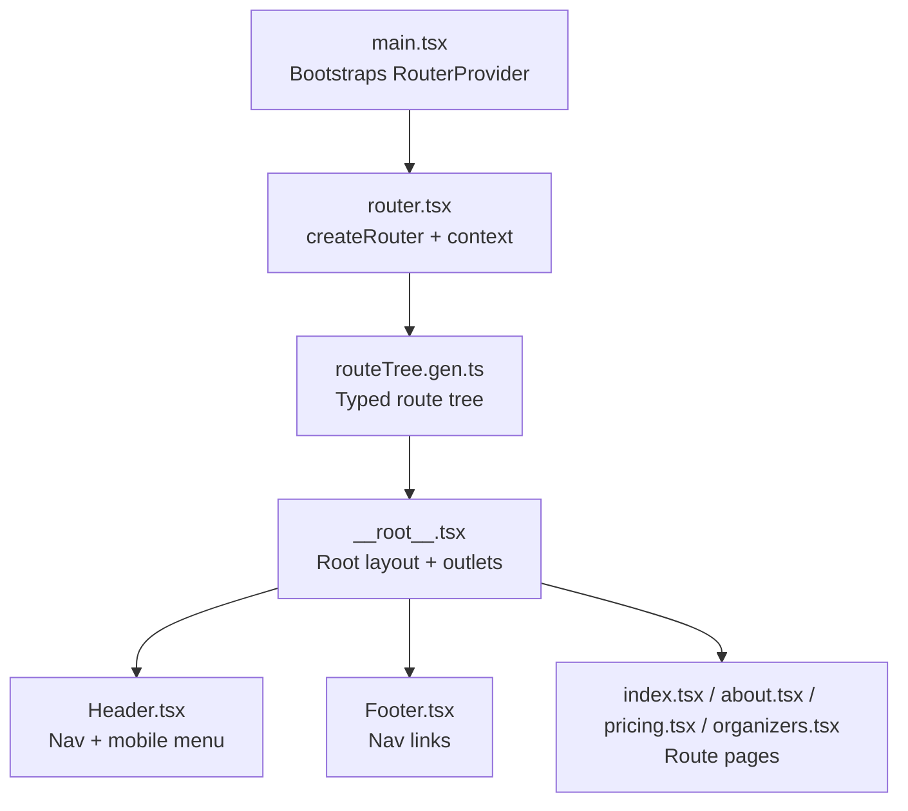

**Diagram sources**
- [main.tsx:1-21](file://src/main.tsx#L1-L21)
- [router.tsx:1-17](file://src/router.tsx#L1-L17)
- [routeTree.gen.ts:1-132](file://src/routeTree.gen.ts#L1-L132)
- [__root__.tsx:1-61](file://src/routes/__root.tsx#L1-L61)
- [Header.tsx:1-84](file://src/components/site/Header.tsx#L1-L84)
- [Footer.tsx:1-44](file://src/components/site/Footer.tsx#L1-L44)
- [index.tsx:1-350](file://src/routes/index.tsx#L1-L350)
- [about.tsx:1-237](file://src/routes/about.tsx#L1-L237)
- [pricing.tsx:1-241](file://src/routes/pricing.tsx#L1-L241)
- [organizers.tsx:1-179](file://src/routes/organizers.tsx#L1-L179)

**Section sources**
- [main.tsx:1-21](file://src/main.tsx#L1-L21)
- [router.tsx:1-17](file://src/router.tsx#L1-L17)
- [routeTree.gen.ts:1-132](file://src/routeTree.gen.ts#L1-L132)

## Core Components
- Router initialization and context provider: The router is created with a QueryClient in context and scroll restoration enabled. The RouterProvider is mounted at the root.
- Root layout: Wraps header, outlet, and footer; provides error and not-found components.
- Navigation UI: Header contains desktop and mobile navigation with active link highlighting; Footer contains navigational links.
- Route pages: Each route defines metadata and renders page-specific content.

**Section sources**
- [router.tsx:5-16](file://src/router.tsx#L5-L16)
- [__root__.tsx:43-60](file://src/routes/__root.tsx#L43-L60)
- [Header.tsx:13-83](file://src/components/site/Header.tsx#L13-L83)
- [Footer.tsx:3-43](file://src/components/site/Footer.tsx#L3-L43)

## Architecture Overview
The navigation stack is TanStack Router-driven. Links are rendered declaratively; the router manages transitions, scroll restoration, and route context. The root route composes shared UI and outlets for page content.

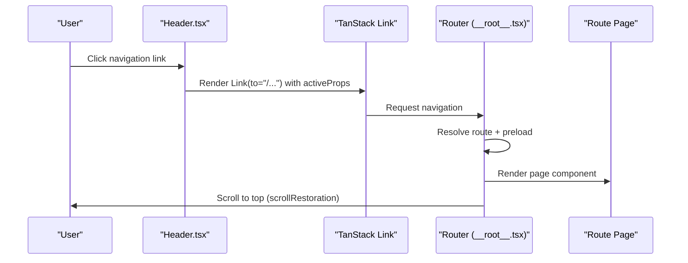

**Diagram sources**
- [Header.tsx:27-35](file://src/components/site/Header.tsx#L27-L35)
- [__root__.tsx:49-60](file://src/routes/__root.tsx#L49-L60)
- [router.tsx:8-13](file://src/router.tsx#L8-L13)

## Detailed Component Analysis

### Declarative Navigation with Link
- Active link highlighting: Desktop links in the Header use activeProps to set an active class when the current route matches.
- Footer links: Provide quick navigation to core sections; external links open in a new tab.
- Route pages: Use Link to navigate internally (e.g., “See Pricing” on About page).

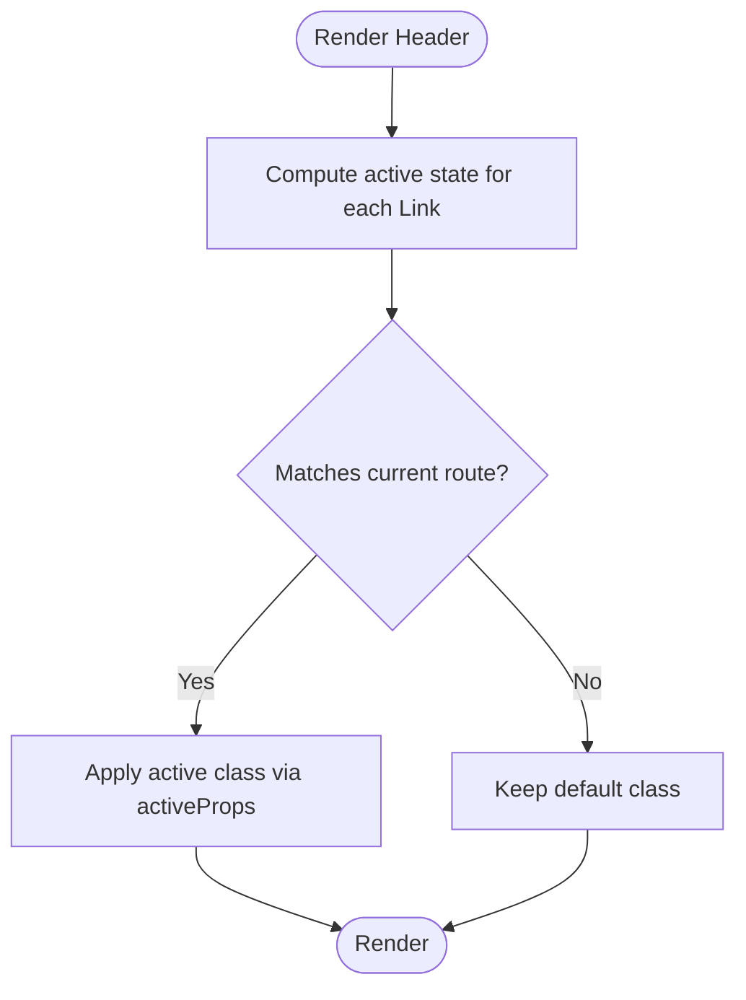

**Diagram sources**
- [Header.tsx:27-35](file://src/components/site/Header.tsx#L27-L35)

**Section sources**
- [Header.tsx:27-35](file://src/components/site/Header.tsx#L27-L35)
- [Footer.tsx:21-26](file://src/components/site/Footer.tsx#L21-L26)
- [about.tsx:229-231](file://src/routes/about.tsx#L229-L231)

### Programmatic Navigation
- Accessing the router: The root route exposes the router instance via useRouter, enabling programmatic navigation and cache invalidation.
- Example usage: Error page buttons call router.invalidate and reset to retry failed route loads.

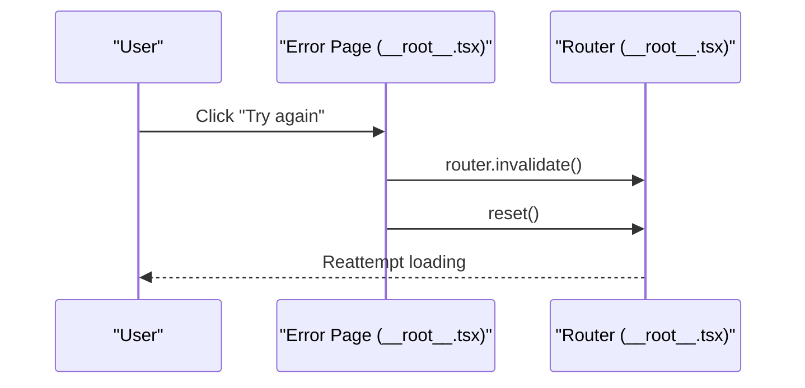

**Diagram sources**
- [__root__.tsx:24-41](file://src/routes/__root.tsx#L24-L41)

**Section sources**
- [__root__.tsx:24-41](file://src/routes/__root.tsx#L24-L41)

### Route Transitions and Scroll Restoration
- Scroll restoration: Enabled in router configuration, restoring scroll position on navigation.
- Preloading: defaultPreloadStaleTime is set to zero to avoid stale preloads.

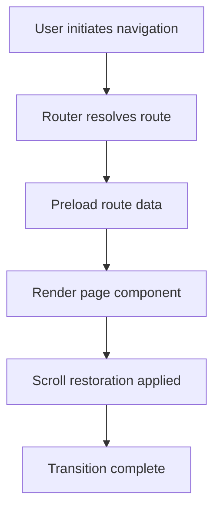

**Diagram sources**
- [router.tsx:11-12](file://src/router.tsx#L11-L12)

**Section sources**
- [router.tsx:11-12](file://src/router.tsx#L11-L12)

### Navigation Guards and Error Handling
- Not found handling: Root route defines a notFoundComponent that renders a friendly message and a Link back to home.
- Error handling: Root route defines an errorComponent that logs the error, provides a retry action via router.invalidate/reset, and displays a friendly message.

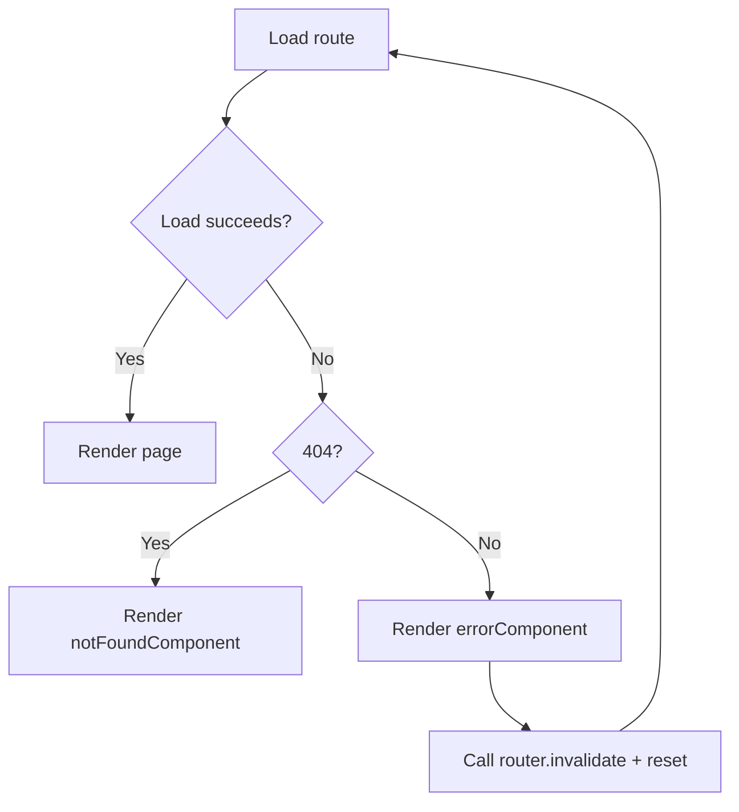

**Diagram sources**
- [__root__.tsx:12-47](file://src/routes/__root__.tsx#L12-L47)

**Section sources**
- [__root__.tsx:12-47](file://src/routes/__root.tsx#L12-L47)

### Mobile Navigation Patterns
- Responsive layout: Desktop nav is hidden on mobile; a mobile menu toggles visibility.
- Active state: Mobile links update active state and close the menu on click.
- Breakpoint: A custom hook detects mobile breakpoints to control responsive behavior.

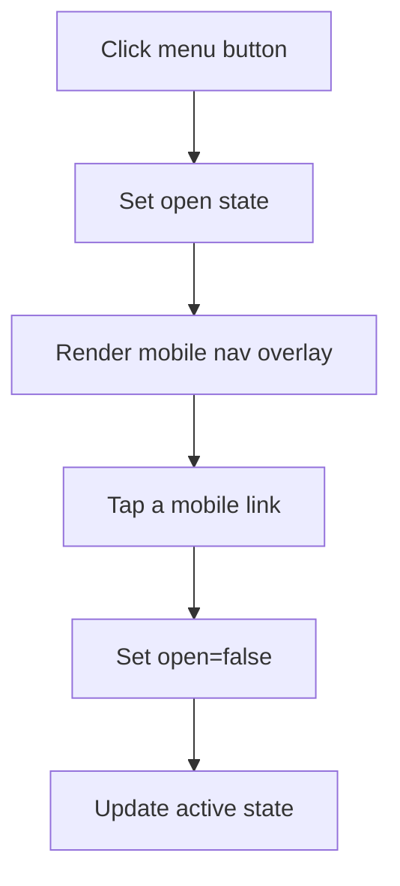

**Diagram sources**
- [Header.tsx:14-83](file://src/components/site/Header.tsx#L14-L83)
- [use-mobile.tsx:1-20](file://src/hooks/use-mobile.tsx#L1-L20)

**Section sources**
- [Header.tsx:14-83](file://src/components/site/Header.tsx#L14-L83)
- [use-mobile.tsx:1-20](file://src/hooks/use-mobile.tsx#L1-L20)

### External Portal Integration Workflows
- Apply Now buttons and links: Open the external application portal in a new tab with noreferrer for security.
- Consistent behavior: Both the Header and CTA components use the same portal URL constant.

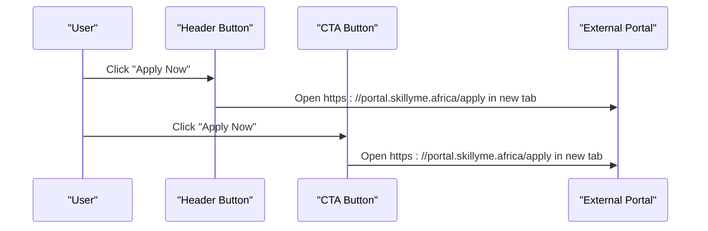

**Diagram sources**
- [Header.tsx:39-54](file://src/components/site/Header.tsx#L39-L54)
- [CTA.tsx:3-17](file://src/components/site/CTA.tsx#L3-L17)

**Section sources**
- [Header.tsx:39-54](file://src/components/site/Header.tsx#L39-L54)
- [CTA.tsx:3-17](file://src/components/site/CTA.tsx#L3-L17)
- [apply.tsx:54-65](file://src/routes/apply.tsx#L54-L65)

### Navigation State Management and Active Link Highlighting
- Active link state: TanStack Router Link computes active/inactive props and applies className/style accordingly.
- Root-level context: The router instance is registered globally for type safety and programmatic access.

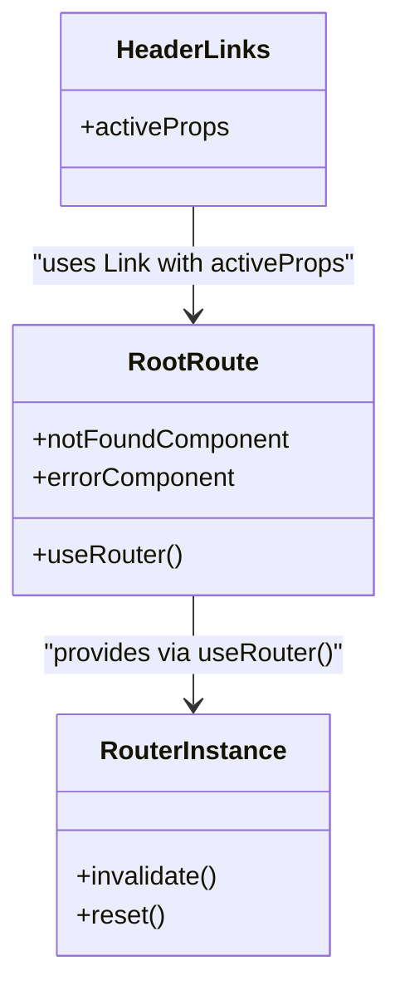

**Diagram sources**
- [__root__.tsx:24-41](file://src/routes/__root__.tsx#L24-L41)
- [Header.tsx:27-35](file://src/components/site/Header.tsx#L27-L35)
- [main.tsx:10-14](file://src/main.tsx#L10-L14)

**Section sources**
- [Header.tsx:27-35](file://src/components/site/Header.tsx#L27-L35)
- [__root__.tsx:24-41](file://src/routes/__root__.tsx#L24-L41)
- [main.tsx:10-14](file://src/main.tsx#L10-L14)

### Common Navigation Scenarios
- Returning to previous pages: Programmatic navigation via router instance supports history-aware actions (e.g., invalidate/reset).
- Navigating between program sections: Internal Link usage across pages (e.g., “See Pricing”).
- External portal integration: New-tab links to the application portal.

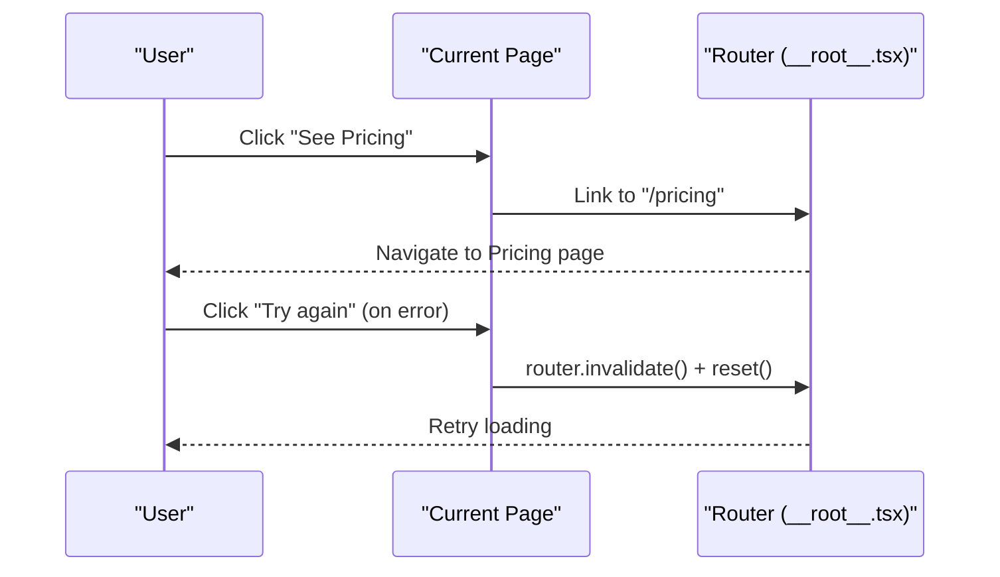

**Diagram sources**
- [about.tsx:229-231](file://src/routes/about.tsx#L229-L231)
- [__root__.tsx:24-41](file://src/routes/__root__.tsx#L24-L41)

**Section sources**
- [about.tsx:229-231](file://src/routes/about.tsx#L229-L231)
- [__root__.tsx:24-41](file://src/routes/__root__.tsx#L24-L41)

## Dependency Analysis
The navigation system depends on TanStack Router for routing, with a typed route tree and a root layout that composes shared UI and outlets.

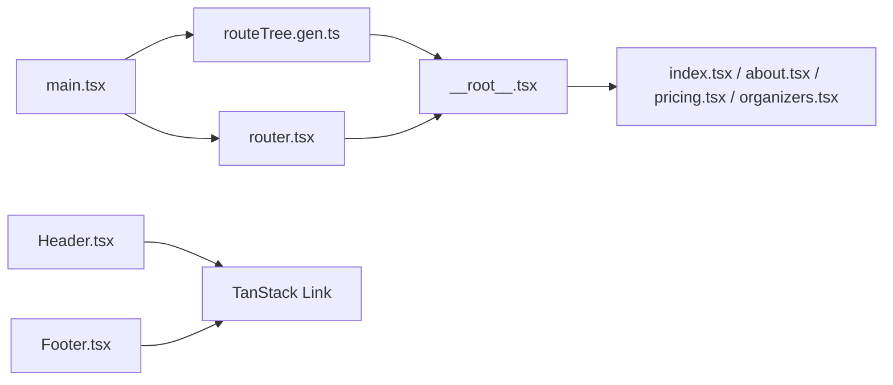

**Diagram sources**
- [routeTree.gen.ts:1-132](file://src/routeTree.gen.ts#L1-L132)
- [__root__.tsx:1-61](file://src/routes/__root.tsx#L1-L61)
- [main.tsx:1-21](file://src/main.tsx#L1-L21)
- [router.tsx:1-17](file://src/router.tsx#L1-L17)
- [Header.tsx:1-84](file://src/components/site/Header.tsx#L1-L84)
- [Footer.tsx:1-44](file://src/components/site/Footer.tsx#L1-L44)
- [index.tsx:1-350](file://src/routes/index.tsx#L1-L350)
- [about.tsx:1-237](file://src/routes/about.tsx#L1-L237)
- [pricing.tsx:1-241](file://src/routes/pricing.tsx#L1-L241)
- [organizers.tsx:1-179](file://src/routes/organizers.tsx#L1-L179)

**Section sources**
- [routeTree.gen.ts:1-132](file://src/routeTree.gen.ts#L1-L132)
- [main.tsx:1-21](file://src/main.tsx#L1-L21)
- [router.tsx:1-17](file://src/router.tsx#L1-L17)

## Performance Considerations
- Preload strategy: defaultPreloadStaleTime is set to zero to avoid stale preloads; consider increasing for frequently visited routes if needed.
- Scroll restoration: Enabled to improve perceived performance by restoring user position.
- Mobile responsiveness: Using a breakpoint hook avoids unnecessary re-renders and ensures smooth menu toggling.

[No sources needed since this section provides general guidance]

## Troubleshooting Guide
- 404 pages: The notFoundComponent provides a friendly message and a Link back to home.
- Route errors: The errorComponent logs the error and offers a retry action via router.invalidate/reset.
- Active link issues: Verify activeProps usage on Link and ensure the route path matches the Link to prop.

**Section sources**
- [__root__.tsx:12-47](file://src/routes/__root__.tsx#L12-L47)

## Conclusion
The application leverages TanStack Router for robust, type-safe navigation. Declarative Link components manage active states and transitions, while programmatic navigation enables error recovery and advanced flows. Scroll restoration and responsive mobile patterns enhance usability. External portal integration is handled consistently via new-tab links. These patterns provide a solid foundation for predictable navigation across the application.

[No sources needed since this section summarizes without analyzing specific files]

## Appendices
- Navigation analytics: Integrate analytics libraries by wrapping Link and capturing router events at the root level. Use router.subscribe to track navigation changes and emit events to your analytics backend.

[No sources needed since this section provides general guidance]