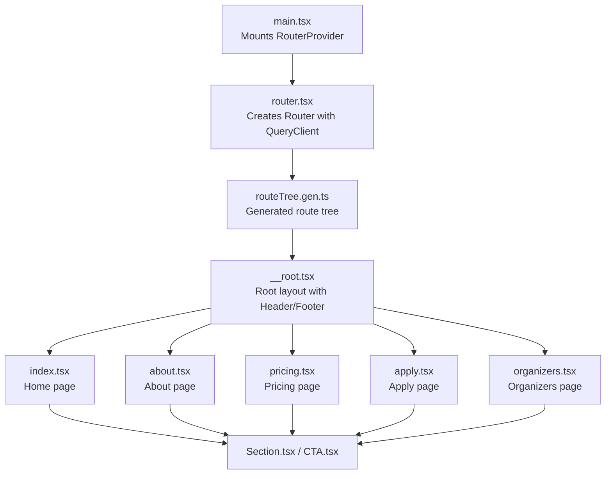
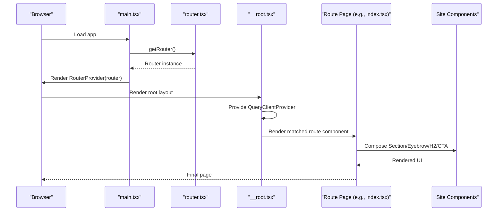
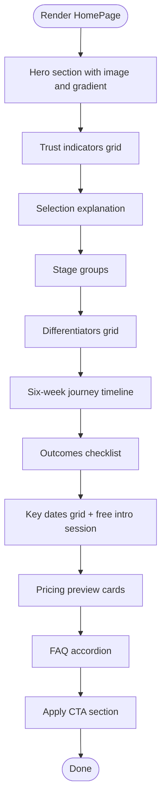
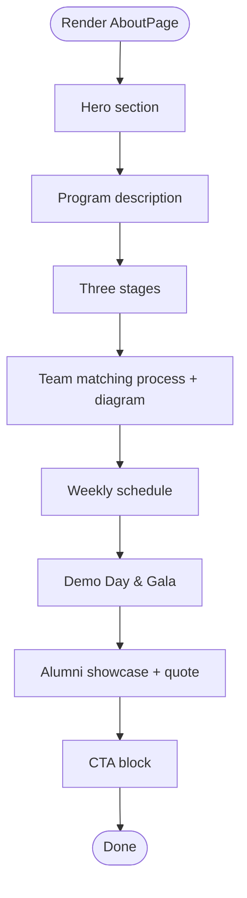
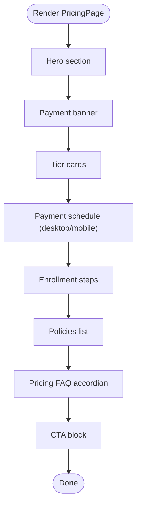
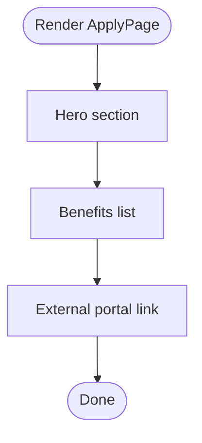
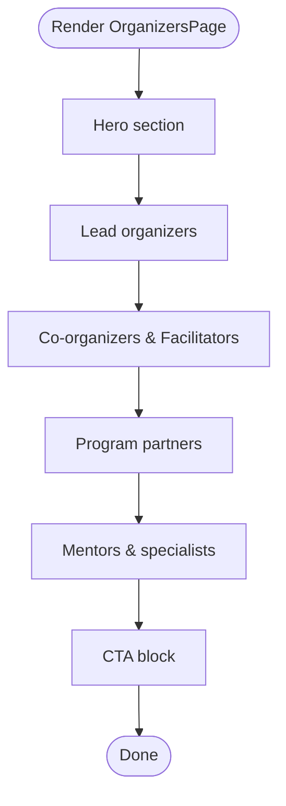
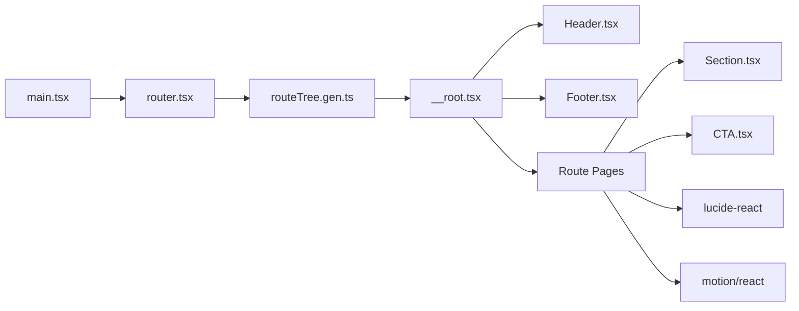

# Route Components

<cite>
**Referenced Files in This Document**
- [index.tsx](file://src/routes/index.tsx)
- [about.tsx](file://src/routes/about.tsx)
- [pricing.tsx](file://src/routes/pricing.tsx)
- [apply.tsx](file://src/routes/apply.tsx)
- [organizers.tsx](file://src/routes/organizers.tsx)
- [__root.tsx](file://src/routes/__root.tsx)
- [router.tsx](file://src/router.tsx)
- [main.tsx](file://src/main.tsx)
- [routeTree.gen.ts](file://src/routeTree.gen.ts)
- [Section.tsx](file://src/components/site/Section.tsx)
- [CTA.tsx](file://src/components/site/CTA.tsx)
- [Header.tsx](file://src/components/site/Header.tsx)
- [error-capture.ts](file://src/lib/error-capture.ts)
- [error-page.ts](file://src/lib/error-page.ts)
- [package.json](file://package.json)
</cite>

## Table of Contents
1. [Introduction](#introduction)
2. [Project Structure](#project-structure)
3. [Core Components](#core-components)
4. [Architecture Overview](#architecture-overview)
5. [Detailed Component Analysis](#detailed-component-analysis)
6. [Dependency Analysis](#dependency-analysis)
7. [Performance Considerations](#performance-considerations)
8. [Troubleshooting Guide](#troubleshooting-guide)
9. [Conclusion](#conclusion)
10. [Appendices](#appendices)

## Introduction
This document explains the route components and their implementation patterns across the application. It focuses on the five primary pages: index.tsx (home), about.tsx, pricing.tsx, apply.tsx, and organizers.tsx. For each route, we describe the component structure, props handling, metadata configuration, and integration with the overall application flow. We also document the relationship between route files and their rendered pages, component composition patterns, and how the app manages errors and performance.

## Project Structure
The routing system is powered by TanStack Router. Routes are defined as file-based routes under src/routes, with a generated route tree that connects each route to the root layout. The root layout composes the shared Header and Footer and provides a QueryClient provider for data fetching. Site-specific components (Section, Eyebrow, H2, CTA) encapsulate common layout and call-to-action patterns.

**Diagram sources**
- [main.tsx:1-21](file://src/main.tsx#L1-L21)
- [router.tsx:1-17](file://src/router.tsx#L1-L17)
- [routeTree.gen.ts:1-132](file://src/routeTree.gen.ts#L1-L132)
- [__root.tsx:1-61](file://src/routes/__root.tsx#L1-L61)
- [index.tsx:1-350](file://src/routes/index.tsx#L1-L350)
- [about.tsx:1-237](file://src/routes/about.tsx#L1-L237)
- [pricing.tsx:1-241](file://src/routes/pricing.tsx#L1-L241)
- [apply.tsx:1-70](file://src/routes/apply.tsx#L1-L70)
- [organizers.tsx:1-179](file://src/routes/organizers.tsx#L1-L179)
- [Section.tsx:1-44](file://src/components/site/Section.tsx#L1-L44)
- [CTA.tsx:1-27](file://src/components/site/CTA.tsx#L1-L27)

**Section sources**
- [main.tsx:1-21](file://src/main.tsx#L1-L21)
- [router.tsx:1-17](file://src/router.tsx#L1-L17)
- [routeTree.gen.ts:1-132](file://src/routeTree.gen.ts#L1-L132)
- [__root.tsx:1-61](file://src/routes/__root.tsx#L1-L61)

## Core Components
- Route definition pattern: Each route file exports a named Route constant created via createFileRoute(path)({ head, component }). The head function defines HTML metadata (title, description, Open Graph). The component is the page’s React component.
- Root layout: __root.tsx composes Header and Footer, provides a QueryClientProvider, and registers notFoundComponent and errorComponent for global error handling.
- Shared site components:
  - Section: Provides responsive section containers with optional elevated tone and animated entrance.
  - Eyebrow and H2: Typography helpers for headings.
  - CTA: Reusable ApplyButton and CTABlock for calls-to-action.
- Navigation: Header.tsx renders a responsive navigation bar with active state styling and mobile menu.

**Section sources**
- [index.tsx:14-22](file://src/routes/index.tsx#L14-L22)
- [about.tsx:6-16](file://src/routes/about.tsx#L6-L16)
- [pricing.tsx:9-19](file://src/routes/pricing.tsx#L9-L19)
- [apply.tsx:7-17](file://src/routes/apply.tsx#L7-L17)
- [organizers.tsx:6-16](file://src/routes/organizers.tsx#L6-L16)
- [__root.tsx:43-47](file://src/routes/__root.tsx#L43-L47)
- [Section.tsx:4-29](file://src/components/site/Section.tsx#L4-L29)
- [CTA.tsx:5-26](file://src/components/site/CTA.tsx#L5-L26)
- [Header.tsx:6-11](file://src/components/site/Header.tsx#L6-L11)

## Architecture Overview
The runtime architecture ties together routing, layout, and page components. The router is initialized with a QueryClient and passed into the root layout. Each route page composes reusable site components to maintain consistent structure and styling.

**Diagram sources**
- [main.tsx:1-21](file://src/main.tsx#L1-L21)
- [router.tsx:1-17](file://src/router.tsx#L1-L17)
- [__root.tsx:49-60](file://src/routes/__root.tsx#L49-L60)
- [index.tsx:98-349](file://src/routes/index.tsx#L98-L349)
- [Section.tsx:1-44](file://src/components/site/Section.tsx#L1-L44)
- [CTA.tsx:1-27](file://src/components/site/CTA.tsx#L1-L27)

## Detailed Component Analysis

### Home Page (index.tsx)
- Purpose: Marketing and conversion hub for Cohort 2. Presents hero, trust indicators, selection criteria, differentiators, journey timeline, outcomes, key dates, pricing preview, FAQ, and application CTA.
- Props handling: None; page is self-contained.
- Composition:
  - Uses Section, Eyebrow, H2 for content blocks.
  - Uses ApplyButton for external application portal links.
  - Uses motion animations for hero and section entrances.
  - Uses Accordion for FAQ.
- Metadata: Sets title and description for SEO and social previews.
- Lifecycle: Stateless functional component; relies on TanStack Router for mounting/unmounting.
- Error handling: Delegated to root-level errorComponent.
- Performance: Minimal re-renders; static arrays define content; motion animations configured via props.

**Diagram sources**
- [index.tsx:98-349](file://src/routes/index.tsx#L98-L349)

**Section sources**
- [index.tsx:14-22](file://src/routes/index.tsx#L14-L22)
- [index.tsx:98-349](file://src/routes/index.tsx#L98-L349)
- [Section.tsx:4-29](file://src/components/site/Section.tsx#L4-L29)
- [CTA.tsx:5-17](file://src/components/site/CTA.tsx#L5-L17)

### About Page (about.tsx)
- Purpose: Describe Cohort 2: Build Track — goals, team roles, matching process, time commitment, demo day, and alumni highlights.
- Props handling: None; page is self-contained.
- Composition:
  - Uses Section, Eyebrow, H2 for content blocks.
  - Renders a team-role diagram with SVG and icons.
  - Lists steps for team matching and weekly schedule.
  - Includes alumni testimonials and showcase.
- Metadata: Sets title, description, and OG tags for social sharing.
- Lifecycle: Stateless functional component.
- Error handling: Delegated to root-level errorComponent.
- Performance: Static content; SVG rendering is lightweight.

**Diagram sources**
- [about.tsx:28-236](file://src/routes/about.tsx#L28-L236)

**Section sources**
- [about.tsx:6-16](file://src/routes/about.tsx#L6-L16)
- [about.tsx:28-236](file://src/routes/about.tsx#L28-L236)
- [Section.tsx:4-29](file://src/components/site/Section.tsx#L4-L29)

### Pricing Page (pricing.tsx)
- Purpose: Present pricing tiers, payment schedules, step-by-step enrollment process, policies, and FAQs.
- Props handling: None; page is self-contained.
- Composition:
  - Uses Section, Eyebrow, H2 for content blocks.
  - Renders tier cards with featured highlighting.
  - Provides desktop and mobile-friendly payment schedules.
  - Includes step-by-step enrollment and policy lists.
  - Uses Accordion for FAQ.
- Metadata: Sets title, description, and OG tags.
- Lifecycle: Stateless functional component.
- Error handling: Delegated to root-level errorComponent.
- Performance: Static data; responsive tables adapt to screen size.

**Diagram sources**
- [pricing.tsx:81-240](file://src/routes/pricing.tsx#L81-L240)

**Section sources**
- [pricing.tsx:9-19](file://src/routes/pricing.tsx#L9-L19)
- [pricing.tsx:81-240](file://src/routes/pricing.tsx#L81-L240)
- [Section.tsx:4-29](file://src/components/site/Section.tsx#L4-L29)

### Apply Page (apply.tsx)
- Purpose: Drive applications to the external portal with clear messaging and prominent CTA.
- Props handling: None; page is self-contained.
- Composition:
  - Uses Section, Eyebrow, H2 for content.
  - Links to external application portal with target and rel attributes.
  - Highlights time, cost, and IP retention benefits.
- Metadata: Sets title, description, and OG tags.
- Lifecycle: Stateless functional component.
- Error handling: Delegated to root-level errorComponent.
- Performance: Minimal DOM; external link opens in new tab.

**Diagram sources**
- [apply.tsx:19-69](file://src/routes/apply.tsx#L19-L69)

**Section sources**
- [apply.tsx:7-17](file://src/routes/apply.tsx#L7-L17)
- [apply.tsx:19-69](file://src/routes/apply.tsx#L19-L69)

### Organizers Page (organizers.tsx)
- Purpose: Introduce lead organizers, co-organizers, program partners, and mentors.
- Props handling: None; page is self-contained.
- Composition:
  - Uses Section, Eyebrow, H2 for content blocks.
  - Displays lead organizers and partner organizations with links.
  - Mentions curated mentor pool and upcoming announcements.
- Metadata: Sets title, description, and OG tags.
- Lifecycle: Stateless functional component.
- Error handling: Delegated to root-level errorComponent.
- Performance: Static content; minimal interactivity.

**Diagram sources**
- [organizers.tsx:18-178](file://src/routes/organizers.tsx#L18-L178)

**Section sources**
- [organizers.tsx:6-16](file://src/routes/organizers.tsx#L6-L16)
- [organizers.tsx:18-178](file://src/routes/organizers.tsx#L18-L178)
- [Section.tsx:4-29](file://src/components/site/Section.tsx#L4-L29)

## Dependency Analysis
- Routing dependencies:
  - main.tsx mounts RouterProvider with a router created in router.tsx.
  - router.tsx initializes TanStack Router with a generated routeTree from routeTree.gen.ts.
  - routeTree.gen.ts declares file routes and their parents, ensuring correct hierarchy.
- Layout and UI:
  - __root.tsx composes Header and Footer and provides a QueryClientProvider.
  - Site components (Section, CTA) are reused across pages.
- External integrations:
  - Pages link to an external application portal via anchor tags.
  - Icons are imported from lucide-react; animations from motion/react.

**Diagram sources**
- [main.tsx:1-21](file://src/main.tsx#L1-L21)
- [router.tsx:1-17](file://src/router.tsx#L1-L17)
- [routeTree.gen.ts:1-132](file://src/routeTree.gen.ts#L1-L132)
- [__root.tsx:1-61](file://src/routes/__root.tsx#L1-L61)
- [Header.tsx:1-84](file://src/components/site/Header.tsx#L1-L84)
- [Section.tsx:1-44](file://src/components/site/Section.tsx#L1-L44)
- [CTA.tsx:1-27](file://src/components/site/CTA.tsx#L1-L27)

**Section sources**
- [main.tsx:1-21](file://src/main.tsx#L1-L21)
- [router.tsx:1-17](file://src/router.tsx#L1-L17)
- [routeTree.gen.ts:1-132](file://src/routeTree.gen.ts#L1-L132)
- [Header.tsx:1-84](file://src/components/site/Header.tsx#L1-L84)

## Performance Considerations
- Rendering:
  - Pages are stateless and rely on reusable components, minimizing re-renders.
  - motion animations are configured with durations and easing; avoid excessive animation triggers.
- Data fetching:
  - A QueryClient is provided at the root; pages do not currently implement data fetching hooks.
  - If adding data fetching, prefer TanStack Router loaders or route-based preloading to improve perceived performance.
- Bundle size:
  - External libraries include TanStack Router, React Query, Radix UI, Lucide icons, and Motion. Keep imports scoped to reduce overhead.
- Accessibility:
  - Ensure external links open in new tabs with rel="noreferrer".
  - Maintain semantic headings and landmarks via Section, Eyebrow, and H2.

[No sources needed since this section provides general guidance]

## Troubleshooting Guide
- Global error handling:
  - Root layout registers an errorComponent that logs the error and allows retry via router invalidation.
- Server-side error capture:
  - Utilities capture unhandled errors and promise rejections for recovery scenarios.
- Static error page:
  - A fallback HTML error page is available for server-rendered contexts.
- Common issues:
  - Broken external links: Verify portal URLs and rel/target attributes.
  - Missing metadata: Confirm head() returns the expected meta entries in each route.
  - Animation glitches: Check motion configuration and viewport options in Section.

**Section sources**
- [__root.tsx:24-41](file://src/routes/__root.tsx#L24-L41)
- [error-capture.ts:1-28](file://src/lib/error-capture.ts#L1-L28)
- [error-page.ts:1-31](file://src/lib/error-page.ts#L1-L31)

## Conclusion
Each route component follows a consistent pattern: define metadata via head(), export a Route constant, and implement a page component that composes shared site components. The root layout centralizes layout and error handling, while the generated route tree ensures predictable navigation. Extending or creating new routes should mirror these patterns: export a Route with head() and component, reuse Section and CTA for consistency, and leverage the root layout for global behavior.

[No sources needed since this section summarizes without analyzing specific files]

## Appendices

### Creating a New Route Following Established Patterns
- Add a new file under src/routes/new-route.tsx.
- Export a Route constant using createFileRoute('/your-path') with:
  - head(): return meta entries for title, description, and OG tags.
  - component: your page component.
- Compose shared components (Section, Eyebrow, H2, CTA) for layout and CTAs.
- Import and register the route in the route tree if needed (TanStack Router auto-registers file routes).
- Add navigation links in Header.tsx if appropriate.

**Section sources**
- [index.tsx:14-22](file://src/routes/index.tsx#L14-L22)
- [about.tsx:6-16](file://src/routes/about.tsx#L6-L16)
- [pricing.tsx:9-19](file://src/routes/pricing.tsx#L9-L19)
- [apply.tsx:7-17](file://src/routes/apply.tsx#L7-L17)
- [organizers.tsx:6-16](file://src/routes/organizers.tsx#L6-L16)
- [Header.tsx:6-11](file://src/components/site/Header.tsx#L6-L11)

### Dependencies Overview
- Core routing and state: @tanstack/react-router, @tanstack/react-query
- UI primitives: @radix-ui/react-* components
- Icons: lucide-react
- Animations: motion
- Styling and utilities: Tailwind CSS, clsx, tailwind-merge

**Section sources**
- [package.json:14-66](file://package.json#L14-L66)