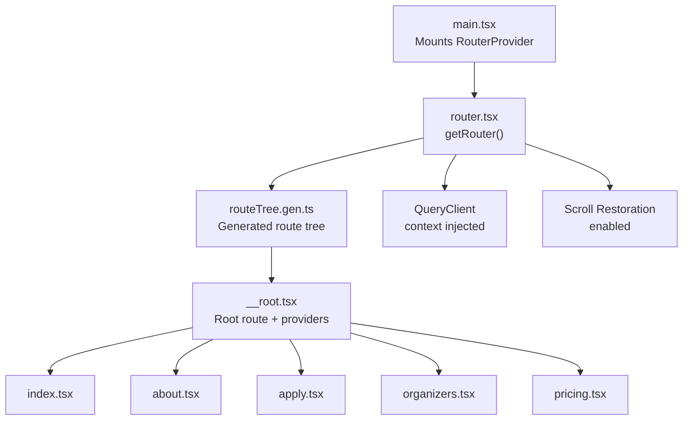
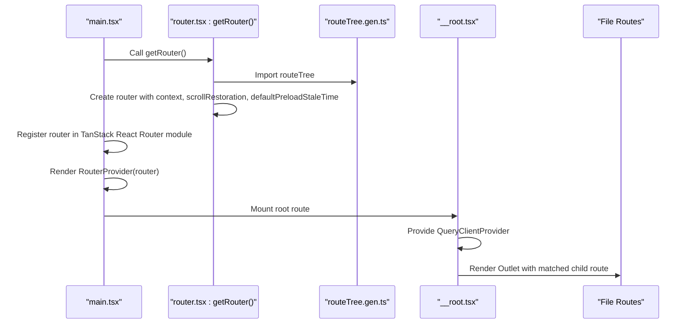
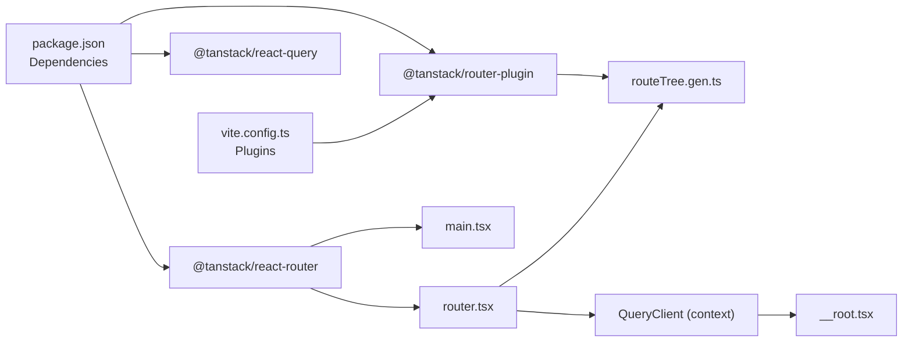

# Route Configuration

<cite>
**Referenced Files in This Document**
- [router.tsx](file://src/router.tsx)
- [routeTree.gen.ts](file://src/routeTree.gen.ts)
- [main.tsx](file://src/main.tsx)
- [__root.tsx](file://src/routes/__root.tsx)
- [index.tsx](file://src/routes/index.tsx)
- [about.tsx](file://src/routes/about.tsx)
- [apply.tsx](file://src/routes/apply.tsx)
- [organizers.tsx](file://src/routes/organizers.tsx)
- [pricing.tsx](file://src/routes/pricing.tsx)
- [vite.config.ts](file://vite.config.ts)
- [package.json](file://package.json)
- [tsconfig.json](file://tsconfig.json)
</cite>

## Table of Contents
1. [Introduction](#introduction)
2. [Project Structure](#project-structure)
3. [Core Components](#core-components)
4. [Architecture Overview](#architecture-overview)
5. [Detailed Component Analysis](#detailed-component-analysis)
6. [Dependency Analysis](#dependency-analysis)
7. [Performance Considerations](#performance-considerations)
8. [Troubleshooting Guide](#troubleshooting-guide)
9. [Conclusion](#conclusion)

## Introduction
This document explains the TanStack Router configuration and setup for the project. It covers router initialization, QueryClient context integration, scroll restoration, and the auto-generated route tree system. It also details how the generated route tree enables type-safe navigation, the router configuration options, and the relationship between routeTree.gen.ts and the actual route definitions. Practical examples are provided via file paths and code snippet references, along with performance optimization settings and benefits of compile-time safety and IDE support.

## Project Structure
The routing system is organized around:
- A generated route tree file that defines all routes and exposes type-safe helpers
- A router factory that configures TanStack Router with QueryClient context and scroll restoration
- A root route that wires the QueryClient provider and shared layout
- Individual file routes under src/routes that define pages and metadata
- Vite plugin integration for automatic route tree generation and code splitting

**Diagram sources**
- [main.tsx:1-21](file://src/main.tsx#L1-L21)
- [router.tsx:1-17](file://src/router.tsx#L1-L17)
- [routeTree.gen.ts:1-132](file://src/routeTree.gen.ts#L1-L132)
- [__root.tsx:1-61](file://src/routes/__root.tsx#L1-L61)
- [index.tsx:1-350](file://src/routes/index.tsx#L1-L350)
- [about.tsx:1-237](file://src/routes/about.tsx#L1-L237)
- [apply.tsx:1-70](file://src/routes/apply.tsx#L1-L70)
- [organizers.tsx:1-179](file://src/routes/organizers.tsx#L1-L179)
- [pricing.tsx:1-241](file://src/routes/pricing.tsx#L1-L241)

**Section sources**
- [main.tsx:1-21](file://src/main.tsx#L1-L21)
- [router.tsx:1-17](file://src/router.tsx#L1-L17)
- [routeTree.gen.ts:1-132](file://src/routeTree.gen.ts#L1-L132)
- [vite.config.ts:1-30](file://vite.config.ts#L1-L30)

## Core Components
- Router factory: Creates the router instance with routeTree, context, scrollRestoration, and defaultPreloadStaleTime.
- Generated route tree: Auto-generated file that mirrors route definitions and exposes type-safe route helpers.
- Root route: Provides QueryClientProvider and shared layout/error/not-found handling.
- File routes: Individual pages under src/routes that define components and metadata.
- Vite plugin: Integrates TanStack Router plugin for code splitting and route tree generation.

Key configuration highlights:
- QueryClient context is passed to the router and consumed in the root route to wrap the app with QueryClientProvider.
- Scroll restoration is enabled for smooth navigation.
- Default preload stale time is set to zero to avoid stale cache behavior by default.
- The TanStack Router plugin is configured with auto code splitting.

**Section sources**
- [router.tsx:5-16](file://src/router.tsx#L5-L16)
- [routeTree.gen.ts:11-42](file://src/routeTree.gen.ts#L11-L42)
- [__root.tsx:43-60](file://src/routes/__root.tsx#L43-L60)
- [vite.config.ts:8-15](file://vite.config.ts#L8-L15)

## Architecture Overview
The runtime architecture ties together the router, generated route tree, and route components. The main entry point mounts the RouterProvider with a registered router instance. The router uses the generated route tree and injects QueryClient into the route context. The root route composes the QueryClientProvider and renders the outlet for nested routes.

**Diagram sources**
- [main.tsx:7-14](file://src/main.tsx#L7-L14)
- [router.tsx:5-16](file://src/router.tsx#L5-L16)
- [routeTree.gen.ts:129-132](file://src/routeTree.gen.ts#L129-L132)
- [__root.tsx:43-60](file://src/routes/__root.tsx#L43-L60)

## Detailed Component Analysis

### Router Initialization and Configuration
- Router creation: The getRouter function initializes a QueryClient and constructs the router with routeTree, context containing the QueryClient, scrollRestoration enabled, and defaultPreloadStaleTime set to zero.
- Router registration: The router instance is registered in the TanStack React Router module declaration in main.tsx to enable type-safe usage across the app.
- Provider wiring: The root route consumes the injected queryClient from the router context and wraps the app with QueryClientProvider.

Benefits:
- Centralized QueryClient lifecycle and scope.
- Type-safe router access across components.
- Consistent scroll position restoration across navigations.
- Explicit control over preloading behavior.

**Section sources**
- [router.tsx:5-16](file://src/router.tsx#L5-L16)
- [main.tsx:9-14](file://src/main.tsx#L9-L14)
- [__root.tsx:43-60](file://src/routes/__root.tsx#L43-L60)

### Auto-Generated Route Tree System
- Generation: The routeTree.gen.ts file is auto-generated by the TanStack Router plugin and mirrors the route definitions under src/routes.
- Types: The file exports strongly typed helpers for route paths, ids, and children, enabling compile-time safe navigation.
- Composition: The generated routeTree is composed from the root route and its children, then augmented with type information.

Relationship to actual route definitions:
- Each route definition under src/routes contributes a route segment reflected in routeTree.gen.ts.
- The generated file updates automatically when route definitions change, ensuring type safety and preventing runtime mismatches.

Type-safe navigation benefits:
- Compile-time verification of route paths and ids.
- IDE autocomplete and refactoring support for route-related code.
- Reduced risk of typos and broken links.

**Section sources**
- [routeTree.gen.ts:7-10](file://src/routeTree.gen.ts#L7-L10)
- [routeTree.gen.ts:11-42](file://src/routeTree.gen.ts#L11-L42)
- [routeTree.gen.ts:129-132](file://src/routeTree.gen.ts#L129-L132)

### File Routes and Metadata
Each file route under src/routes defines:
- Head metadata for SEO and social sharing.
- A component for rendering the page content.
- Optional loaders or other route utilities.

Examples:
- Home page: Defines head metadata and a rich homepage component.
- About page: Defines head metadata and informational content.
- Apply page: Defines head metadata and a call-to-action to an external portal.
- Organizers page: Defines head metadata and team information.
- Pricing page: Defines head metadata and detailed pricing information.

These routes are composed into the generated route tree and rendered under the root route’s outlet.

**Section sources**
- [index.tsx:14-22](file://src/routes/index.tsx#L14-L22)
- [about.tsx:6-16](file://src/routes/about.tsx#L6-L16)
- [apply.tsx:7-17](file://src/routes/apply.tsx#L7-L17)
- [organizers.tsx:6-16](file://src/routes/organizers.tsx#L6-L16)
- [pricing.tsx:9-19](file://src/routes/pricing.tsx#L9-L19)

### Context Injection and Providers
- QueryClientProvider: The root route injects the QueryClient from the router context and wraps the app with QueryClientProvider, making queries and mutations available throughout the app.
- Error and not-found handling: The root route defines errorComponent and notFoundComponent to handle errors and unmatched routes globally.

Practical implications:
- Consistent caching and invalidation strategies across the app.
- Centralized error and not-found UI.
- Access to router utilities within route components via the route context.

**Section sources**
- [__root.tsx:43-60](file://src/routes/__root.tsx#L43-L60)

### Scroll Restoration Settings
- Enabled in router configuration: scrollRestoration is set to true, ensuring the browser restores scroll positions when navigating back and forth.
- Behavior: Improves perceived performance and UX by avoiding unnecessary reflows and maintaining user context.

**Section sources**
- [router.tsx:10-12](file://src/router.tsx#L10-L12)

### Default Preload Strategies
- Set to zero: defaultPreloadStaleTime is configured to zero, meaning preloaded data is considered stale immediately and will be refetched on subsequent visits.
- Impact: Ensures fresh data on navigation but may increase initial load times; suitable for content-sensitive pages.

**Section sources**
- [router.tsx:12-13](file://src/router.tsx#L12-L13)

### Vite Plugin Integration and Code Splitting
- Plugin: TanStack Router Vite plugin is included with autoCodeSplitting enabled, which improves performance by splitting route bundles.
- Resolution: Dedupe and alias configurations ensure consistent resolution and avoid duplicate packages.

**Section sources**
- [vite.config.ts:8-15](file://vite.config.ts#L8-L15)
- [vite.config.ts:16-28](file://vite.config.ts#L16-L28)

## Dependency Analysis
The routing stack depends on:
- TanStack Router for routing orchestration and context.
- TanStack React Router for React bindings and RouterProvider.
- TanStack Router plugin for Vite to generate routeTree.gen.ts and enable code splitting.
- TanStack React Query for QueryClient and caching.

**Diagram sources**
- [package.json:43-45](file://package.json#L43-L45)
- [vite.config.ts:3-10](file://vite.config.ts#L3-L10)
- [main.tsx:3-4](file://src/main.tsx#L3-L4)
- [router.tsx:1-3](file://src/router.tsx#L1-L3)
- [__root.tsx:1-2](file://src/routes/__root.tsx#L1-L2)

**Section sources**
- [package.json:14-66](file://package.json#L14-L66)
- [vite.config.ts:1-30](file://vite.config.ts#L1-L30)

## Performance Considerations
- Auto code splitting: Enabled via the TanStack Router Vite plugin, reducing initial bundle size and improving load times.
- Default preload stale time: Set to zero to avoid serving stale data; adjust based on content volatility and performance goals.
- Scroll restoration: Reduces layout thrashing by restoring positions, improving perceived performance.
- QueryClient scope: Centralized QueryClient reduces duplication and optimizes cache reuse.

Recommendations:
- Monitor cache hit rates and adjust defaultPreloadStaleTime for frequently changing content.
- Use route loaders and preloads judiciously to balance freshness and performance.
- Keep route definitions minimal and modular to maximize code splitting benefits.

**Section sources**
- [vite.config.ts:10-10](file://vite.config.ts#L10-L10)
- [router.tsx:12-13](file://src/router.tsx#L12-L13)

## Troubleshooting Guide
Common issues and resolutions:
- Missing route tree: Ensure the TanStack Router plugin is active in Vite and the routeTree.gen.ts file exists and is up to date.
- QueryClient not available: Verify the router context includes queryClient and the root route provides QueryClientProvider.
- Scroll restoration unexpected behavior: Confirm scrollRestoration is enabled and no custom history overrides are interfering.
- Type errors after route changes: Re-run the build or development server to regenerate routeTree.gen.ts and update types.

**Section sources**
- [routeTree.gen.ts:7-10](file://src/routeTree.gen.ts#L7-L10)
- [router.tsx:10-12](file://src/router.tsx#L10-L12)
- [__root.tsx:43-60](file://src/routes/__root.tsx#L43-L60)

## Conclusion
The project leverages TanStack Router’s auto-generated route tree to achieve compile-time safety and robust IDE support. The router is initialized with QueryClient context, scroll restoration, and explicit preload settings. The Vite plugin integrates code splitting and route generation, while the root route centralizes providers and error handling. Together, these configurations deliver a maintainable, type-safe, and performant routing system.