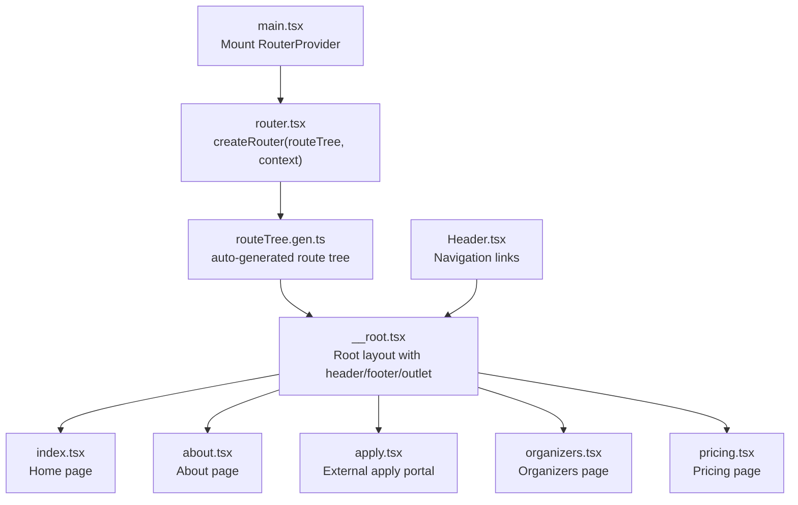
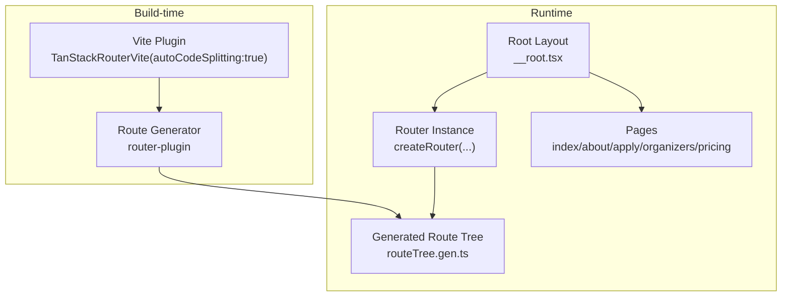
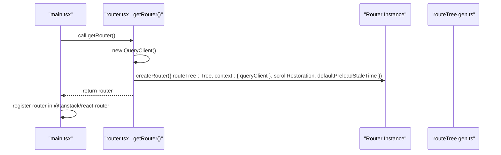
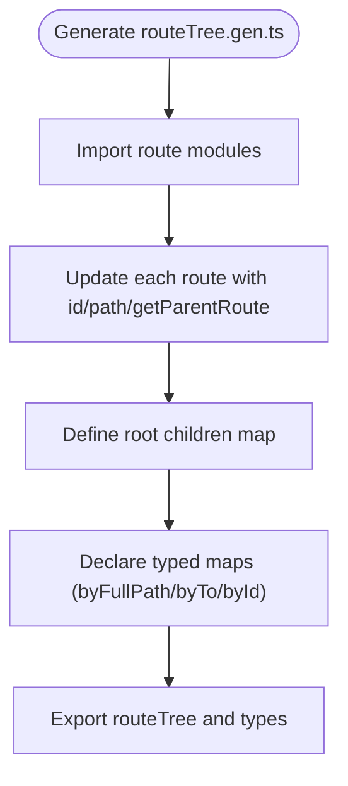
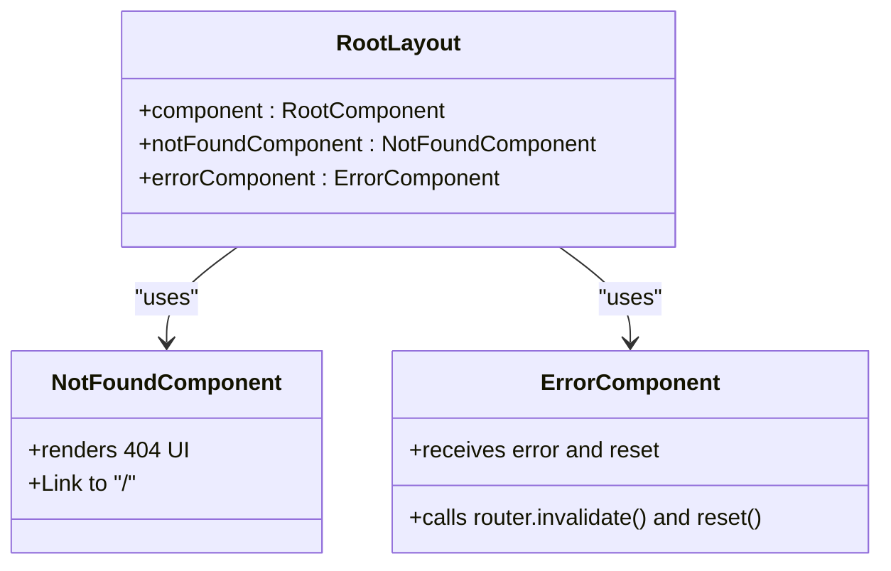
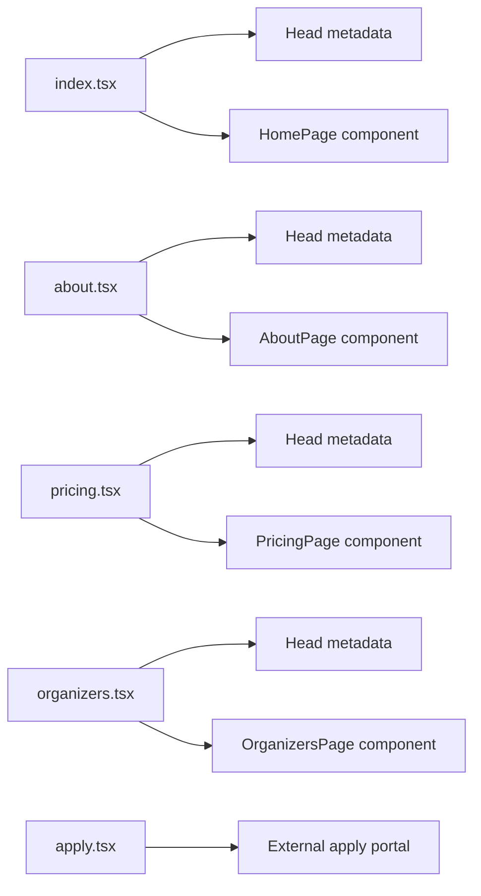
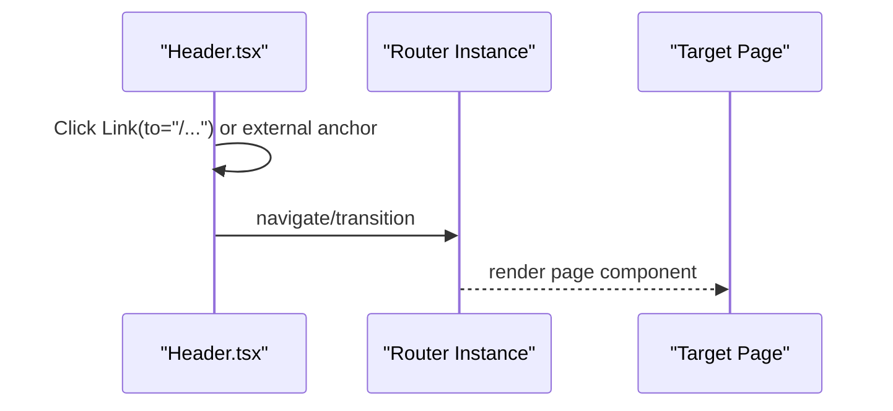
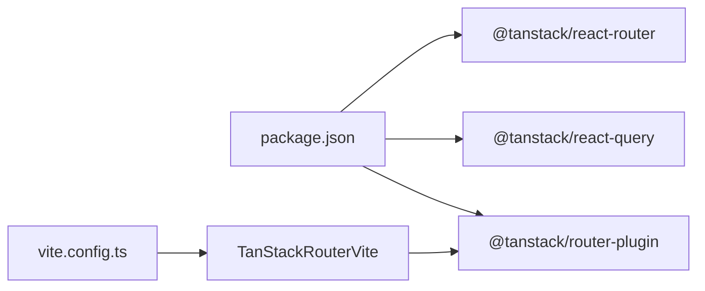

# Routing System

<cite>
**Referenced Files in This Document**
- [main.tsx](file://src/main.tsx)
- [router.tsx](file://src/router.tsx)
- [routeTree.gen.ts](file://src/routeTree.gen.ts)
- [__root.tsx](file://src/routes/__root.tsx)
- [index.tsx](file://src/routes/index.tsx)
- [about.tsx](file://src/routes/about.tsx)
- [apply.tsx](file://src/routes/apply.tsx)
- [organizers.tsx](file://src/routes/organizers.tsx)
- [pricing.tsx](file://src/routes/pricing.tsx)
- [Header.tsx](file://src/components/site/Header.tsx)
- [vite.config.ts](file://vite.config.ts)
- [package.json](file://package.json)
</cite>

## Table of Contents
1. [Introduction](#introduction)
2. [Project Structure](#project-structure)
3. [Core Components](#core-components)
4. [Architecture Overview](#architecture-overview)
5. [Detailed Component Analysis](#detailed-component-analysis)
6. [Dependency Analysis](#dependency-analysis)
7. [Performance Considerations](#performance-considerations)
8. [Troubleshooting Guide](#troubleshooting-guide)
9. [Conclusion](#conclusion)
10. [Appendices](#appendices)

## Introduction
This document explains the TanStack Router-based routing system used in the application. It covers the modern SPA navigation architecture, route definitions, and parameter handling. It documents the auto-generated route tree system and its benefits for type-safe navigation, route configuration (including nested routes, layout components, and route parameters), the relationship between route files and page components, navigation patterns, programmatic navigation, and route guards. It also describes code splitting and lazy loading strategies, performance optimizations, and practical examples for creating routes, implementing navigation, and extracting parameters. Finally, it addresses common routing scenarios such as program exploration, information gathering, and application initiation workflows.

## Project Structure
The routing system is organized around file-based routing with an auto-generated route tree. Routes are defined under src/routes as individual files, and TanStack Router’s Vite plugin generates a strongly typed route tree at build time. The root layout composes shared UI (header, footer) and renders child routes via an outlet. Navigation is handled via TanStack Router’s Link component and programmatic APIs.

**Diagram sources**
- [main.tsx:1-21](file://src/main.tsx#L1-L21)
- [router.tsx:1-17](file://src/router.tsx#L1-L17)
- [routeTree.gen.ts:1-132](file://src/routeTree.gen.ts#L1-L132)
- [__root.tsx:1-61](file://src/routes/__root.tsx#L1-L61)
- [index.tsx:1-350](file://src/routes/index.tsx#L1-L350)
- [about.tsx:1-237](file://src/routes/about.tsx#L1-L237)
- [apply.tsx:1-70](file://src/routes/apply.tsx#L1-L70)
- [organizers.tsx:1-179](file://src/routes/organizers.tsx#L1-L179)
- [pricing.tsx:1-241](file://src/routes/pricing.tsx#L1-L241)
- [Header.tsx:1-84](file://src/components/site/Header.tsx#L1-L84)

**Section sources**
- [main.tsx:1-21](file://src/main.tsx#L1-L21)
- [router.tsx:1-17](file://src/router.tsx#L1-L17)
- [routeTree.gen.ts:1-132](file://src/routeTree.gen.ts#L1-L132)
- [__root.tsx:1-61](file://src/routes/__root.tsx#L1-L61)
- [Header.tsx:1-84](file://src/components/site/Header.tsx#L1-L84)

## Core Components
- Router initialization: Creates a router instance with a typed route tree, React Query context, scroll restoration, and preload behavior.
- Auto-generated route tree: Built from route files and exposed as a typed tree for type-safe navigation.
- Root layout: Provides global layout (header, footer), outlet rendering, and error/not-found handling.
- Page components: Individual route files define metadata and page content.

Key responsibilities:
- Type-safe navigation via the generated route tree.
- Shared layout and error/not-found handling.
- Programmatic navigation and scroll restoration.

**Section sources**
- [router.tsx:5-16](file://src/router.tsx#L5-L16)
- [routeTree.gen.ts:11-132](file://src/routeTree.gen.ts#L11-L132)
- [__root.tsx:43-61](file://src/routes/__root.tsx#L43-L61)

## Architecture Overview
The routing architecture follows a file-based, convention-driven model with a generated route tree. The Vite plugin enables automatic code splitting and route generation. The root route composes shared UI and delegates rendering to child routes. Navigation is declarative via Link and imperative via router APIs.

**Diagram sources**
- [router.tsx:8-13](file://src/router.tsx#L8-L13)
- [routeTree.gen.ts:11-132](file://src/routeTree.gen.ts#L11-L132)
- [__root.tsx:49-60](file://src/routes/__root.tsx#L49-L60)
- [vite.config.ts:3-10](file://vite.config.ts#L3-L10)

**Section sources**
- [router.tsx:8-13](file://src/router.tsx#L8-L13)
- [routeTree.gen.ts:11-132](file://src/routeTree.gen.ts#L11-L132)
- [vite.config.ts:3-10](file://vite.config.ts#L3-L10)

## Detailed Component Analysis

### Router Initialization and Context
- Initializes a QueryClient and passes it to the router context.
- Enables scroll restoration and disables default stale-time for preload.
- Exposes a factory function to create the router instance.

**Diagram sources**
- [main.tsx:7-14](file://src/main.tsx#L7-L14)
- [router.tsx:5-16](file://src/router.tsx#L5-L16)
- [routeTree.gen.ts:129-131](file://src/routeTree.gen.ts#L129-L131)

**Section sources**
- [router.tsx:5-16](file://src/router.tsx#L5-L16)
- [main.tsx:7-14](file://src/main.tsx#L7-L14)

### Auto-Generated Route Tree
- Imports route modules and updates them with explicit ids and paths.
- Builds a typed route tree with children and type-safe lookup maps.
- Declares module augmentation for file-based route types.

Benefits:
- Type-safe navigation and typing for route parameters and loaders.
- Automatic code splitting and route registration.

**Diagram sources**
- [routeTree.gen.ts:11-132](file://src/routeTree.gen.ts#L11-L132)

**Section sources**
- [routeTree.gen.ts:11-132](file://src/routeTree.gen.ts#L11-L132)

### Root Layout and Error Handling
- Provides global layout with header, footer, and outlet.
- Defines not-found and error components with recovery actions.
- Uses React Query provider from router context.

**Diagram sources**
- [__root.tsx:43-61](file://src/routes/__root.tsx#L43-L61)

**Section sources**
- [__root.tsx:12-41](file://src/routes/__root.tsx#L12-L41)
- [__root.tsx:49-60](file://src/routes/__root.tsx#L49-L60)

### Route Files and Page Components
Each route file defines:
- Metadata via head().
- A page component.
- Optional programmatic navigation to external resources.

Examples:
- Home route defines SEO metadata and renders the landing page.
- About route defines SEO metadata and renders program details.
- Apply route redirects to an external portal.
- Organizers and Pricing routes render informational pages.

**Diagram sources**
- [index.tsx:14-22](file://src/routes/index.tsx#L14-L22)
- [about.tsx:6-16](file://src/routes/about.tsx#L6-L16)
- [pricing.tsx:9-19](file://src/routes/pricing.tsx#L9-L19)
- [organizers.tsx:6-16](file://src/routes/organizers.tsx#L6-L16)
- [apply.tsx:7-17](file://src/routes/apply.tsx#L7-L17)

**Section sources**
- [index.tsx:14-22](file://src/routes/index.tsx#L14-L22)
- [about.tsx:6-16](file://src/routes/about.tsx#L6-L16)
- [pricing.tsx:9-19](file://src/routes/pricing.tsx#L9-L19)
- [organizers.tsx:6-16](file://src/routes/organizers.tsx#L6-L16)
- [apply.tsx:7-17](file://src/routes/apply.tsx#L7-L17)

### Navigation Patterns and Programmatic Navigation
- Declarative navigation: Header.tsx uses Link to navigate between internal routes.
- Programmatic navigation: Router instance can be accessed via hooks to trigger navigation or invalidate queries.
- External navigation: Apply route opens an external portal in a new tab.

**Diagram sources**
- [Header.tsx:6-11](file://src/components/site/Header.tsx#L6-L11)
- [Header.tsx:25-36](file://src/components/site/Header.tsx#L25-L36)
- [apply.tsx:54-64](file://src/routes/apply.tsx#L54-L64)

**Section sources**
- [Header.tsx:6-11](file://src/components/site/Header.tsx#L6-L11)
- [Header.tsx:25-36](file://src/components/site/Header.tsx#L25-L36)
- [apply.tsx:54-64](file://src/routes/apply.tsx#L54-L64)

### Route Guards
- No explicit route guards are implemented in the current codebase.
- Authentication or authorization checks would typically be implemented using route loaders or middleware-like patterns in TanStack Router.

[No sources needed since this section does not analyze specific files]

### Parameter Handling
- The current routes do not define dynamic route parameters.
- If parameters were needed, they would be declared in route files and accessed via router APIs.

[No sources needed since this section does not analyze specific files]

## Dependency Analysis
The routing system relies on TanStack Router and related plugins. The Vite plugin enables auto code splitting and route generation. Dependencies include React Router, React Query, and the TanStack Router plugin.

**Diagram sources**
- [package.json:43-45](file://package.json#L43-L45)
- [package.json:44-46](file://package.json#L44-L46)
- [vite.config.ts:3-10](file://vite.config.ts#L3-L10)

**Section sources**
- [package.json:43-46](file://package.json#L43-L46)
- [vite.config.ts:3-10](file://vite.config.ts#L3-L10)

## Performance Considerations
- Auto code splitting: Enabled via the Vite plugin, ensuring route components are split and loaded on demand.
- Preload behavior: defaultPreloadStaleTime is set to zero to avoid stale preloads.
- Scroll restoration: Enabled to improve UX by restoring scroll positions after navigation.
- React Query integration: Shared query client reduces duplication and improves caching.

Recommendations:
- Use route loaders for data fetching to leverage React Query’s caching and invalidation.
- Consider route-level suspense boundaries for smoother transitions.
- Monitor bundle sizes and adjust code splitting thresholds if needed.

**Section sources**
- [vite.config.ts:10](file://vite.config.ts#L10)
- [router.tsx:11-12](file://src/router.tsx#L11-L12)
- [router.tsx:6](file://src/router.tsx#L6)

## Troubleshooting Guide
Common issues and resolutions:
- Route not found: Verify route paths in route files and ensure they match the generated route tree.
- Navigation not working: Confirm Link usage and that the router instance is registered in the app.
- Error handling: Use the error component to surface errors and provide recovery actions.
- External links: Ensure external URLs are correct and open in new tabs when appropriate.

**Section sources**
- [__root.tsx:24-41](file://src/routes/__root.tsx#L24-L41)
- [apply.tsx:54-64](file://src/routes/apply.tsx#L54-L64)

## Conclusion
The application uses a modern, type-safe routing system powered by TanStack Router. The auto-generated route tree ensures strong typing for navigation, while the root layout provides a consistent UI shell. The Vite plugin enables automatic code splitting and route generation. Current routes focus on information gathering and application initiation, with external redirection for the application portal. The system is extensible for future enhancements such as route guards, dynamic parameters, and advanced data loading strategies.

## Appendices

### Practical Examples

- Creating a new route:
  - Add a new file under src/routes with a createFileRoute(path) wrapper and a component.
  - Define head() metadata and export the Route object.
  - Reference the example in index.tsx for structure.

- Implementing navigation:
  - Use Link for internal navigation in Header.tsx.
  - Use router APIs for programmatic navigation in components.

- Extracting parameters:
  - Define dynamic segments in the route path and access them via router APIs in the component.

[No sources needed since this section provides general guidance]