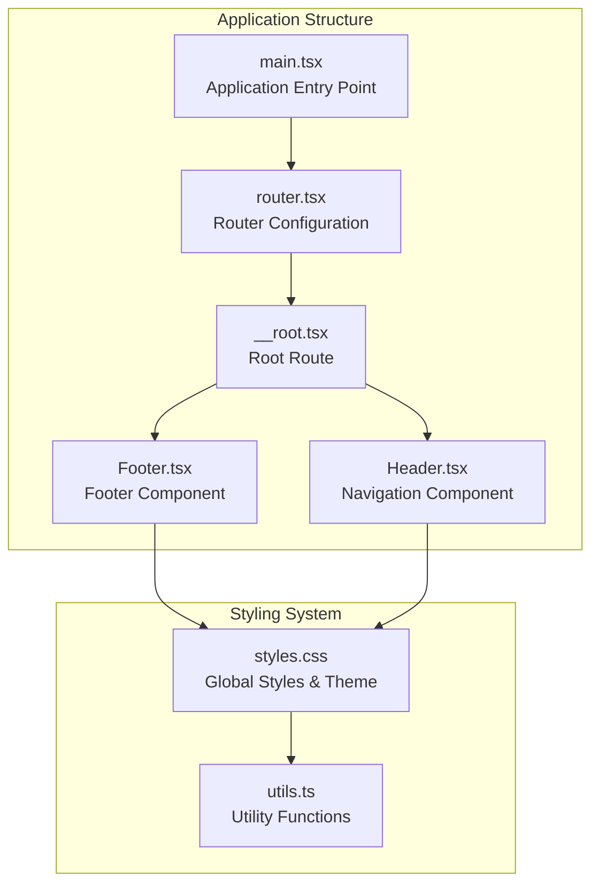
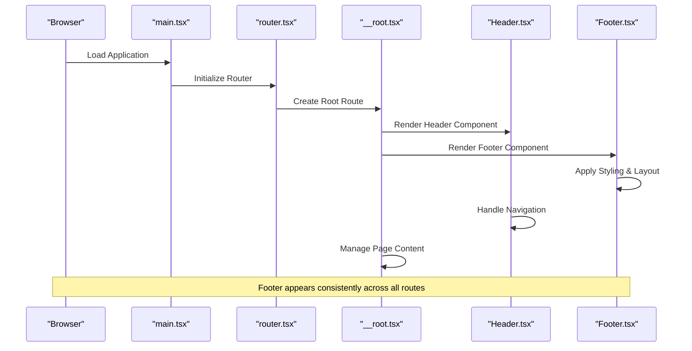
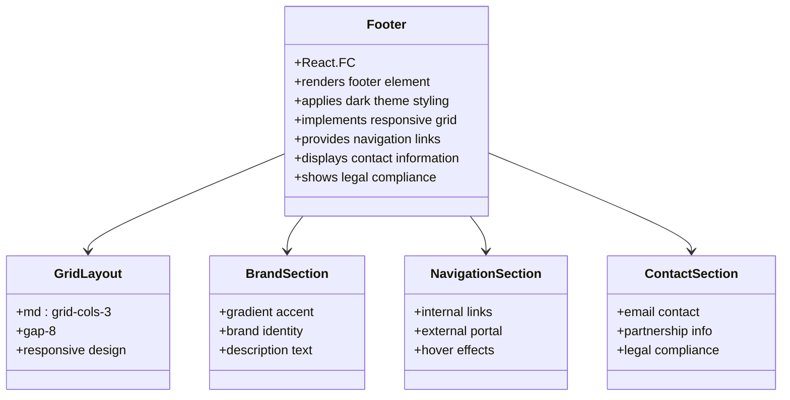
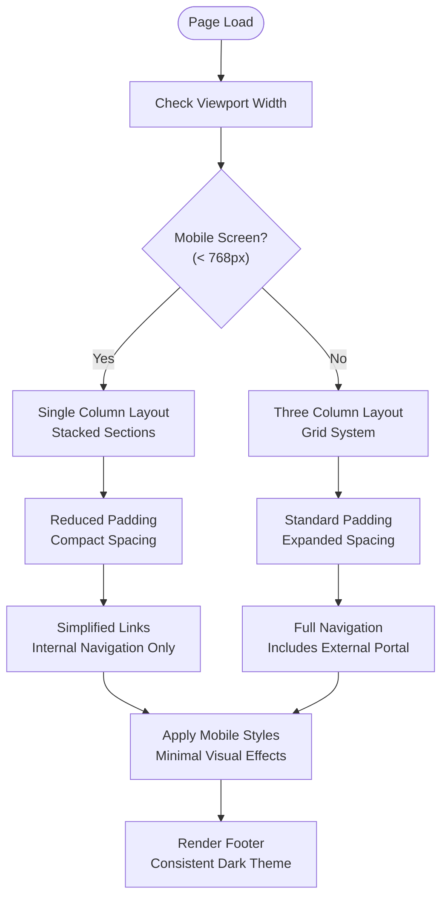
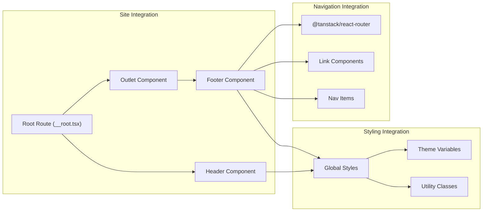
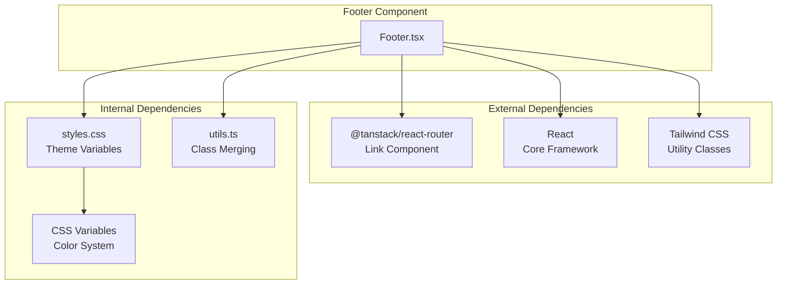

# Footer Component

<cite>
**Referenced Files in This Document**
- [Footer.tsx](file://src/components/site/Footer.tsx)
- [styles.css](file://src/styles.css)
- [__root.tsx](file://src/routes/__root.tsx)
- [Header.tsx](file://src/components/site/Header.tsx)
- [organizers.tsx](file://src/routes/organizers.tsx)
- [main.tsx](file://src/main.tsx)
- [router.tsx](file://src/router.tsx)
- [utils.ts](file://src/lib/utils.ts)
</cite>

## Table of Contents
1. [Introduction](#introduction)
2. [Project Structure](#project-structure)
3. [Core Components](#core-components)
4. [Architecture Overview](#architecture-overview)
5. [Detailed Component Analysis](#detailed-component-analysis)
6. [Dependency Analysis](#dependency-analysis)
7. [Performance Considerations](#performance-considerations)
8. [Troubleshooting Guide](#troubleshooting-guide)
9. [Conclusion](#conclusion)

## Introduction
The Footer component serves as a consistent navigational and informational element across all pages of the Skillyme Africa website. It provides essential navigation links, contact information, legal compliance statements, and maintains visual consistency with the site's dark theme design system. This documentation explains the component's structure, styling approach, responsive design patterns, and integration within the overall site architecture.

## Project Structure
The Footer component is part of the site components collection and integrates with the routing system through the root route configuration. The component follows a modular structure with clear separation of concerns between presentation, styling, and integration.

**Diagram sources**
- [main.tsx:1-21](file://src/main.tsx#L1-L21)
- [router.tsx:1-17](file://src/router.tsx#L1-L17)
- [__root.tsx:49-61](file://src/routes/__root.tsx#L49-L61)
- [Footer.tsx:1-44](file://src/components/site/Footer.tsx#L1-L44)
- [styles.css:1-136](file://src/styles.css#L1-L136)

**Section sources**
- [main.tsx:1-21](file://src/main.tsx#L1-L21)
- [router.tsx:1-17](file://src/router.tsx#L1-L17)
- [__root.tsx:49-61](file://src/routes/__root.tsx#L49-L61)

## Core Components
The Footer component consists of three primary content sections organized in a responsive grid layout:

### Layout Structure
- **Grid Container**: Responsive three-column layout using Tailwind CSS grid classes
- **Section 1 - Brand Identity**: Logo placeholder, gradient accent, and brand name
- **Section 2 - Navigation Links**: Primary navigation links with hover effects
- **Section 3 - Contact Information**: Email contact and partnership acknowledgments
- **Legal Footer**: Compliance statement and copyright information

### Content Organization
The component implements a clean, hierarchical information architecture with:
- Clear section headings with uppercase typography
- Consistent spacing using Tailwind's spacing scale
- Hover states for interactive elements
- Dark theme color palette integration

**Section sources**
- [Footer.tsx:3-43](file://src/components/site/Footer.tsx#L3-L43)

## Architecture Overview
The Footer component participates in the site's architectural pattern through the root route's outlet system, ensuring consistent placement across all pages while maintaining separation of concerns.

**Diagram sources**
- [main.tsx:1-21](file://src/main.tsx#L1-L21)
- [router.tsx:1-17](file://src/router.tsx#L1-L17)
- [__root.tsx:49-61](file://src/routes/__root.tsx#L49-L61)
- [Footer.tsx:1-44](file://src/components/site/Footer.tsx#L1-L44)

## Detailed Component Analysis

### Component Structure and Implementation
The Footer component utilizes a functional React approach with TypeScript integration, leveraging the TanStack Router's Link component for internal navigation.

**Diagram sources**
- [Footer.tsx:3-43](file://src/components/site/Footer.tsx#L3-L43)

### Styling Approach and Design System Integration
The Footer component seamlessly integrates with the site's comprehensive dark theme design system:

#### Color Palette Integration
- **Background**: Deep blue (#070B1A) for consistent dark theme
- **Text Colors**: White with varying opacity levels (70% for secondary text)
- **Accent Colors**: Primary teal (#00E0B8) and purple (#7B3CFF) gradients
- **Border Elements**: Subtle white/alpha borders (rgba 255,255,255,0.06)

#### Typography and Spacing
- **Font Family**: Plus Jakarta Sans for consistent typography
- **Text Hierarchy**: Uppercase headings with tracking, body text with reduced opacity
- **Responsive Spacing**: Padding scales from 4 to 8 units with larger screens

#### Gradient and Visual Effects
- **Amber Gradient**: Custom gradient utility for visual accents
- **Glass Morphism**: Backdrop blur effects for depth perception
- **Shadow Effects**: Subtle glow and elevation shadows

**Section sources**
- [Footer.tsx:4-5](file://src/components/site/Footer.tsx#L4-L5)
- [styles.css:45-79](file://src/styles.css#L45-L79)
- [styles.css:117-123](file://src/styles.css#L117-L123)

### Responsive Design Patterns
The Footer implements a sophisticated responsive design system:

**Diagram sources**
- [Footer.tsx:7](file://src/components/site/Footer.tsx#L7)
- [Header.tsx:55-62](file://src/components/site/Header.tsx#L55-L62)

#### Breakpoint Behavior
- **Mobile (< 768px)**: Single column layout with stacked sections
- **Desktop (≥ 768px)**: Three-column grid layout for optimal information density
- **Padding Adaptation**: Responsive padding scaling from 4/8 units to larger screen sizes

### Content Organization and Navigation
The Footer organizes information into three distinct sections:

#### Brand Identity Section
- **Visual Element**: Hidden skyline image placeholder for future integration
- **Gradient Accent**: Circular amber gradient element for visual interest
- **Brand Statement**: Cohort 2 program description with professional messaging

#### Navigation Section
- **Internal Links**: Home, About, Organizers, Pricing with Router Link components
- **External Portal**: Apply Now link to external application portal
- **Interactive States**: Hover effects with text color transitions

#### Contact and Legal Section
- **Contact Information**: Placeholder for email contact (to be configured)
- **Partnership Acknowledgment**: Corporate partnership recognition
- **Legal Compliance**: Data protection act compliance statement
- **Copyright Information**: Year-based copyright with brand identity

**Section sources**
- [Footer.tsx:8-35](file://src/components/site/Footer.tsx#L8-L35)
- [Footer.tsx:36-39](file://src/components/site/Footer.tsx#L36-L39)

### Accessibility Features
The Footer component incorporates several accessibility best practices:

#### Semantic Structure
- **HTML5 Footer Element**: Proper semantic markup for footer content
- **Logical Heading Hierarchy**: Clear section headings with appropriate levels
- **Descriptive Alt Text**: Alternative text for visual elements

#### Interactive Elements
- **Focus Management**: Visible focus indicators through outline styles
- **Hover States**: Sufficient contrast for interactive elements
- **Screen Reader Support**: Proper ARIA attributes and semantic markup

#### Color Contrast
- **WCAG Compliance**: Maintained color contrast ratios for readability
- **Dark Theme Optimization**: High contrast against dark backgrounds
- **Color Accessibility**: Careful selection of text and background combinations

### Integration Patterns
The Footer integrates seamlessly with the broader site architecture:

**Diagram sources**
- [__root.tsx:49-61](file://src/routes/__root.tsx#L49-L61)
- [Footer.tsx:1](file://src/components/site/Footer.tsx#L1)
- [Header.tsx:1](file://src/components/site/Header.tsx#L1)

**Section sources**
- [__root.tsx:9-10](file://src/routes/__root.tsx#L9-L10)
- [Footer.tsx:1](file://src/components/site/Footer.tsx#L1)

## Dependency Analysis
The Footer component has minimal but strategic dependencies that support its functionality and integration:

### External Dependencies
- **TanStack Router**: Provides Link component for internal navigation
- **React**: Core framework for component implementation
- **Tailwind CSS**: Utility-first styling system

### Internal Dependencies
- **Global Styles**: Access to theme variables and utility classes
- **Router Context**: Integration with application routing system
- **Utility Functions**: Class name merging utilities

**Diagram sources**
- [Footer.tsx:1](file://src/components/site/Footer.tsx#L1)
- [styles.css:8-43](file://src/styles.css#L8-L43)
- [utils.ts:4-6](file://src/lib/utils.ts#L4-L6)

**Section sources**
- [Footer.tsx:1](file://src/components/site/Footer.tsx#L1)
- [utils.ts:4-6](file://src/lib/utils.ts#L4-L6)

## Performance Considerations
The Footer component is designed for optimal performance through several implementation strategies:

### Lightweight Implementation
- **Minimal Dependencies**: Only essential imports reduce bundle size
- **Static Content**: Fixed content reduces dynamic rendering overhead
- **Efficient Styling**: Utility classes minimize CSS specificity conflicts

### Rendering Optimization
- **Pure Component Pattern**: Stateless component reduces re-render cycles
- **Static Markup**: Predefined structure eliminates runtime computation
- **CSS-in-JS Integration**: Direct style application avoids complex state management

### Bundle Impact
- **Tree Shaking**: Unused code elimination through modular imports
- **Lazy Loading**: No heavy dependencies that would require lazy loading
- **Minimal Imports**: Focused import strategy reduces overall bundle size

## Troubleshooting Guide

### Common Issues and Solutions

#### Styling Problems
- **Color Not Applying**: Verify theme variables are loaded in global styles
- **Layout Breaking**: Check Tailwind configuration and responsive breakpoints
- **Gradient Not Displaying**: Ensure CSS variables are properly defined

#### Navigation Issues
- **Links Not Working**: Verify Router configuration and route definitions
- **External Links Opening Incorrectly**: Check target and rel attributes
- **Active State Styling**: Confirm Router Link component usage

#### Content Updates
- **Text Changes Not Reflecting**: Ensure component re-renders after state updates
- **Dynamic Content Integration**: Consider prop-based content injection
- **Accessibility Testing**: Validate with screen readers and keyboard navigation

### Debugging Strategies
- **Console Logging**: Add temporary logging for component lifecycle events
- **CSS Inspection**: Use browser developer tools to inspect applied styles
- **Network Monitoring**: Verify asset loading for images and fonts
- **Performance Profiling**: Monitor component rendering performance

**Section sources**
- [Footer.tsx:25](file://src/components/site/Footer.tsx#L25)
- [styles.css:117-123](file://src/styles.css#L117-L123)

## Conclusion
The Footer component successfully delivers a consistent, accessible, and visually appealing footer experience across all pages of the Skillyme Africa website. Its implementation demonstrates strong adherence to modern React development practices, effective integration with the site's design system, and thoughtful consideration of responsive design principles.

The component's architecture supports easy maintenance and extension while maintaining performance optimization. The dark theme integration, color palette consistency, and accessibility features contribute to a cohesive user experience that aligns with the site's professional brand identity.

Future enhancements could include dynamic content integration, expanded social media connectivity, and additional customization options while maintaining the component's core design principles and performance characteristics.