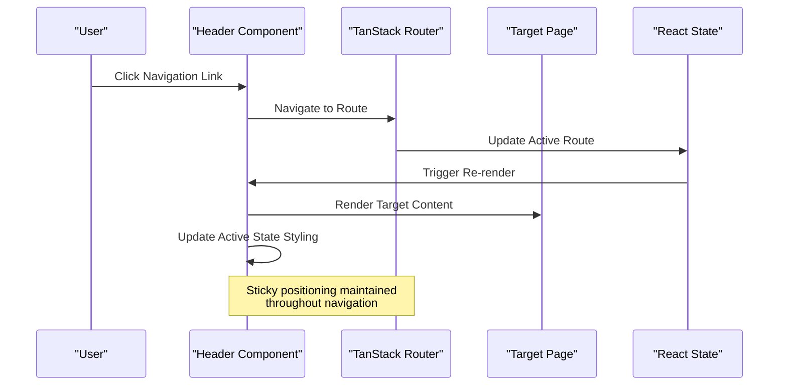
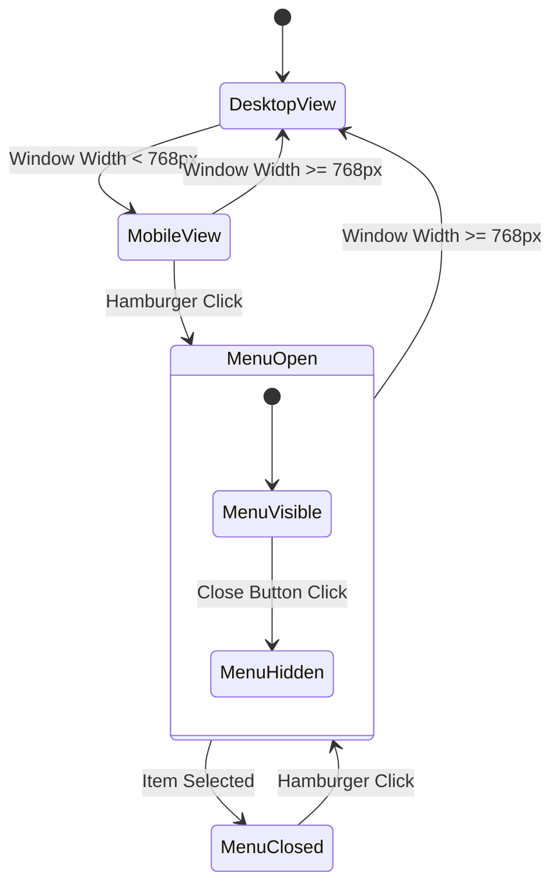
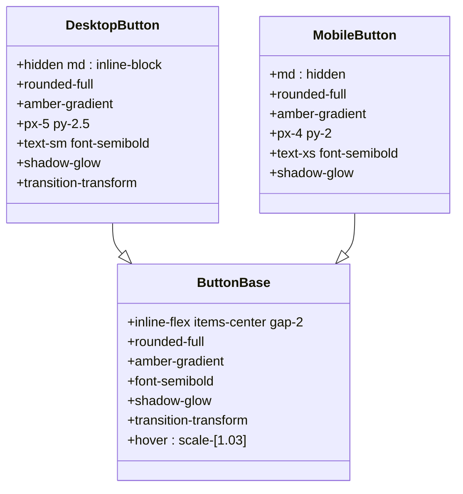
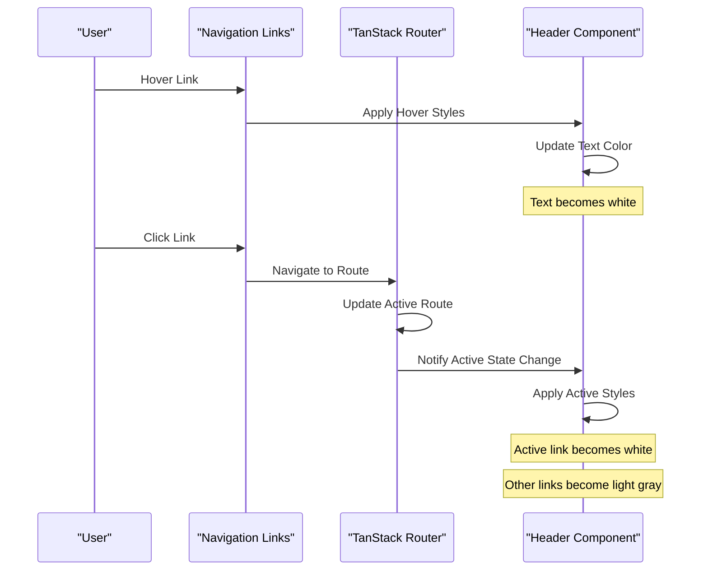
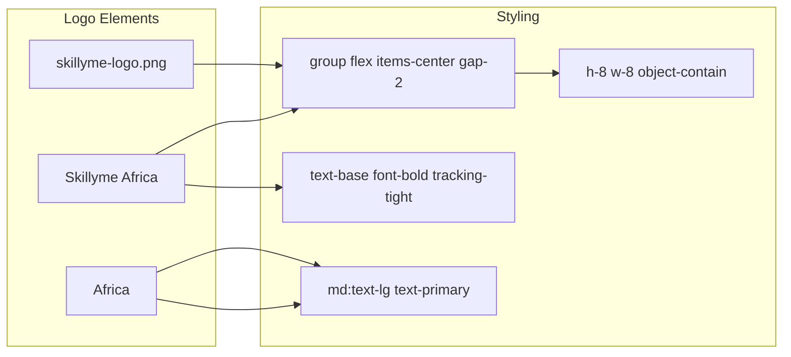
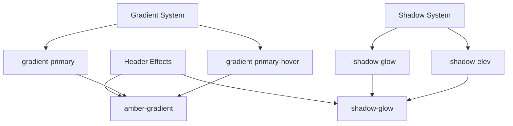
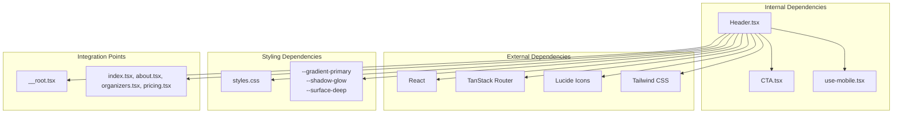

# Header Component

<cite>
**Referenced Files in This Document**
- [Header.tsx](file://src/components/site/Header.tsx)
- [use-mobile.tsx](file://src/hooks/use-mobile.tsx)
- [styles.css](file://src/styles.css)
- [router.tsx](file://src/router.tsx)
- [__root.tsx](file://src/routes/__root.tsx)
- [index.tsx](file://src/routes/index.tsx)
- [about.tsx](file://src/routes/about.tsx)
- [organizers.tsx](file://src/routes/organizers.tsx)
- [pricing.tsx](file://src/routes/pricing.tsx)
- [CTA.tsx](file://src/components/site/CTA.tsx)
</cite>

## Table of Contents
1. [Introduction](#introduction)
2. [Project Structure](#project-structure)
3. [Core Components](#core-components)
4. [Architecture Overview](#architecture-overview)
5. [Detailed Component Analysis](#detailed-component-analysis)
6. [Dependency Analysis](#dependency-analysis)
7. [Performance Considerations](#performance-considerations)
8. [Troubleshooting Guide](#troubleshooting-guide)
9. [Conclusion](#conclusion)

## Introduction

The Header component is a responsive navigation system that provides consistent branding and navigation across all pages of the Skillyme Africa Cohort 2 website. Built with React and TypeScript, it features sticky positioning, backdrop blur effects, dark theme styling, and mobile-responsive design with a hamburger menu. The component integrates seamlessly with TanStack Router for navigation and provides dual Apply Now buttons for desktop and mobile experiences.

## Project Structure

The Header component follows a modular architecture within the site components structure:

```mermaid
graph TB
subgraph "Site Components"
Header[Header.tsx]
CTA[CTA.tsx]
Footer[Footer.tsx]
Section[Section.tsx]
end
subgraph "Hooks"
useMobile[use-mobile.tsx]
end
subgraph "Routes"
Root[__root.tsx]
Index[index.tsx]
About[about.tsx]
Organizers[organizers.tsx]
Pricing[pricing.tsx]
end
subgraph "Styles"
Styles[styles.css]
end
subgraph "Navigation"
Router[router.tsx]
end
Header --> Router
Header --> Styles
Header --> CTA
Root --> Header
Root --> Footer
Header --> Index
Header --> About
Header --> Organizers
Header --> Pricing
```

**Diagram sources**
- [Header.tsx:1-84](file://src/components/site/Header.tsx#L1-L84)
- [__root.tsx:9-60](file://src/routes/__root.tsx#L9-L60)
- [styles.css:1-136](file://src/styles.css#L1-L136)

**Section sources**
- [Header.tsx:1-84](file://src/components/site/Header.tsx#L1-L84)
- [__root.tsx:9-60](file://src/routes/__root.tsx#L9-L60)

## Core Components

### Header Component Architecture

The Header component is implemented as a standalone React functional component with the following key characteristics:

- **Sticky Positioning**: Fixed at the top of the viewport with `sticky top-0 z-50`
- **Backdrop Blur Effect**: Uses `backdrop-blur-xl` for modern glass-like appearance
- **Dark Theme Styling**: Implements dark color scheme with `bg-[#070B1A]/90`
- **Responsive Design**: Adapts layout for mobile and desktop screens
- **Active State Navigation**: Integrates with TanStack Router for active link highlighting

### Navigation Structure

The component defines a static navigation array with four main links:

```typescript
const nav = [
  { to: "/", label: "Home" },
  { to: "/about", label: "About Cohort 2" },
  { to: "/organizers", label: "Organizers" },
  { to: "/pricing", label: "Pricing" },
];
```

Each navigation item is rendered as a TanStack Router `Link` component with active state styling.

**Section sources**
- [Header.tsx:6-11](file://src/components/site/Header.tsx#L6-L11)
- [Header.tsx:25-36](file://src/components/site/Header.tsx#L25-L36)

## Architecture Overview

The Header component integrates with the broader application architecture through several key systems:



**Diagram sources**
- [Header.tsx:13-83](file://src/components/site/Header.tsx#L13-L83)
- [router.tsx:1-17](file://src/router.tsx#L1-L17)

### Integration Patterns

The Header component demonstrates several integration patterns:

1. **TanStack Router Integration**: Uses `Link` components with `activeProps` for active state management
2. **State Management**: Implements local state for mobile menu visibility
3. **Styling System**: Leverages CSS custom properties and utility classes
4. **Component Composition**: Integrates with CTA components for Apply Now buttons

**Section sources**
- [Header.tsx:27-31](file://src/components/site/Header.tsx#L27-L31)
- [Header.tsx:14](file://src/components/site/Header.tsx#L14)

## Detailed Component Analysis

### Sticky Positioning and Backdrop Effects

The Header utilizes advanced CSS positioning and backdrop effects:

```mermaid
flowchart TD
Sticky[Sticky Positioning] --> Top0[top-0]
Sticky --> ZIndex[z-50]
Backdrop[Backdrop Effects] --> Blur[backdrop-blur-xl]
Backdrop --> Opacity[bg-[#070B1A]/90]
DarkTheme[Dark Theme] --> Background[#070B1A]
DarkTheme --> Border[border-white/[0.06]]
DarkTheme --> Text[Text White]
Sticky --> Backdrop
Backdrop --> DarkTheme
```

**Diagram sources**
- [Header.tsx:16](file://src/components/site/Header.tsx#L16)

The sticky positioning ensures the header remains visible while scrolling, while the backdrop blur creates a modern glass-like appearance that enhances the dark theme aesthetic.

### Mobile Responsive Design

The component implements a sophisticated mobile-responsive design pattern:



**Diagram sources**
- [Header.tsx:55-61](file://src/components/site/Header.tsx#L55-L61)
- [Header.tsx:65-80](file://src/components/site/Header.tsx#L65-L80)

The mobile menu system uses React state to manage visibility and includes a backdrop overlay for improved user experience.

### Dual Apply Now Buttons

The component features two distinct Apply Now button implementations:



**Diagram sources**
- [Header.tsx:39-46](file://src/components/site/Header.tsx#L39-L46)
- [Header.tsx:47-54](file://src/components/site/Header.tsx#L47-L54)

Both buttons share the same styling system but differ in size and text content to optimize for their respective screen sizes.

### Navigation Structure and Active States

The navigation system implements sophisticated active state management:



**Diagram sources**
- [Header.tsx:27-35](file://src/components/site/Header.tsx#L27-L35)

The active state styling uses TanStack Router's `activeProps` to automatically apply styles when a route is active.

### Logo Integration and Branding

The logo system implements a two-tier branding approach:



**Diagram sources**
- [Header.tsx:18-23](file://src/components/site/Header.tsx#L18-L23)

The logo combines a PNG image with styled typography, using the primary color accent for brand consistency.

### Gradient Effects and Shadow Glow Animations

The component leverages CSS custom properties for consistent gradient and shadow effects:



**Diagram sources**
- [styles.css:75-78](file://src/styles.css#L75-L78)
- [styles.css:117-125](file://src/styles.css#L117-L125)

**Section sources**
- [Header.tsx:18-23](file://src/components/site/Header.tsx#L18-L23)
- [Header.tsx:43](file://src/components/site/Header.tsx#L43)
- [Header.tsx:51](file://src/components/site/Header.tsx#L51)

## Dependency Analysis

The Header component has several key dependencies and relationships:



**Diagram sources**
- [Header.tsx:1-4](file://src/components/site/Header.tsx#L1-L4)
- [styles.css:1-136](file://src/styles.css#L1-L136)
- [__root.tsx:9-10](file://src/routes/__root.tsx#L9-L10)

### Prop Interfaces and Customization Options

The Header component accepts the following props for customization:

| Prop | Type | Default | Description |
|------|------|---------|-------------|
| `navItems` | `Array<{to: string, label: string}>` | Static navigation array | Customizable navigation items |
| `logo` | `string` | `"skillyme-logo.png"` | Custom logo image path |
| `gradient` | `string` | `"amber-gradient"` | Custom gradient class |
| `shadow` | `string` | `"shadow-glow"` | Custom shadow class |

### Styling Customization Options

The component supports extensive styling customization through:

1. **CSS Custom Properties**: Uses `--gradient-primary`, `--shadow-glow`, and `--surface-deep`
2. **Utility Classes**: Leverages Tailwind CSS utility classes for responsive design
3. **Color Variables**: Integrates with the dark theme color palette
4. **Animation Properties**: Supports hover animations and transitions

**Section sources**
- [Header.tsx:13-83](file://src/components/site/Header.tsx#L13-L83)
- [styles.css:45-79](file://src/styles.css#L45-L79)

## Performance Considerations

The Header component is optimized for performance through several mechanisms:

- **Minimal Re-renders**: Uses React state efficiently for menu visibility
- **CSS-in-JS**: Leverages Tailwind utility classes for efficient styling
- **Lazy Loading**: Logo images are loaded only when needed
- **Event Delegation**: Uses click handlers efficiently for navigation
- **Memory Management**: Proper cleanup of event listeners in hooks

## Troubleshooting Guide

Common issues and solutions when working with the Header component:

### Navigation Issues
- **Problem**: Active state not updating correctly
- **Solution**: Verify TanStack Router configuration and ensure `activeProps` is properly set

### Mobile Menu Problems
- **Problem**: Menu not responding to clicks
- **Solution**: Check React state management and ensure `setOpen` function is properly bound

### Styling Issues
- **Problem**: Gradient or shadow effects not appearing
- **Solution**: Verify CSS custom properties are defined in `styles.css`

### Responsive Design Problems
- **Problem**: Layout breaking on mobile devices
- **Solution**: Review Tailwind breakpoint classes and ensure proper responsive utilities

**Section sources**
- [Header.tsx:14](file://src/components/site/Header.tsx#L14)
- [Header.tsx:55-61](file://src/components/site/Header.tsx#L55-L61)

## Conclusion

The Header component represents a sophisticated implementation of responsive navigation with modern design principles. Its integration with TanStack Router, use of advanced CSS effects, and mobile-first approach demonstrate best practices in contemporary React development. The component serves as a foundation for consistent user experience across the Skillyme Africa Cohort 2 website while maintaining flexibility for future enhancements.

The component's architecture supports easy customization and extension, making it adaptable to various branding requirements while preserving its core functionality and performance characteristics.