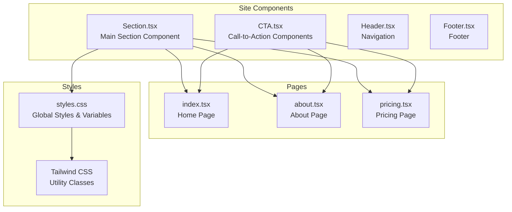
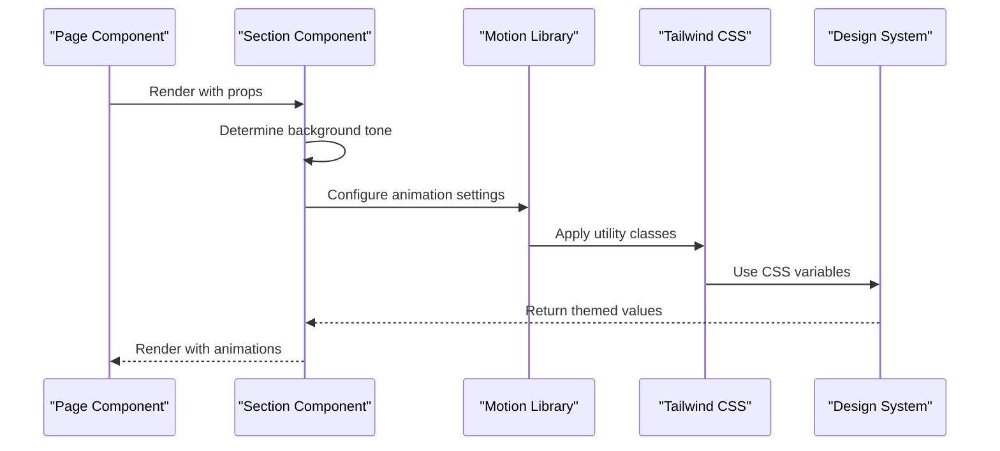
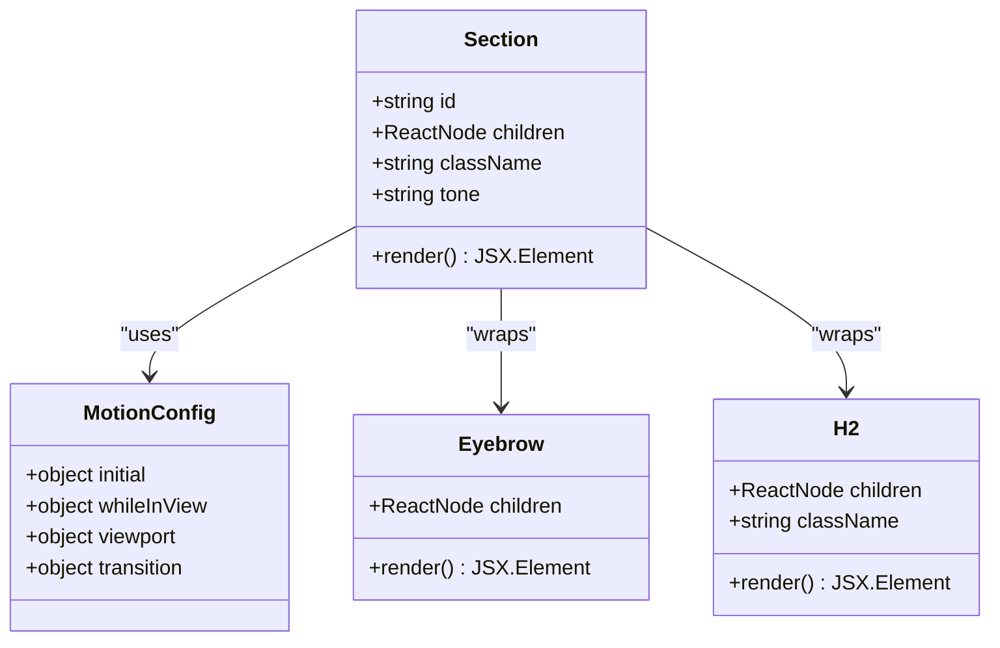
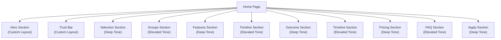
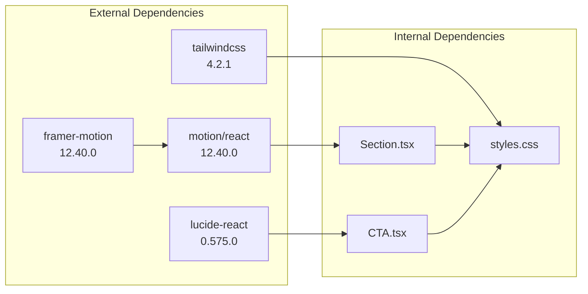

# Section Component

<cite>
**Referenced Files in This Document**
- [Section.tsx](file://src/components/site/Section.tsx)
- [styles.css](file://src/styles.css)
- [index.tsx](file://src/routes/index.tsx)
- [about.tsx](file://src/routes/about.tsx)
- [pricing.tsx](file://src/routes/pricing.tsx)
- [CTA.tsx](file://src/components/site/CTA.tsx)
- [main.tsx](file://src/main.tsx)
- [router.tsx](file://src/router.tsx)
- [package.json](file://package.json)
- [components.json](file://components.json)
</cite>

## Table of Contents
1. [Introduction](#introduction)
2. [Project Structure](#project-structure)
3. [Core Components](#core-components)
4. [Architecture Overview](#architecture-overview)
5. [Detailed Component Analysis](#detailed-component-analysis)
6. [Dependency Analysis](#dependency-analysis)
7. [Performance Considerations](#performance-considerations)
8. [Troubleshooting Guide](#troubleshooting-guide)
9. [Conclusion](#conclusion)
10. [Appendices](#appendices)

## Introduction
The Section component serves as a foundational layout utility for organizing content blocks throughout the Skillyme Africa application. It provides consistent spacing, alignment, and responsive behavior for page sections while integrating seamlessly with the application's design system. The component encapsulates motion animations, background effects, and typography helpers to create a cohesive visual experience across different page types.

## Project Structure
The Section component is part of the site-level components collection, designed to be reusable across various pages and contexts within the application. It leverages Tailwind CSS utilities and integrates with the broader design system through shared CSS variables and utility classes.

**Diagram sources**
- [Section.tsx:1-44](file://src/components/site/Section.tsx#L1-L44)
- [styles.css:1-136](file://src/styles.css#L1-L136)
- [index.tsx:1-350](file://src/routes/index.tsx#L1-L350)

**Section sources**
- [Section.tsx:1-44](file://src/components/site/Section.tsx#L1-L44)
- [styles.css:1-136](file://src/styles.css#L1-L136)

## Core Components
The Section component consists of three primary parts: the main Section wrapper, typography helpers (Eyebrow and H2), and integrated motion animations. These components work together to provide a consistent layout foundation across the application.

### Section Component Properties
The Section component accepts the following props:

| Property | Type | Default | Description |
|----------|------|---------|-------------|
| id | string | undefined | HTML id attribute for section identification |
| children | ReactNode | Required | Content to render inside the section |
| className | string | "" | Additional CSS classes to apply |
| tone | "deep" \| "elev" | "deep" | Background effect variant |

### Background Effects and Variants
The component provides two distinct background variants controlled by the `tone` prop:

- **Deep Tone**: Subtle dark blue background with light backdrop blur
- **Elev Tone**: Deeper dark blue background with enhanced backdrop blur

### Typography Helpers
The component exports two helper components for consistent typography:

- **Eyebrow**: Small, uppercase text with primary color emphasis
- **H2**: Balanced heading with responsive sizing and leading

**Section sources**
- [Section.tsx:4-29](file://src/components/site/Section.tsx#L4-L29)
- [Section.tsx:31-43](file://src/components/site/Section.tsx#L31-L43)

## Architecture Overview
The Section component integrates with the application's design system through multiple layers: motion animations, CSS variables, and Tailwind utilities. This architecture ensures consistent behavior across different screen sizes and maintains visual coherence throughout the application.

**Diagram sources**
- [Section.tsx:15-27](file://src/components/site/Section.tsx#L15-L27)
- [styles.css:72-79](file://src/styles.css#L72-L79)

## Detailed Component Analysis

### Section Component Implementation
The Section component serves as the primary layout container, providing consistent spacing and responsive behavior across all pages.

**Diagram sources**
- [Section.tsx:4-43](file://src/components/site/Section.tsx#L4-L43)

#### Animation Behavior
The component implements sophisticated motion animations using the Framer Motion library:

- **Entry Animation**: Fade-in with upward movement
- **Viewport Trigger**: Activates when section enters viewport
- **Transition**: Smooth easing with configurable duration
- **Responsive Behavior**: Optimized for mobile and desktop

#### Responsive Design Patterns
The component follows established responsive design patterns:

- **Mobile-first**: Base padding and spacing for small screens
- **Progressive Enhancement**: Additional padding for larger screens
- **Max Width Constraints**: Consistent content width across breakpoints
- **Flexible Container**: Centered layout with maximum width limits

**Section sources**
- [Section.tsx:15-27](file://src/components/site/Section.tsx#L15-L27)
- [styles.css:126-129](file://src/styles.css#L126-L129)

### Usage Patterns Across Pages
The Section component demonstrates versatile usage patterns across different page types within the application.

#### Home Page Implementation
The home page showcases multiple Section variations demonstrating different use cases:

**Diagram sources**
- [index.tsx:163-346](file://src/routes/index.tsx#L163-L346)

#### About Page Implementation
The about page demonstrates educational content organization with alternating Section tones:

- **Deep Sections**: Primary content areas with subtle backgrounds
- **Elevated Sections**: Highlighted content with enhanced visual prominence
- **Consistent Spacing**: Uniform vertical rhythm throughout the page

#### Pricing Page Implementation
The pricing page showcases data presentation patterns within Section containers:

- **Tabular Data**: Responsive table layouts with mobile stacking
- **Feature Comparison**: Card-based layouts with visual emphasis
- **Process Documentation**: Step-by-step procedures with numbered indicators

**Section sources**
- [index.tsx:163-346](file://src/routes/index.tsx#L163-L346)
- [about.tsx:45-233](file://src/routes/about.tsx#L45-L233)
- [pricing.tsx:102-237](file://src/routes/pricing.tsx#L102-L237)

### Design System Integration
The Section component integrates deeply with the application's design system through multiple mechanisms:

#### CSS Variable System
The component leverages a comprehensive CSS variable system for consistent theming:

- **Surface Colors**: Deep, elevated, and dark surface variations
- **Typography Scale**: Responsive font sizing with balanced line heights
- **Visual Effects**: Consistent shadows, glows, and backdrop effects
- **Border Radius**: Unified corner radius system across components

#### Utility Class Architecture
The component utilizes Tailwind CSS utility classes for consistent styling:

- **Spacing System**: Consistent padding and margin patterns
- **Layout Constraints**: Maximum width and centered content layouts
- **Responsive Utilities**: Mobile-first responsive design patterns
- **Visual Effects**: Backdrop blur, gradients, and shadow effects

**Section sources**
- [styles.css:8-43](file://src/styles.css#L8-L43)
- [styles.css:72-79](file://src/styles.css#L72-L79)
- [styles.css:109-135](file://src/styles.css#L109-L135)

## Dependency Analysis
The Section component has minimal external dependencies while maintaining deep integration with the application's ecosystem.

**Diagram sources**
- [package.json:53-66](file://package.json#L53-L66)
- [Section.tsx:1](file://src/components/site/Section.tsx#L1)

### Internal Dependencies
The component relies on several internal systems:

- **Motion Integration**: Framer Motion for smooth animations
- **Design System**: CSS variables and utility classes
- **Typography System**: Consistent heading and text patterns
- **Layout System**: Responsive grid and spacing utilities

### External Dependencies
The component has carefully selected external dependencies:

- **Motion**: Lightweight animation library with tree-shaking support
- **Icons**: Lucide React for consistent iconography
- **CSS Framework**: Tailwind CSS for utility-first styling

**Section sources**
- [package.json:53-66](file://package.json#L53-L66)
- [Section.tsx:1](file://src/components/site/Section.tsx#L1)

## Performance Considerations
The Section component is designed with performance optimization in mind, utilizing modern React patterns and efficient rendering strategies.

### Animation Performance
The motion animations are optimized for smooth performance:

- **Viewport-based Triggering**: Animations only run when sections are visible
- **Hardware Acceleration**: CSS transforms and opacity for GPU acceleration
- **Memory Management**: Cleanup of event listeners and animation frames
- **Reduced Re-renders**: Stable component structure minimizing unnecessary updates

### Rendering Optimization
The component employs several rendering optimization techniques:

- **Static Class Names**: Pre-computed class names reduce runtime computation
- **Conditional Rendering**: Background effects computed once per component
- **Fragment Usage**: Minimal DOM overhead with React fragments
- **Lazy Loading**: Images and media loaded only when needed

### Bundle Size Impact
The component is designed to minimize bundle size impact:

- **Tree Shaking**: Unused animation features automatically removed
- **Selective Imports**: Only required motion utilities are imported
- **CSS Optimization**: Tailwind purging removes unused styles
- **Icon Optimization**: Lucide icons are tree-shaken to single usage

## Troubleshooting Guide
Common issues and solutions when working with the Section component:

### Animation Issues
**Problem**: Animations not triggering on scroll
**Solution**: Verify viewport configuration and ensure section has sufficient height

**Problem**: Animation stuttering on mobile devices
**Solution**: Check hardware acceleration settings and reduce animation complexity

### Styling Conflicts
**Problem**: Section background overrides custom styling
**Solution**: Use the className prop to add additional styles without overriding core functionality

**Problem**: Responsive breakpoints not working as expected
**Solution**: Verify Tailwind CSS configuration and ensure proper breakpoint ordering

### Performance Issues
**Problem**: Slow page load times with multiple Section components
**Solution**: Consider lazy loading heavy content or deferring non-critical animations

**Problem**: Excessive memory usage with animated content
**Solution**: Implement proper cleanup of animation listeners and optimize animation durations

**Section sources**
- [Section.tsx:18-22](file://src/components/site/Section.tsx#L18-L22)
- [styles.css:126-129](file://src/styles.css#L126-L129)

## Conclusion
The Section component represents a well-designed, production-ready layout utility that effectively organizes content across the Skillyme Africa application. Its thoughtful integration of motion animations, responsive design patterns, and design system principles creates a consistent and engaging user experience.

The component's architecture demonstrates best practices in React component design, with clear separation of concerns, minimal dependencies, and extensive customization options. The implementation showcases how modern web development combines performance optimization with visual appeal to create compelling user interfaces.

Through its usage across multiple pages and content types, the Section component proves its versatility and effectiveness as a foundational layout element in the application's design system.

## Appendices

### Design System Reference
The Section component participates in the following design system elements:

- **Color Palette**: Deep blues (#070B1A, #0F1328) with accent green (#00E0B8)
- **Typography Scale**: Responsive headings with balanced line heights
- **Spacing System**: Consistent padding and margin patterns
- **Visual Effects**: Backdrop blur, gradients, and subtle shadows

### Usage Guidelines
When implementing Section components, follow these guidelines:

- Use deep tone for primary content sections
- Use elevated tone for highlighted or secondary content
- Leverage the className prop for additional styling needs
- Ensure adequate spacing between Section components
- Test animations across different device types and screen sizes

### Integration Examples
The component integrates seamlessly with other site components:

- **CTA Components**: ApplyButton and CTABlock work harmoniously within Section containers
- **UI Components**: Radix UI components can be nested within Section boundaries
- **Layout Systems**: Grid and flexbox layouts complement Section's container behavior

**Section sources**
- [CTA.tsx:5-26](file://src/components/site/CTA.tsx#L5-L26)
- [styles.css:72-79](file://src/styles.css#L72-L79)