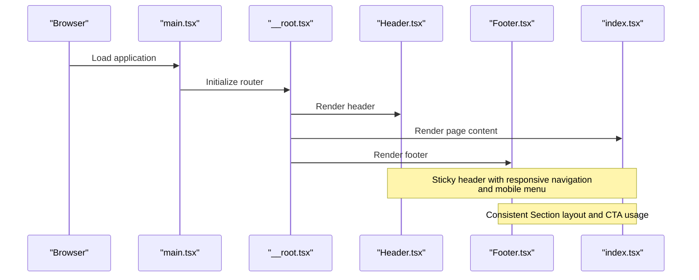
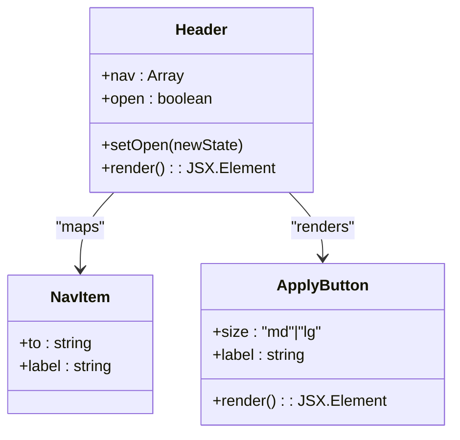
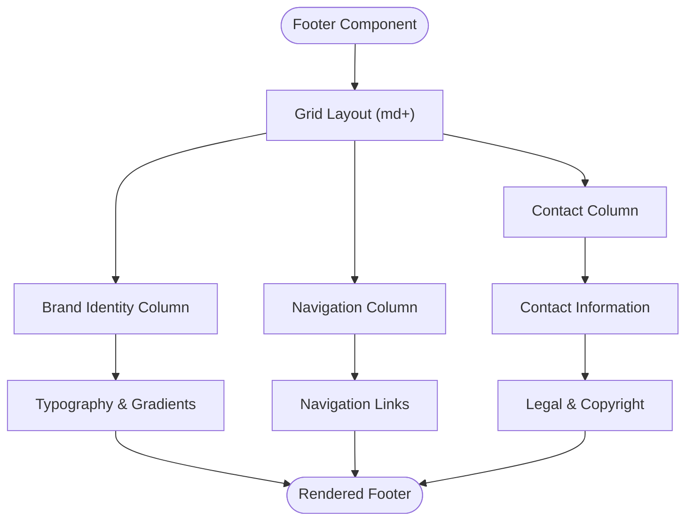
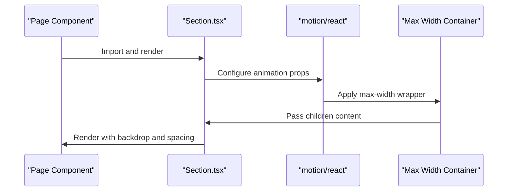
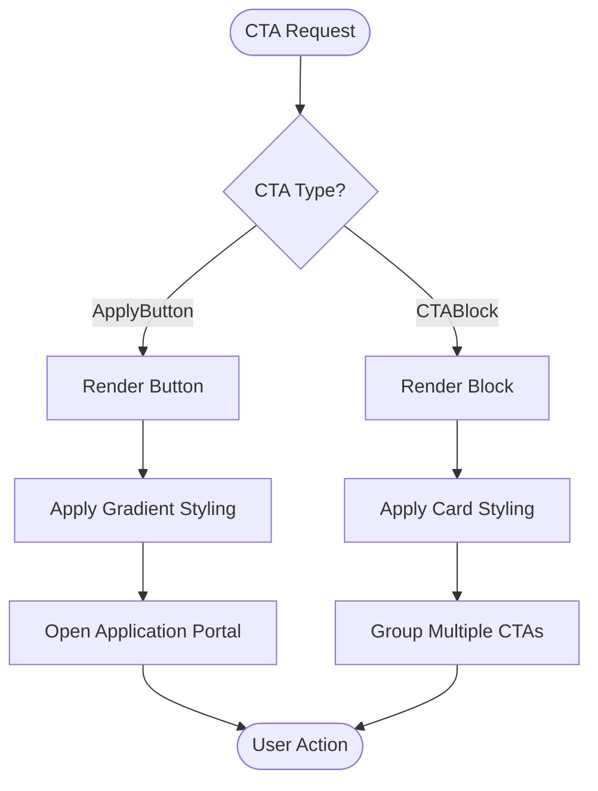
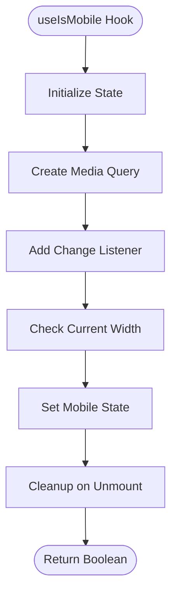
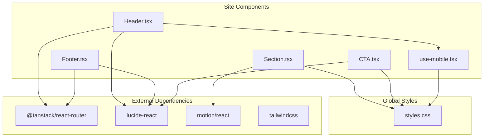

# Site Components

<cite>
**Referenced Files in This Document**
- [Header.tsx](file://src/components/site/Header.tsx)
- [Footer.tsx](file://src/components/site/Footer.tsx)
- [Section.tsx](file://src/components/site/Section.tsx)
- [CTA.tsx](file://src/components/site/CTA.tsx)
- [use-mobile.tsx](file://src/hooks/use-mobile.tsx)
- [__root.tsx](file://src/routes/__root.tsx)
- [index.tsx](file://src/routes/index.tsx)
- [styles.css](file://src/styles.css)
- [main.tsx](file://src/main.tsx)
- [package.json](file://package.json)
</cite>

## Table of Contents
1. [Introduction](#introduction)
2. [Project Structure](#project-structure)
3. [Core Components](#core-components)
4. [Architecture Overview](#architecture-overview)
5. [Detailed Component Analysis](#detailed-component-analysis)
6. [Dependency Analysis](#dependency-analysis)
7. [Performance Considerations](#performance-considerations)
8. [Troubleshooting Guide](#troubleshooting-guide)
9. [Conclusion](#conclusion)
10. [Appendices](#appendices)

## Introduction
This document provides comprehensive documentation for the application-specific site components that deliver consistent layout and navigation across pages. It covers the Header component with responsive navigation and mobile menu functionality, the Footer with social links and contact information, the Section component as a layout utility for organizing content blocks, and the CTA (Call-to-Action) component used throughout the application for user engagement. It also explains the mobile detection hook and its role in responsive design, component composition patterns, prop interfaces, and integration with the overall design system. Usage examples and customization guidelines are included to maintain brand consistency across all site components.

## Project Structure
The site components are organized under the site directory within the components folder. They integrate with the routing system and global styles to provide a cohesive user experience across all pages.

```mermaid
graph TB
subgraph "Components"
Header["Header.tsx"]
Footer["Footer.tsx"]
Section["Section.tsx"]
CTA["CTA.tsx"]
end
subgraph "Hooks"
MobileHook["use-mobile.tsx"]
end
subgraph "Routes"
Root["__root.tsx"]
Home["index.tsx"]
end
subgraph "Styles"
Styles["styles.css"]
end
subgraph "App"
Main["main.tsx"]
end
Main --> Root
Root --> Header
Root --> Footer
Root --> Home
Home --> Section
Home --> CTA
Header --> MobileHook
Styles --> Header
Styles --> Footer
Styles --> Section
Styles --> CTA
```

**Diagram sources**
- [main.tsx:16-20](file://src/main.tsx#L16-L20)
- [__root.tsx:49-60](file://src/routes/__root.tsx#L49-L60)
- [Header.tsx:13-83](file://src/components/site/Header.tsx#L13-L83)
- [Footer.tsx:3-43](file://src/components/site/Footer.tsx#L3-L43)
- [Section.tsx:4-29](file://src/components/site/Section.tsx#L4-L29)
- [CTA.tsx:5-26](file://src/components/site/CTA.tsx#L5-L26)
- [use-mobile.tsx:5-19](file://src/hooks/use-mobile.tsx#L5-L19)
- [styles.css:109-135](file://src/styles.css#L109-L135)

**Section sources**
- [main.tsx:16-20](file://src/main.tsx#L16-L20)
- [__root.tsx:49-60](file://src/routes/__root.tsx#L49-L60)

## Core Components
This section documents the primary site components and their responsibilities within the application.

- Header: Provides sticky navigation with responsive desktop and mobile layouts, brand identity, and prominent call-to-action buttons.
- Footer: Delivers navigational links, contact information, and legal disclaimers in a responsive grid layout.
- Section: A layout utility component offering standardized spacing, backdrop effects, and animated entrance transitions.
- CTA: A reusable call-to-action component with flexible sizing and block variants for consistent engagement across pages.
- useIsMobile: A hook that detects mobile devices based on screen width to enable responsive behavior.

**Section sources**
- [Header.tsx:13-83](file://src/components/site/Header.tsx#L13-L83)
- [Footer.tsx:3-43](file://src/components/site/Footer.tsx#L3-L43)
- [Section.tsx:4-29](file://src/components/site/Section.tsx#L4-L29)
- [CTA.tsx:5-26](file://src/components/site/CTA.tsx#L5-L26)
- [use-mobile.tsx:5-19](file://src/hooks/use-mobile.tsx#L5-L19)

## Architecture Overview
The site components are integrated into the application through the root route, which wraps the entire app with the Header and Footer. The Header uses the mobile detection hook to manage responsive behavior, while the Section component provides a consistent layout utility across pages. The CTA component is used throughout the application to drive user engagement.



**Diagram sources**
- [main.tsx:16-20](file://src/main.tsx#L16-L20)
- [__root.tsx:49-60](file://src/routes/__root.tsx#L49-L60)
- [Header.tsx:13-83](file://src/components/site/Header.tsx#L13-L83)
- [Footer.tsx:3-43](file://src/components/site/Footer.tsx#L3-L43)
- [index.tsx:98-349](file://src/routes/index.tsx#L98-L349)

## Detailed Component Analysis

### Header Component
The Header component provides a sticky navigation bar with responsive behavior, brand identity, and call-to-action buttons. It manages a mobile menu state and integrates with the TanStack Router for navigation.

Key features:
- Sticky positioning at the top of the viewport
- Responsive desktop navigation with hover states
- Mobile menu with animated state management
- Brand logo and typography with gradient accents
- Dual Apply Now buttons (desktop and mobile)
- Active link highlighting using TanStack Router

Responsive behavior:
- Desktop: Hidden mobile menu, full navigation bar
- Mobile: Collapsible menu triggered by hamburger button
- Breakpoint determined by the useIsMobile hook

Accessibility:
- Proper aria-label for the mobile menu button
- Semantic HTML structure with navigation landmarks

**Section sources**
- [Header.tsx:13-83](file://src/components/site/Header.tsx#L13-L83)
- [use-mobile.tsx:5-19](file://src/hooks/use-mobile.tsx#L5-L19)

#### Header Class Diagram


**Diagram sources**
- [Header.tsx:6-11](file://src/components/site/Header.tsx#L6-L11)
- [Header.tsx:13-83](file://src/components/site/Header.tsx#L13-L83)

### Footer Component
The Footer component delivers a responsive grid layout with navigational links, contact information, and legal disclaimers. It maintains brand consistency through typography and color usage.

Layout structure:
- Three-column grid on medium screens and above
- Brand identity with gradient accent
- Navigation links synchronized with Header
- Contact information and partnership acknowledgments
- Legal notices and copyright information

Typography and branding:
- Consistent use of primary color for headings
- Secondary text with reduced opacity for readability
- Gradient accents for visual continuity

**Section sources**
- [Footer.tsx:3-43](file://src/components/site/Footer.tsx#L3-L43)

#### Footer Layout Flowchart


**Diagram sources**
- [Footer.tsx:7-43](file://src/components/site/Footer.tsx#L7-L43)

### Section Component
The Section component serves as a layout utility for organizing content blocks with consistent spacing, backdrop effects, and animated entrances. It provides helper components for typography and content organization.

Core functionality:
- Background tone selection ("deep" or "elev")
- Backdrop blur effects for modern UI
- Motion animation with viewport intersection
- Max-width container with responsive padding
- Optional ID attribute for anchor navigation

Helper components:
- Eyebrow: Small, uppercase introductory text
- H2: Large, bold headline with responsive sizing

Animation behavior:
- Fade-in and subtle upward movement
- Triggered when element enters viewport
- One-time animation to prevent re-triggering

**Section sources**
- [Section.tsx:4-29](file://src/components/site/Section.tsx#L4-L29)
- [Section.tsx:31-43](file://src/components/site/Section.tsx#L31-L43)

#### Section Composition Pattern


**Diagram sources**
- [Section.tsx:18-27](file://src/components/site/Section.tsx#L18-L27)

### CTA Component
The CTA component provides reusable call-to-action elements with consistent styling and behavior. It includes both individual buttons and compound block components for different use cases.

CTA variants:
- ApplyButton: Standalone button with gradient background and glow effect
- CTABlock: Card-like container for grouping multiple CTAs

Styling characteristics:
- Gradient amber background with hover effects
- Glowing shadow for depth perception
- Responsive sizing options (md/lg)
- External link icon for portal navigation

Integration patterns:
- Used in hero sections, feature highlights, and landing areas
- Consistent with brand colors and typography
- Accessible with proper focus states and hover feedback

**Section sources**
- [CTA.tsx:5-26](file://src/components/site/CTA.tsx#L5-L26)

#### CTA Usage Flowchart


**Diagram sources**
- [CTA.tsx:5-26](file://src/components/site/CTA.tsx#L5-L26)

### Mobile Detection Hook
The useIsMobile hook provides device detection capabilities for responsive design decisions. It uses media queries to determine whether the current viewport qualifies as mobile.

Detection mechanism:
- Media query targeting widths below 768px
- Change listener for dynamic viewport adjustments
- Initial state derived from current window width
- Cleanup of event listeners to prevent memory leaks

Integration patterns:
- Controls mobile menu visibility in Header
- Enables responsive component behavior
- Supports conditional rendering based on device type

**Section sources**
- [use-mobile.tsx:5-19](file://src/hooks/use-mobile.tsx#L5-L19)

#### Mobile Detection Flowchart


**Diagram sources**
- [use-mobile.tsx:8-16](file://src/hooks/use-mobile.tsx#L8-L16)

## Dependency Analysis
The site components rely on several external libraries and internal utilities to achieve their functionality and design goals.

External dependencies:
- TanStack Router for navigation and routing
- Lucide React for icons and visual elements
- Motion for animations and transitions
- Tailwind CSS for styling utilities

Internal dependencies:
- Global styles for theme variables and utilities
- Shared components for consistent UI patterns
- Route context for application-wide state



**Diagram sources**
- [package.json:44-66](file://package.json#L44-L66)
- [Header.tsx:1-4](file://src/components/site/Header.tsx#L1-L4)
- [Footer.tsx:1](file://src/components/site/Footer.tsx#L1)
- [Section.tsx:1](file://src/components/site/Section.tsx#L1)
- [CTA.tsx:1](file://src/components/site/CTA.tsx#L1)
- [use-mobile.tsx:1](file://src/hooks/use-mobile.tsx#L1)
- [styles.css:1-4](file://src/styles.css#L1-L4)

**Section sources**
- [package.json:44-66](file://package.json#L44-L66)

## Performance Considerations
The site components are designed with performance in mind through several optimization strategies:

- Lazy loading: Motion animations trigger only when elements enter the viewport
- Minimal re-renders: State management is scoped to necessary components
- Efficient styling: Utility-first CSS reduces bundle size
- Responsive breakpoints: Media queries minimize unnecessary computations
- Clean event handling: Proper cleanup prevents memory leaks

Best practices for maintaining performance:
- Use Section component for content blocks to leverage optimized animations
- Leverage useIsMobile hook for conditional rendering rather than complex calculations
- Utilize gradient utilities from styles.css for efficient background rendering
- Keep component props minimal to reduce re-render cycles

## Troubleshooting Guide
Common issues and solutions when working with site components:

Navigation issues:
- Verify TanStack Router configuration in __root.tsx
- Ensure navigation items in Header match route definitions
- Check activeProps usage for proper link highlighting

Responsive behavior:
- Confirm useIsMobile hook returns expected values
- Test media query breakpoints in different viewport sizes
- Validate mobile menu state management

Styling problems:
- Verify Tailwind CSS configuration and custom utilities
- Check gradient and shadow utilities in styles.css
- Ensure proper z-index stacking for sticky header

Animation concerns:
- Adjust viewport margin in Section component if animations trigger prematurely
- Modify motion duration and easing for different performance profiles
- Test animation behavior across different browsers and devices

**Section sources**
- [__root.tsx:49-60](file://src/routes/__root.tsx#L49-L60)
- [Header.tsx:13-83](file://src/components/site/Header.tsx#L13-L83)
- [Section.tsx:18-27](file://src/components/site/Section.tsx#L18-L27)
- [styles.css:109-135](file://src/styles.css#L109-L135)

## Conclusion
The site components provide a robust foundation for consistent layout and navigation across the application. Their thoughtful design balances functionality with performance, ensuring a seamless user experience across devices. The Header delivers sticky navigation with intelligent responsive behavior, the Footer offers comprehensive information architecture, the Section component standardizes content organization, and the CTA component drives user engagement through consistent visual patterns. Together with the mobile detection hook, these components form a cohesive design system that maintains brand identity while adapting to diverse user contexts.

## Appendices

### Component Prop Interfaces
- Header: No required props; manages internal state for mobile menu
- Section: Optional id, children, className, and tone props
- ApplyButton: Optional size and label props
- CTABlock: Required heading with optional children
- useIsMobile: No props; returns boolean state

### Customization Guidelines
- Maintain brand consistency through primary color usage
- Preserve gradient and shadow utilities for visual coherence
- Follow responsive breakpoint patterns established in existing components
- Keep animation timing consistent across components
- Ensure accessibility compliance with proper ARIA attributes and keyboard navigation

### Integration Patterns
- Import components in route files using named imports
- Wrap page content with Section for consistent spacing
- Use ApplyButton for all application-related actions
- Leverage Footer navigation for cross-page consistency
- Implement useIsMobile hook for device-specific adaptations