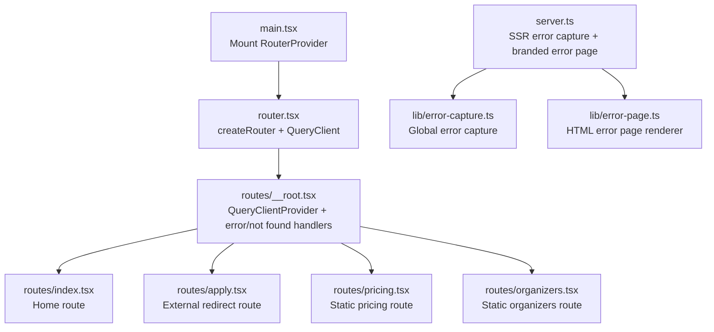
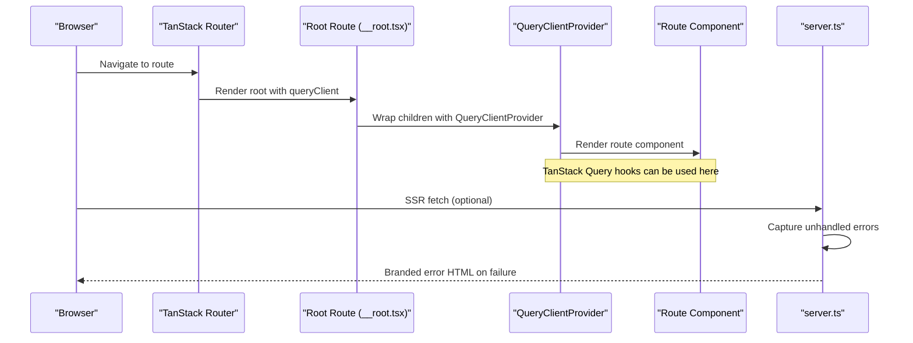
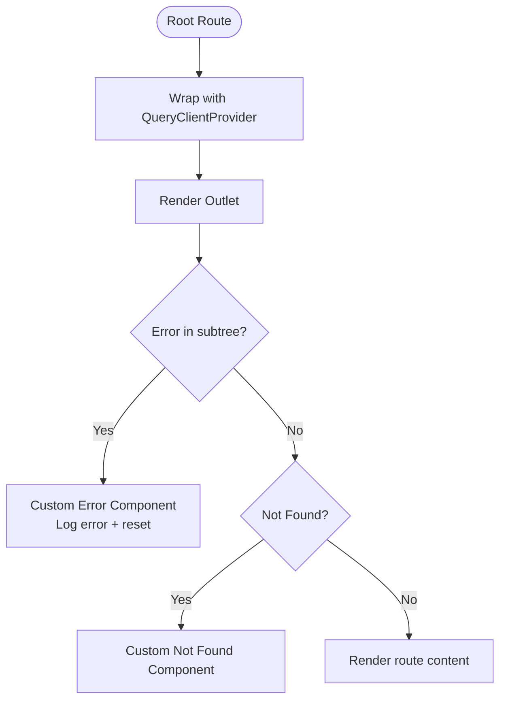
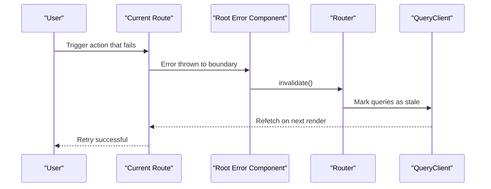
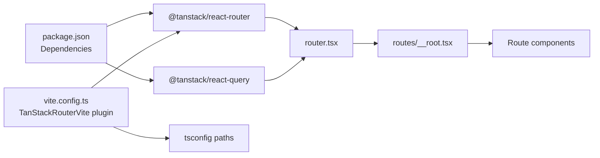

# State Management

<cite>
**Referenced Files in This Document**
- [main.tsx](file://src/main.tsx)
- [router.tsx](file://src/router.tsx)
- [__root.tsx](file://src/routes/__root.tsx)
- [index.tsx](file://src/routes/index.tsx)
- [apply.tsx](file://src/routes/apply.tsx)
- [pricing.tsx](file://src/routes/pricing.tsx)
- [organizers.tsx](file://src/routes/organizers.tsx)
- [error-capture.ts](file://src/lib/error-capture.ts)
- [error-page.ts](file://src/lib/error-page.ts)
- [server.ts](file://src/server.ts)
- [use-mobile.tsx](file://src/hooks/use-mobile.tsx)
- [package.json](file://package.json)
- [vite.config.ts](file://vite.config.ts)
</cite>

## Table of Contents
1. [Introduction](#introduction)
2. [Project Structure](#project-structure)
3. [Core Components](#core-components)
4. [Architecture Overview](#architecture-overview)
5. [Detailed Component Analysis](#detailed-component-analysis)
6. [Dependency Analysis](#dependency-analysis)
7. [Performance Considerations](#performance-considerations)
8. [Troubleshooting Guide](#troubleshooting-guide)
9. [Conclusion](#conclusion)

## Introduction
This document explains the state management architecture powered by TanStack Query and React Router. It covers the query client configuration, caching strategies, data fetching patterns, and how routing integrates with state management. It also documents error handling, loading states, optimistic updates, custom error capture and error pages, context providers, custom hooks, and performance optimization techniques. Finally, it outlines patterns for managing application-wide state, route-specific data, and component-local state, and addresses data persistence, offline handling, and state synchronization.

## Project Structure
The application is a React + TanStack Router + TanStack Query setup. The router is created with a shared QueryClient injected into the route context. Routes are generated via the TanStack Router plugin and rendered under a QueryClientProvider provided by the root route.

**Diagram sources**
- [main.tsx:1-21](file://src/main.tsx#L1-L21)
- [router.tsx:1-17](file://src/router.tsx#L1-L17)
- [__root.tsx:1-61](file://src/routes/__root.tsx#L1-L61)
- [index.tsx:1-350](file://src/routes/index.tsx#L1-L350)
- [apply.tsx:1-70](file://src/routes/apply.tsx#L1-L70)
- [pricing.tsx:1-241](file://src/routes/pricing.tsx#L1-L241)
- [organizers.tsx:1-179](file://src/routes/organizers.tsx#L1-L179)
- [server.ts:1-51](file://src/server.ts#L1-L51)
- [error-capture.ts:1-28](file://src/lib/error-capture.ts#L1-L28)
- [error-page.ts:1-31](file://src/lib/error-page.ts#L1-L31)

**Section sources**
- [main.tsx:1-21](file://src/main.tsx#L1-L21)
- [router.tsx:1-17](file://src/router.tsx#L1-L17)
- [__root.tsx:1-61](file://src/routes/__root.tsx#L1-L61)
- [server.ts:1-51](file://src/server.ts#L1-L51)

## Core Components
- QueryClient creation and injection: A single QueryClient is instantiated and passed into the router’s context, ensuring all routes share the same cache and background update mechanisms.
- Root provider: The root route wraps the app in QueryClientProvider, enabling TanStack Query hooks anywhere below it.
- Error and not-found handling: The root route defines custom error and not-found components, centralizing error UX and recovery actions.
- Routing + SSR error pipeline: The server captures unhandled errors and renders a branded HTML error page, integrating with the client-side error boundaries.

Key implementation references:
- QueryClient creation and router context: [router.tsx:5-13](file://src/router.tsx#L5-L13)
- Root provider and error components: [__root.tsx:43-60](file://src/routes/__root.tsx#L43-L60)
- SSR error capture and branded page: [server.ts:1-51](file://src/server.ts#L1-L51), [error-capture.ts:1-28](file://src/lib/error-capture.ts#L1-L28), [error-page.ts:1-31](file://src/lib/error-page.ts#L1-L31)

**Section sources**
- [router.tsx:5-13](file://src/router.tsx#L5-L13)
- [__root.tsx:43-60](file://src/routes/__root.tsx#L43-L60)
- [server.ts:1-51](file://src/server.ts#L1-L51)
- [error-capture.ts:1-28](file://src/lib/error-capture.ts#L1-L28)
- [error-page.ts:1-31](file://src/lib/error-page.ts#L1-L31)

## Architecture Overview
The state management architecture centers on a single QueryClient shared across the app. Routes are code-split and lazy-loaded via TanStack Router. The root route provides the QueryClientProvider, enabling hooks like useQuery, useMutation, and useQueryClient throughout the app. The server integrates error capture and a branded error page for SSR failures.

**Diagram sources**
- [main.tsx:1-21](file://src/main.tsx#L1-L21)
- [router.tsx:1-17](file://src/router.tsx#L1-L17)
- [__root.tsx:1-61](file://src/routes/__root.tsx#L1-L61)
- [server.ts:1-51](file://src/server.ts#L1-L51)

## Detailed Component Analysis

### Query Client Configuration and Caching
- Single QueryClient: Created once and passed into the router context, ensuring a unified cache across the app.
- Preload behavior: defaultPreloadStaleTime is set to zero, meaning preloaded queries are considered stale immediately, favoring fresh data on navigation.
- Scroll restoration: Enabled to improve UX when navigating between routes.

References:
- [router.tsx:5-13](file://src/router.tsx#L5-L13)

**Section sources**
- [router.tsx:5-13](file://src/router.tsx#L5-L13)

### Root Provider and Error Boundaries
- QueryClientProvider: Wraps the app subtree, enabling TanStack Query hooks downstream.
- Error boundary: A custom error component is provided at the root level, logging the error and offering a reset action that invalidates the router and resets state.
- Not-found boundary: A dedicated not-found component is provided at the root.

References:
- [__root.tsx:43-60](file://src/routes/__root.tsx#L43-L60)

**Diagram sources**
- [__root.tsx:24-41](file://src/routes/__root.tsx#L24-L41)

**Section sources**
- [__root.tsx:24-41](file://src/routes/__root.tsx#L24-L41)

### Route-Based Data Loading and Cache Invalidation
- Route-level rendering: Routes define metadata (head) and components. There are no explicit useQuery hooks shown in the provided route files, indicating either static content or external resource loading via links.
- Navigation-driven invalidation: The root error component triggers router invalidation and reset, helping recover from transient errors by refetching data on retry.

References:
- [index.tsx:14-22](file://src/routes/index.tsx#L14-L22)
- [apply.tsx:7-17](file://src/routes/apply.tsx#L7-L17)
- [pricing.tsx:9-19](file://src/routes/pricing.tsx#L9-L19)
- [organizers.tsx:6-16](file://src/routes/organizers.tsx#L6-L16)
- [__root.tsx:24-41](file://src/routes/__root.tsx#L24-L41)

**Diagram sources**
- [__root.tsx:24-41](file://src/routes/__root.tsx#L24-L41)

**Section sources**
- [__root.tsx:24-41](file://src/routes/__root.tsx#L24-L41)

### Error Handling Strategies and Optimistic Updates
- Client-side error boundaries: Centralized error component logs the error and exposes a reset mechanism.
- Branded SSR error page: The server captures unhandled errors and returns a branded HTML error page, preventing stack leakage and providing a graceful fallback.
- Optimistic updates pattern: While not explicitly shown in the provided files, optimistic updates are commonly implemented using mutation APIs (e.g., useMutation) to immediately reflect user actions and reconcile with the server later. This pattern fits naturally with the existing QueryClient and error boundaries.

References:
- [server.ts:1-51](file://src/server.ts#L1-L51)
- [error-capture.ts:1-28](file://src/lib/error-capture.ts#L1-L28)
- [error-page.ts:1-31](file://src/lib/error-page.ts#L1-L31)

**Section sources**
- [server.ts:1-51](file://src/server.ts#L1-L51)
- [error-capture.ts:1-28](file://src/lib/error-capture.ts#L1-L28)
- [error-page.ts:1-31](file://src/lib/error-page.ts#L1-L31)

### Context Providers and Custom Hooks
- Context provider: The root route provides the QueryClient via context, making it available to nested routes.
- Custom hook: A responsive utility hook demonstrates local state management and device detection.

References:
- [__root.tsx:49-50](file://src/routes/__root.tsx#L49-L50)
- [use-mobile.tsx:1-20](file://src/hooks/use-mobile.tsx#L1-L20)

**Section sources**
- [__root.tsx:49-50](file://src/routes/__root.tsx#L49-L50)
- [use-mobile.tsx:1-20](file://src/hooks/use-mobile.tsx#L1-L20)

### Patterns for Managing State
- Application-wide state: Managed via the shared QueryClient, enabling cache normalization, background refetching, and global invalidation.
- Route-specific data: Defined in route metadata and components; data fetching would be implemented with TanStack Query hooks in route components.
- Component-local state: Handled with React useState/useReducer hooks in leaf components (e.g., responsive hook).

References:
- [router.tsx:5-13](file://src/router.tsx#L5-L13)
- [index.tsx:14-22](file://src/routes/index.tsx#L14-L22)
- [use-mobile.tsx:1-20](file://src/hooks/use-mobile.tsx#L1-L20)

**Section sources**
- [router.tsx:5-13](file://src/router.tsx#L5-L13)
- [index.tsx:14-22](file://src/routes/index.tsx#L14-L22)
- [use-mobile.tsx:1-20](file://src/hooks/use-mobile.tsx#L1-L20)

### Data Persistence, Offline Handling, and Synchronization
- Persistence: The current setup does not enable persistence in the QueryClient configuration. Data is cached in memory.
- Offline handling: No explicit offline strategies are configured. The app relies on network connectivity for data retrieval.
- Synchronization: The QueryClient manages cache synchronization across the app, invalidating and refetching as needed.

References:
- [router.tsx:6](file://src/router.tsx#L6)

**Section sources**
- [router.tsx:6](file://src/router.tsx#L6)

## Dependency Analysis
The project depends on TanStack Router and TanStack Query for routing and state management, respectively. Vite is configured with the TanStack Router plugin for code splitting and TypeScript path resolution.

**Diagram sources**
- [package.json:14-66](file://package.json#L14-L66)
- [vite.config.ts:1-29](file://vite.config.ts#L1-L29)
- [router.tsx:1-17](file://src/router.tsx#L1-L17)
- [__root.tsx:1-61](file://src/routes/__root.tsx#L1-L61)

**Section sources**
- [package.json:14-66](file://package.json#L14-L66)
- [vite.config.ts:1-29](file://vite.config.ts#L1-L29)
- [router.tsx:1-17](file://src/router.tsx#L1-L17)
- [__root.tsx:1-61](file://src/routes/__root.tsx#L1-L61)

## Performance Considerations
- Code splitting: Enabled via the TanStack Router Vite plugin, reducing initial bundle size.
- QueryClient defaults: Immediate staleness on preload favors freshness; tune default staleTime/preloadStaleTime for your data sensitivity.
- Dedupe dependencies: Vite resolves duplicates for React and TanStack packages to avoid multiple instances.
- Local state hooks: Keep component-local state minimal and scoped to avoid unnecessary re-renders.

[No sources needed since this section provides general guidance]

## Troubleshooting Guide
- Client-side errors: Use the root error component to log and reset. Trigger router invalidation to refetch data.
- SSR errors: The server captures unhandled errors and returns a branded HTML error page. Review captured errors via the error capture utility.
- Global error capture: The error capture utility records the last error with a TTL to aid recovery in SSR scenarios.

References:
- [__root.tsx:24-41](file://src/routes/__root.tsx#L24-L41)
- [server.ts:1-51](file://src/server.ts#L1-L51)
- [error-capture.ts:1-28](file://src/lib/error-capture.ts#L1-L28)
- [error-page.ts:1-31](file://src/lib/error-page.ts#L1-L31)

**Section sources**
- [__root.tsx:24-41](file://src/routes/__root.tsx#L24-L41)
- [server.ts:1-51](file://src/server.ts#L1-L51)
- [error-capture.ts:1-28](file://src/lib/error-capture.ts#L1-L28)
- [error-page.ts:1-31](file://src/lib/error-page.ts#L1-L31)

## Conclusion
The application employs a clean, scalable state management architecture centered on a single QueryClient shared across the app via the root route provider. TanStack Router handles routing and code splitting, while the root route provides robust error and not-found boundaries. The server integrates error capture and a branded error page for SSR resilience. To enhance the system, consider adding explicit data fetching hooks in route components, configuring persistence and offline strategies, and adopting optimistic updates for interactive mutations.