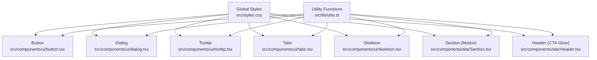
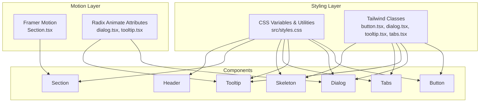
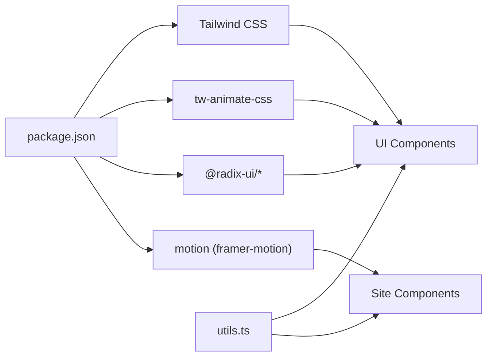

# Animations & Transitions

<cite>
**Referenced Files in This Document**
- [styles.css](file://src/styles.css)
- [package.json](file://package.json)
- [button.tsx](file://src/components/ui/button.tsx)
- [dialog.tsx](file://src/components/ui/dialog.tsx)
- [tooltip.tsx](file://src/components/ui/tooltip.tsx)
- [tabs.tsx](file://src/components/ui/tabs.tsx)
- [skeleton.tsx](file://src/components/ui/skeleton.tsx)
- [Section.tsx](file://src/components/site/Section.tsx)
- [Header.tsx](file://src/components/site/Header.tsx)
- [utils.ts](file://src/lib/utils.ts)
</cite>

## Table of Contents
1. [Introduction](#introduction)
2. [Project Structure](#project-structure)
3. [Core Components](#core-components)
4. [Architecture Overview](#architecture-overview)
5. [Detailed Component Analysis](#detailed-component-analysis)
6. [Dependency Analysis](#dependency-analysis)
7. [Performance Considerations](#performance-considerations)
8. [Troubleshooting Guide](#troubleshooting-guide)
9. [Conclusion](#conclusion)

## Introduction
This document explains the animation and transition system across the project, covering CSS animations, transitions, and motion library integration. It documents custom utilities such as shadow-glow, glass effects, and gradient transitions, and details how interactive elements and page transitions are configured. It also outlines best practices for smooth animations, performance optimization, and accessibility compliance, with examples of common animation patterns implemented in components.

## Project Structure
The animation system spans Tailwind CSS utilities, CSS custom properties, Radix UI animated variants, and the Framer Motion library. Key areas:
- Global styles define theme tokens, gradients, shadows, and utility classes for glass and glow effects.
- UI components leverage Tailwind transitions and Radix’s built-in animate-in/animate-out attributes.
- Motion library integration is used for page-level entrance animations via viewport-triggered motion primitives.

**Diagram sources**
- [styles.css:1-136](file://src/styles.css#L1-L136)
- [utils.ts:1-7](file://src/lib/utils.ts#L1-L7)
- [button.tsx:1-50](file://src/components/ui/button.tsx#L1-L50)
- [dialog.tsx:1-105](file://src/components/ui/dialog.tsx#L1-L105)
- [tooltip.tsx:1-33](file://src/components/ui/tooltip.tsx#L1-L33)
- [tabs.tsx:1-54](file://src/components/ui/tabs.tsx#L1-L54)
- [skeleton.tsx:1-7](file://src/components/ui/skeleton.tsx#L1-L7)
- [Section.tsx:1-43](file://src/components/site/Section.tsx#L1-L43)
- [Header.tsx:1-84](file://src/components/site/Header.tsx#L1-L84)

**Section sources**
- [styles.css:1-136](file://src/styles.css#L1-L136)
- [utils.ts:1-7](file://src/lib/utils.ts#L1-L7)

## Core Components
- Global CSS and theme tokens define:
  - Gradients for primary and hover states.
  - Shadow utilities for glow and elevation.
  - Glass effect using backdrop blur and semi-transparent backgrounds.
  - Pulse animation for skeleton loaders.
- UI components integrate:
  - Transition utilities for hover and focus states.
  - Radix animate-in/animate-out attributes for overlay and tooltip animations.
  - Motion primitives for viewport-triggered entrance animations.

Key implementation references:
- Theme tokens and utilities: [styles.css:8-135](file://src/styles.css#L8-L135)
- Button transitions: [button.tsx:7-32](file://src/components/ui/button.tsx#L7-L32)
- Dialog overlay and content animations: [dialog.tsx:21-52](file://src/components/ui/dialog.tsx#L21-L52)
- Tooltip animations: [tooltip.tsx:14-29](file://src/components/ui/tooltip.tsx#L14-L29)
- Skeleton pulse: [skeleton.tsx:3-5](file://src/components/ui/skeleton.tsx#L3-L5)
- Page section motion: [Section.tsx:18-28](file://src/components/site/Section.tsx#L18-L28)
- CTA gradient and glow: [Header.tsx:43-54](file://src/components/site/Header.tsx#L43-L54)

**Section sources**
- [styles.css:8-135](file://src/styles.css#L8-L135)
- [button.tsx:7-32](file://src/components/ui/button.tsx#L7-L32)
- [dialog.tsx:21-52](file://src/components/ui/dialog.tsx#L21-L52)
- [tooltip.tsx:14-29](file://src/components/ui/tooltip.tsx#L14-L29)
- [skeleton.tsx:3-5](file://src/components/ui/skeleton.tsx#L3-L5)
- [Section.tsx:18-28](file://src/components/site/Section.tsx#L18-L28)
- [Header.tsx:43-54](file://src/components/site/Header.tsx#L43-L54)

## Architecture Overview
The animation pipeline combines:
- Tailwind utilities for transitions and layout-aware effects.
- CSS custom properties for theme-driven gradients and shadows.
- Radix UI’s declarative animate-in/animate-out for overlay and tooltip micro-interactions.
- Framer Motion for viewport-triggered page section animations.

**Diagram sources**
- [styles.css:8-135](file://src/styles.css#L8-L135)
- [button.tsx:7-32](file://src/components/ui/button.tsx#L7-L32)
- [dialog.tsx:21-52](file://src/components/ui/dialog.tsx#L21-L52)
- [tooltip.tsx:14-29](file://src/components/ui/tooltip.tsx#L14-L29)
- [tabs.tsx:8-35](file://src/components/ui/tabs.tsx#L8-L35)
- [skeleton.tsx:3-5](file://src/components/ui/skeleton.tsx#L3-L5)
- [Section.tsx:18-28](file://src/components/site/Section.tsx#L18-L28)
- [Header.tsx:43-54](file://src/components/site/Header.tsx#L43-L54)

## Detailed Component Analysis

### Global Styles and Utilities
- Theme tokens:
  - Gradients for primary and hover states enable smooth color transitions on interactive elements.
  - Shadow tokens support glow and elevation effects for depth cues.
- Utility classes:
  - Glass effect blends backdrop blur with translucent backgrounds.
  - Gradient utilities power CTA buttons with animated background shifts.
  - Pulse animation provides lightweight loading feedback.

Implementation references:
- Theme tokens and utilities: [styles.css:8-135](file://src/styles.css#L8-L135)

**Section sources**
- [styles.css:8-135](file://src/styles.css#L8-L135)

### Button Interactions
- Uses transition utilities for hover and focus states, ensuring smooth color and shadow changes.
- Variants define default, destructive, outline, secondary, ghost, and link styles with consistent transitions.

Implementation references:
- Button variants and transitions: [button.tsx:7-32](file://src/components/ui/button.tsx#L7-L32)

**Section sources**
- [button.tsx:7-32](file://src/components/ui/button.tsx#L7-L32)

### Dialog Overlay and Content
- Overlay applies fade-in/fade-out via animate-in/animate-out attributes for cross-fade transitions.
- Content adds zoom-in/zoom-out and fade-in/fade-out for entrance/exit, with a 200ms duration for snappy feedback.

Implementation references:
- Dialog overlay and content animations: [dialog.tsx:21-52](file://src/components/ui/dialog.tsx#L21-L52)

**Section sources**
- [dialog.tsx:21-52](file://src/components/ui/dialog.tsx#L21-L52)

### Tooltip Micro-interactions
- Tooltip content leverages animate-in and animate-out with fade and zoom variants, plus directional slide-ins for precise anchoring.

Implementation references:
- Tooltip animations: [tooltip.tsx:14-29](file://src/components/ui/tooltip.tsx#L14-L29)

**Section sources**
- [tooltip.tsx:14-29](file://src/components/ui/tooltip.tsx#L14-L29)

### Tabs Interaction States
- Active tab receives background and shadow updates for clear state indication.
- Focus-visible ring and transition-all ensure keyboard-friendly and smooth state changes.

Implementation references:
- Tabs trigger states and transitions: [tabs.tsx:23-35](file://src/components/ui/tabs.tsx#L23-L35)

**Section sources**
- [tabs.tsx:23-35](file://src/components/ui/tabs.tsx#L23-L35)

### Skeleton Loading Feedback
- Skeleton uses a pulse animation to indicate activity without heavy motion, reducing performance overhead.

Implementation references:
- Skeleton pulse: [skeleton.tsx:3-5](file://src/components/ui/skeleton.tsx#L3-L5)

**Section sources**
- [skeleton.tsx:3-5](file://src/components/ui/skeleton.tsx#L3-L5)

### Page Section Entrance Animation
- Section wraps content in a motion component with viewport-based triggers.
- Initial and whileInView states define opacity and positional easing for smooth entrance.
- Duration and easing are tuned for readability and perceived performance.

Implementation references:
- Section motion configuration: [Section.tsx:18-28](file://src/components/site/Section.tsx#L18-L28)

**Section sources**
- [Section.tsx:18-28](file://src/components/site/Section.tsx#L18-L28)

### CTA Gradient and Glow Effects
- Apply Now buttons use gradient utilities and shadow-glow for emphasis.
- Hover scale transition enhances interactivity without distracting motion.

Implementation references:
- CTA gradient and glow: [Header.tsx:43-54](file://src/components/site/Header.tsx#L43-L54)

**Section sources**
- [Header.tsx:43-54](file://src/components/site/Header.tsx#L43-L54)

### Motion Library Integration
- The project integrates the motion package for viewport-triggered animations.
- Dependencies are declared in package.json.

Implementation references:
- Motion dependency: [package.json:53](file://package.json#L53)
- Section motion usage: [Section.tsx:1-1](file://src/components/site/Section.tsx#L1-L1)

**Section sources**
- [package.json:53](file://package.json#L53)
- [Section.tsx:1-1](file://src/components/site/Section.tsx#L1-L1)

## Dependency Analysis
- Tailwind CSS and tw-animate-css provide CSS-based transitions and animate-in/out utilities.
- Radix UI contributes declarative animation attributes for overlays and tooltips.
- Framer Motion supplies viewport-triggered motion primitives for page sections.
- Utility functions merge class names consistently across components.

**Diagram sources**
- [package.json:14-66](file://package.json#L14-L66)
- [utils.ts:1-7](file://src/lib/utils.ts#L1-L7)
- [button.tsx:1-50](file://src/components/ui/button.tsx#L1-L50)
- [dialog.tsx:1-105](file://src/components/ui/dialog.tsx#L1-L105)
- [tooltip.tsx:1-33](file://src/components/ui/tooltip.tsx#L1-L33)
- [tabs.tsx:1-54](file://src/components/ui/tabs.tsx#L1-L54)
- [Section.tsx:1-43](file://src/components/site/Section.tsx#L1-L43)

**Section sources**
- [package.json:14-66](file://package.json#L14-L66)
- [utils.ts:1-7](file://src/lib/utils.ts#L1-L7)

## Performance Considerations
- Prefer transform and opacity for GPU-accelerated animations; avoid layout-affecting properties during interactions.
- Use viewport-based motion sparingly; limit the number of in-view triggers per page.
- Keep transition durations short for micro-interactions (e.g., 150–250 ms) and moderate for page sections (e.g., 0.5–0.7 s).
- Use skeleton loaders (pulse) for loading states to reduce jank compared to complex spinners.
- Leverage CSS custom properties for theme-driven animations to minimize reflows.

[No sources needed since this section provides general guidance]

## Troubleshooting Guide
- Overlays not animating:
  - Verify animate-in/animate-out attributes are applied to overlay/content elements.
  - Confirm tw-animate-css is imported in global styles.
  - References: [dialog.tsx:21-52](file://src/components/ui/dialog.tsx#L21-L52), [styles.css:4](file://src/styles.css#L4)
- Tooltip flicker or misalignment:
  - Ensure animate-in and direction-specific slide-in classes are present.
  - Adjust sideOffset if needed for tight layouts.
  - References: [tooltip.tsx:14-29](file://src/components/ui/tooltip.tsx#L14-L29)
- Excessive motion causing nausea:
  - Reduce motion via system settings or disable viewport-based animations for sensitive users.
  - Replace motion with static transitions for critical content.
  - References: [Section.tsx:18-28](file://src/components/site/Section.tsx#L18-L28)
- Gradient or glow not applying:
  - Confirm gradient and shadow utilities are defined and applied.
  - References: [styles.css:117-125](file://src/styles.css#L117-L125), [Header.tsx:43-54](file://src/components/site/Header.tsx#L43-L54)
- Button transitions feel sluggish:
  - Use minimal transition properties and avoid expensive effects like shadow transitions on hover.
  - References: [button.tsx:7-32](file://src/components/ui/button.tsx#L7-L32)

**Section sources**
- [dialog.tsx:21-52](file://src/components/ui/dialog.tsx#L21-L52)
- [styles.css:4](file://src/styles.css#L4)
- [tooltip.tsx:14-29](file://src/components/ui/tooltip.tsx#L14-L29)
- [Section.tsx:18-28](file://src/components/site/Section.tsx#L18-L28)
- [styles.css:117-125](file://src/styles.css#L117-L125)
- [Header.tsx:43-54](file://src/components/site/Header.tsx#L43-L54)
- [button.tsx:7-32](file://src/components/ui/button.tsx#L7-L32)

## Conclusion
The project employs a layered animation strategy: CSS transitions and theme-driven utilities for interactive feedback, Radix animate-in/animate-out for micro-interactions, and Framer Motion for viewport-triggered page entrances. By combining these tools with thoughtful performance tuning and accessibility considerations, the system achieves polished, efficient motion across components.

[No sources needed since this section summarizes without analyzing specific files]