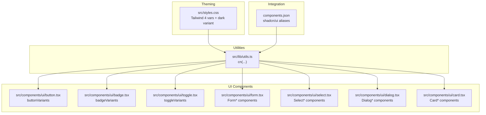
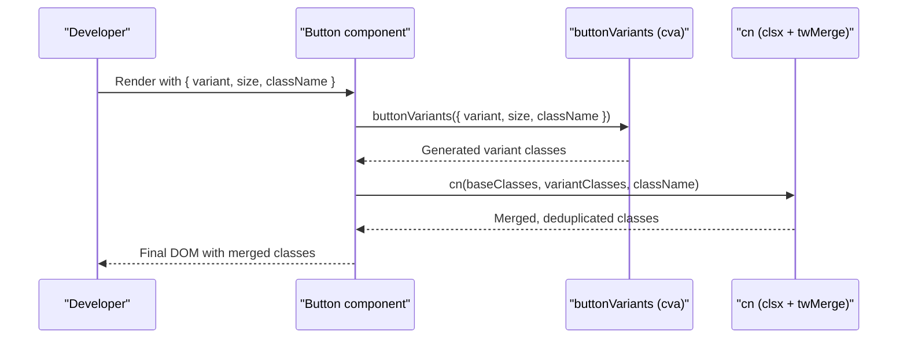
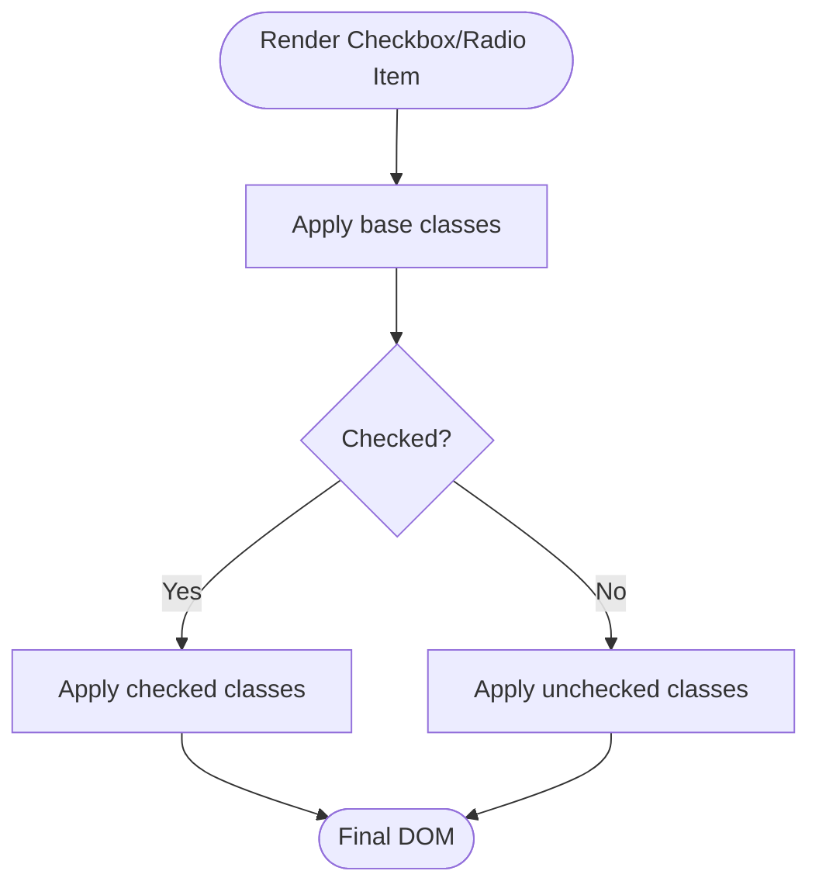
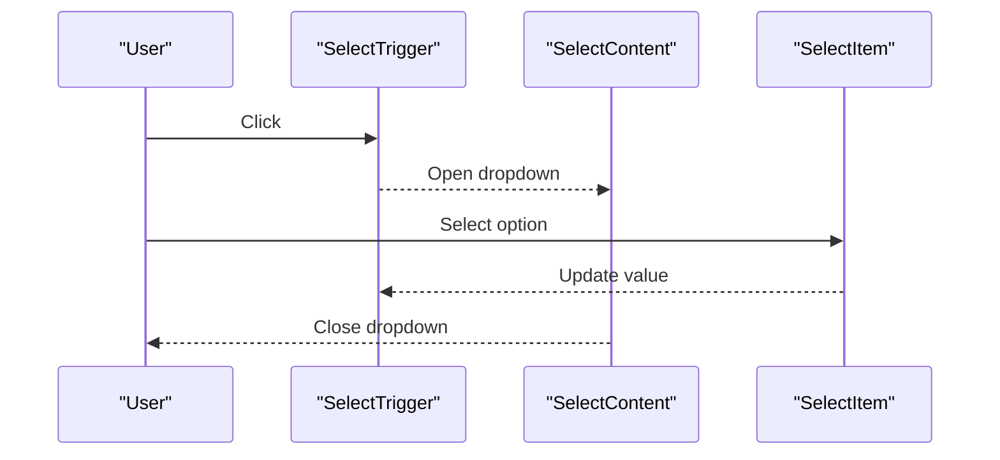
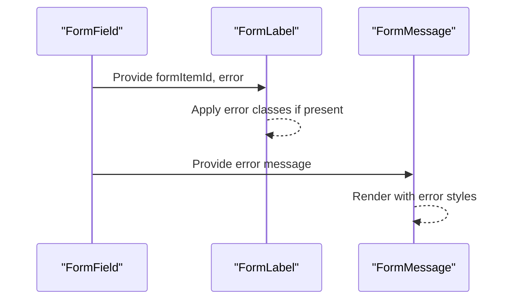
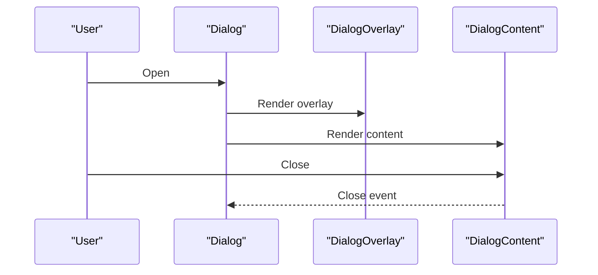
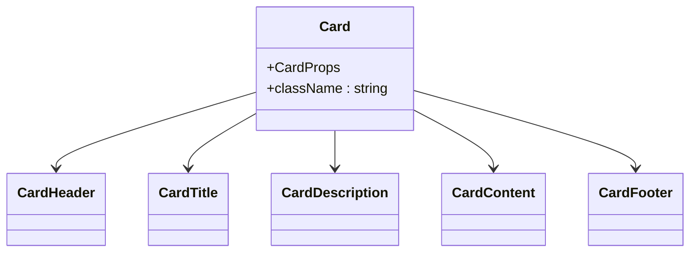
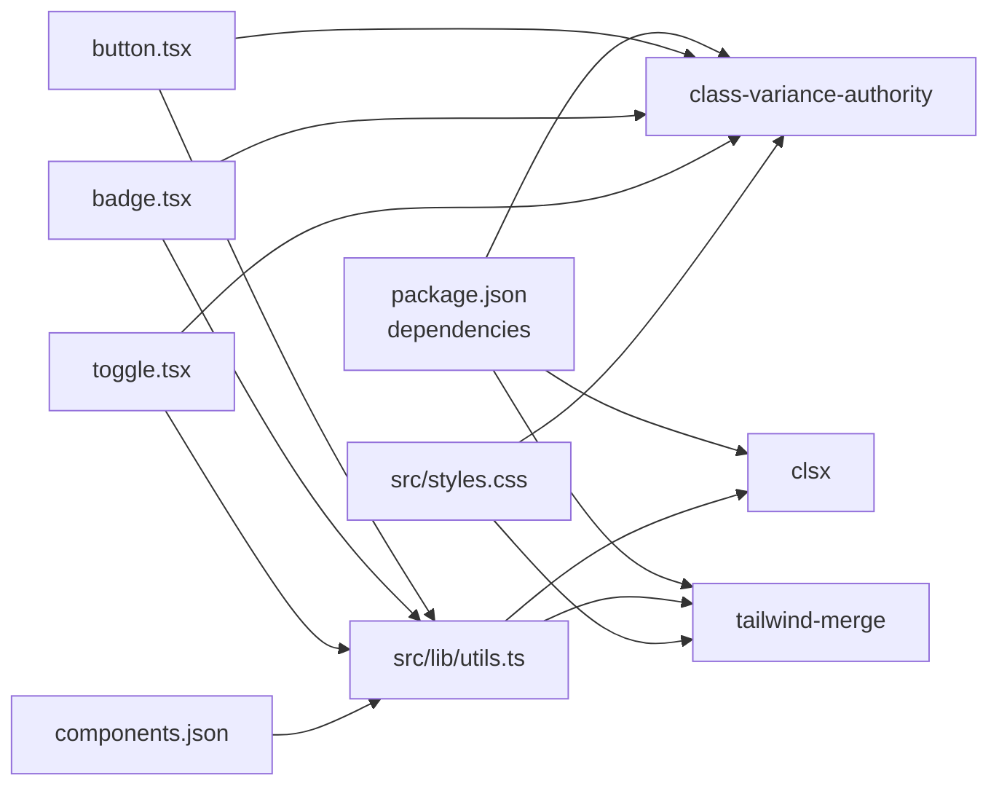

# Component Variants System

<cite>
**Referenced Files in This Document**
- [utils.ts](file://src/lib/utils.ts)
- [button.tsx](file://src/components/ui/button.tsx)
- [badge.tsx](file://src/components/ui/badge.tsx)
- [toggle.tsx](file://src/components/ui/toggle.tsx)
- [input.tsx](file://src/components/ui/input.tsx)
- [textarea.tsx](file://src/components/ui/textarea.tsx)
- [label.tsx](file://src/components/ui/label.tsx)
- [checkbox.tsx](file://src/components/ui/checkbox.tsx)
- [radio-group.tsx](file://src/components/ui/radio-group.tsx)
- [select.tsx](file://src/components/ui/select.tsx)
- [form.tsx](file://src/components/ui/form.tsx)
- [dialog.tsx](file://src/components/ui/dialog.tsx)
- [card.tsx](file://src/components/ui/card.tsx)
- [styles.css](file://src/styles.css)
- [components.json](file://components.json)
- [package.json](file://package.json)
</cite>

## Table of Contents
1. [Introduction](#introduction)
2. [Project Structure](#project-structure)
3. [Core Components](#core-components)
4. [Architecture Overview](#architecture-overview)
5. [Detailed Component Analysis](#detailed-component-analysis)
6. [Dependency Analysis](#dependency-analysis)
7. [Performance Considerations](#performance-considerations)
8. [Troubleshooting Guide](#troubleshooting-guide)
9. [Conclusion](#conclusion)
10. [Appendices](#appendices)

## Introduction
This document explains the component variant system used across the UI components in this project. It focuses on how class-variance-authority (cva) and clsx are integrated to define and compose variants for buttons, inputs, badges, toggles, and other interactive components. It also documents the cn function for safe class merging, the Tailwind-based theming system, and the integration with the shadcn/ui component library. Practical guidance is provided for creating custom variants, extending existing styles, maintaining consistency, and ensuring backward compatibility.

## Project Structure
The variant system is implemented across shared utilities and individual UI components:
- Shared utilities: a single cn function wraps clsx and tailwind-merge for deterministic class merging.
- UI components: several components use cva to define variant sets (e.g., size, color, state) and expose typed props via VariantProps.
- Theming: Tailwind 4 variables and custom dark mode variant are defined in the global stylesheet.
- Integration: components.json configures shadcn/ui aliases and registry paths.



**Diagram sources**
- [utils.ts:1-7](file://src/lib/utils.ts#L1-L7)
- [button.tsx:1-50](file://src/components/ui/button.tsx#L1-L50)
- [badge.tsx:1-33](file://src/components/ui/badge.tsx#L1-L33)
- [toggle.tsx:1-43](file://src/components/ui/toggle.tsx#L1-L43)
- [form.tsx:1-172](file://src/components/ui/form.tsx#L1-L172)
- [select.tsx:1-153](file://src/components/ui/select.tsx#L1-L153)
- [dialog.tsx:1-105](file://src/components/ui/dialog.tsx#L1-L105)
- [card.tsx:1-56](file://src/components/ui/card.tsx#L1-L56)
- [styles.css:1-136](file://src/styles.css#L1-L136)
- [components.json:1-23](file://components.json#L1-L23)

**Section sources**
- [utils.ts:1-7](file://src/lib/utils.ts#L1-L7)
- [components.json:1-23](file://components.json#L1-L23)

## Core Components
This section outlines the building blocks of the variant system:
- cn function: merges Tailwind classes safely using clsx and tailwind-merge.
- cva usage: defines variant sets and default values per component.
- VariantProps: exposes strongly typed props for variant selection.
- Tailwind 4 theming: CSS variables and custom dark mode variant.

Key implementation references:
- cn function definition and usage across components.
- buttonVariants, badgeVariants, toggleVariants configuration.
- Tailwind 4 variable declarations and dark variant definition.
- shadcn/ui alias configuration in components.json.

**Section sources**
- [utils.ts:1-7](file://src/lib/utils.ts#L1-L7)
- [button.tsx:7-32](file://src/components/ui/button.tsx#L7-L32)
- [badge.tsx:6-23](file://src/components/ui/badge.tsx#L6-L23)
- [toggle.tsx:7-27](file://src/components/ui/toggle.tsx#L7-L27)
- [styles.css:6-43](file://src/styles.css#L6-L43)
- [components.json:14-20](file://components.json#L14-L20)

## Architecture Overview
The variant architecture follows a predictable pattern:
- Each variant-enabled component defines a cva configuration with variants and defaultVariants.
- The component’s props accept variant keys and forward className to cn.
- cn merges the base classes, variant classes, and any user-provided className.
- Tailwind 4 variables and the dark variant ensure consistent theming across components.



**Diagram sources**
- [button.tsx:34-46](file://src/components/ui/button.tsx#L34-L46)
- [button.tsx:7-32](file://src/components/ui/button.tsx#L7-L32)
- [utils.ts:4-6](file://src/lib/utils.ts#L4-L6)

## Detailed Component Analysis

### Button Variants
The Button component demonstrates a robust variant configuration:
- Variants: default, destructive, outline, secondary, ghost, link.
- Sizes: default, sm, lg, icon.
- Defaults: variant default, size default.
- Composition: base classes plus variant-specific classes, with responsive and state utilities.

```mermaid
classDiagram
class Button {
+ButtonProps
+asChild : boolean
+className : string
+variant : "default"|"destructive"|"outline"|"secondary"|"ghost"|"link"
+size : "default"|"sm"|"lg"|"icon"
}
class buttonVariants {
+variants : { variant, size }
+defaultVariants : { variant : "default", size : "default" }
}
Button --> buttonVariants : "uses"
```

**Diagram sources**
- [button.tsx:34-46](file://src/components/ui/button.tsx#L34-L46)
- [button.tsx:7-32](file://src/components/ui/button.tsx#L7-L32)

**Section sources**
- [button.tsx:7-32](file://src/components/ui/button.tsx#L7-L32)
- [button.tsx:34-46](file://src/components/ui/button.tsx#L34-L46)

### Badge Variants
The Badge component showcases a simpler variant set:
- Variants: default, secondary, destructive, outline.
- Defaults: variant default.
- Composition: base classes plus variant-specific classes.

```mermaid
classDiagram
class Badge {
+BadgeProps
+className : string
+variant : "default"|"secondary"|"destructive"|"outline"
}
class badgeVariants {
+variants : { variant }
+defaultVariants : { variant : "default" }
}
Badge --> badgeVariants : "uses"
```

**Diagram sources**
- [badge.tsx:25-31](file://src/components/ui/badge.tsx#L25-L31)
- [badge.tsx:6-23](file://src/components/ui/badge.tsx#L6-L23)

**Section sources**
- [badge.tsx:6-23](file://src/components/ui/badge.tsx#L6-L23)
- [badge.tsx:25-31](file://src/components/ui/badge.tsx#L25-L31)

### Toggle Variants
The Toggle component illustrates state-based variants:
- Variants: default, outline.
- Sizes: default, sm, lg.
- Defaults: variant default, size default.
- Composition: base classes plus variant-specific classes and data-state attributes.

```mermaid
classDiagram
class Toggle {
+ToggleProps
+className : string
+variant : "default"|"outline"
+size : "default"|"sm"|"lg"
}
class toggleVariants {
+variants : { variant, size }
+defaultVariants : { variant : "default", size : "default" }
}
Toggle --> toggleVariants : "uses"
```

**Diagram sources**
- [toggle.tsx:29-38](file://src/components/ui/toggle.tsx#L29-L38)
- [toggle.tsx:7-27](file://src/components/ui/toggle.tsx#L7-L27)

**Section sources**
- [toggle.tsx:7-27](file://src/components/ui/toggle.tsx#L7-L27)
- [toggle.tsx:29-38](file://src/components/ui/toggle.tsx#L29-L38)

### Label Variants
The Label component uses cva for optional variants:
- Variants: none defined (empty set).
- Composition: base classes only, with optional variant prop typing.

```mermaid
classDiagram
class Label {
+LabelProps
+className : string
}
class labelVariants {
+variants : {}
}
Label --> labelVariants : "uses"
```

**Diagram sources**
- [label.tsx:13-18](file://src/components/ui/label.tsx#L13-L18)
- [label.tsx:9-11](file://src/components/ui/label.tsx#L9-L11)

**Section sources**
- [label.tsx:9-11](file://src/components/ui/label.tsx#L9-L11)
- [label.tsx:13-18](file://src/components/ui/label.tsx#L13-L18)

### Checkbox and Radio Group
These components demonstrate state-based styling without cva:
- Checkbox: data-[state=checked] classes applied directly.
- RadioGroupItem: similar state-based classes.



**Diagram sources**
- [checkbox.tsx:11-22](file://src/components/ui/checkbox.tsx#L11-L22)
- [radio-group.tsx:15-33](file://src/components/ui/radio-group.tsx#L15-L33)

**Section sources**
- [checkbox.tsx:11-22](file://src/components/ui/checkbox.tsx#L11-L22)
- [radio-group.tsx:15-33](file://src/components/ui/radio-group.tsx#L15-L33)

### Select Variants
The Select component composes multiple parts with consistent styling:
- Trigger, Content, Item, Label, Separator, ScrollUp/DownButton.
- Uses cn for class composition and Tailwind utilities for layout and transitions.



**Diagram sources**
- [select.tsx:15-33](file://src/components/ui/select.tsx#L15-L33)
- [select.tsx:63-93](file://src/components/ui/select.tsx#L63-L93)
- [select.tsx:107-127](file://src/components/ui/select.tsx#L107-L127)

**Section sources**
- [select.tsx:15-33](file://src/components/ui/select.tsx#L15-L33)
- [select.tsx:63-93](file://src/components/ui/select.tsx#L63-L93)
- [select.tsx:107-127](file://src/components/ui/select.tsx#L107-L127)

### Form Variants
Form components integrate with react-hook-form and conditionally style labels based on field errors:
- FormLabel applies error-aware classes.
- FormMessage renders error messages with consistent typography.



**Diagram sources**
- [form.tsx:86-101](file://src/components/ui/form.tsx#L86-L101)
- [form.tsx:138-160](file://src/components/ui/form.tsx#L138-L160)

**Section sources**
- [form.tsx:86-101](file://src/components/ui/form.tsx#L86-L101)
- [form.tsx:138-160](file://src/components/ui/form.tsx#L138-L160)

### Dialog Variants
Dialog components combine overlay, content, header, footer, title, and description:
- Overlay and Content use cn with animation utilities.
- Close button integrates with iconography and focus styles.



**Diagram sources**
- [dialog.tsx:17-54](file://src/components/ui/dialog.tsx#L17-L54)

**Section sources**
- [dialog.tsx:17-54](file://src/components/ui/dialog.tsx#L17-L54)

### Card Variants
Card components provide a consistent container with header, title, description, content, and footer:
- Each part uses cn for spacing and typography.



**Diagram sources**
- [card.tsx:5-14](file://src/components/ui/card.tsx#L5-L14)
- [card.tsx:16-31](file://src/components/ui/card.tsx#L16-L31)
- [card.tsx:34-53](file://src/components/ui/card.tsx#L34-L53)

**Section sources**
- [card.tsx:5-14](file://src/components/ui/card.tsx#L5-L14)
- [card.tsx:16-31](file://src/components/ui/card.tsx#L16-L31)
- [card.tsx:34-53](file://src/components/ui/card.tsx#L34-L53)

## Dependency Analysis
The variant system relies on:
- class-variance-authority for variant configuration and composition.
- clsx and tailwind-merge for safe class merging.
- Tailwind 4 CSS variables and custom dark variant for theming.
- shadcn/ui configuration for aliases and registry paths.



**Diagram sources**
- [package.json:46-61](file://package.json#L46-L61)
- [utils.ts:1-7](file://src/lib/utils.ts#L1-L7)
- [button.tsx:3-5](file://src/components/ui/button.tsx#L3-L5)
- [badge.tsx:2-4](file://src/components/ui/badge.tsx#L2-L4)
- [toggle.tsx:3-5](file://src/components/ui/toggle.tsx#L3-L5)
- [styles.css:6-43](file://src/styles.css#L6-L43)
- [components.json:14-20](file://components.json#L14-L20)

**Section sources**
- [package.json:46-61](file://package.json#L46-L61)
- [utils.ts:1-7](file://src/lib/utils.ts#L1-L7)
- [button.tsx:3-5](file://src/components/ui/button.tsx#L3-L5)
- [badge.tsx:2-4](file://src/components/ui/badge.tsx#L2-L4)
- [toggle.tsx:3-5](file://src/components/ui/toggle.tsx#L3-L5)
- [styles.css:6-43](file://src/styles.css#L6-L43)
- [components.json:14-20](file://components.json#L14-L20)

## Performance Considerations
- Prefer cva for variant composition to avoid runtime class concatenation and reduce bundle size.
- Use cn to merge classes efficiently; it leverages clsx and tailwind-merge to prevent duplicates and conflicts.
- Keep variant sets minimal and focused to reduce CSS output and improve maintainability.
- Avoid excessive conditional class logic in render; delegate to cva where possible.

## Troubleshooting Guide
Common issues and resolutions:
- Conflicting classes: Ensure variant classes are ordered so that later classes override earlier ones. The cn function merges deterministically, but explicit ordering helps.
- Missing variant defaults: Define defaultVariants to guarantee consistent baseline styles.
- State-based classes not applying: Verify data-state attributes and ensure the component exposes them (e.g., Toggle, Checkbox).
- Theming inconsistencies: Confirm Tailwind 4 variables and dark variant are defined in the stylesheet and used consistently across components.

**Section sources**
- [utils.ts:4-6](file://src/lib/utils.ts#L4-L6)
- [toggle.tsx:7-27](file://src/components/ui/toggle.tsx#L7-L27)
- [checkbox.tsx:11-22](file://src/components/ui/checkbox.tsx#L11-L22)
- [styles.css:6-43](file://src/styles.css#L6-L43)

## Conclusion
The variant system leverages cva for structured, type-safe variant composition and cn for reliable class merging. Combined with Tailwind 4 variables and the dark variant, it enables consistent theming across components. The shadcn/ui integration via components.json ensures predictable aliases and paths. Following the patterns documented here will help maintain consistency, support future extensions, and preserve backward compatibility.

## Appendices

### Creating Custom Variants
Steps to add a new variant set to an existing component:
- Define the variant configuration using cva with variants and defaultVariants.
- Export the variant configuration and use it in the component’s props.
- Merge variant classes with cn alongside any user-provided className.
- Add tests or examples to validate the new variant combinations.

References:
- [button.tsx:7-32](file://src/components/ui/button.tsx#L7-L32)
- [utils.ts:4-6](file://src/lib/utils.ts#L4-L6)

**Section sources**
- [button.tsx:7-32](file://src/components/ui/button.tsx#L7-L32)
- [utils.ts:4-6](file://src/lib/utils.ts#L4-L6)

### Extending Existing Component Styles
Guidelines:
- Use the component’s exported variant configuration to add new variant options.
- Keep variant names semantic and aligned with the component’s purpose.
- Maintain backward compatibility by preserving defaultVariants and not removing existing variants.

References:
- [badge.tsx:6-23](file://src/components/ui/badge.tsx#L6-L23)
- [toggle.tsx:7-27](file://src/components/ui/toggle.tsx#L7-L27)

**Section sources**
- [badge.tsx:6-23](file://src/components/ui/badge.tsx#L6-L23)
- [toggle.tsx:7-27](file://src/components/ui/toggle.tsx#L7-L27)

### Maintaining Variant Consistency
Best practices:
- Centralize variant definitions in a single cva configuration per component.
- Use Tailwind 4 variables for theme tokens to ensure consistency.
- Leverage the dark variant for consistent dark-mode behavior.
- Keep variant sets small and orthogonal to minimize complexity.

References:
- [styles.css:6-43](file://src/styles.css#L6-L43)
- [components.json:14-20](file://components.json#L14-L20)

**Section sources**
- [styles.css:6-43](file://src/styles.css#L6-L43)
- [components.json:14-20](file://components.json#L14-L20)

### Shadcn/UI Integration and Customization
Patterns:
- Use components.json aliases to map internal paths to @/components, @/lib, and @/ui.
- Keep component files under src/components/ui and export both component and variant configuration.
- Maintain a shared cn utility for consistent class merging.

References:
- [components.json:14-20](file://components.json#L14-L20)
- [utils.ts:4-6](file://src/lib/utils.ts#L4-L6)

**Section sources**
- [components.json:14-20](file://components.json#L14-L20)
- [utils.ts:4-6](file://src/lib/utils.ts#L4-L6)