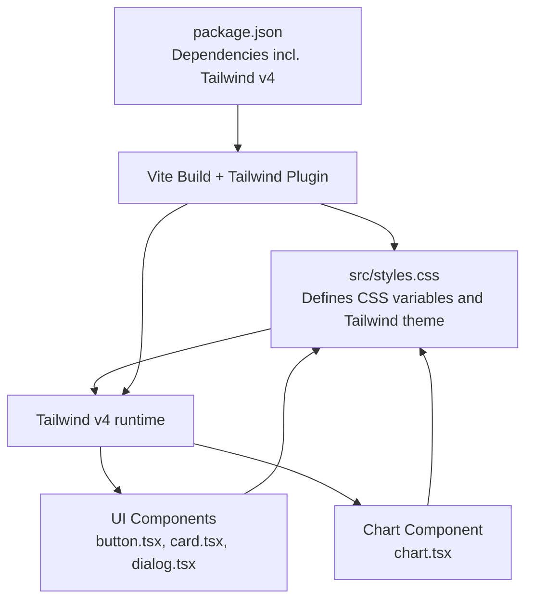
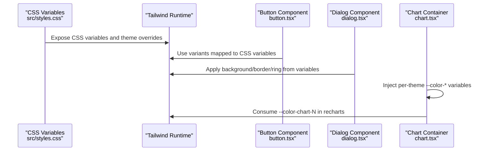
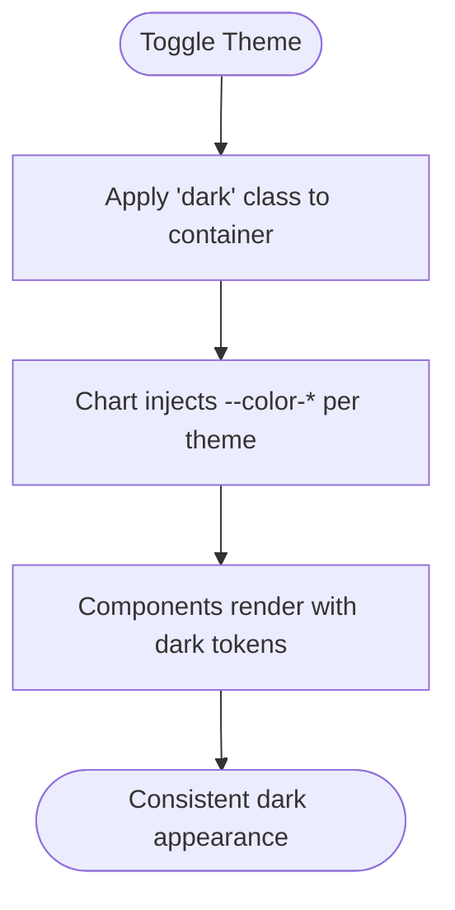
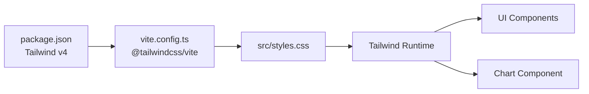

# Design Tokens & Variables

<cite>
**Referenced Files in This Document**
- [styles.css](file://src/styles.css)
- [button.tsx](file://src/components/ui/button.tsx)
- [card.tsx](file://src/components/ui/card.tsx)
- [dialog.tsx](file://src/components/ui/dialog.tsx)
- [chart.tsx](file://src/components/ui/chart.tsx)
- [package.json](file://package.json)
- [vite.config.ts](file://vite.config.ts)
</cite>

## Table of Contents
1. [Introduction](#introduction)
2. [Project Structure](#project-structure)
3. [Core Components](#core-components)
4. [Architecture Overview](#architecture-overview)
5. [Detailed Component Analysis](#detailed-component-analysis)
6. [Dependency Analysis](#dependency-analysis)
7. [Performance Considerations](#performance-considerations)
8. [Troubleshooting Guide](#troubleshooting-guide)
9. [Conclusion](#conclusion)
10. [Appendices](#appendices)

## Introduction
This document describes the design token system and CSS custom properties used across the project. It covers the color palette (primary, secondary, background, foreground, surfaces), typography scale, radius variables, spacing units, gradients for interactive states, dark mode color scheme and theme switching, chart color tokens, and the relationship between CSS variables and Tailwind theme configuration. It also provides guidelines for accessing, modifying, and extending the token system consistently.

## Project Structure
The design token system is centralized in a single stylesheet that defines CSS custom properties and Tailwind theme overrides. Utility classes and components consume these variables to maintain visual consistency.



**Diagram sources**
- [styles.css:1-136](file://src/styles.css#L1-L136)
- [button.tsx:1-50](file://src/components/ui/button.tsx#L1-L50)
- [card.tsx:1-56](file://src/components/ui/card.tsx#L1-L56)
- [dialog.tsx:1-105](file://src/components/ui/dialog.tsx#L1-L105)
- [chart.tsx:1-331](file://src/components/ui/chart.tsx#L1-L331)
- [vite.config.ts:1-30](file://vite.config.ts#L1-L30)
- [package.json:1-86](file://package.json#L1-L86)

**Section sources**
- [styles.css:1-136](file://src/styles.css#L1-L136)
- [vite.config.ts:1-30](file://vite.config.ts#L1-L30)
- [package.json:1-86](file://package.json#L1-L86)

## Core Components
This section documents the design tokens exposed via CSS custom properties and how they are consumed by components and utilities.

- Color tokens
  - Background and foreground: used for base surfaces and text.
  - Primary and secondary: brand accent colors for prominent actions and highlights.
  - Muted/accent/destructive: semantic roles for supporting elements, neutral accents, and destructive actions.
  - Card/popover: surfaces for elevated containers.
  - Border/input/ring: borders and focus rings.
  - Surfaces: deep, elevated, and dark surface tokens for backgrounds and overlays.
  - Chart colors: five named chart tokens for data visualization series.
- Typography
  - Font family for sans-serif text.
- Radius
  - Base radius and derived sizes for corners.
- Gradients and shadows
  - Primary gradient and hover variant for interactive states.
  - Glow and elevation shadows for depth effects.
- Dark mode
  - A custom dark variant selector targets descendants under a dark class.

Access pattern:
- Components reference tokens via Tailwind utilities that map to CSS variables.
- The chart component injects per-theme color variables into its container element.

**Section sources**
- [styles.css:8-43](file://src/styles.css#L8-L43)
- [styles.css:45-79](file://src/styles.css#L45-L79)
- [styles.css:6-6](file://src/styles.css#L6-L6)
- [button.tsx:10-31](file://src/components/ui/button.tsx#L10-L31)
- [card.tsx:7-9](file://src/components/ui/card.tsx#L7-L9)
- [dialog.tsx:40-43](file://src/components/ui/dialog.tsx#L40-L43)
- [chart.tsx:64-91](file://src/components/ui/chart.tsx#L64-L91)

## Architecture Overview
The token architecture connects CSS variables to Tailwind’s theme system and component classes. The chart component dynamically injects theme-specific color variables into its DOM subtree to support light/dark modes.



**Diagram sources**
- [styles.css:8-43](file://src/styles.css#L8-L43)
- [styles.css:45-79](file://src/styles.css#L45-L79)
- [button.tsx:10-31](file://src/components/ui/button.tsx#L10-L31)
- [dialog.tsx:40-43](file://src/components/ui/dialog.tsx#L40-L43)
- [chart.tsx:64-91](file://src/components/ui/chart.tsx#L64-L91)

## Detailed Component Analysis

### Color Palette and Surface Tokens
- Primary and secondary palettes are defined as brand colors with contrasting foregrounds.
- Background and foreground define the base canvas and text.
- Card and popover surfaces provide elevated containers with appropriate foregrounds.
- Muted/accent/destructive serve semantic roles.
- Surfaces deep/elev/dark provide layered background options.
- Borders and inputs define interactive and structural boundaries.
- Ring controls focus indicators.

Usage examples:
- Buttons use primary/secondary/muted/accent/destructive tokens depending on variant.
- Cards apply card and card-foreground tokens.
- Dialogs rely on background and border tokens.

**Section sources**
- [styles.css:47-74](file://src/styles.css#L47-L74)
- [button.tsx:11-18](file://src/components/ui/button.tsx#L11-L18)
- [card.tsx:7-9](file://src/components/ui/card.tsx#L7-L9)
- [dialog.tsx:40-43](file://src/components/ui/dialog.tsx#L40-L43)

### Typography Scale and Font Family
- The font stack is configured for a sans-serif family.
- Headings inherit the same font family and weight.
- Focus-visible outline uses the primary color for accessibility.

**Section sources**
- [styles.css:42-42](file://src/styles.css#L42-L42)
- [styles.css:98-102](file://src/styles.css#L98-L102)
- [styles.css:103-106](file://src/styles.css#L103-L106)

### Radius Variables
- A base radius is defined and mapped to derived sizes for small, medium, large, extra-large, and extra-extra-large radii.
- Components use rounded utilities that align with these derived values.

**Section sources**
- [styles.css:46-46](file://src/styles.css#L46-L46)
- [styles.css:9-14](file://src/styles.css#L9-L14)
- [button.tsx:7-32](file://src/components/ui/button.tsx#L7-L32)

### Spacing Units
- Spacing is applied implicitly via component classes (e.g., padding and margin utilities).
- There is no explicit spacing token variable defined; spacing is managed through Tailwind utilities.

**Section sources**
- [card.tsx:16-51](file://src/components/ui/card.tsx#L16-L51)
- [dialog.tsx:56-67](file://src/components/ui/dialog.tsx#L56-L67)

### Gradient Tokens and Interactive States
- Primary gradient and hover variant are defined for interactive states.
- Utilities apply these gradients and glow/elevation shadows.

**Section sources**
- [styles.css:75-78](file://src/styles.css#L75-L78)
- [styles.css:117-123](file://src/styles.css#L117-L123)
- [styles.css:124-125](file://src/styles.css#L124-L125)

### Dark Mode Color Scheme and Theme Switching
- A custom dark variant selector targets descendants of an element with a dark class.
- The chart component injects theme-specific color variables into its container for light/dark contexts.
- Components consume tokens via Tailwind utilities; dark mode is activated by applying the dark class to the container.



**Diagram sources**
- [styles.css:6-6](file://src/styles.css#L6-L6)
- [chart.tsx:7-7](file://src/components/ui/chart.tsx#L7-L7)
- [chart.tsx:64-91](file://src/components/ui/chart.tsx#L64-L91)

**Section sources**
- [styles.css:6-6](file://src/styles.css#L6-L6)
- [chart.tsx:7-7](file://src/components/ui/chart.tsx#L7-L7)
- [chart.tsx:64-91](file://src/components/ui/chart.tsx#L64-L91)

### Chart Color Tokens
- Five named chart tokens are defined for data series.
- The chart component dynamically sets per-theme color variables inside its container so charts adapt to light/dark modes.

**Section sources**
- [styles.css:66-70](file://src/styles.css#L66-L70)
- [chart.tsx:64-91](file://src/components/ui/chart.tsx#L64-L91)

### Relationship Between CSS Variables and Tailwind Theme Configuration
- The stylesheet exposes a theme block that maps CSS variables to Tailwind’s theme namespace.
- Components reference Tailwind utilities that resolve to CSS variables, ensuring consistent theming.

```mermaid
classDiagram
class CSSVariables {
"+--background"
"+--foreground"
"+--primary"
"+--secondary"
"+--muted"
"+--accent"
"+--destructive"
"+--border"
"+--input"
"+--ring"
"+--radius"
"+--chart-1..5"
}
class TailwindTheme {
"+colors.* -> CSS vars"
"+spacing.* -> derived from vars"
"+borderRadius.* -> derived from radius"
}
CSSVariables <.. TailwindTheme : "mapped via @theme inline"
```

**Diagram sources**
- [styles.css:8-43](file://src/styles.css#L8-L43)
- [styles.css:45-79](file://src/styles.css#L45-L79)

**Section sources**
- [styles.css:8-43](file://src/styles.css#L8-L43)
- [styles.css:45-79](file://src/styles.css#L45-L79)

## Dependency Analysis
The token system depends on Tailwind v4 and the Vite build pipeline with the Tailwind plugin.



**Diagram sources**
- [package.json:62-62](file://package.json#L62-L62)
- [vite.config.ts:5-5](file://vite.config.ts#L5-L5)
- [styles.css:1-4](file://src/styles.css#L1-L4)

**Section sources**
- [package.json:62-62](file://package.json#L62-L62)
- [vite.config.ts:5-5](file://vite.config.ts#L5-L5)
- [styles.css:1-4](file://src/styles.css#L1-L4)

## Performance Considerations
- CSS variables reduce duplication and enable efficient theme switching.
- The chart component injects only the color variables it needs, minimizing overhead.
- Keep the number of injected variables scoped to the component to avoid unnecessary cascade.

## Troubleshooting Guide
- If dark mode visuals appear inconsistent, verify the dark class is applied to the container and that the chart component is rendering with per-theme color variables.
- If gradients or shadows look incorrect, confirm the gradient and shadow variables are present and applied via utilities.
- If typography appears off, ensure the font variable is set and used by headings and body elements.

**Section sources**
- [styles.css:6-6](file://src/styles.css#L6-L6)
- [styles.css:117-125](file://src/styles.css#L117-L125)
- [chart.tsx:64-91](file://src/components/ui/chart.tsx#L64-L91)

## Conclusion
The project’s design token system centers on a compact set of CSS custom properties that are mapped into Tailwind’s theme and consumed by components. The approach supports consistent theming, dark mode, and extensible chart color tokens. By adhering to the established access patterns and keeping theme updates localized to the stylesheet, teams can maintain visual consistency and easily extend the system.

## Appendices

### Accessing and Modifying Tokens
- To change a color: update the corresponding CSS variable in the root block.
- To adjust corner radii: modify the base radius and derived values.
- To add a new chart color: define a new chart-N variable and use it in chart configurations.
- To introduce a new gradient or shadow: add a variable and apply it via utilities.

Guidelines:
- Prefer updating variables in the central stylesheet to propagate changes globally.
- When adding new tokens, mirror the mapping in the theme block for Tailwind compatibility.
- For chart tokens, ensure both light and dark theme values are provided when applicable.

**Section sources**
- [styles.css:8-43](file://src/styles.css#L8-L43)
- [styles.css:45-79](file://src/styles.css#L45-L79)
- [chart.tsx:64-91](file://src/components/ui/chart.tsx#L64-L91)