# Responsive Design & Breakpoints

<cite>
**Referenced Files in This Document**
- [styles.css](file://src/styles.css)
- [use-mobile.tsx](file://src/hooks/use-mobile.tsx)
- [components.json](file://components.json)
- [Header.tsx](file://src/components/site/Header.tsx)
- [Footer.tsx](file://src/components/site/Footer.tsx)
- [sidebar.tsx](file://src/components/ui/sidebar.tsx)
- [navigation-menu.tsx](file://src/components/ui/navigation-menu.tsx)
- [drawer.tsx](file://src/components/ui/drawer.tsx)
- [utils.ts](file://src/lib/utils.ts)
- [button.tsx](file://src/components/ui/button.tsx)
- [card.tsx](file://src/components/ui/card.tsx)
- [main.tsx](file://src/main.tsx)
- [__root.tsx](file://src/routes/__root.tsx)
</cite>

## Table of Contents
1. [Introduction](#introduction)
2. [Project Structure](#project-structure)
3. [Core Components](#core-components)
4. [Architecture Overview](#architecture-overview)
5. [Detailed Component Analysis](#detailed-component-analysis)
6. [Dependency Analysis](#dependency-analysis)
7. [Performance Considerations](#performance-considerations)
8. [Troubleshooting Guide](#troubleshooting-guide)
9. [Conclusion](#conclusion)
10. [Appendices](#appendices)

## Introduction
This document explains the responsive design system and breakpoint management used throughout the application. It focuses on the mobile-first approach, breakpoint definitions, responsive utility classes, adaptive component behaviors, and the relationship between CSS custom properties and responsive patterns. It also provides practical guidelines for building responsive layouts, handling mobile navigation, and optimizing touch interactions.

## Project Structure
The responsive system is implemented across three layers:
- Global theme and utilities: CSS custom properties and media queries define the baseline responsive behavior.
- Component-level adaptation: UI components use Tailwind variants and CSS custom properties to adapt to screen sizes.
- Runtime detection: A hook detects mobile breakpoints to drive runtime behavior (e.g., sidebar off-canvas on mobile).

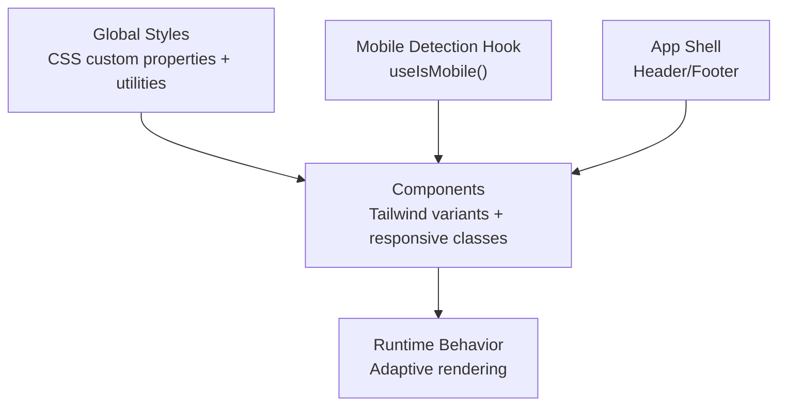

**Diagram sources**
- [styles.css:8-43](file://src/styles.css#L8-L43)
- [use-mobile.tsx:3-19](file://src/hooks/use-mobile.tsx#L3-L19)
- [Header.tsx:13-84](file://src/components/site/Header.tsx#L13-L84)
- [Footer.tsx:3-44](file://src/components/site/Footer.tsx#L3-L44)

**Section sources**
- [styles.css:1-136](file://src/styles.css#L1-L136)
- [components.json:6-11](file://components.json#L6-L11)
- [main.tsx:1-21](file://src/main.tsx#L1-L21)
- [__root.tsx:49-61](file://src/routes/__root.tsx#L49-L61)

## Core Components
- Mobile breakpoint definition: The constant breakpoint is set at 768 pixels, used consistently across the app for responsive toggles.
- CSS custom properties: Theme tokens are defined as CSS variables and consumed in base and utility layers.
- Responsive utilities: Media queries and Tailwind utilities adjust paddings, typography, and spacing at larger screens.
- Adaptive components: Components switch between desktop and mobile modes using the mobile detection hook and Tailwind responsive modifiers.

Key implementation references:
- Breakpoint constant and media queries: [use-mobile.tsx:3](file://src/hooks/use-mobile.tsx#L3), [styles.css:127-129](file://src/styles.css#L127-L129)
- CSS custom properties and theme tokens: [styles.css:8-43](file://src/styles.css#L8-L43), [styles.css:45-79](file://src/styles.css#L45-L79)
- Utility classes and responsive adjustments: [styles.css:109-135](file://src/styles.css#L109-L135)

**Section sources**
- [use-mobile.tsx:3-19](file://src/hooks/use-mobile.tsx#L3-L19)
- [styles.css:8-43](file://src/styles.css#L8-L43)
- [styles.css:109-135](file://src/styles.css#L109-L135)

## Architecture Overview
The responsive architecture combines:
- A global theme layer that defines colors, radii, and fonts via CSS custom properties.
- A utilities layer that applies responsive adjustments using media queries.
- Component libraries that rely on Tailwind variants and CSS variables for consistent styling.
- Runtime adaptation through a mobile detection hook that switches component behavior on small screens.

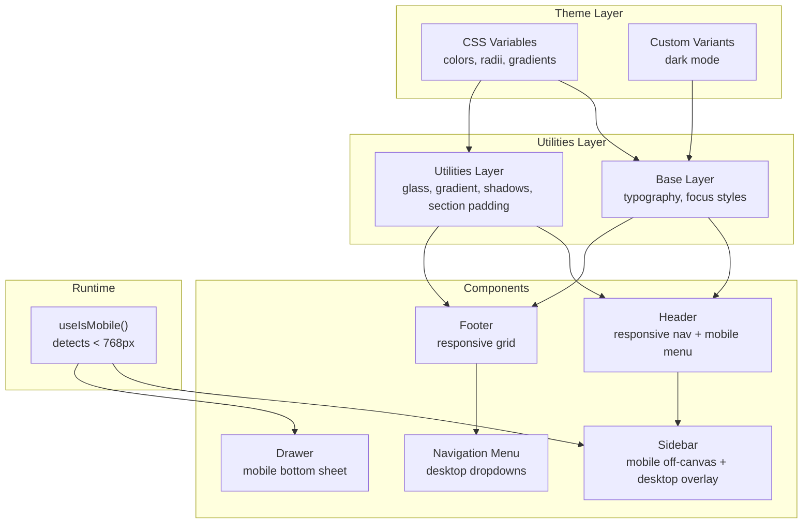

**Diagram sources**
- [styles.css:8-43](file://src/styles.css#L8-L43)
- [styles.css:109-135](file://src/styles.css#L109-L135)
- [Header.tsx:13-84](file://src/components/site/Header.tsx#L13-L84)
- [Footer.tsx:3-44](file://src/components/site/Footer.tsx#L3-L44)
- [sidebar.tsx:69-94](file://src/components/ui/sidebar.tsx#L69-L94)
- [navigation-menu.tsx:8-21](file://src/components/ui/navigation-menu.tsx#L8-L21)
- [drawer.tsx:6-12](file://src/components/ui/drawer.tsx#L6-L12)
- [use-mobile.tsx:3-19](file://src/hooks/use-mobile.tsx#L3-L19)

## Detailed Component Analysis

### Mobile Breakpoint and Detection
- Breakpoint: 768 pixels is used to distinguish mobile from tablet/desktop.
- Detection: The hook listens to a media query change event and tracks the current window width to determine mobile state.
- Usage: Components conditionally render mobile-specific UI (e.g., off-canvas sidebar, compact menus).

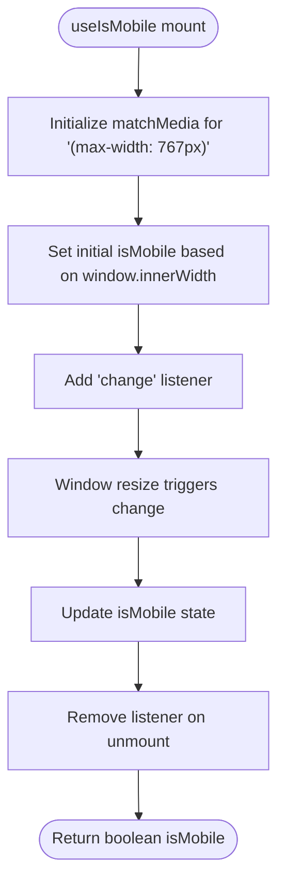

**Diagram sources**
- [use-mobile.tsx:5-16](file://src/hooks/use-mobile.tsx#L5-L16)

**Section sources**
- [use-mobile.tsx:3-19](file://src/hooks/use-mobile.tsx#L3-L19)

### Global Theme and Utilities
- CSS custom properties: Colors, radii, gradients, and shadows are defined as CSS variables in the theme block and applied in the base and utilities layers.
- Base layer: Normalizes borders, scroll behavior, and typography; applies theme colors globally.
- Utilities layer: Provides reusable responsive helpers such as glass panels, gradient buttons, glow/elevation shadows, and section padding that increases at wider widths.

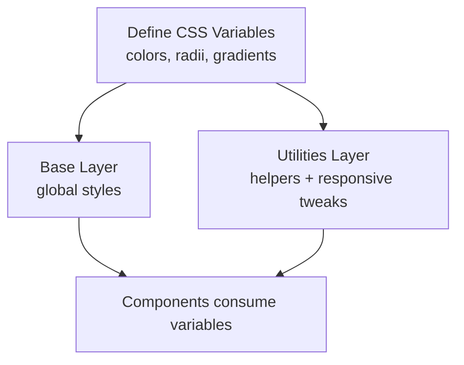

**Diagram sources**
- [styles.css:8-43](file://src/styles.css#L8-L43)
- [styles.css:109-135](file://src/styles.css#L109-L135)

**Section sources**
- [styles.css:8-43](file://src/styles.css#L8-L43)
- [styles.css:109-135](file://src/styles.css#L109-L135)

### Header: Mobile-First Navigation
- Desktop layout: Navigation links are visible alongside a prominent CTA.
- Mobile layout: A hamburger menu reveals a vertical navigation list; a smaller CTA is shown on mobile.
- Responsive classes: Hidden/show classes switch at the 768px breakpoint.

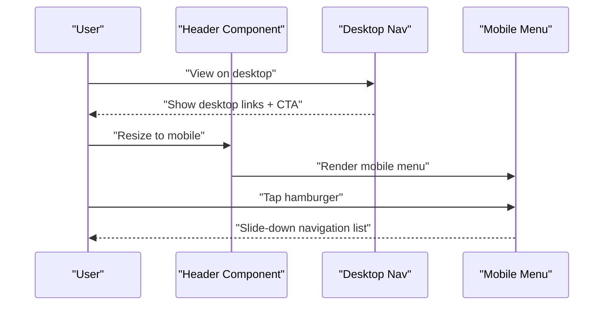

**Diagram sources**
- [Header.tsx:13-84](file://src/components/site/Header.tsx#L13-L84)

**Section sources**
- [Header.tsx:13-84](file://src/components/site/Header.tsx#L13-L84)

### Footer: Responsive Grid Layout
- Uses a responsive grid that stacks on mobile and splits into columns on tablets and up.
- Padding and typography scale appropriately using responsive utilities.

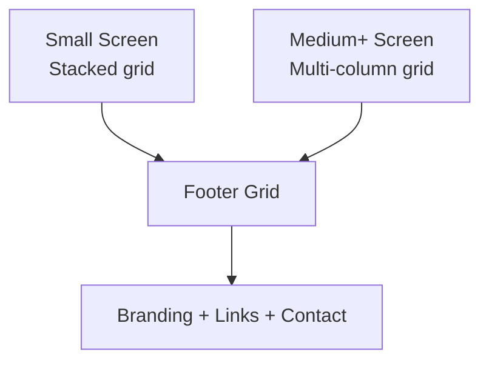

**Diagram sources**
- [Footer.tsx:3-44](file://src/components/site/Footer.tsx#L3-L44)

**Section sources**
- [Footer.tsx:3-44](file://src/components/site/Footer.tsx#L3-L44)

### Sidebar: Adaptive Desktop and Mobile Behaviors
- Desktop: Sidebar overlays the main content with collapsible states and adjustable width.
- Mobile: Sidebar becomes an off-canvas drawer using a sheet component.
- Runtime adaptation: The provider uses the mobile hook to decide between desktop and mobile rendering.
- CSS custom properties: Widths and icon widths are controlled via CSS variables for consistent sizing.

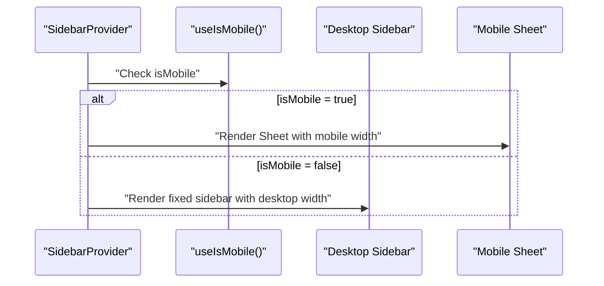

**Diagram sources**
- [sidebar.tsx:69-94](file://src/components/ui/sidebar.tsx#L69-L94)
- [sidebar.tsx:189-211](file://src/components/ui/sidebar.tsx#L189-L211)
- [sidebar.tsx:130-140](file://src/components/ui/sidebar.tsx#L130-L140)

**Section sources**
- [sidebar.tsx:69-94](file://src/components/ui/sidebar.tsx#L69-L94)
- [sidebar.tsx:130-140](file://src/components/ui/sidebar.tsx#L130-L140)
- [sidebar.tsx:189-211](file://src/components/ui/sidebar.tsx#L189-L211)

### Navigation Menu: Desktop Dropdowns
- Desktop-only behavior: Dropdown menus appear below items and are sized using CSS custom properties for viewport dimensions.
- Mobile: No dropdowns; navigation remains flat.

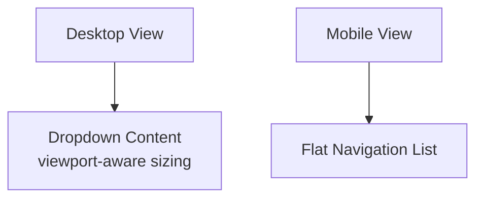

**Diagram sources**
- [navigation-menu.tsx:59-91](file://src/components/ui/navigation-menu.tsx#L59-L91)

**Section sources**
- [navigation-menu.tsx:59-91](file://src/components/ui/navigation-menu.tsx#L59-L91)

### Drawer: Mobile-First Bottom Sheet
- Mobile-only component: Provides a bottom sheet for actions and content on small screens.
- Uses a portal and overlay for proper stacking and backdrop behavior.

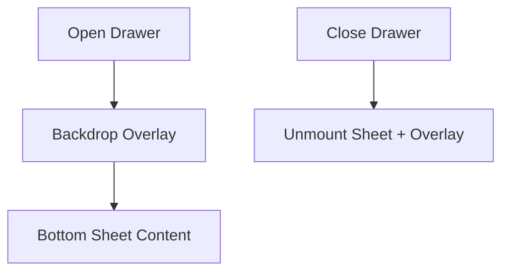

**Diagram sources**
- [drawer.tsx:6-12](file://src/components/ui/drawer.tsx#L6-L12)
- [drawer.tsx:32-51](file://src/components/ui/drawer.tsx#L32-L51)

**Section sources**
- [drawer.tsx:6-12](file://src/components/ui/drawer.tsx#L6-L12)
- [drawer.tsx:32-51](file://src/components/ui/drawer.tsx#L32-L51)

### Utility Classes and Responsive Patterns
- Section padding: Increases padding at wider widths using a media query.
- Glass effect: Applies backdrop blur and semi-transparent borders.
- Gradient buttons: Uses CSS variables for primary and hover gradients.
- Focus and transitions: Consistent focus styles and hover effects leverage theme tokens.

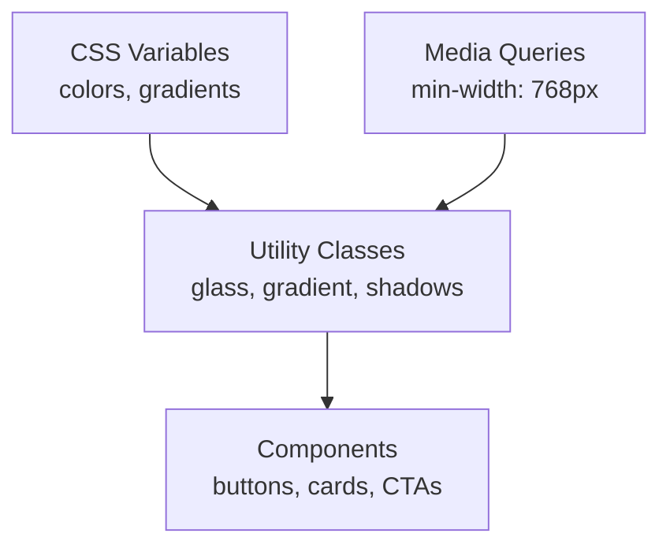

**Diagram sources**
- [styles.css:109-135](file://src/styles.css#L109-L135)
- [styles.css:45-79](file://src/styles.css#L45-L79)

**Section sources**
- [styles.css:109-135](file://src/styles.css#L109-L135)
- [styles.css:45-79](file://src/styles.css#L45-L79)

### Component Variants and Adaptive Styling
- Button variants: Default, destructive, outline, secondary, ghost, link with size variants (default, sm, lg, icon).
- Card sections: Header, title, description, content, footer with consistent spacing and typography.
- These components inherit responsive behavior from Tailwind utilities and CSS variables.

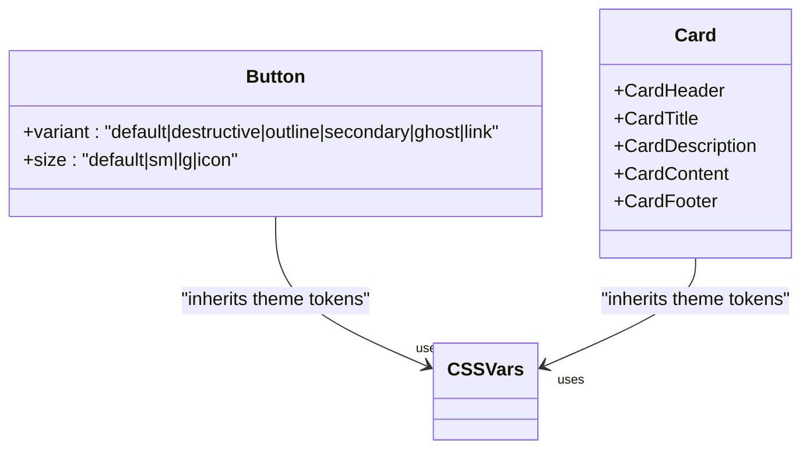

**Diagram sources**
- [button.tsx:7-32](file://src/components/ui/button.tsx#L7-L32)
- [card.tsx:5-55](file://src/components/ui/card.tsx#L5-L55)

**Section sources**
- [button.tsx:7-32](file://src/components/ui/button.tsx#L7-L32)
- [card.tsx:5-55](file://src/components/ui/card.tsx#L5-L55)

## Dependency Analysis
The responsive system depends on:
- Tailwind CSS and CSS variables for theme tokens and responsive utilities.
- A mobile detection hook to switch component behavior at the 768px breakpoint.
- Component libraries that compose Tailwind variants and CSS custom properties.

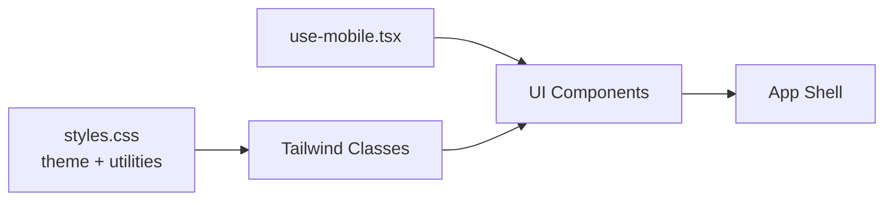

**Diagram sources**
- [styles.css:8-43](file://src/styles.css#L8-L43)
- [use-mobile.tsx:3-19](file://src/hooks/use-mobile.tsx#L3-L19)
- [components.json:6-11](file://components.json#L6-L11)

**Section sources**
- [components.json:6-11](file://components.json#L6-L11)
- [use-mobile.tsx:3-19](file://src/hooks/use-mobile.tsx#L3-L19)
- [styles.css:8-43](file://src/styles.css#L8-L43)

## Performance Considerations
- Prefer CSS custom properties for theme tokens to minimize reflows and enable efficient updates.
- Use Tailwind’s responsive modifiers to avoid writing custom media queries in components.
- Keep mobile-specific rendering lightweight (e.g., off-canvas vs. overlay) to reduce layout thrash.
- Consolidate responsive utilities in shared styles to reduce CSS bloat.

## Troubleshooting Guide
- If responsive classes do not apply:
  - Verify the 768px breakpoint matches your expectations and that media queries are not overridden.
  - Confirm Tailwind is configured to scan component files and that CSS variables are defined.
- If mobile detection feels inconsistent:
  - Ensure the media query listener is attached and cleaned up properly.
  - Check that the hook is used inside components that re-render on resize.
- If components look broken on small screens:
  - Review component-specific responsive classes (e.g., hidden/show at breakpoints).
  - Confirm that utility classes like glass and gradient are applied correctly.

**Section sources**
- [use-mobile.tsx:5-16](file://src/hooks/use-mobile.tsx#L5-L16)
- [styles.css:127-129](file://src/styles.css#L127-L129)
- [components.json:6-11](file://components.json#L6-L11)

## Conclusion
The application follows a cohesive mobile-first responsive design system:
- A single 768px breakpoint governs runtime and layout decisions.
- CSS custom properties unify theming and enable consistent adaptive styling.
- Components leverage Tailwind variants and responsive utilities to deliver seamless experiences across devices.
- Runtime detection ensures optimal behavior on mobile versus desktop.

## Appendices

### Breakpoint Definitions and Usage
- Breakpoint: 768px (mobile threshold).
- Applied via:
  - Media queries for layout adjustments.
  - Runtime hook for behavioral changes.
  - Tailwind responsive modifiers for visibility and spacing.

**Section sources**
- [use-mobile.tsx:3-19](file://src/hooks/use-mobile.tsx#L3-L19)
- [styles.css:127-129](file://src/styles.css#L127-L129)

### Guidelines for Creating Responsive Layouts
- Start with mobile-first markup and progressively enhance for larger screens.
- Use responsive variants for visibility, spacing, and typography.
- Prefer CSS custom properties for theme-driven adaptations.
- Keep interactive elements appropriately sized for touch targets.

### Handling Mobile Navigation
- Hide desktop navigation on small screens and replace with a collapsible menu or drawer.
- Ensure clear affordances for opening/closing navigation.
- Test gesture interactions (swipe, tap) and keyboard shortcuts.

### Optimizing Touch Interactions
- Increase hit areas for actionable elements.
- Use appropriate spacing and contrast for readability.
- Minimize reliance on hover states; design for touch-first interactions.