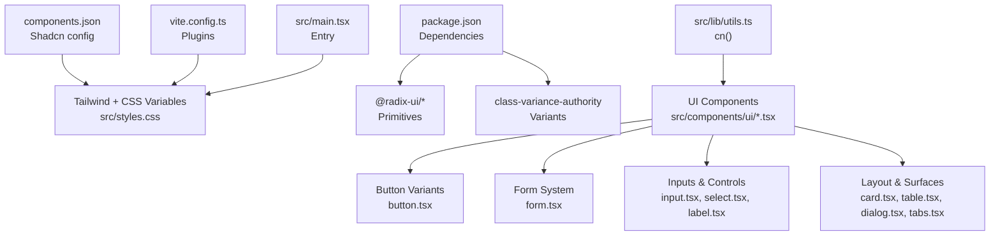
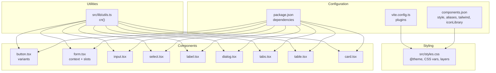
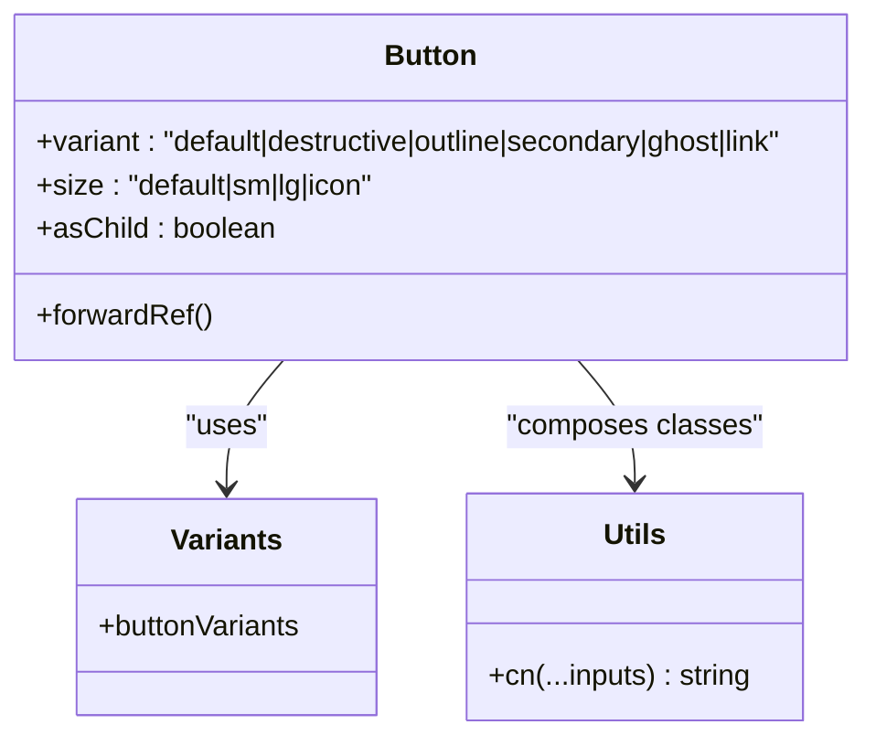
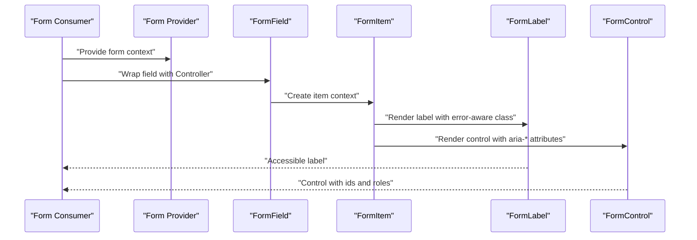
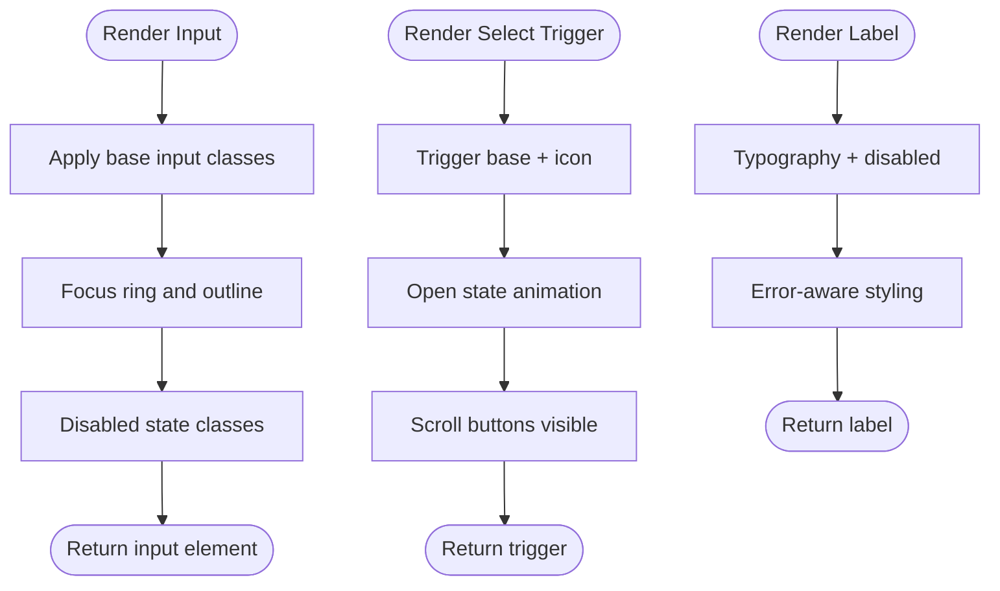
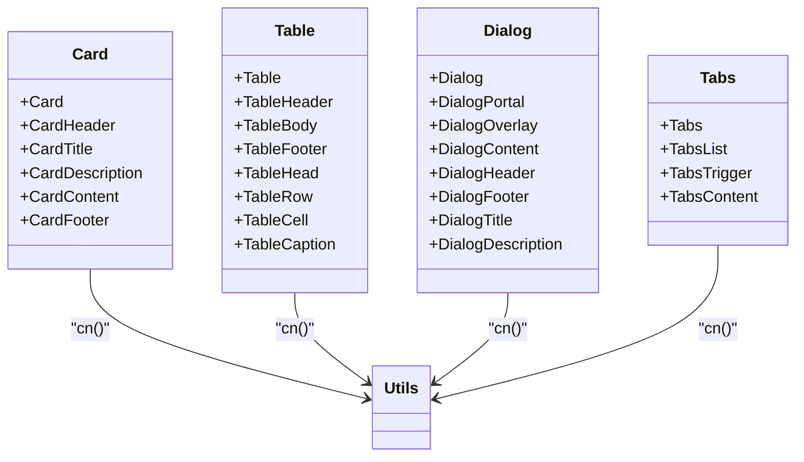
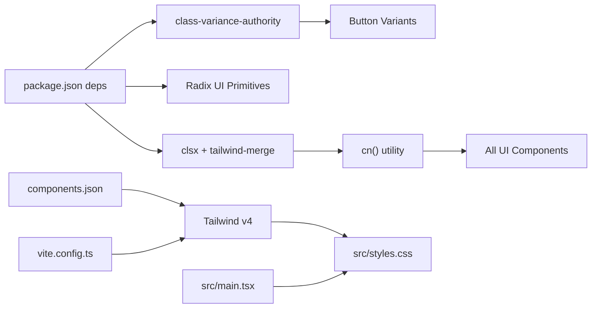

# Shadcn/UI Integration

<cite>
**Referenced Files in This Document**
- [components.json](file://components.json)
- [package.json](file://package.json)
- [vite.config.ts](file://vite.config.ts)
- [src/main.tsx](file://src/main.tsx)
- [src/styles.css](file://src/styles.css)
- [src/lib/utils.ts](file://src/lib/utils.ts)
- [src/components/ui/button.tsx](file://src/components/ui/button.tsx)
- [src/components/ui/card.tsx](file://src/components/ui/card.tsx)
- [src/components/ui/input.tsx](file://src/components/ui/input.tsx)
- [src/components/ui/form.tsx](file://src/components/ui/form.tsx)
- [src/components/ui/tabs.tsx](file://src/components/ui/tabs.tsx)
- [src/components/ui/dialog.tsx](file://src/components/ui/dialog.tsx)
- [src/components/ui/label.tsx](file://src/components/ui/label.tsx)
- [src/components/ui/select.tsx](file://src/components/ui/select.tsx)
- [src/components/ui/table.tsx](file://src/components/ui/table.tsx)
</cite>

## Table of Contents
1. [Introduction](#introduction)
2. [Project Structure](#project-structure)
3. [Core Components](#core-components)
4. [Architecture Overview](#architecture-overview)
5. [Detailed Component Analysis](#detailed-component-analysis)
6. [Dependency Analysis](#dependency-analysis)
7. [Performance Considerations](#performance-considerations)
8. [Troubleshooting Guide](#troubleshooting-guide)
9. [Conclusion](#conclusion)
10. [Appendices](#appendices)

## Introduction
This document explains how the project integrates shadcn/ui components and variants into a cohesive design system. It covers the installation and configuration via the shadcn/ui manifest, Tailwind and CSS variable-driven theming, and the component wrapper patterns used to maintain consistent styling and behavior. It also documents how to add new components, customize existing ones, and keep variant patterns aligned with the project’s design tokens.

## Project Structure
The project organizes shadcn/ui components under a dedicated UI module and centralizes styling and utilities. The key integration points are:
- Shadcn/ui configuration manifest
- Tailwind and CSS variables in global styles
- Utility functions for composing Tailwind classes
- Component wrappers that apply design tokens and variants

**Diagram sources**
- [components.json:1-23](file://components.json#L1-L23)
- [src/styles.css:1-136](file://src/styles.css#L1-L136)
- [package.json:14-66](file://package.json#L14-L66)
- [vite.config.ts:1-30](file://vite.config.ts#L1-L30)
- [src/main.tsx:1-21](file://src/main.tsx#L1-L21)
- [src/lib/utils.ts:1-7](file://src/lib/utils.ts#L1-L7)
- [src/components/ui/button.tsx:1-50](file://src/components/ui/button.tsx#L1-L50)
- [src/components/ui/form.tsx:1-172](file://src/components/ui/form.tsx#L1-L172)
- [src/components/ui/input.tsx:1-23](file://src/components/ui/input.tsx#L1-L23)
- [src/components/ui/select.tsx:1-153](file://src/components/ui/select.tsx#L1-L153)
- [src/components/ui/card.tsx:1-56](file://src/components/ui/card.tsx#L1-L56)
- [src/components/ui/table.tsx:1-95](file://src/components/ui/table.tsx#L1-L95)
- [src/components/ui/dialog.tsx:1-105](file://src/components/ui/dialog.tsx#L1-L105)
- [src/components/ui/tabs.tsx:1-54](file://src/components/ui/tabs.tsx#L1-L54)
- [src/components/ui/label.tsx:1-22](file://src/components/ui/label.tsx#L1-L22)

**Section sources**
- [components.json:1-23](file://components.json#L1-L23)
- [src/styles.css:1-136](file://src/styles.css#L1-L136)
- [package.json:14-66](file://package.json#L14-L66)
- [vite.config.ts:1-30](file://vite.config.ts#L1-L30)
- [src/main.tsx:1-21](file://src/main.tsx#L1-L21)
- [src/lib/utils.ts:1-7](file://src/lib/utils.ts#L1-L7)

## Core Components
This section highlights the core integration patterns used across components:
- Design tokens and CSS variables: Centralized in global styles and consumed by components.
- Utility composition: A single cn() utility merges and merges Tailwind classes safely.
- Variant systems: Components expose consistent variant and size options using class-variance-authority.
- Radix UI primitives: Components wrap Radix UI roots and slots to preserve accessibility and composition.

Key integration points:
- Global design tokens and CSS variables are defined in the stylesheet and referenced by component classes.
- The cn() utility composes Tailwind classes consistently across components.
- Variants are defined per component and applied via a central class composition function.

**Section sources**
- [src/styles.css:8-43](file://src/styles.css#L8-L43)
- [src/lib/utils.ts:4-6](file://src/lib/utils.ts#L4-L6)
- [src/components/ui/button.tsx:7-32](file://src/components/ui/button.tsx#L7-L32)
- [src/components/ui/input.tsx:5-18](file://src/components/ui/input.tsx#L5-L18)
- [src/components/ui/label.tsx:9-18](file://src/components/ui/label.tsx#L9-L18)

## Architecture Overview
The integration architecture ties together configuration, styling, and component wrappers:

**Diagram sources**
- [components.json:1-23](file://components.json#L1-L23)
- [package.json:14-66](file://package.json#L14-L66)
- [vite.config.ts:1-30](file://vite.config.ts#L1-L30)
- [src/styles.css:1-136](file://src/styles.css#L1-L136)
- [src/lib/utils.ts:1-7](file://src/lib/utils.ts#L1-L7)
- [src/components/ui/button.tsx:1-50](file://src/components/ui/button.tsx#L1-L50)
- [src/components/ui/form.tsx:1-172](file://src/components/ui/form.tsx#L1-L172)
- [src/components/ui/input.tsx:1-23](file://src/components/ui/input.tsx#L1-L23)
- [src/components/ui/select.tsx:1-153](file://src/components/ui/select.tsx#L1-L153)
- [src/components/ui/label.tsx:1-22](file://src/components/ui/label.tsx#L1-L22)
- [src/components/ui/dialog.tsx:1-105](file://src/components/ui/dialog.tsx#L1-L105)
- [src/components/ui/tabs.tsx:1-54](file://src/components/ui/tabs.tsx#L1-L54)
- [src/components/ui/table.tsx:1-95](file://src/components/ui/table.tsx#L1-L95)
- [src/components/ui/card.tsx:1-56](file://src/components/ui/card.tsx#L1-L56)

## Detailed Component Analysis

### Button Variants and Composition
The Button component demonstrates the variant pattern:
- Uses class-variance-authority to define variant and size scales.
- Composes classes via cn() and applies Radix UI Slot for semantic flexibility.
- Exposes a ref-forwarding pattern for imperative usage.

**Diagram sources**
- [src/components/ui/button.tsx:7-32](file://src/components/ui/button.tsx#L7-L32)
- [src/lib/utils.ts:4-6](file://src/lib/utils.ts#L4-L6)

**Section sources**
- [src/components/ui/button.tsx:7-32](file://src/components/ui/button.tsx#L7-L32)
- [src/lib/utils.ts:4-6](file://src/lib/utils.ts#L4-L6)

### Form System and Accessible Labels
The Form system integrates Radix UI labels and react-hook-form:
- Provides contexts for field metadata and ids.
- Wraps controls with Slot to preserve accessibility attributes.
- Applies error-aware styling on labels and messages.

**Diagram sources**
- [src/components/ui/form.tsx:16-171](file://src/components/ui/form.tsx#L16-L171)

**Section sources**
- [src/components/ui/form.tsx:16-171](file://src/components/ui/form.tsx#L16-L171)

### Inputs, Selects, and Labels
These components illustrate consistent styling and iconography:
- Input applies standardized focus, disabled, and placeholder styles.
- Select wraps Radix UI primitives with icons and viewport sizing.
- Label uses class-variance-authority for typography and states.

**Diagram sources**
- [src/components/ui/input.tsx:5-18](file://src/components/ui/input.tsx#L5-L18)
- [src/components/ui/select.tsx:15-33](file://src/components/ui/select.tsx#L15-L33)
- [src/components/ui/label.tsx:9-18](file://src/components/ui/label.tsx#L9-L18)

**Section sources**
- [src/components/ui/input.tsx:5-18](file://src/components/ui/input.tsx#L5-L18)
- [src/components/ui/select.tsx:15-33](file://src/components/ui/select.tsx#L15-L33)
- [src/components/ui/label.tsx:9-18](file://src/components/ui/label.tsx#L9-L18)

### Layout and Surface Components
Surface components (Card, Table, Dialog, Tabs) demonstrate consistent spacing and theming:
- Card composes border, background, and shadow tokens.
- Table wraps overflow and applies striped row behavior.
- Dialog and Tabs use Radix UI with consistent animations and focus styles.

**Diagram sources**
- [src/components/ui/card.tsx:5-55](file://src/components/ui/card.tsx#L5-L55)
- [src/components/ui/table.tsx:5-94](file://src/components/ui/table.tsx#L5-L94)
- [src/components/ui/dialog.tsx:9-104](file://src/components/ui/dialog.tsx#L9-L104)
- [src/components/ui/tabs.tsx:6-53](file://src/components/ui/tabs.tsx#L6-L53)

**Section sources**
- [src/components/ui/card.tsx:5-55](file://src/components/ui/card.tsx#L5-L55)
- [src/components/ui/table.tsx:5-94](file://src/components/ui/table.tsx#L5-L94)
- [src/components/ui/dialog.tsx:9-104](file://src/components/ui/dialog.tsx#L9-L104)
- [src/components/ui/tabs.tsx:6-53](file://src/components/ui/tabs.tsx#L6-L53)

## Dependency Analysis
The project relies on shadcn/ui-compatible libraries and Tailwind v4. The dependency graph below shows how configuration, plugins, and packages connect to components.

**Diagram sources**
- [components.json:1-23](file://components.json#L1-L23)
- [package.json:14-66](file://package.json#L14-L66)
- [src/lib/utils.ts:1-7](file://src/lib/utils.ts#L1-L7)
- [src/styles.css:1-136](file://src/styles.css#L1-L136)
- [vite.config.ts:1-30](file://vite.config.ts#L1-L30)
- [src/main.tsx:1-21](file://src/main.tsx#L1-L21)

**Section sources**
- [components.json:1-23](file://components.json#L1-L23)
- [package.json:14-66](file://package.json#L14-L66)
- [src/lib/utils.ts:1-7](file://src/lib/utils.ts#L1-L7)
- [src/styles.css:1-136](file://src/styles.css#L1-L136)
- [vite.config.ts:1-30](file://vite.config.ts#L1-L30)
- [src/main.tsx:1-21](file://src/main.tsx#L1-L21)

## Performance Considerations
- Prefer the cn() utility to merge classes efficiently and avoid duplication.
- Keep variant sets minimal to reduce CSS bloat.
- Use Tailwind’s built-in utilities and CSS variables to minimize runtime style recomputation.
- Wrap heavy components (e.g., Select viewport) with portals to avoid layout thrashing.

## Troubleshooting Guide
Common issues and resolutions:
- Missing Tailwind or CSS variables: Ensure the stylesheet is imported at the application entry and Tailwind plugin is active.
- Variant classes not applying: Verify the variant prop is passed to the component and the variant map includes the requested option.
- Form accessibility errors: Confirm that labels, controls, and messages receive proper ids and aria attributes via the Form system.
- Iconography not rendering: Confirm the configured icon library matches installed icons.

**Section sources**
- [src/main.tsx:5](file://src/main.tsx#L5)
- [vite.config.ts:8-15](file://vite.config.ts#L8-L15)
- [src/styles.css:1-136](file://src/styles.css#L1-L136)
- [src/components/ui/form.tsx:86-118](file://src/components/ui/form.tsx#L86-L118)

## Conclusion
The project integrates shadcn/ui primitives with a robust design system centered on CSS variables, consistent variant patterns, and a unified class composition utility. This approach ensures predictable theming, strong accessibility, and maintainable customization across components.

## Appendices

### Installation and Setup
- Install dependencies declared for Radix UI, class-variance-authority, and Tailwind v4.
- Configure the Tailwind plugin in the bundler and ensure the stylesheet is imported at the app entry.
- Align component aliases and paths with the configuration manifest.

**Section sources**
- [package.json:14-66](file://package.json#L14-L66)
- [vite.config.ts:8-15](file://vite.config.ts#L8-L15)
- [src/main.tsx:5](file://src/main.tsx#L5)

### Adding New Shadcn/UI Components
- Scaffold the component using the shadcn/cli with the project’s configuration.
- Place the component under the UI module and export a ref-forwarding component.
- Apply the cn() utility and design tokens from the stylesheet.
- Define variants with class-variance-authority when appropriate.

**Section sources**
- [components.json:14-20](file://components.json#L14-L20)
- [src/lib/utils.ts:4-6](file://src/lib/utils.ts#L4-L6)
- [src/styles.css:8-43](file://src/styles.css#L8-L43)

### Theme Customization Guidelines
- Centralize color tokens and radii in the stylesheet’s theme block and CSS variables.
- Reference tokens via Tailwind variables and component classes.
- Maintain consistent sizes and shadows across components using shared utilities.

**Section sources**
- [src/styles.css:8-43](file://src/styles.css#L8-L43)
- [src/styles.css:109-135](file://src/styles.css#L109-L135)

### Maintaining Consistency with Custom Variants
- Keep variant definitions explicit and scoped to each component.
- Use the cn() utility to compose base, variant, and custom classes deterministically.
- Avoid ad-hoc overrides; prefer extending variants or introducing new ones.

**Section sources**
- [src/components/ui/button.tsx:7-32](file://src/components/ui/button.tsx#L7-L32)
- [src/lib/utils.ts:4-6](file://src/lib/utils.ts#L4-L6)