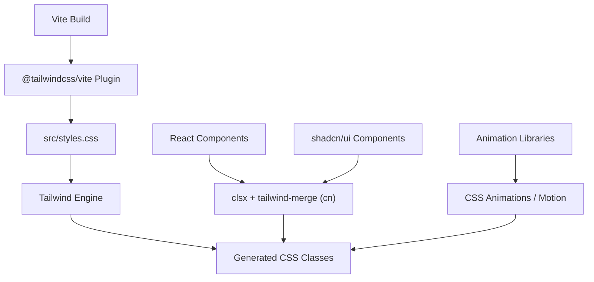
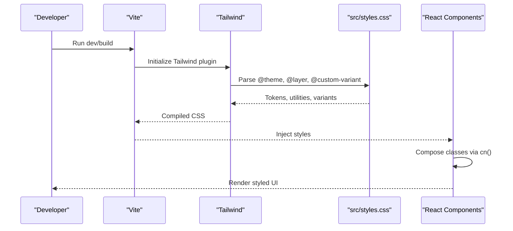
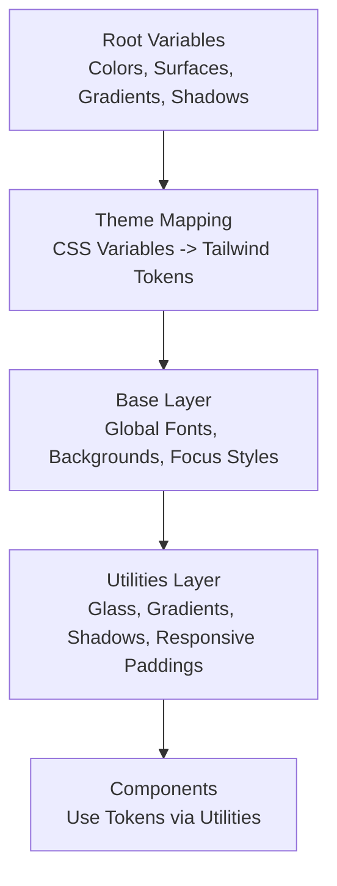
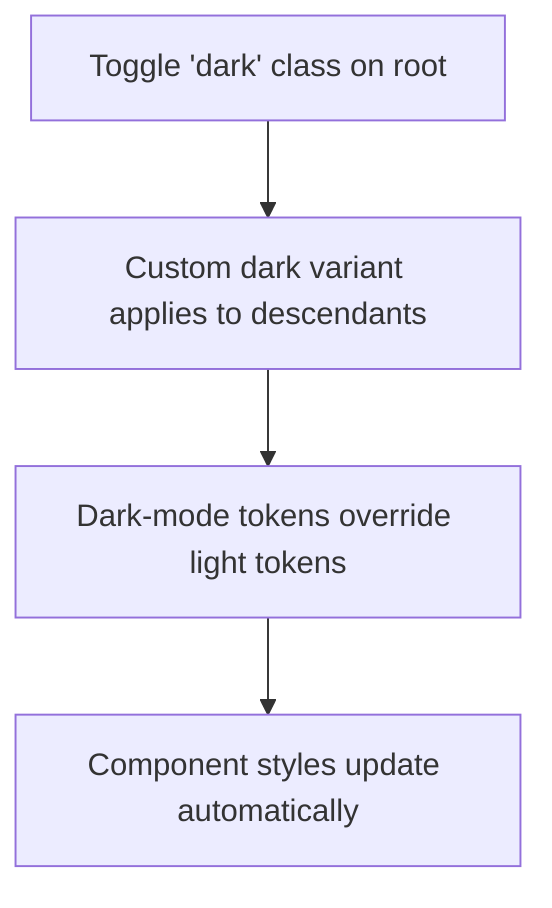
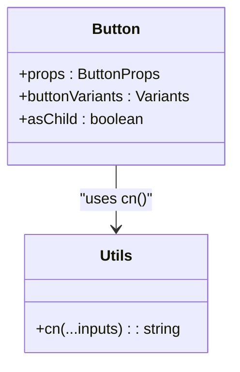
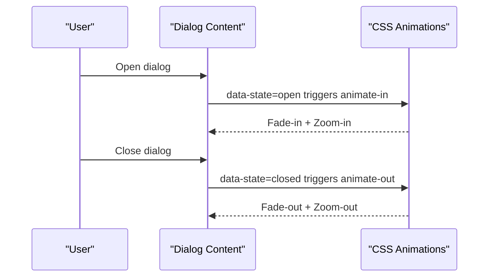
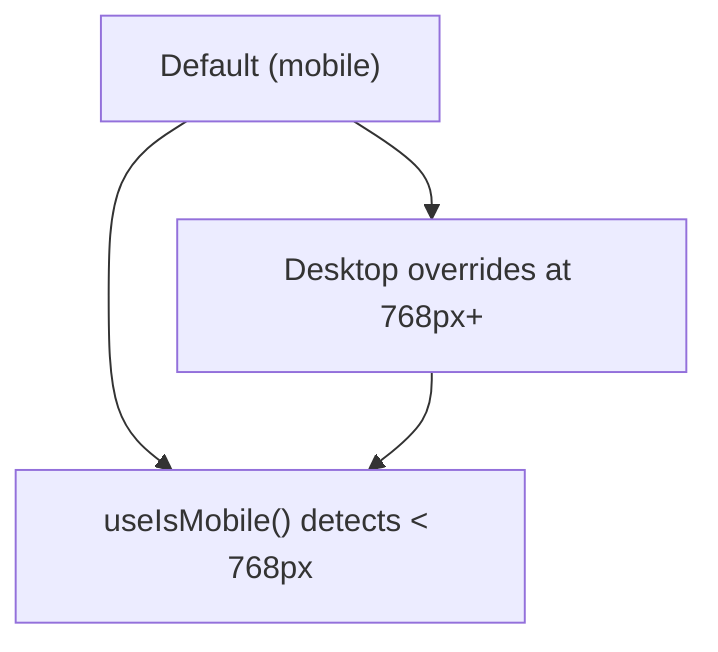
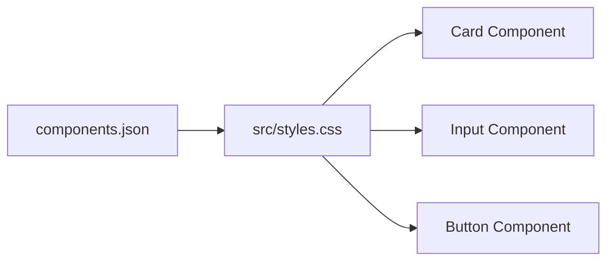
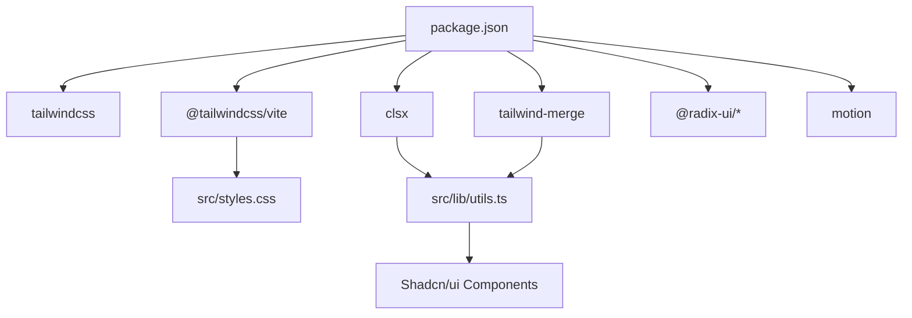

# Styling System

<cite>
**Referenced Files in This Document**
- [package.json](file://package.json)
- [vite.config.ts](file://vite.config.ts)
- [src/styles.css](file://src/styles.css)
- [components.json](file://components.json)
- [src/lib/utils.ts](file://src/lib/utils.ts)
- [src/components/ui/button.tsx](file://src/components/ui/button.tsx)
- [src/components/ui/card.tsx](file://src/components/ui/card.tsx)
- [src/components/ui/input.tsx](file://src/components/ui/input.tsx)
- [src/components/ui/dialog.tsx](file://src/components/ui/dialog.tsx)
- [src/components/ui/form.tsx](file://src/components/ui/form.tsx)
- [src/hooks/use-mobile.tsx](file://src/hooks/use-mobile.tsx)
- [src/main.tsx](file://src/main.tsx)
</cite>

## Table of Contents
1. [Introduction](#introduction)
2. [Project Structure](#project-structure)
3. [Core Components](#core-components)
4. [Architecture Overview](#architecture-overview)
5. [Detailed Component Analysis](#detailed-component-analysis)
6. [Dependency Analysis](#dependency-analysis)
7. [Performance Considerations](#performance-considerations)
8. [Troubleshooting Guide](#troubleshooting-guide)
9. [Conclusion](#conclusion)
10. [Appendices](#appendices)

## Introduction
This document describes the Tailwind CSS-based styling system and design architecture used in the project. It explains the utility-first approach, custom theme variables, dark mode implementation, component variant system using class-variance-authority and clsx, animation system integration with motion and CSS animations, responsive design patterns, breakpoint management, and the design token system. It also covers integration with the shadcn/ui component system, customization patterns, extension guidelines, and performance considerations.

## Project Structure
The styling system is organized around a single CSS entry that imports Tailwind directives, defines design tokens, and registers custom utilities and variants. Vite integrates Tailwind via the official plugin, while shadcn/ui is configured to use the project’s CSS file and design tokens.

**Diagram sources**
- [vite.config.ts:1-30](file://vite.config.ts#L1-L30)
- [src/styles.css:1-136](file://src/styles.css#L1-L136)
- [src/lib/utils.ts:1-7](file://src/lib/utils.ts#L1-L7)

**Section sources**
- [vite.config.ts:1-30](file://vite.config.ts#L1-L30)
- [src/styles.css:1-136](file://src/styles.css#L1-L136)
- [components.json:1-23](file://components.json#L1-L23)

## Core Components
- Design tokens and theme variables: Centralized in the CSS theme block and root variables, enabling consistent color, typography, and spacing across the app.
- Utility-first CSS: Tailwind utilities are applied directly in components, with custom utilities layered for advanced effects.
- Component variants: Shadcn/ui components use class-variance-authority to define variant and size sets, merged with clsx and tailwind-merge for safe composition.
- Dark mode: A custom dark variant targets descendants under a dark class, enabling seamless dark mode styling.
- Responsive patterns: Breakpoints and media queries are used to adapt layouts and paddings for mobile-first experiences.
- Animation system: CSS animations and pulse utilities are used for lightweight transitions; motion libraries are available for advanced animations.

**Section sources**
- [src/styles.css:6-43](file://src/styles.css#L6-L43)
- [src/styles.css:81-135](file://src/styles.css#L81-L135)
- [src/lib/utils.ts:1-7](file://src/lib/utils.ts#L1-L7)
- [src/components/ui/button.tsx:1-50](file://src/components/ui/button.tsx#L1-L50)
- [src/hooks/use-mobile.tsx:1-20](file://src/hooks/use-mobile.tsx#L1-L20)

## Architecture Overview
The styling pipeline integrates Vite, Tailwind, and the component layer:

- Vite loads the Tailwind plugin and compiles Tailwind directives from the CSS entry.
- The CSS entry defines theme tokens, base styles, and custom utilities.
- Components compose classes using cn (clsx + tailwind-merge) and consume shadcn/ui primitives.
- Dark mode is toggled via a dark class on the root element, applying the custom dark variant.
- Animations leverage CSS utilities and optional motion libraries.

**Diagram sources**
- [vite.config.ts:1-30](file://vite.config.ts#L1-L30)
- [src/styles.css:1-136](file://src/styles.css#L1-L136)
- [src/lib/utils.ts:1-7](file://src/lib/utils.ts#L1-L7)

## Detailed Component Analysis

### Theme and Token System
- Root variables define color palettes, surfaces, gradients, and shadows.
- The theme block maps CSS variables to Tailwind tokens for consistent usage across utilities and components.
- Base layer sets global fonts, backgrounds, and focus styles.
- Utilities layer adds reusable helpers like glass, gradient buttons, glow/elevated shadows, and responsive paddings.

**Diagram sources**
- [src/styles.css:45-79](file://src/styles.css#L45-L79)
- [src/styles.css:8-43](file://src/styles.css#L8-L43)
- [src/styles.css:81-135](file://src/styles.css#L81-L135)

**Section sources**
- [src/styles.css:45-79](file://src/styles.css#L45-L79)
- [src/styles.css:8-43](file://src/styles.css#L8-L43)
- [src/styles.css:81-135](file://src/styles.css#L81-L135)

### Dark Mode Implementation
- A custom dark variant targets descendants of an element with the dark class.
- Toggle the dark class on the root element to switch themes without rebuilding styles.

**Diagram sources**
- [src/styles.css:6](file://src/styles.css#L6)

**Section sources**
- [src/styles.css:6](file://src/styles.css#L6)

### Component Variant System (class-variance-authority + clsx)
- Variants and sizes are defined centrally and composed with component classes.
- cn merges and deduplicates incoming classes safely.

**Diagram sources**
- [src/components/ui/button.tsx:1-50](file://src/components/ui/button.tsx#L1-L50)
- [src/lib/utils.ts:1-7](file://src/lib/utils.ts#L1-L7)

**Section sources**
- [src/components/ui/button.tsx:1-50](file://src/components/ui/button.tsx#L1-L50)
- [src/lib/utils.ts:1-7](file://src/lib/utils.ts#L1-L7)

### Animation System Integration
- CSS animations: Shadcn/ui dialogs use fade and zoom transitions via data-state attributes.
- Pulse utilities: Skeleton components use a pulse animation for loading states.
- Motion libraries: Available via motion for advanced animations; integrate by adding motion classes or components alongside existing utilities.

**Diagram sources**
- [src/components/ui/dialog.tsx:17-53](file://src/components/ui/dialog.tsx#L17-L53)

**Section sources**
- [src/components/ui/dialog.tsx:17-53](file://src/components/ui/dialog.tsx#L17-L53)
- [src/components/ui/form.tsx:1-172](file://src/components/ui/form.tsx#L1-L172)

### Responsive Design Patterns and Breakpoints
- Mobile-first approach: Defaults target small screens; larger breakpoints refine layout.
- Breakpoint example: A utility increases vertical padding at the 768px boundary.
- Hook pattern: A media query hook detects mobile viewport width for runtime decisions.

**Diagram sources**
- [src/styles.css:127-129](file://src/styles.css#L127-L129)
- [src/hooks/use-mobile.tsx:1-20](file://src/hooks/use-mobile.tsx#L1-L20)

**Section sources**
- [src/styles.css:127-129](file://src/styles.css#L127-L129)
- [src/hooks/use-mobile.tsx:1-20](file://src/hooks/use-mobile.tsx#L1-L20)

### shadcn/ui Integration and Customization
- shadcn/ui is configured to use the project’s CSS file, base color, and CSS variables.
- Aliases map component imports to local paths for consistent usage.
- Components like Card and Input demonstrate token-driven styling with consistent borders, backgrounds, and typography.

**Diagram sources**
- [components.json:1-23](file://components.json#L1-L23)
- [src/styles.css:1-136](file://src/styles.css#L1-L136)
- [src/components/ui/card.tsx:1-56](file://src/components/ui/card.tsx#L1-L56)
- [src/components/ui/input.tsx:1-23](file://src/components/ui/input.tsx#L1-L23)
- [src/components/ui/button.tsx:1-50](file://src/components/ui/button.tsx#L1-L50)

**Section sources**
- [components.json:1-23](file://components.json#L1-L23)
- [src/styles.css:1-136](file://src/styles.css#L1-L136)
- [src/components/ui/card.tsx:1-56](file://src/components/ui/card.tsx#L1-L56)
- [src/components/ui/input.tsx:1-23](file://src/components/ui/input.tsx#L1-L23)
- [src/components/ui/button.tsx:1-50](file://src/components/ui/button.tsx#L1-L50)

## Dependency Analysis
- Tailwind CSS and Vite: Tailwind is loaded via the official Vite plugin; the CSS entry imports Tailwind directives and utilities.
- Class composition: clsx and tailwind-merge are used to merge and deduplicate classes safely.
- Component libraries: Radix UI primitives power shadcn/ui components; animations rely on CSS data-state attributes and optional motion libraries.

**Diagram sources**
- [package.json:14-66](file://package.json#L14-L66)
- [vite.config.ts:1-30](file://vite.config.ts#L1-L30)
- [src/lib/utils.ts:1-7](file://src/lib/utils.ts#L1-L7)

**Section sources**
- [package.json:14-66](file://package.json#L14-L66)
- [vite.config.ts:1-30](file://vite.config.ts#L1-L30)
- [src/lib/utils.ts:1-7](file://src/lib/utils.ts#L1-L7)

## Performance Considerations
- CSS optimization: Tailwind’s utility-first model reduces duplication; keep the design system centralized to minimize redundant declarations.
- Class composition: Using clsx and tailwind-merge prevents class conflicts and reduces bundle weight by avoiding duplicates.
- Animations: Prefer CSS transitions and data-state animations for lightweight effects; reserve motion for complex interactions.
- Build-time optimizations: Ensure Tailwind purges unused classes in production builds and avoid importing large icon or animation libraries unless needed.
- Fonts: The external font is loaded via a CDN; consider self-hosting or preloading strategies for improved performance.

[No sources needed since this section provides general guidance]

## Troubleshooting Guide
- Dark mode not applying: Verify the dark class is set on the root element and the custom dark variant is present in the CSS.
- Variant classes not merging correctly: Ensure cn is used to merge variant classes and that defaults are defined in the variant configuration.
- Animations not triggering: Confirm data-state attributes are present on interactive elements and CSS selectors match the expected states.
- Responsive utilities not working: Check media queries and breakpoint utilities; ensure the CSS entry is imported and compiled by Vite.

**Section sources**
- [src/styles.css:6](file://src/styles.css#L6)
- [src/lib/utils.ts:1-7](file://src/lib/utils.ts#L1-L7)
- [src/components/ui/dialog.tsx:17-53](file://src/components/ui/dialog.tsx#L17-L53)
- [src/styles.css:127-129](file://src/styles.css#L127-L129)

## Conclusion
The project employs a robust, utility-first Tailwind CSS architecture with centralized design tokens, a custom dark variant, and a strong component variant system powered by class-variance-authority and clsx. Responsive patterns follow a mobile-first approach, and animations are integrated via CSS utilities and optionally motion. The shadcn/ui integration is configured to align with the project’s design system, enabling scalable customization and consistent styling across components.

[No sources needed since this section summarizes without analyzing specific files]

## Appendices

### Extending the Design System
- Add new tokens: Define new CSS variables in the root and map them in the theme block.
- Create utilities: Add reusable utilities in the utilities layer for common patterns.
- Extend variants: Introduce new variants and sizes in component variant definitions and compose with cn.
- Maintain consistency: Keep design tokens centralized and consistently referenced across components.

**Section sources**
- [src/styles.css:8-43](file://src/styles.css#L8-L43)
- [src/styles.css:109-135](file://src/styles.css#L109-L135)
- [src/components/ui/button.tsx:7-32](file://src/components/ui/button.tsx#L7-L32)
- [src/lib/utils.ts:4-6](file://src/lib/utils.ts#L4-L6)

### Creating New Variants
- Define variant options in the component’s variant configuration.
- Use cn to merge variant classes with incoming className.
- Test variants across states and ensure defaults are sensible.

**Section sources**
- [src/components/ui/button.tsx:7-32](file://src/components/ui/button.tsx#L7-L32)
- [src/lib/utils.ts:4-6](file://src/lib/utils.ts#L4-L6)

### Maintaining Design Consistency
- Centralize tokens and utilities in the CSS entry.
- Use shadcn/ui components to maintain consistent base styles.
- Leverage the cn utility to prevent class conflicts and enforce predictable compositions.

**Section sources**
- [src/styles.css:1-136](file://src/styles.css#L1-L136)
- [src/lib/utils.ts:1-7](file://src/lib/utils.ts#L1-L7)
- [components.json:1-23](file://components.json#L1-L23)