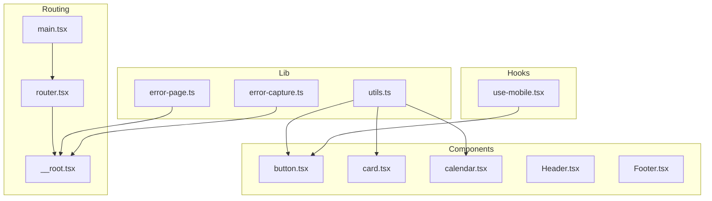
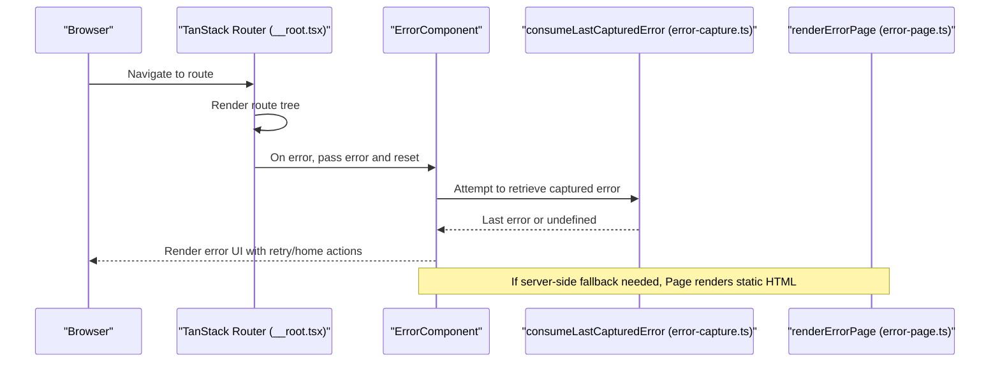
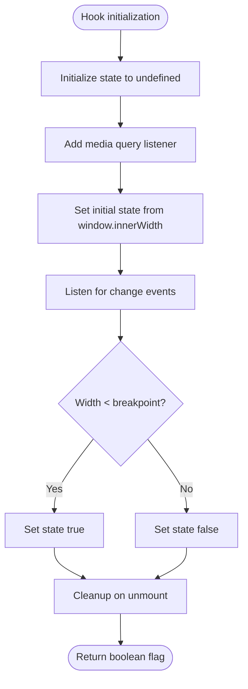
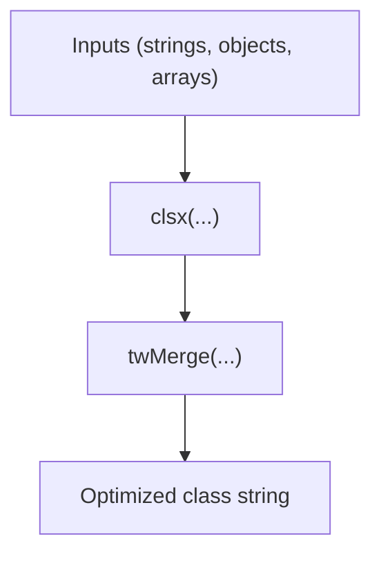
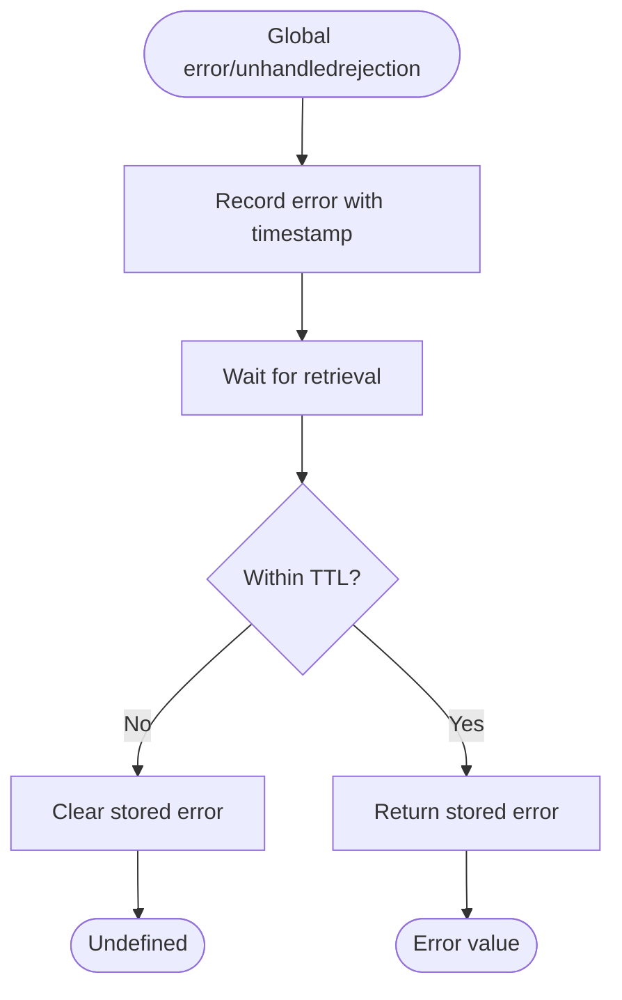
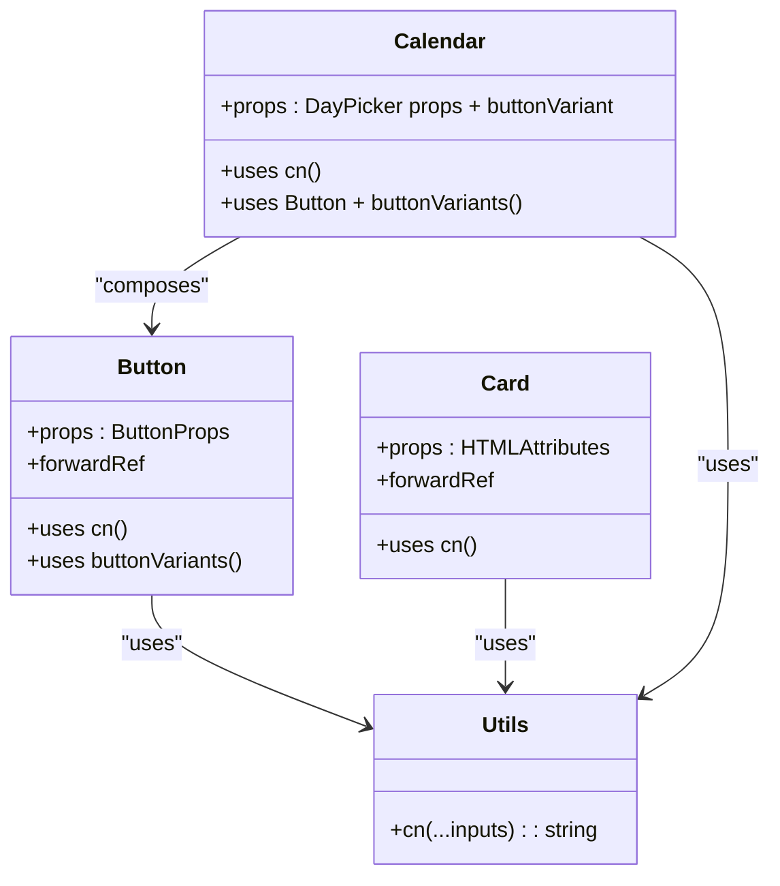
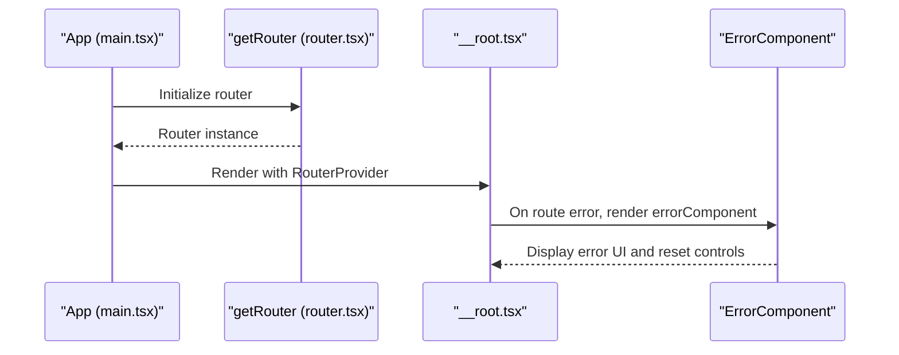
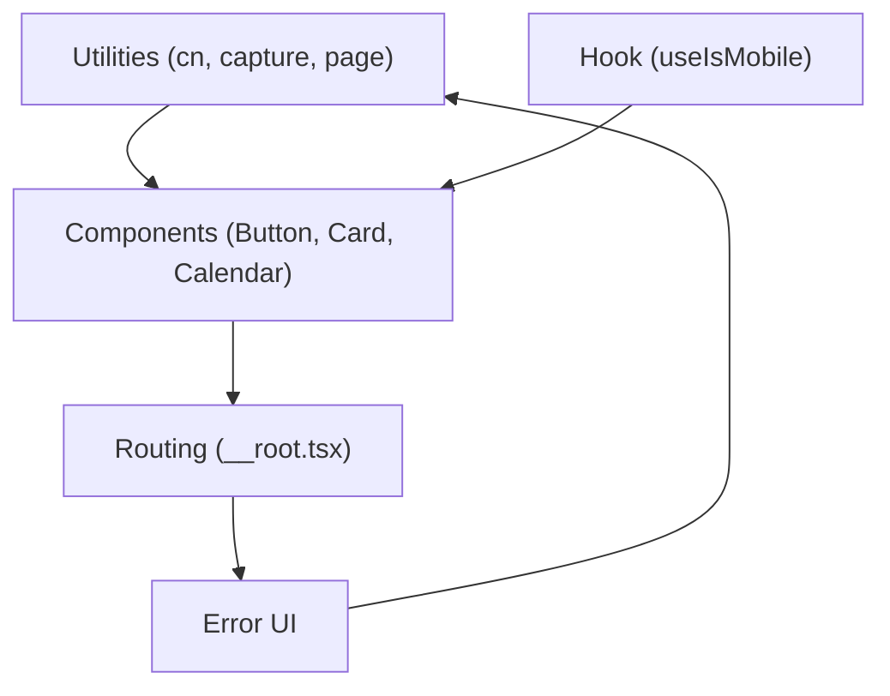
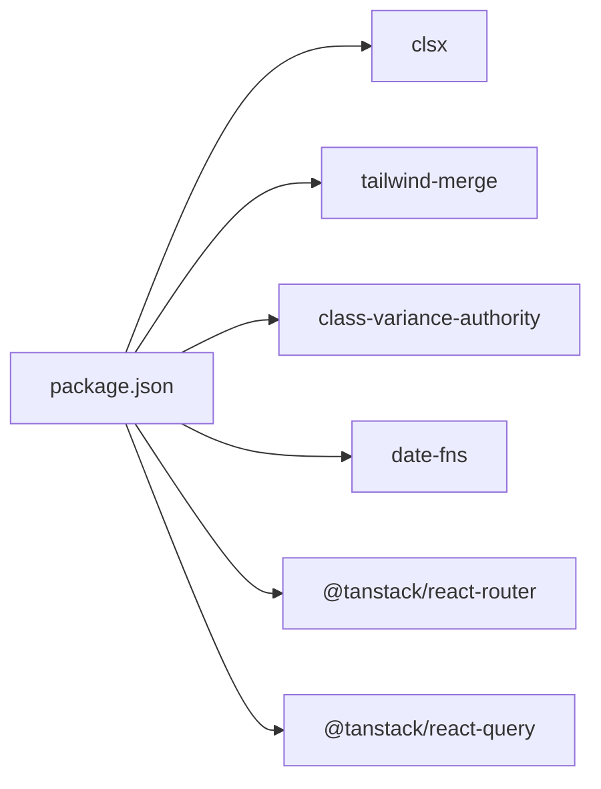

# Utility Systems

<cite>
**Referenced Files in This Document**
- [use-mobile.tsx](file://src/hooks/use-mobile.tsx)
- [utils.ts](file://src/lib/utils.ts)
- [error-capture.ts](file://src/lib/error-capture.ts)
- [error-page.ts](file://src/lib/error-page.ts)
- [main.tsx](file://src/main.tsx)
- [router.tsx](file://src/router.tsx)
- [__root.tsx](file://src/routes/__root.tsx)
- [button.tsx](file://src/components/ui/button.tsx)
- [card.tsx](file://src/components/ui/card.tsx)
- [calendar.tsx](file://src/components/ui/calendar.tsx)
- [Header.tsx](file://src/components/site/Header.tsx)
- [Footer.tsx](file://src/components/site/Footer.tsx)
- [package.json](file://package.json)
</cite>

## Table of Contents
1. [Introduction](#introduction)
2. [Project Structure](#project-structure)
3. [Core Components](#core-components)
4. [Architecture Overview](#architecture-overview)
5. [Detailed Component Analysis](#detailed-component-analysis)
6. [Dependency Analysis](#dependency-analysis)
7. [Performance Considerations](#performance-considerations)
8. [Troubleshooting Guide](#troubleshooting-guide)
9. [Conclusion](#conclusion)
10. [Appendices](#appendices)

## Introduction
This document explains the utility systems that power the application’s functionality. It covers:
- Custom hooks for responsive behavior and device adaptation
- Utility functions for component composition, class merging, and styling helpers
- Error handling and capture mechanisms for graceful error management
- The error page component and its integration with the routing system
- Helper functions for date formatting, string manipulation, and common operations
- Integration patterns between utilities and components, performance considerations, and best practices for extending the utility library
- Testing strategies for utility functions and common usage patterns

## Project Structure
The utility systems are organized into focused modules:
- Hooks: Responsive behavior via a custom hook
- Lib: Styling helpers, error capture, and error page rendering
- Components: UI primitives that rely on utility functions for styling and composition
- Routing: Root route defines error and not-found handlers

**Diagram sources**
- [use-mobile.tsx:1-20](file://src/hooks/use-mobile.tsx#L1-L20)
- [utils.ts:1-7](file://src/lib/utils.ts#L1-L7)
- [error-capture.ts:1-28](file://src/lib/error-capture.ts#L1-L28)
- [error-page.ts:1-31](file://src/lib/error-page.ts#L1-L31)
- [button.tsx:1-50](file://src/components/ui/button.tsx#L1-L50)
- [card.tsx:1-56](file://src/components/ui/card.tsx#L1-L56)
- [calendar.tsx:1-178](file://src/components/ui/calendar.tsx#L1-L178)
- [main.tsx:1-21](file://src/main.tsx#L1-L21)
- [router.tsx:1-17](file://src/router.tsx#L1-L17)
- [__root.tsx:1-61](file://src/routes/__root.tsx#L1-L61)

**Section sources**
- [main.tsx:1-21](file://src/main.tsx#L1-L21)
- [router.tsx:1-17](file://src/router.tsx#L1-L17)
- [__root.tsx:1-61](file://src/routes/__root.tsx#L1-L61)

## Core Components
- Responsive hook: Provides a boolean signal for mobile breakpoints and updates on resize
- Styling helper: Merges Tailwind classes safely and deduplicates conflicts
- Error capture: Records unhandled errors and promise rejections for later retrieval
- Error page renderer: Produces a static HTML error page for server-side or fallback scenarios
- UI components: Buttons, cards, and calendars that compose with utility functions and variants

Key responsibilities:
- Mobile detection: Centralized breakpoint logic and effect cleanup
- Class composition: Robust merging of conditional Tailwind classes
- Error resilience: Out-of-band capture and TTL-based retrieval
- User feedback: Consistent error UI and navigation actions

**Section sources**
- [use-mobile.tsx:1-20](file://src/hooks/use-mobile.tsx#L1-L20)
- [utils.ts:1-7](file://src/lib/utils.ts#L1-L7)
- [error-capture.ts:1-28](file://src/lib/error-capture.ts#L1-L28)
- [error-page.ts:1-31](file://src/lib/error-page.ts#L1-L31)

## Architecture Overview
The utility systems integrate with the routing and component layers to deliver responsive, styled UI and resilient error handling.

**Diagram sources**
- [__root.tsx:24-41](file://src/routes/__root.tsx#L24-L41)
- [error-capture.ts:18-27](file://src/lib/error-capture.ts#L18-L27)
- [error-page.ts:1-31](file://src/lib/error-page.ts#L1-L31)

## Detailed Component Analysis

### Custom Hook: useIsMobile
Purpose:
- Detects whether the viewport width is below a mobile breakpoint
- Initializes state, listens to media query changes, and cleans up listeners

Behavior:
- Uses a media query listener for real-time updates
- Returns a boolean coerced value for immediate consumption
- Ensures cleanup to avoid memory leaks

Integration:
- Can be used in components to adapt layout or behavior for small screens

**Diagram sources**
- [use-mobile.tsx:5-19](file://src/hooks/use-mobile.tsx#L5-L19)

**Section sources**
- [use-mobile.tsx:1-20](file://src/hooks/use-mobile.tsx#L1-L20)

### Utility: cn (class merging)
Purpose:
- Merge and deduplicate Tailwind CSS classes while preserving overrides

Implementation highlights:
- Delegates to clsx for conditional class composition
- Uses tailwind-merge to resolve conflicting Tailwind utilities

Usage pattern:
- Accepts multiple inputs and returns a single optimized class string

**Diagram sources**
- [utils.ts:4-6](file://src/lib/utils.ts#L4-L6)

**Section sources**
- [utils.ts:1-7](file://src/lib/utils.ts#L1-L7)

### Error Capture: consumeLastCapturedError
Purpose:
- Capture and retrieve recent unhandled errors and promise rejections
- Enforce a short TTL to prevent stale errors

Mechanics:
- Listens to global error and unhandledrejection events
- Stores the latest error with timestamp
- Retrieves and clears the error within TTL, otherwise clears it

**Diagram sources**
- [error-capture.ts:7-27](file://src/lib/error-capture.ts#L7-L27)

**Section sources**
- [error-capture.ts:1-28](file://src/lib/error-capture.ts#L1-L28)

### Error Page Renderer: renderErrorPage
Purpose:
- Produce a static HTML error page for server-side or fallback scenarios

Features:
- Self-contained HTML with minimal CSS
- Actions to reload the page or navigate home

Integration:
- Used when client-side error boundaries are unavailable or during SSR failures

**Section sources**
- [error-page.ts:1-31](file://src/lib/error-page.ts#L1-L31)

### UI Components Composition with Utilities
- Button: Uses cn for class merging and cva variants for style composition
- Card: Uses cn for base and override classes
- Calendar: Uses cn extensively and integrates Button variants for navigation

**Diagram sources**
- [button.tsx:34-46](file://src/components/ui/button.tsx#L34-L46)
- [card.tsx:5-13](file://src/components/ui/card.tsx#L5-L13)
- [calendar.tsx:10-137](file://src/components/ui/calendar.tsx#L10-L137)
- [utils.ts:4-6](file://src/lib/utils.ts#L4-L6)

**Section sources**
- [button.tsx:1-50](file://src/components/ui/button.tsx#L1-L50)
- [card.tsx:1-56](file://src/components/ui/card.tsx#L1-L56)
- [calendar.tsx:1-178](file://src/components/ui/calendar.tsx#L1-L178)

### Routing Integration and Error Handling
- Root route defines errorComponent and notFoundComponent
- ErrorComponent logs the error and provides a retry/reset action
- Router initializes TanStack Query client and context

**Diagram sources**
- [main.tsx:7-20](file://src/main.tsx#L7-L20)
- [router.tsx:5-16](file://src/router.tsx#L5-L16)
- [__root.tsx:43-47](file://src/routes/__root.tsx#L43-L47)
- [__root.tsx:24-41](file://src/routes/__root.tsx#L24-L41)

**Section sources**
- [main.tsx:1-21](file://src/main.tsx#L1-L21)
- [router.tsx:1-17](file://src/router.tsx#L1-L17)
- [__root.tsx:1-61](file://src/routes/__root.tsx#L1-L61)

### Conceptual Overview
- Utilities enable consistent, composable styling across components
- Hooks centralize responsive logic for easy reuse
- Error capture and page rendering provide robust fallbacks
- Routing integrates error boundaries to present user-friendly messages

[No sources needed since this diagram shows conceptual workflow, not actual code structure]

[No sources needed since this section doesn't analyze specific source files]

## Dependency Analysis
External libraries leveraged by utilities and components:
- clsx and tailwind-merge for safe class merging
- class-variance-authority for variant composition
- date-fns for date formatting in calendar components
- TanStack Router and Query for routing and caching context

**Diagram sources**
- [package.json:14-66](file://package.json#L14-L66)

**Section sources**
- [package.json:1-86](file://package.json#L1-L86)

## Performance Considerations
- useIsMobile
  - Uses a media query listener; ensure cleanup to avoid leaks
  - Debounce or throttle if used excessively in frequent re-renders
- cn
  - Efficiently merges classes; avoid passing very large class lists per render
- Error capture
  - TTL prevents stale errors; keep TTL reasonable for your app’s error rate
- Calendar
  - Reuses Button variants and cn to minimize style churn
  - Consider virtualization for large date ranges if needed

[No sources needed since this section provides general guidance]

## Troubleshooting Guide
Common issues and resolutions:
- Mobile detection not updating
  - Verify the media query listener is attached and cleanup occurs
  - Confirm the breakpoint constant aligns with your design system
- Classes not applying as expected
  - Ensure cn receives the intended inputs and order
  - Check for conflicting Tailwind utilities resolved by tailwind-merge
- Error not shown to user
  - Confirm errorComponent is set on the root route
  - Ensure consumeLastCapturedError is called appropriately in server-side flows
- Static error page not rendering
  - Validate renderErrorPage is invoked when client-side boundaries fail

**Section sources**
- [use-mobile.tsx:8-16](file://src/hooks/use-mobile.tsx#L8-L16)
- [utils.ts:4-6](file://src/lib/utils.ts#L4-L6)
- [error-capture.ts:18-27](file://src/lib/error-capture.ts#L18-L27)
- [error-page.ts:1-31](file://src/lib/error-page.ts#L1-L31)
- [__root.tsx:43-47](file://src/routes/__root.tsx#L43-L47)

## Conclusion
The utility systems provide a cohesive foundation for responsive behavior, consistent styling, and resilient error handling. By composing utilities with UI components and integrating them into the routing layer, the application achieves maintainable, scalable, and user-friendly functionality.

[No sources needed since this section summarizes without analyzing specific files]

## Appendices

### Testing Strategies for Utility Functions
- useIsMobile
  - Mock window.matchMedia and window.innerWidth
  - Simulate resize events and verify state transitions
- cn
  - Test combinations of conditional classes and overrides
  - Validate that conflicting Tailwind utilities are merged deterministically
- error-capture
  - Emit global error and unhandledrejection events
  - Assert TTL behavior and retrieval semantics
- renderErrorPage
  - Snapshot or assert key elements and attributes in generated HTML

[No sources needed since this section provides general guidance]